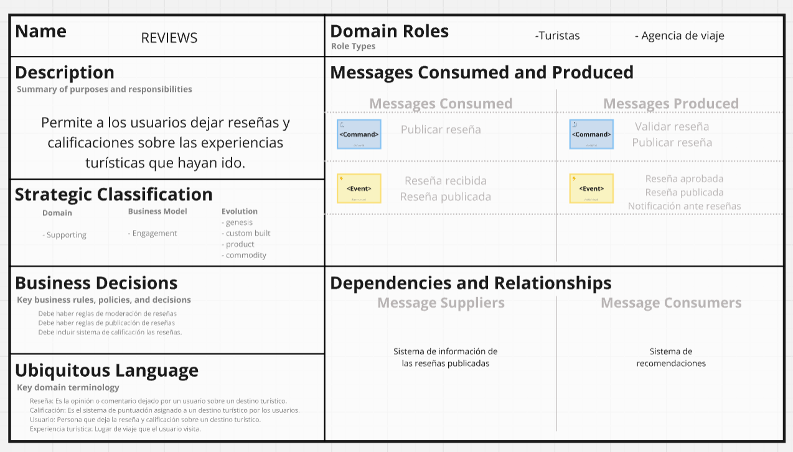
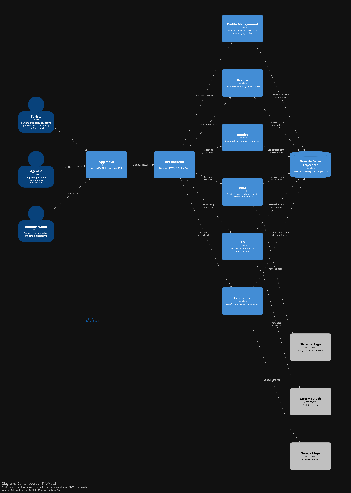
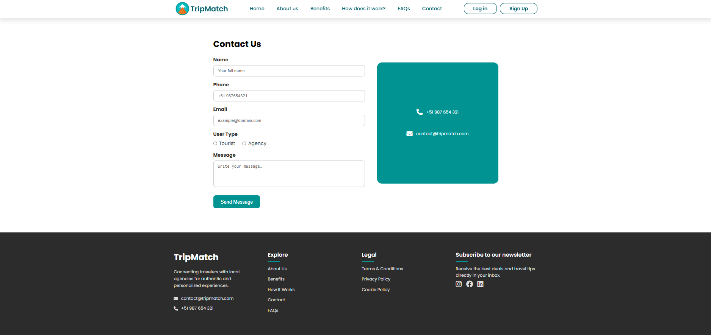
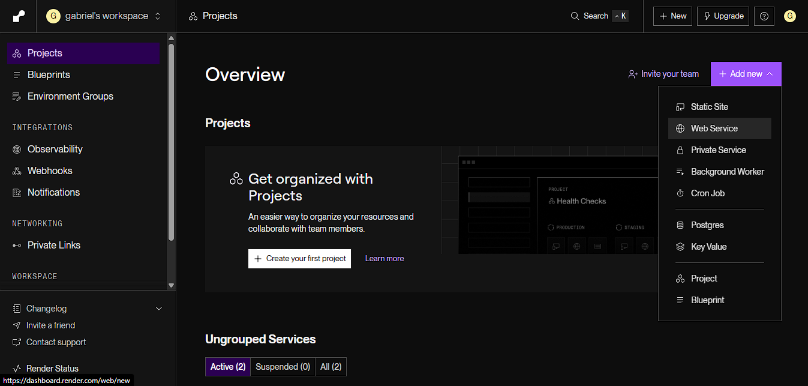

  

# Universidad Peruana de Ciencias Aplicadas

## Ingeniería de Software

**Periodo:** 202520  
**1ACC0238 |** Aplicaciones para Dispositivos Móviles  
**NRC:** 14649  
**Docente:** David Gerardo Quevedo Velasco  

**Informe del Trabajo Final**  

**Startup:** Xplora  
**Producto:** TripMatch

**Integrantes:**

<table style="border-collapse: collapse; border: none;">
  <tr>
    <td style="border: none; padding: 4px;">U202219481</td>
    <td style="border: none; padding: 4px;">Alaya Cabrera Rodrigo</td>
  </tr>
  <tr>
    <td style="border: none; padding: 4px;">U20191E414</td>
    <td style="border: none; padding: 4px;">Antayhua Castillo Oscar Josué</td>
  </tr>
  <tr>
    <td style="border: none; padding: 4px;">U20221E229</td>
    <td style="border: none; padding: 4px;">Gordon Salas Gabriel Fernando</td>
  </tr>
  <tr>
    <td style="border: none; padding: 4px;">U20231C505</td>
    <td style="border: none; padding: 4px;">Melgarejo Gomez Marcia Victoria</td>
  </tr>
  <tr>
    <td style="border: none; padding: 4px;">U202224602</td>
    <td style="border: none; padding: 4px;">Sulca Silva Melisa Geraldine</td>
  </tr>
</table>
 
 
 
 
 
 

**Octubre - 2025**

  

 
 
 
 
 
 
 
 
 
 
 

# **Registro de Versiones**

<table>
  <thead>
    <tr>
        <th>Versión</th>
        <th>Fecha</th>
        <th>Autor</th>
        <th>Descripción de modificación</th>
    </tr>
  </thead>
  <tbody>
  <tr>
      <td><strong>TB1</strong></td>
      <td>Setiembre</td>
      <td>
        <ul>
          <li>Rodrigo Alaya</li>
          <li>Gabriel Gordon</li>
          <li>Marcia Melgarejo</li>
          <li>Melisa Sulca</li>
          <li>Oscar Antayhua</li>
        </ul>
      </td>
      <td>
        Se han incluído los siguientes capítulos:
        <ul>
          <li>Capítulo I: Presentación</li>
          <li>Capítulo II: Requirements Development and Software Solution Design</li>
          <li>Avance de Conclusiones, Bibliografía y Anexos</li>
        </ul>
      </td>
  </tr>
  <tr>
      <td><strong>TP1</strong></td>
      <td>14/05/25</td>
      <td>
        <ul>
          <li>Rodrigo Alaya</li>
          <li>Gabriel Gordon</li>
          <li>Marcia Melgarejo</li>
          <li>Melisa Sulca</li>
          <li>Oscar Antayhua</li>
        </ul>
      </td>
      <td>
        <ul>
          <li>Capítulo III:  Solution UI/UX Design</li>
          <li>Capítulo IV: Requirements Development and Software Solution Design</li>
          <li>Avance del despliegue de la landing page y el backend</li>
          <li>Avance de las imagenes sobre la aplicación movile</li>
        </ul>
      </td>
  </tr>
  <tr>
      <td><strong>TB2</strong></td>
      <td>19/06/25</td>
      <td>
        <ul>
          <li>Rodrigo Alaya</li>
          <li>Gabriel Gordon</li>
          <li>Marcia Melgarejo</li>
          <li>Melisa Sulca</li>
          <li>Oscar Antayhua</li>
        </ul>
      </td>
      <td>
        <ul>
          <li>Capítulo III:  Solution UI/UX Design</li>
          <li>Capítulo IV: Requirements Development and Software Solution Design</li>
          <li>Avance de las funciones principales de la app</li>
          <li>Elaboración de los videos about the product y about the team</li>
        </ul>
      </td>
  </tr>
  <tr>
      <td><strong>TF</strong></td>
      <td>09/07/25</td>
      <td>
        <ul>
          <li>Rodrigo Alaya</li>
          <li>Gabriel Gordon</li>
          <li>Marcia Melgarejo</li>
          <li>Melisa Sulca</li>
          <li>Oscar Antayhua</li>
        </ul>
      </td>
      <td>
      </td>
  </tr>
  </tbody>
</table>

## Project Report Collaboration Insights

| URL de la organización del proyecto | URL del repositorio del reporte   |
| :------------------: | :---------------------------: | 
| https://github.com/Xplora | https://github.com/Xplora/workstation-markdown/tree/main |

| URL de la Landing Page desplegada | URL del Backend  deployado   |
| :------------------: | :---------------------------: | 
| https://xplora.github.io/workstation-landing-page/ | https://xplora-backend.onrender.com/swagger/index.html |

Commits del Report TB1:

# **Student Outcomes**
| Criterio específico | Acciones Realizadas | Conclusiones |
|:---:|:---|:---|
|**Actualiza conceptos y conocimientos necesarios para su desarrollo profesional y en especial para su proyecto en soluciones de software.**| **- Rodrigo Alaya**   **TB1:** Participé en la realización de entrevistas para dos segmentos de mercado, identificando requisitos clave. Además, elaboré los diagramas de clases por bounded context, aplicando los conceptos de Domain-Driven Design.  **TP:** Actualicé los conceptos y conocimientos fundamentales de la ingeniería de software, aplicándolos en el desarrollo de mi proyecto para fortalecer mi crecimiento profesional   **TB2:** Actualicé mis conocimientos sobre arquitecturas modernas, aplicándolos directamente en la selección de tecnologías y el diseño de la infraestructura de mi proyecto, lo que potenció su escalabilidad y eficiencia.   **TF:**.    **- Gabriel Gordon**   **TB1:** Colaboré en la elaboración del Strategic-Level Domain-Driven Design y en la creación de los diagramas de componentes para los bounded contexts, lo que fortaleció mi comprensión de la arquitectura de software a nivel de componentes.  **TP:** Actualicé continuamente herramientas que fueron de uso al momento de realizar algunos puntos del proyecto, fortaleciendo mi crecimiento profesional   **TB2:** Fortalecí mis habilidades en la gestión de proyectos ágiles, liderando la implementación de ceremonias y métricas que mejoraron significativamente la productividad y la calidad de la entrega de valor en el desarrollo del proyecto.   **TF:**.    **- Marcia Melgarejo**   **TB1:** Lideré el desarrollo de la entrevista para el segmento de empresas, obteniendo información valiosa. También me encargué del Strategic-Level Domain-Driven Design para el bounded context de Experience y de los diagramas de base de datos asociados.  **TP:** Busqué nuevas tendencias y tecnologías emergentes para actualizar mis conocimientos, logrando integrar soluciones innovadoras y sostenibles dentro del desarrollo de mi proyecto  **TB2:** Profundicé en los conceptos de seguridad de software, aplicando prácticas de defensa en profundidad que no solo protegieron mi proyecto, sino que también ampliaron mi perfil profesional hacia un rol más integral y de alta demanda..   **TF:**.    **- Melisa Sulca**   **TB1:** Participé en la sesión de Event Storming para identificar los eventos clave del negocio y las relaciones entre ellos. Adicionalmente, elaboré el Context Mapping para definir las interacciones entre los diferentes bounded contexts del sistema.  **TP:** Actualicé mis conocimientos mediante el intercambio de experiencias y aprendizaje con mis compañeros de equipo, fortaleciendo tanto mi desarrollo profesional como la calidad del proyecto  **TB2:** Consolidé mis conocimientos sobre patrones de diseño, utilizándolos como herramientas fundamentales para estructurar mi proyecto, lo cual resultó en un código más robusto, escalable y fácil de mantener, demostrando madurez técnica.   **TF:**.    **- Oscar Antayhua**   **TB1:** Elaboré los diagramas de Context, Container y Deployment Mapping, lo que permitió visualizar la arquitectura del sistema en diferentes niveles y planificar el despliegue de nuestra solución.  **TP:** Me comprometí con mi aprendizaje autónomo, buscando constantemente nuevas fuentes de conocimiento y aplicando lo aprendido en la mejora de mi proyecto  **TB2:** Actualicé mis habilidades en optimización de bases de datos, un conocimiento crítico para soluciones de software con alto tráfico, aplicando estas mejoras para garantizar que mi proyecto fuera rápido y eficiente bajo carga.   **TF:**. | **TB1:** A lo largo de TB1, el equipo demostró una sólida comprensión de los principios de **Domain-Driven Design (DDD)** y del **Modelo C4**. Se aplicaron estos conceptos para diseñar una arquitectura de software robusta y escalable, lo que proporcionó una base técnica clara para el proyecto. El trabajo realizado refleja un dominio de los conocimientos teóricos y una habilidad para plasmarlos en un plan de arquitectura coherente.   **TP1:** A lo largo del desarrollo del proyecto, el equipo evidenció una actualización constante de conceptos y conocimientos necesarios para su crecimiento profesional y la consolidación de soluciones de software de calidad. Se integraron nuevas herramientas, metodologías y enfoques tecnológicos que fortalecieron la capacidad del equipo para analizar, diseñar e implementar soluciones eficientes y sostenibles.   **TB2:** El equipo integró y aplicó activamente conocimientos y frameworks de última generación, fortaleciendo colectivamente sus habilidades para diseñar e implementar soluciones de software altamente escalables y sostenibles, impactando directamente en la madurez técnica y el éxito del proyecto.  |
|**Reconoce la necesidad del aprendizaje permanente para el desempeño profesional y el desarrollo de proyectos en soluciones de software.**| **- Rodrigo Alaya**   **TB1:** Participé activamente en el análisis del dominio y en la elaboración de diagramas de diseño, lo que me permitió aplicar y consolidar los conceptos de arquitectura de software en un contexto práctico.  **TP:** Fui consciente de que el aprendizaje permanente era esencial para adaptarme a los cambios del sector tecnológico, por lo que me mantuve en constante actualización para mejorar el impacto del proyecto   **TB2:** Reconocí que para desarrollar soluciones de software competitivas debía actualizar mis conocimientos continuamente, así que incorporé nuevas herramientas y tendencias que optimizaron los resultados del proyecto.   **TF:**.    **- Gabriel Gordon**   **TB1:** En esta primera entrega fomenté la participación equitativa dentro el equipo. Establecimos cronogramas de trabajo para poder cumplir con los objetivos sobre el trabajo.  **TP:** Reconozco la importancia del aprendizaje para fortalecer mi desempeño profesional y mejorar la calidad del proyecto que estamos desarrollando en grupo.   **TB2:** Comprendí que el aprendizaje continuo es clave para responder a los retos del entorno digital, por lo que investigué nuevos enfoques y buenas prácticas que enriquecieron la arquitectura y la calidad del software desarrollado.   **TF:**.    **- Marcia Melgarejo**   **TB1:** A través de la investigación y la aplicación práctica de nuevas metodologías de diseño y modelado de datos, pude fortalecer mi capacidad de aprendizaje autónomo y resolver desafíos complejos de arquitectura.  **TP:** Reconocí que el aprendizaje continuo no solo fortalecía mis competencias individuales, sino también mi capacidad para trabajar en equipo, compartir conocimientos y contribuir al éxito del proyecto  **TB2:** Identifiqué la importancia de mantenerme en formación constante, lo que me permitió adaptarme rápidamente a cambios tecnológicos y aplicar métodos actualizados que mejoraron la eficiencia del proyecto.   **TF:**.    **- Melisa Sulca**   **TB1:** La colaboración en las sesiones de Event Storming y Context Mapping fomentó una comprensión compartida del problema y la solución, reconociendo la importancia de trabajar en equipo para superar retos técnicos.  **TP:** Valoré el aprendizaje permanente como una oportunidad para innovar en mis proyectos de software, integrando tendencias emergentes y buenas prácticas.   **TB2:** Entendí que el aprendizaje permanente es fundamental para mantenerme vigente en el ámbito del desarrollo de software, por lo que busqué nuevos conocimientos, cursos y recursos que me permitieron mejorar mis habilidades y aportar soluciones más sólidas al proyecto.   **TF:**.    **- Oscar Antayhua**   **TB1:** Reconocí la necesidad del aprendizaje continuo al profundizar en metodologías como Domain-Driven Design y herramientas especializadas como Structurizr DSL, complementando mis conocimientos previos en desarrollo web y automatización.  **TP:** Pude Aplicar nuevos conocimientos y tecnologías que fortalecieron mis competencias en el diseño e implementación de soluciones de software   **TB2:** Reconocí que el sector tecnológico evoluciona de manera acelerada, por lo que asumí el compromiso de aprender de forma continua para fortalecer mi rol en el equipo y aportar soluciones innovadoras al proyecto.   **TF:**. | **TB1:** El trabajo en equipo fue fundamental en esta etapa. Las interacciones en las sesiones de análisis y diseño fomentaron la **colaboración**, el **liderazgo compartido** y la **comunicación efectiva**. Esto demostró la capacidad del equipo para adaptarse a nuevas metodologías y organizar un flujo de trabajo dinámico, un aspecto crucial para el desarrollo de proyectos de software complejos.   **TP1:** Durante el desarrollo del proyecto, el equipo demostró una clara conciencia sobre la importancia del aprendizaje permanente como parte esencial de su formación profesional. A través de la búsqueda continua de nuevos conocimientos, la revisión de buenas prácticas y la adaptación a herramientas emergentes, los integrantes fortalecieron su capacidad de análisis y resolución de problemas en el ámbito del desarrollo de software.   **TB2:** El equipo demostró una comprensión sólida sobre la importancia del aprendizaje permanente para el desarrollo profesional y la calidad del proyecto. Cada integrante asumió una actitud proactiva frente a la actualización tecnológica, investigando nuevas herramientas, metodologías y buenas prácticas que fortalecieron la elaboración de la solución de software.|

# **Objetivos SMART**

## U202219481 — Alaya Cabrera Rodrigo

Objetivo 1  
conseguir un puesto junior como desarrollador backend .NET en una empresa de tecnología en un plazo máximo de 6 meses después de la graduación.

- específico: rol backend con .NET y C# trabajando en APIs REST
- medible: enviar 40 postulaciones de calidad, 6 entrevistas, 1 oferta firmada
- alcanzable: experiencia del proyecto TripMatch y dos microservicios en el portafolio
- relevante: alinea carrera técnica en desarrollo de servicios
- tiempo: 6 meses post-graduación
- acciones clave: completar certificación AZ-204; publicar dos repos con clean architecture y pruebas; actualizar CV y LinkedIn; practicar entrevistas técnicas 2 veces por semana
- evidencia de logro: carta oferta firmada o contrato; enlaces a repos; badge de certificación

Objetivo 2  
elevar el nivel de inglés de B1 a B2 para mejorar empleabilidad internacional en 9 meses.

- específico: alcanzar B2 según MCER
- medible: obtener 6.5 en IELTS Academic o certificado equivalente B2
- alcanzable: plan de estudio 6 horas/semana y tutoría conversacional
- relevante: requisito frecuente en vacantes backend
- tiempo: 9 meses
- acciones clave: curso B1→B2; simulacros mensuales; clubes de conversación; ver y resumir 1 charla técnica semanal
- evidencia de logro: certificado IELTS o equivalente

---

## U20221E229 — Gordon Salas Gabriel Fernando

Objetivo 1  
incorporarse como desarrollador frontend con React y TypeScript en 6 meses tras la graduación.

- específico: rol frontend con React, Vite, Testing Library
- medible: 3 proyectos productivos en portafolio; 30 postulaciones; 5 entrevistas; 1 oferta
- alcanzable: experiencia UI de TripMatch y refactor a componentes reutilizables
- relevante: foco profesional en interfaces web
- tiempo: 6 meses
- acciones clave: construir un pequeño design system; cobertura de tests ≥ 70% en un proyecto; Lighthouse ≥ 90; certificación Meta Front-End o equivalente
- evidencia de logro: oferta firmada; repos públicos; reporte Lighthouse y cobertura de tests

Objetivo 2  
dominar pruebas end-to-end con Cypress para elevar la calidad de entrega en 4 meses.

- específico: automatizar flujos críticos de front
- medible: 15 pruebas E2E estables en un proyecto demo y en TripMatch
- alcanzable: guía oficial y práctica semanal
- relevante: calidad y empleabilidad
- tiempo: 4 meses
- acciones clave: configurar pipeline CI; reportes de fallos; patrón Page Object
- evidencia de logro: dashboard de CI con ejecuciones verdes; suite documentada

---

## U20231C505 — Melgarejo Gomez Marcia Victoria

Objetivo 1  
trabajar como desarrolladora full-stack JavaScript en 8 meses.

- específico: stack React + Node.js con Prisma/PostgreSQL
- medible: 2 proyectos full-stack en producción y 1 práctica profesional o freelance
- alcanzable: experiencia de TripMatch y cursos complementarios
- relevante: versatilidad en frontend y backend
- tiempo: 8 meses
- acciones clave: construir API con autenticación JWT y roles; pruebas unitarias y de integración; certificación PSM I de Scrum
- evidencia de logro: despliegues en la nube; certificación PSM I; bitácora de sprints

Objetivo 2  
mejorar habilidades de diseño funcional y accesibilidad web en 5 meses.

- específico: aplicar WCAG 2.2 nivel AA
- medible: Lighthouse Accessibility ≥ 95 en dos proyectos
- alcanzable: guía WCAG y herramientas axe
- relevante: impacto en usuarios y compliance
- tiempo: 5 meses
- acciones clave: auditorías mensuales; corrección de contrastes; foco y navegación por teclado
- evidencia de logro: reportes Lighthouse y axe con mejoras

---

## U20191E414 — Antayhua Castillo Oscar Josué

Objetivo 1  
obtener un rol jr de DevOps o Cloud en 7 meses.

- específico: automatizar CI/CD y despliegues en AWS o Azure
- medible: certificación AWS SAA-C03 o AZ-104 y 2 pipelines productivos
- alcanzable: base en proyectos y práctica guiada
- relevante: carrera en plataformas y confiabilidad
- tiempo: 7 meses
- acciones clave: infraestructura como código con Terraform; observabilidad básica con logs y métricas; hardening de contenedores
- evidencia de logro: badge de certificación; repos de IaC; pipelines activos

Objetivo 2  
elevar confiabilidad de servicios personales a SLOs básicos en 4 meses.

- específico: definir SLOs de disponibilidad y latencia para dos servicios demo
- medible: monitoreo con alertas y tableros; tiempo de recuperación < 30 min en simulacros
- alcanzable: uso de uptime checks y tracing ligero
- relevante: buenas prácticas DevOps
- tiempo: 4 meses
- acciones clave: definir SLOs; configurar alertas; ejecutar game days mensuales
- evidencia de logro: tableros y postmortems documentados

---

## U202224602 — Melisa Sulca

Objetivo 1  
insertarse como data analyst junior en 6 meses.

- específico: análisis con SQL, Python y Power BI
- medible: 3 dashboards publicados; 2 estudios de caso reproducibles; certificación Power BI Data Analyst Associate o Google Data Analytics
- alcanzable: plan de estudio y datasets abiertos
- relevante: trayectoria en datos aplicada a turismo
- tiempo: 6 meses
- acciones clave: portafolio con casos de reservas y demanda; storytelling de datos; validación con stakeholders
- evidencia de logro: certificación; portafolio público; feedback de revisión

Objetivo 2  
mejorar dominio de SQL para analítica en 3 meses.

- específico: consultas complejas con window functions y CTEs
- medible: 100 ejercicios nivel intermedio-avanzado y optimización de 3 consultas en un proyecto real
- alcanzable: práctica diaria y repos de ejercicios
- relevante: base para análisis y reporting
- tiempo: 3 meses
- acciones clave: rutina de 45 minutos diarios; revisión por pares semanal; documentación de patrones
- evidencia de logro: bitácora de ejercicios; antes/después de planes de ejecución

# **Project Report Online**

Tabla de contenidos

- [Capítulo I: Presentación](#capítulo-i-presentación)
  - [1.1. Startup Profile](#11-startup-profile)
    - [1.1.1. Descripción de la Startup](#111-descripción-de-la-startup)
    - [1.1.2. Perfiles de integrantes del equipo](#112-perfiles-de-integrantes-del-equipo)
  - [1.2. Solution Profile](#12-solution-profile)
    - [1.2.1. Antecedentes y problemática](#121-antecedentes-y-problemática)
    - [1.2.2. Lean UX Process](#122-lean-ux-process)
      - [1.2.2.1. Lean UX Problem Statements](#1221-lean-ux-problem-statements)
      - [1.2.2.2. Lean UX Assumptions](#1222-lean-ux-assumptions)
      - [1.2.2.3. Lean UX Hypothesis Statements](#1223-lean-ux-hypothesis-statements)
      - [1.2.2.4. Lean UX Canvas](#1224-lean-ux-canvas)
  - [1.3. Segmentos objetivos](#13-segmentos-objetivos)

- [Capítulo II: Requirements Development and Software Solution Design](#capítulo-ii-requirements-development-and-software-solution-design)
  - [2.1. Competidores](#21-competidores)
    - [2.1.1. Análisis competitivo](#211-análisis-competitivo)
    - [2.1.2. Estrategias y tácticas frente a competidores](#212-estrategias-y-tácticas-frente-a-competidores)
  - [2.2. Entrevistas](#22-entrevistas)
    - [2.2.1. Diseño de entrevistas](#221-diseño-de-entrevistas)
    - [2.2.2. Registro de entrevistas](#222-registro-de-entrevistas)
    - [2.2.3. Análisis de entrevistas](#223-análisis-de-entrevistas)
  - [2.3. Needfinding](#23-needfinding)
    - [2.3.1. User Personas](#231-user-personas)
    - [2.3.2. User Task Matrix](#232-user-task-matrix)
    - [2.3.3. User Journey Mapping](#233-user-journey-mapping)
    - [2.3.4. Empathy Mapping](#234-empathy-mapping)
    - [2.3.5. Ubiquitous Language](#235-ubiquitous-language)
  - [2.4. Requirements Specification](#24-requirements-specification)
    - [2.4.1. User Stories](#241-user-stories)
    - [2.4.2. Impact Mapping](#242-impact-mapping)
    - [2.4.3. Product Backlog](#243-product-backlog)
  - [2.5. Strategic-Level Domain-Driven Design](#25-strategic-level-domain-driven-design)
    - [2.5.1. EventStorming](#251-eventstorming)
      - [2.5.1.1. Candidate Context Discovery](#2511-candidate-context-discovery)
      - [2.5.1.2. Domain Message Flows Modeling](#2512-domain-message-flows-modeling)
      - [2.5.1.3. Bounded Context Canvases](#2513-bounded-context-canvases)
    - [2.5.2. Context Mapping](#252-context-mapping)
    - [2.5.3. Software Architecture](#253-software-architecture)
      - [2.5.3.1. Software Architecture Context Level Diagrams](#2531-software-architecture-context-level-diagrams)
      - [2.5.3.2. Software Architecture Container Level Diagrams](#2532-software-architecture-container-level-diagrams)
      - [2.5.3.3. Software Architecture Deployment Diagrams](#2533-software-architecture-deployment-diagrams)
  - [2.6. Tactical-Level Domain-Driven Design](#26-tactical-level-domain-driven-design)
    - [2.6.x. Bounded Context: <Bounded Context Name>](#26x-bounded-context-bounded-context-name)
      - [2.6.x.1. Domain Layer](#26x1-domain-layer)
      - [2.6.x.2. Interface Layer](#26x2-interface-layer)
      - [2.6.x.3. Application Layer](#26x3-application-layer)
      - [2.6.x.4. Infrastructure Layer](#26x4-infrastructure-layer)
      - [2.6.x.5. Bounded Context Software Architecture Component Level Diagrams](#26x5-bounded-context-software-architecture-component-level-diagrams)
      - [2.6.x.6. Bounded Context Software Architecture Code Level Diagrams](#26x6-bounded-context-software-architecture-code-level-diagrams)
        - [2.6.x.6.1. Bounded Context Domain Layer Class Diagrams](#26x61-bounded-context-domain-layer-class-diagrams)
        - [2.6.x.6.2. Bounded Context Database Design Diagram](#26x62-bounded-context-database-design-diagram)

- [Capítulo III: Solution UI/UX Design](#capítulo-iii-solution-uiux-design)
  - [3.1. Product Design](#31-product-design)
    - [3.1.1. Style Guidelines](#311-style-guidelines)
      - [3.1.1.1. General Style Guidelines](#3111-general-style-guidelines)
    - [3.1.2. Information Architecture](#312-information-architecture)
      - [3.1.2.1. Organization Systems](#3121-organization-systems)
      - [3.1.2.2. Labelling Systems](#3122-labelling-systems)
      - [3.1.2.3. SEO Tags and Meta Tags](#3123-seo-tags-and-meta-tags)
      - [3.1.2.4. Searching Systems](#3124-searching-systems)
      - [3.1.2.5. Navigation Systems](#3125-navigation-systems)
    - [3.1.3. Landing Page UI Design](#313-landing-page-ui-design)
      - [3.1.3.1. Landing Page Wireframe](#3131-landing-page-wireframe)
      - [3.1.3.2. Landing Page Mock-up](#3132-landing-page-mock-up)
    - [3.1.4. Mobile Applications UX/UI Design](#314-mobile-applications-uxui-design)
      - [3.1.4.1. Mobile Applications Wireframes](#3141-mobile-applications-wireframes)
      - [3.1.4.2. Mobile Applications Wireflow Diagrams](#3142-mobile-applications-wireflow-diagrams)
      - [3.1.4.3. Mobile Applications Mock-ups](#3143-mobile-applications-mock-ups)
      - [3.1.4.4. Mobile Applications User Flow Diagrams](#3144-mobile-applications-user-flow-diagrams)
      - [3.1.4.5. Mobile Applications Prototyping](#3145-mobile-applications-prototyping)

- [Capítulo IV: Product Implementation & Validation](#capítulo-iv-product-implementation--validation)
  - [4.1. Software Configuration Management](#41-software-configuration-management)
    - [4.1.1. Software Development Environment Configuration](#411-software-development-environment-configuration)
    - [4.1.2. Source Code Management](#412-source-code-management)
    - [4.1.3. Source Code Style Guide & Conventions](#413-source-code-style-guide--conventions)
    - [4.1.4. Software Deployment Configuration](#414-software-deployment-configuration)
  - [4.2. Landing Page & Mobile Application Implementation](#42-landing-page--mobile-application-implementation)
    - [4.2.1. Sprint 1](#421-sprint-1)
      - [4.2.1.1. Sprint Planning 1](#4211-sprint-planning-1)
      - [4.2.1.2. Sprint Backlog 1](#4212-sprint-backlog-1)
      - [4.2.1.3. Development Evidence for Sprint Review](#4213-development-evidence-for-sprint-review)
      - [4.2.1.4. Testing Suite Evidence for Sprint Review](#4214-testing-suite-evidence-for-sprint-review)
      - [4.2.1.5. Execution Evidence for Sprint Review](#4215-execution-evidence-for-sprint-review)
      - [4.2.1.6. Services Documentation Evidence for Sprint Review](#4216-services-documentation-evidence-for-sprint-review)
      - [4.2.1.7. Software Deployment Evidence for Sprint Review](#4217-software-deployment-evidence-for-sprint-review)
      - [4.2.1.8. Team Collaboration Insights during Sprint](#4218-team-collaboration-insights-during-sprint)
    - [4.2.2. Sprint 2](#422-sprint-2)
      - [4.2.2.1. Sprint Planning 2](#4221-sprint-planning-2)
      - [4.2.2.2. Sprint Backlog 2](#4222-sprint-backlog-2)
      - [4.2.2.3. Development Evidence for Sprint Review](#4223-development-evidence-for-sprint-review)
      - [4.2.2.4. Testing Suite Evidence for Sprint Review](#4224-testing-suite-evidence-for-sprint-review)
      - [4.2.2.5. Execution Evidence for Sprint Review](#4225-execution-evidence-for-sprint-review)
      - [4.2.2.6. Services Documentation Evidence for Sprint Review](#4226-services-documentation-evidence-for-sprint-review)
      - [4.2.2.7. Software Deployment Evidence for Sprint Review](#4227-software-deployment-evidence-for-sprint-review)
      - [4.2.2.8. Team Collaboration Insights during Sprint](#4228-team-collaboration-insights-during-sprint)
    - [4.2.3. Sprint 3](#423-sprint-3)
      - [4.2.3.1. Sprint Planning 3](#4231-sprint-planning-3)
      - [4.2.3.2. Sprint Backlog 3](#4232-sprint-backlog-3)
      - [4.2.3.3. Development Evidence for Sprint Review](#4233-development-evidence-for-sprint-review)
      - [4.2.3.4. Testing Suite Evidence for Sprint Review](#4234-testing-suite-evidence-for-sprint-review)
      - [4.2.3.5. Execution Evidence for Sprint Review](#4235-execution-evidence-for-sprint-review)
      - [4.2.3.6. Services Documentation Evidence for Sprint Review](#4236-services-documentation-evidence-for-sprint-review)
      - [4.2.3.7. Software Deployment Evidence for Sprint Review](#4237-software-deployment-evidence-for-sprint-review)
      - [4.2.3.8. Team Collaboration Insights during Sprint](#4238-team-collaboration-insights-during-sprint)
  - [4.3. Validation Interviews](#43-validation-interviews)
    - [4.3.1. Diseño de Entrevistas](#431-diseño-de-entrevistas)
    - [4.3.2. Registro de Entrevistas](#432-registro-de-entrevistas)
    - [4.3.3. Evaluaciones según heurísticas](#433-evaluaciones-según-heurísticas)

- [Conclusiones](#conclusiones)
  - [Conclusiones y recomendaciones](#conclusiones-y-recomendaciones)

- [Video App Validation](#video-app-validation)
- [Video About the product](#video-about-the-product)
- [Video About the team](#video-about-the-team)
- [Glosario](#glosario)
- [Bibliografía](#bibliografía)
- [Anexos](#anexos)

# Capítulo 1: Introducción
## 1.1. Startup Profile
### 1.1.1. Descripción de la startup
En un mundo donde el turismo se ha diversificado y las experiencias personalizadas son cada vez más valoradas, Xplora surge como una startup enfocada en transformar la forma en que los viajeros conectan con agencias de turismo locales a través de soluciones digitales diseñadas principalmente para dispositivos móviles.

Reconocemos que muchos turistas enfrentan la dificultad de encontrar paquetes confiables, ajustados a su presupuesto y verdaderamente adaptados a sus intereses, mientras que las agencias buscan nuevas maneras tecnológicas de llegar a sus clientes.

A través de nuestra aplicación TripMatch, brindamos un espacio donde los usuarios pueden explorar, comparar y reservar actividades y experiencias turísticas únicas desde sus teléfonos móviles, filtradas por destino, tipo de viaje, duración o presupuesto. Al mismo tiempo, las agencias pueden administrar su catálogo de servicios, responder consultas en tiempo real mediante chat móvil y recibir reservas de forma directa y sencilla. Nuestro enfoque está en ofrecer una experiencia fluida y confiable tanto para el viajero como para el proveedor, promoviendo el turismo responsable y local.

**Misión:** Nuestra misión es facilitar el acceso a experiencias turísticas auténticas y personalizadas mediante una aplicación móvil que conecte a viajeros con agencias de turismo de manera directa, eficiente y transparente. Trabajamos para simplificar el proceso de búsqueda y reserva de actividades, fomentando al mismo tiempo el crecimiento de negocios turísticos locales a través de soluciones tecnológicas intuitivas.

**Visión:** Convertirnos en la aplicación de referencia para la planificación y reserva de experiencias turísticas móviles, destacándonos por promover el turismo responsable, la innovación tecnológica y el fortalecimiento de agencias locales. Aspiramos a ser una solución global que conecte millones de viajeros con sus destinos a través de su smartphone.

Valores: Defendemos la integridad, la innovación y el turismo sostenible. Aseguramos precisión en la información, apoyamos a agencias locales y ofrecemos experiencias personalizadas para garantizar viajes auténticos, seguros y responsables.

### 1.1.2. Perfiles de integrantes del equipo

|  Nombres y Apellidos |    Codigo   | Descripción | Foto | 
|----------------------|-------------|-------------|------|
| Gabriel Fernando Gordon Salas  | U20221E229  | Me considero una persona responsable, me gusta ayudar a mis compañeros en los trabajos y sé organizarme bien al momento de realizar mis cosas. Con esto mi objetivo es poder dar lo mejor en un ambiente de cooperación entre todos para que el proyecto dé una muy buena presentación |    |
| Marcia Victoria Melgarejo Gomez |  U20231C505  | Actualmente estoy cursando el quinto ciclo de la carrera de Ingeniería de Software en la UPC. Opté por esta carrera debido a mi interés en el mundo de la tecnología y todo lo que este campo puede ofrecer a la sociedad.   Me caracterizo por ser una persona curiosa, persistente y colaborativa.   Tengo conocimientos en C++, HTML, CSS, JS, Pyhton | |
| Rodrigo Alaya Cabrera |  U202219481  | Soy una persona responsable, comprometida con mis objetivos y con gran disposición para aprender continuamente. Me adapto con facilidad al trabajo en equipo, aportando ideas y soluciones. Valoro mucho la eficiencia, la ética profesional y la mejora constante. Me esfuerzo por entregar siempre resultados de calidad, gestionando mis tareas con orden y enfoque. |    |
|  Oscar Josué Antayhua Castillo |  U20191E414  | Soy una persona responsable, enfocado, con habilidades en automatización y desarrollo web. Manejo distintas herramientas RPA como Make, Power Automate, n8n y zapier, y para desarrollo web tengo conocimiento en HTML, CSS, Python, C++, NoSQL, SQL, Vue, Angular, Nextjs, Typescript. |   |
|  Melisa Geraldine Sulca Silva |  U202224602  | Mi nombre es Melisa Sulca y estudio la carrera de Ingeniería de Software en la Universidad Peruana de Ciencias Aplicadas (UPC). Mis principales habilidades son el trabajo en equipo, soy responsable, mantengo mi compromiso en dar todo mi esfuerzo y práctico perseverancia. |   |

## 1.2. Solution Profile

La propuesta de solución está orientada al diseño y desarrollo de **TripMatch**, una aplicación móvil que conecta a los usuarios con experiencias de viaje personalizadas según sus intereses, presupuesto y tiempo disponible. La solución busca responder a la creciente necesidad de contar con herramientas móviles que permitan planificar viajes de forma rápida, flexible y desde cualquier lugar, optimizando tanto la búsqueda como la gestión de reservas de actividades turísticas.

### 1.2.1. Antecedentes y problemática

**What**
- ¿Cuál es el problema?  
    El problema central radica en la desconexión entre viajeros y agencias de turismo locales. Los turistas tienen dificultades para encontrar experiencias auténticas y personalizadas, mientras que las agencias locales carecen de herramientas digitales efectivas que les permitan visibilizar y gestionar sus servicios en un mercado cada vez más competitivo.  
- ¿Cuál es la relación con la persona en cuestión?  
  La aplicación TripMatch (de Xplora) busca cerrar esa brecha. Para el viajero, TripMatch facilita la búsqueda, comparación y reserva de experiencias desde cualquier lugar mediante la app móvil, incorporando filtros relevantes, reseñas verificadas y opciones de reserva rápida. Para la agencia local, la plataforma ofrece herramientas sencillas de administración que reducen la dependencia de intermediarios y permiten llegar a clientes en el momento de decisión.

**When**
- ¿Cuándo sucede el problema?  
    El problema se manifiesta principalmente en las etapas de planificación y organización del viaje, cuando los turistas intentan investigar y contratar servicios turísticos confiables y personalizados desde sus dispositivos móviles. También ocurre durante el desplazamiento, cuando buscan actividades adicionales o alternativas a lo inicialmente planeado y requieren inmediatez en la información y la reserva.

- ¿Cuándo utiliza el cliente el producto?  
  El cliente utiliza la plataforma TripMatch en dos momentos clave: antes del viaje, cuando explora actividades y destinos desde casa o el trabajo mediante su smartphone o tablet; y durante el viaje, cuando ya se encuentra en el destino y busca experiencias complementarias, aprovechando la facilidad de realizar reservas y consultas directamente desde su móvil.

**Where**
- ¿Dónde está el cliente cuando utiliza el producto?  
  El usuario puede acceder a la plataforma desde múltiples ubicaciones. Desde su hogar durante la fase de planificación, utilizando dispositivos como computadoras o celulares; o bien desde su destino turístico y necesita encontrar nuevas experiencias turisticas.
- ¿A dónde se dirige?  
  El usuario se dirige a destinos nacionales o internacionales, buscando experiencias auténticas y personalizadas. Puede tratarse de destinos populares donde evita lo masificado o de lugares poco explorados en los que necesita orientación especializada que le aporte confianza y seguridad.
- ¿Dónde surge el problema?  
  El problema surge principalmente en el espacio digital fragmentado del sector turístico, donde la información se encuentra dispersa en múltiples sitios web, aplicaciones y plataformas, dificultando la comparación de opciones y la verificación de la calidad y autenticidad de las experiencias ofrecidas por agencias locales que a menudo carecen de presencia digital efectiva.

**Who**
- ¿Quiénes están involucrados?  
  Los principales involucrados son los turistas que buscan experiencias personalizadas, las agencias locales que ofrecen servicios especializados, los operadores turísticos y las plataformas tecnológicas que no integran oferta ni demanda de manera eficiente.
- ¿A quiénes les sucede el problema?  
  Afecta a dos actores principales: los turistas que buscan opciones auténticas y no logran comunicarse con proveedores locales de forma confiable, y las agencias locales que tienen dificultades para digitalizar sus servicios y competir frente a las grandes plataformas.
- ¿Quién lo utiliza?  
  La plataforma TripMatch será utilizada por viajeros independientes que buscan experiencias turísticas auténticas y personalizadas más allá del turismo masivo, así como por agencias locales de turismo que buscan ampliar su presencia digital y conectar directamente con clientes potenciales sin intermediarios que reduzcan sus márgenes o limiten su capacidad de personalización.

**Why**
- ¿Cuál es la causa del problema?  
  La causa radica en la falta de personalización de los paquetes turísticos y en la limitada digitalización de las agencias locales. Los viajeros quieren experiencias únicas y en tiempo real, pero reciben ofertas genéricas. Además, la baja presencia digital limita la interacción inmediata, clave para usuarios que gestionan sus viajes desde el internet  (KPMG Tendencias, 2024).

**How**
- ¿En qué condiciones nuestros clientes usan el producto?  
  Los clientes acceden a nuestra plataforma TripMatch cuando buscan experiencias turísticas auténticas y personalizadas que se ajusten a sus intereses específicos, presupuesto y disponibilidad de tiempo. Esto ocurre tanto durante la planificación anticipada de su viaje, desde casa o el trabajo, como cuando ya se encuentran en el destino y requieren modificar o complementar su itinerario con actividades locales recomendadas. En este último caso, la facilidad de acceder desde dispositivos móviles resulta clave para obtener información inmediata y concretar reservas en tiempo real.  

- ¿Cómo nos conocieron nuestros compradores?  
  Los usuarios conocen nuestra plataforma principalmente a través de marketing digital especializado en viajes y comunidades de viajeros, recomendaciones de otros usuarios satisfechos en redes sociales, y posicionamiento en buscadores especializados en turismo cuando buscan alternativas a las grandes plataformas tradicionales.  

- ¿Cómo prefieren nuestros consumidores acceder a nuestro producto?  
  Los usuarios acceden a nuestra plataforma mediante un sitio web para la planificación detallada previa, y a través de dispositivos móviles que les permiten facilitar reservas rápidas durante su viaje.  

- ¿Qué llevó a la persona a esa situación?  
  El creciente deseo de los viajeros por experiencias auténticas y personalizadas, junto con la frustración provocada por las plataformas masivas que ofrecen opciones estandarizadas, lleva a los usuarios a buscar alternativas que faciliten la conexión directa con proveedores locales. A la vez, las agencias de turismo local llegan a nuestra plataforma motivadas por la necesidad de digitalizar sus servicios y expandir su alcance.

**How Much**  
Aproximadamente el 82% de las reservas de viajes en 2018 se realizaron a través de Internet, según un análisis de Mize (2021). Este cambio refleja cómo la tecnología ha transformado la industria turística, eliminando intermediarios y facilitando la personalización de experiencias para los viajeros. Además, más del 50% de viajeros suelen dedicar su tiempo en investigar sitios locales de reseñas de viajes con el objetivo de tomar una decisión informada sobre su próximo viaje, considerando aspectos como videos y fotos de destinos, la capacidad de los hoteles para destacar sus servicios y la experiencia previa de otros viajeros, entre otros factores (Travelperk, 2022). Asimismo, según el Ministerio de Comercio Exterior y Turismo (MINCETUR, 2024) solo en el Perú, aproximadamente 48 millones de viajes se realizan anualmente por motivos de turismo interno, incluyendo tanto turistas extranjeros que visitan el país como locales que viajan a otras ciudades dentro del territorio nacional.

### 1.2.2. Lean UX Process
#### 1.2.2.1. Lean UX Problem Statements
Nuestro servicio ofrece una aplicación que permite a viajeros explorar, comparar y reservar experiencias turísticas gestionadas por agencias locales. Al mismo tiempo, la plataforma brinda a estas agencias un espacio digital para mostrar sus servicios y conectarse con potenciales clientes dentro de un entorno seguro y accesible.

Hemos identificado un factor crítico que afecta la experiencia tanto de viajeros como de agencias locales: actualmente existe una baja efectividad en la interacción entre ambos actores, lo que dificulta que los viajeros encuentren experiencias alineadas a sus intereses y que las agencias logren una mayor visibilidad dentro del mercado turístico.

¿Cómo podemos mejorar la efectividad de la conexión entre viajeros y agencias locales para asegurar experiencias turísticas auténticas y alineadas a las preferencias del usuario, fortaleciendo al mismo tiempo la interacción dentro de la plataforma?

#### 1.2.2.2. Lean UX Assumptions
**User Assumptions**
- ¿Quién es mi usuario?  
  Nuestros usuarios son viajeros que buscan experiencias auténticas y personalizadas, y agencias de turismo locales que necesitan digitalizar sus servicios para llegar a más clientes.
- ¿Dónde encaja nuestro producto en su trabajo o vida?  
  Para viajeros, simplifica la búsqueda y reserva de actividades únicas; para agencias, es una herramienta de gestión y conexión directa con turistas.
- ¿Qué problemas tiene nuestro producto? ¿Resolver?  
  Resuelve la dificultad de los viajeros para encontrar opciones confiables y personalizadas, y la falta de visibilidad digital de las agencias locales.
- ¿Cuándo y cómo es nuestro producto? ¿Usado?  
  Los viajeros lo usan al planificar su viaje o durante este para reservar actividades; las agencias lo usan diariamente para gestionar servicios y atender consultas.
- ¿Qué características son importantes?  
  Filtros avanzados, reseñas verificadas, chat en tiempo real, herramientas de gestión para agencias y opción de reservas móviles.
- ¿Cómo debe verse nuestro producto y cómo debe comportarse?  
  Debe ser visualmente atractivo, fácil de usar, seguro para transacciones e intuitivo para agencias con poca experiencia digital.  

**Business Assumptions**
- Creo que nuestros clientes necesitan una manera sencilla y confiable de encontrar y reservar experiencias turísticas auténticas y personalizadas, gestionadas por agencias locales, sin tener que navegar entre múltiples plataformas ni arriesgarse a servicios poco verificados.  
- Estas necesidades se pueden cubrir con una aplicación que ofrezca filtros avanzados, reseñas verificadas, herramientas de comparación, comunicación directa en tiempo real y un sistema de reservas seguro y eficiente.  
- Mis clientes iniciales serán viajeros independientes, tanto nacionales como internacionales, que buscan experiencias locales auténticas, y agencias de turismo local que necesitan digitalizar sus servicios para ampliar su alcance.  
- El valor principal que mis clientes esperan es contar con herramientas digitales que les permitan planificar, comparar y reservar experiencias de manera ágil, segura y adaptada a sus intereses y presupuesto.  
- Los clientes también pueden obtener beneficios adicionales como: ahorro de tiempo en la búsqueda de actividades, conexión directa con proveedores confiables, acceso a descuentos exclusivos, reseñas verificadas, contenido visual auténtico y recomendaciones personalizadas.  
- Captaré la mayoría de mis clientes mediante marketing digital, alianzas estratégicas con comunidades de viajeros y programas de recomendación con beneficios para quienes compartan la aplicación.  
- Generaré ingresos a través de comisiones por reservas, alianzas estratégicas y colaboraciones con influencers de viajes.  
- Mi competencia principal está representada por plataformas como *Withlocals*, *ToursByLocals* y *Showaround*, que también ofrecen experiencias personalizadas mediante guías o agencias locales.  
- Superaremos a la competencia gracias a nuestro enfoque en el turismo local auténtico, brindando soporte directo a pequeñas agencias que normalmente no tienen acceso a herramientas tecnológicas avanzadas. Además, nuestra propuesta prioriza la confianza, la personalización y la conexión directa con proveedores locales.  
- El mayor riesgo de producto es que las agencias locales no adopten la aplicación por falta de habilidades digitales o que no mantengan actualizado su catálogo, afectando la calidad del servicio.  
- Resolveremos este riesgo mediante capacitación inicial, soporte técnico continuo, una interfaz intuitiva diseñada para usuarios con poca experiencia digital.  

#### 1.2.2.3. Lean UX Hypothesis Statements
- **Creemos que** ofrecer filtros avanzados aumentará la adopción de la plataforma por parte de viajeros que buscan personalización.  
  **Sabremos que hemos tenido éxito**  
  **Cuando veamos** un aumento del 35% en las reservas realizadas con filtros personalizados durante los primeros 4 meses.

- **Creemos que** permitir a las agencias locales gestionar su catálogo digital y responder consultas en tiempo real incrementará su participación en la plataforma.  
  **Sabremos que hemos tenido éxito**  
  **Cuando veamos** que el 70% de las agencias registradas actualizan su catálogo semanalmente y responden a consultas en menos de 2 horas durante los primeros 3 meses.

- **Creemos que** eliminar intermediarios y ofrecer precios directos mejorará la rentabilidad de las agencias locales.  
  **Sabremos que hemos tenido éxito**  
  **Cuando veamos** un aumento del 25% en la renovación de contratos anuales con agencias locales y una reducción del 15% en quejas por precios elevados en el primer año.

- **Creemos que** la integración de reseñas verificadas y fotos reales de experiencias aumentará la confianza de los viajeros en las agencias locales.  
  **Sabremos que hemos tenido éxito**  
  **Cuando veamos** un aumento del 30% en las reservas de agencias con al menos 10 reseñas positivas durante el primer trimestre de uso.

#### 1.2.2.4. Lean UX Canvas

## 1.3. Segmentos Objetivos
**Segmento #1: Turistas**  
Este segmento está conformado por viajeros que buscan experiencias únicas y adaptadas a sus intereses y presupuestos. Se dirigen tanto a jóvenes aventureros como a familias y profesionales que desean descubrir destinos novedosos y actividades locales.
- Aspectos demográficos:
  - Sexo: Masculino y femenino
  - Edades: Entre 18 y 65 años
- Aspectos psicográficos:
  - Motivaciones: Vivir experiencias auténticas, apoyar el turismo local, evitar intermediarios innecesarios y optimizar su tiempo en la planificación.
  - Intereses: Turismo responsable, culturas locales, aventura, gastronomía típica y actividades fuera de lo convencional.
  - Comportamiento: Investigan opciones antes de reservar, comparan precios y valoran reseñas reales. Prefieren plataformas intuitivas que les permitan filtrar por preferencias específicas como duración, presupuesto, tipo de viaje, etc.

**Segmento #2: Agencias de Turismo**  
Este segmento agrupa a aquellas agencias y operadores turísticos que buscan ampliar su alcance y optimizar la gestión de sus servicios a través de canales digitales. Incluyen tanto pequeñas empresas emergentes como agencias consolidadas que desean modernizar sus procesos y alcanzar a un público más amplio mediante la reserva en tiempo real.
- Aspectos demográficos:
  - Tipo de negocio: Pequeñas y medianas agencias de turismo, y guías independientes.
  - Ubicación: Destinos turísticos con enfoque en experiencias culturales, ecológicas o de aventura.
- Aspectos psicográficos:
  - Motivaciones: Digitalizar su negocio, aumentar reservas directas, reducir costos de intermediación y fidelizar clientes mediante experiencias memorables.
  - Intereses: Innovación en turismo, marketing digital, sostenibilidad y herramientas que simplifiquen la gestión de reservas y consultas.
  - Comportamiento: Activos en redes sociales, dispuestos a adoptar tecnología accesible y con interés en destacar su propuesta de valor.

# Capítulo 2: Requirements Eliciation & Analysis
## 2.1. Competidores
### 2.1.1. Análisis competitivo
**¿Por qué llevar a cabo este análisis?**  
    Este análisis permite entender el entorno competitivo en el que TripMatch operará, identificar las fortalezas y debilidades de plataformas similares a nivel local e internacional, y delinear estrategias efectivas para posicionar a Turisnap como una solución confiable y diferenciada para el turismo personalizado y responsable.

| **Categoría** | **TripMatch**  | **Withlocals**  | **ToursByLocals**  | **Showaround**  |
|---------------|------------------|-------------------|----------------------|----------------------|
| **Overview** | Plataforma digital que conecta turistas con agencias locales para experiencias personalizadas. | Conecta viajeros con anfitriones locales para tours privados. | Tours privados guiados por expertos locales. | Recorridos personalizados con locales en su ciudad. |
| **Ventaja competitiva** | Filtros por tipo de viaje, presupuesto, duración; reservas instantáneas; soporte a agencias locales. | Experiencias privadas y auténticas en ciudades populares. | Personalización de itinerarios con guías especializados. | Perspectiva local auténtica para conocer la ciudad como residente. |
| **Mercado objetivo** | Viajeros que buscan autenticidad y agencias que desean digitalizarse. | Viajeros interesados en cultura local y experiencias no masificadas. | Turistas con alto presupuesto que buscan experiencias exclusivas. | Millennials y Gen Z viajeros espontáneos. |
| **Estrategias de marketing** | Alianzas con blogs de viaje, redes sociales, posicionamiento SEO en turismo peruano. | Marketing de influencers, presencia en redes, contenido en video. | Posicionamiento premium, campañas dirigidas a mercados maduros. | Promoción directa en Instagram y TikTok. |
| **Productos & Servicios** | Buscador por intereses, chat con agencias, reseñas, pagos online. | Tours guiados 1:1, personalizables. | Itinerarios custom, filtros por estilo de viaje. | Recorridos casuales, flexibles y sociales. |
| **Precios & Costos** | Comisión por transacción (microtransacciones), acceso freemium para agencias. | Precio por experiencia, sin comisiones intermedias. | Tarifa fija por guía, orientado a turismo premium. | Precios negociados directamente con los locales. |
| **Canales de distribución** | Aplicación móvil y plataforma web | Web y app móvil. | Web y app. | App y sitio móvil social. |
| **Fortalezas** | Enfoque local, flexibilidad, apoyo a pymes, interfaz intuitiva. | Autenticidad, enfoque humano. | Alta calidad y seguridad en el servicio. | Espontaneidad, enfoque juvenil. |
| **Debilidades** | Plataforma nueva, sin marca reconocida aún. | Limitado a ciertas ciudades. | Costos altos | **Oportunidades** | Crecimiento del turismo interno y de experiencias locales. | Tendencia al turismo responsable. | Viajeros de lujo que buscan experiencias únicas. | Mayor uso de apps sociales de viaje. |
| **Amenazas** | Alta competencia y presencia de marcas globales. | Escalabilidad limitada por modelo 1:1. | Barrera de acceso por costos. | Riesgos de seguridad para el usuario. |

### 2.1.2. Estrategias y tácticas frente a competidores
 TripMatch debe posicionarse como una alternativa local, accesible, confiable y especializada en conectar a viajeros con agencias peruanas. A continuación, se detallan estrategias para competir frente a las fortalezas de plataformas globales, aprovechar debilidades del mercado y mitigar amenazas.

### 2.1.2. Estrategias y tácticas frente a competidores
 TripMatch debe posicionarse como una alternativa local, accesible, confiable y especializada en conectar a viajeros con agencias peruanas. A continuación, se detallan estrategias para competir frente a las fortalezas de plataformas globales, aprovechar debilidades del mercado y mitigar amenazas.

#### Frente a las fortalezas de los competidores

| **Fortalezas de los competidores** | **Estrategias de TripMatch** |
|-----------------------------------|-------------------------------|
| Withlocals ofrece tours íntimos y personalizados. | Reforzar alianzas con agencias locales para experiencias culturales en zonas menos exploradas. |
| ToursByLocals tiene alta reputación y seguridad. | Incorporar validación de identidad, garantías y sistema de soporte proactivo. |
| Showaround apela al contacto informal entre viajeros y locales. | Crear perfiles verificados para guías y filtros por estilo de viaje para personalización real. |

#### Frente a las debilidades de los competidores

| **Debilidades de los competidores** | **Tácticas de TripMatch** |
|------------------------------------|-------------------------------|
| Withlocals está limitado a ciudades grandes. | Enfocarse en destinos emergentes y rurales dentro del Perú. |
| ToursByLocals tiene precios elevados. | Ofrecer experiencias de calidad a precios accesibles gracias a la eliminación de intermediarios. |
| Showaround carece de control de calidad. | Sistema de reputación, verificación de agencias y reseñas verificadas. |

#### Aprovechamiento de oportunidades del entorno

| **Oportunidades del entorno** | **Estrategias para capitalizarlas** |
|-------------------------------|------------------------------------|
| Creciente interés en el turismo responsable. | Promover experiencias sostenibles y apoyar económicamente a comunidades locales. |
| Mayor uso de herramientas digitales para planificar viajes. | Optimizar UX de TripMatch para dispositivos móviles y ofrecer recomendaciones inteligentes. |

#### Mitigación de amenazas del entorno

| **Amenazas externas** | **Tácticas de mitigación** |
|------------------------|----------------------------|
| Presencia de plataformas consolidadas. | Posicionar TripMatch como una solución peruana con valor local y enfoque en experiencias genuinas. |
| Baja confianza en plataformas nuevas. | Transparencia total en tarifas, reseñas verificadas, y garantías de reserva. |

#### Estrategia general

TripMatch se posicionará como una aplicación peruana de turismo responsable y digitalizado, enfocada en conectar viajeros con experiencias auténticas de forma directa y accesible. Su modelo flexible y su enfoque en la experiencia del usuario permitirá escalar en destinos clave del Perú y luego expandirse regionalmente, diferenciándose de competidores globales por su cercanía, confiabilidad y valor cultural.

## 2.2. Entrevistas
### 2.2.1. Diseño de entrevistas  

**Preguntas Generales:**  
+ ¿Cuál es tu nombre y a qué te dedicas actualmente?
+ ¿Cuántos años tienes?

**Preguntas Especificas:**   
  
Segmento 1: Turistas    
1. Cuando estás organizando un viaje, ¿qué tan fácil te resulta encontrar actividades o experiencias que realmente se alineen a tus intereses y presupuesto?
2. ¿Qué problemas sueles encontrar cuando buscas y reservas actividades turísticas online?
3. ¿Alguna vez has querido contratar un tour o actividad local y no supiste cómo contactarte con alguien confiable? ¿Qué hiciste en ese caso?
4. ¿Qué tan dispuesto estás a descubrir actividades nuevas durante tu viaje, que no estaban en tu plan original?
5. ¿Te gustaría poder encontrar experiencias personalizadas en una sola app, según tus intereses y reservar directamente con agencias locales? ¿Por qué?
6. ¿Qué haría que confíes en una app que te conecta con operadores locales directamente?
7. ¿Sientes que las plataformas actuales te dan opciones hechas a medida o más bien paquetes estándar para el turismo masivo? ¿Qué te gustaría que cambie?
   
Segmento 2: Agencias de Turismo  
1. ¿Cómo te das a conocer actualmente ante nuevos clientes?
2. ¿Qué tan fácil o difícil es para ti atraer turistas independientes sin intermediarios?
3. ¿Qué herramientas digitales utilizas actualmente para gestionar reservas o promocionar tus servicios?
4. ¿Has tenido problemas para digitalizar algunos aspectos de tu operación? ¿Cuáles?
5. ¿Qué desafíos enfrentas al competir con grandes agencias o plataformas conocidas?
6. ¿Te interesaría una plataforma que permita mostrar tus tours a turistas según sus intereses específicos y que puedan reservar directamente contigo? ¿Por qué?
7. ¿Qué características serían imprescindibles para ti en una plataforma como TripMatch?
8. ¿Cómo manejas actualmente las consultas y reservas de último minuto? ¿Sientes que necesitas automatizar eso?
9. ¿Qué beneficios esperarías obtener al usar una plataforma que conecte directamente agencias locales con viajeros sin tantos intermediarios?

### 2.2.2. Registro de entrevistas

> Segmento 1: Turistas

| Nº Entrevista | Datos del entrevistado                                                                                                                                                                | Resumen de la entrevista                                                                                                                                                                                                                                                                                                                                                                                                                                                                                       | Evidencia de entrevista                          |
|---------------|---------------|-------------------|--------------|
| 1             | - **Nombre:**  Valentino Chavez   - **Edad:** 20 años    - **Distrito:** San Miguel   - **Link:** [Entrevista 1: Valentino Chavez](https://upcedupe-my.sharepoint.com/:v:/g/personal/u202219481_upc_edu_pe/Eds4jzCLBjRKlkWWBEC8nEcB59T0FRpe17OH2a6_5EzH-g?e=xRUHKu&nav=eyJyZWZlcnJhbEluZm8iOnsicmVmZXJyYWxBcHAiOiJTdHJlYW1XZWJBcHAiLCJyZWZlcnJhbFZpZXciOiJTaGFyZURpYWxvZy1MaW5rIiwicmVmZXJyYWxBcHBQbGF0Zm9ybSI6IldlYiIsInJlZmVycmFsTW9kZSI6InZpZXcifX0%3D) | Valentino es un viajero que busca aventuras como canotaje le cuesta hallar actividades alineadas porque las webs no dan info suficiente y termina escribiendo por WhatsApp. Desconfía por falta de garantías y operadores confiables; recurre a recomendaciones. Está muy dispuesto a descubrir planes auténticos. Quiere una app con experiencias personalizadas por interés, reserva directa y alianza real entre la plataforma y operadores (no solo listado de contactos), con precios claros y reseñas verificadas. Rechaza paquetes estándar; busca flexibilidad para ajustar al horario propio.                 |  |
| 2             | - **Nombre:** Leslie Vanessa Quispe   - **Edad:** 24 años   - **Distrito:** Pachacútec – Ica   - **Link:** [Entrevista 2: Leslie Vanessa](https://upcedupe-my.sharepoint.com/:v:/g/personal/u202219481_upc_edu_pe/ER9uSjjYeUpAlCGDYI6ikEUBMF_SZ3xek6ePFchu92xoNg?e=KnUET1) | Leslie, joven viajera, enfrenta dificultades por precios altos y reseñas dudosas. Desea una app como TripMatch con precios claros, reseñas reales y conexión directa con operadores locales. Valora la autenticidad y personalización de las experiencias. Está motivada a apoyar el turismo local mediante plataformas confiables.                                                                                                                   |  |
| 3             | - **Nombre:** Alejandra Gamboa   - **Edad:** 19 años   - **Distrito:** Barranco   - **Link:** [Entrevista 3: Alejandra Gamboa](https://upcedupe-my.sharepoint.com/:v:/g/personal/u202219481_upc_edu_pe/EXm4HovlZY1PrmmdXs-fT9YBHs3fND1u5-Fia79sK1HtEw?e=zSYzcU&nav=eyJyZWZlcnJhbEluZm8iOnsicmVmZXJyYWxBcHAiOiJTdHJlYW1XZWJBcHAiLCJyZWZlcnJhbFZpZXciOiJTaGFyZURpYWxvZy1MaW5rIiwicmVmZXJyYWxBcHBQbGF0Zm9ybSI6IldlYiIsInJlZmVycmFsTW9kZSI6InZpZXcifX0%3D) | Alejandra viajera flexible y consciente del presupuesto, le cuesta hallar actividades alineadas a sus intereses y presupuesto; desconfía de reservas online por precios poco claros y costos ocultos. Ha querido tours locales pero falta un canal directo y termina pagando más o perdiendo cupos. Está muy dispuesta a descubrir experiencias auténticas. Quiere una app con precios transparentes, reseñas reales, operadores verificados y reserva directa con agencias locales. Crítica que las plataformas actuales ofrecen paquetes masivos; busca personalización y flexibilidad mientras apoya lo local.                                                             |  |

  #### Resumen de entrevistas  segmento #1

>Segmento 2: Agencias de Turismo

| Nº Entrevista | Datos del entrevistado  | Resumen de la entrevista     | Evidencia de entrevista                      |
|---------------|-----------------------------------|-------------------------------|----------------|
| 1             | - **Nombre:** Hector Rios  - **Edad:** 21 años   - **Distrito:** Callao   - **Link:** [Entrevista 1: Hector Rios](https://upcedupe-my.sharepoint.com/:v:/g/personal/u20231c505_upc_edu_pe/ESihRhLiTBVLq0ad9GJZNLIBJlhryUpCkoy-bTxl4qobxg?nav=eyJyZWZlcnJhbEluZm8iOnsicmVmZXJyYWxBcHAiOiJTdHJlYW1XZWJBcHAiLCJyZWZlcnJhbFZpZXciOiJTaGFyZURpYWxvZy1MaW5rIiwicmVmZXJyYWxBcHBQbGF0Zm9ybSI6IldlYiIsInJlZmVycmFsTW9kZSI6InZpZXcifX0%3D&e=RDjmxY) | Héctor Ríos, representante de agencia de turismo, indica que se promocionan sobre todo por redes sociales y recomendaciones, aunque atraer turistas independientes sin intermediarios es difícil. Menciona desorden en la gestión de información y clientes como reto para digitalizarse. Valora una app como TripMatch por la posibilidad de recibir reservas directas, organizar mejor sus servicios y generar confianza con reseñas verificadas.|  |
| 2             | - **Nombre:** Frank Mosqueiraa   - **Edad:** 23 años   - **Ciudad:** Cajamarca   - **Link:** [Entrevista 2: Frank Mosqueira](https://upcedupe-my.sharepoint.com/:v:/g/personal/u202219481_upc_edu_pe/EfKrwQSBA9RMqNWaMEsnJ68BEl10ehYjcu-9-AGaIYGkqg?e=dOYtGe&nav=eyJyZWZlcnJhbEluZm8iOnsicmVmZXJyYWxBcHAiOiJTdHJlYW1XZWJBcHAiLCJyZWZlcnJhbFZpZXciOiJTaGFyZURpYWxvZy1MaW5rIiwicmVmZXJyYWxBcHBQbGF0Zm9ybSI6IldlYiIsInJlZmVycmFsTW9kZSI6InZpZXcifX0%3D) | Frank que tiene una agencia familiar en Cajamarca hoy depende de boca a boca, redes y convenios; carece de sistema centralizado y sufre con pagos online y reservas manuales. Le cuesta captar turistas directos por la visibilidad de grandes plataformas. Quiere TripMatch para segmentar por intereses, reservas/pagos seguros y reseñas verificadas. Beneficios esperados: más visibilidad, menos intermediarios y mejores márgenes con automatización de consultas de último minuto. |  |
| 3             | - **Nombre:** Carlos Puma   - **Edad:** 23 años   - **Departamento:** Cusco   - **Agencia:** Local Trekkers Perú   - **Link:** [Entrevista 3: Carlos Puma](https://upcedupe-my.sharepoint.com/:v:/g/personal/u20221d382_upc_edu_pe/Efa3TJjWZ0tOqBBYaxlHYjoBWM9G087BxQmRgo7UQcteBw?e=iYPsIk) | Carlos, asistente en Local Trekkers Perú, señala que usan Instagram, su web y TripAdvisor para captar clientes, aunque les cuesta atraer turistas independientes. Enfrentan problemas operativos como desorganización en canales de contacto y escasa visibilidad frente a plataformas grandes. Desea una app como TripMatch que centralice reservas, tenga diseño visual atractivo, mensajería básica, filtros por intereses y permita destacar experiencias auténticas de operadores locales. |  |

#### Resumen de entrevistas  segmento #2

### 2.2.3. Análisis de entrevistas
#### SEGMENTO 1: Turistas

Este segmento está compuesto por tres jóvenes entre 19 y 24 años que viajan en grupo, tienen un perfil digital activo y buscan experiencias auténticas y accesibles. Todos han expresado frustraciones con plataformas tradicionales y un fuerte deseo por soluciones más personalizadas y seguras.

**Principales características comunes:**

- 100% tiene entre 19 y 24 años.
- 100% suele viajar acompañado (grupo o amigos).
- 100% ha tenido dificultades para encontrar experiencias alineadas a sus intereses y presupuesto.
- 66.7% ha tenido problemas para contactar operadores confiables sin intermediarios.
- 100% utiliza medios digitales para informarse y reservar (reseñas, apps, plataformas web).
- 100% expresa desconfianza hacia plataformas turísticas tradicionales (reseñas falsas, fotos engañosas, poca transparencia).
- 100% muestra disposición a descubrir actividades no planificadas durante sus viajes.
- 100% valora una app como TripMatch, que permita personalización, contacto directo y reseñas verificadas.
- 66.7% critica que las plataformas actuales ofrecen paquetes estandarizados que no responden a sus intereses reales.

**Gráfico de resultados:**

**Análisis del gráfico:**

El gráfico refleja una marcada homogeneidad en las necesidades de los turistas jóvenes: prefieren experiencias personalizadas, tienen altos niveles de autonomía digital y desconfían de las plataformas tradicionales. La falta de contacto directo con agencias locales y la estandarización de los paquetes turísticos son frustraciones claves. Este segmento representa una oportunidad clara para TripMatch de posicionarse como una app auténtica, transparente y centrada en el usuario.

---

#### SEGMENTO 2: Agencias de Turismo

Este segmento agrupa a tres representantes de agencias turísticas peruanas que enfrentan barreras en el entorno digital dominado por grandes plataformas. Todos buscan herramientas que les permitan automatizar procesos, conectarse directamente con turistas y visibilizar su propuesta auténtica.

**Principales características comunes:**

- 100% usa redes sociales como canal principal de promoción (Instagram, Facebook, TikTok).
- 100% encuentra difícil captar turistas sin intermediarios.
- 100% emplea herramientas digitales dispersas (WhatsApp, Google Forms, Mailchimp).
- 100% menciona problemas para gestionar pagos online y disponibilidad en tiempo real.
- 100% atiende consultas por WhatsApp manualmente (sin automatización).
- 100% destaca la atención personalizada como su mayor diferencial competitivo.
- 100% considera valiosa una app como TripMatch para reservas directas, filtros por intereses, contenido visual y reseñas reales.
- 100% desea automatizar procesos básicos como confirmaciones, disponibilidad y consultas.
- 100% indica que las plataformas actuales reducen su visibilidad y no permiten mostrar el verdadero valor de sus servicios.

**Gráfico de resultados:**

**Análisis del gráfico:**

Las agencias entrevistadas comparten limitaciones tecnológicas similares: falta de integración, baja visibilidad y dependencia de canales manuales. La atención personalizada es su ventaja competitiva, pero requiere herramientas que potencien su alcance sin intermediarios. La propuesta de TripMatch les permitiría automatizar tareas repetitivas, centralizar operaciones y fortalecer su relación directa con los turistas, resaltando su autenticidad en un entorno más justo.

## 2.3. Needfinding
### 2.3.1. User Personas
>Segmento 1: Turistas

>Segmento 2: Agencias de Turismo

### 2.3.2. User Task Matrix  

>Segmento 1: Turistas

|Tarea| Frecuencia| Importancia|
|-----|-----------|-------------|
|Buscar experiencias de viaje alineadas a sus intereses y presupuesto| Often|	High|
|Comparar actividades entre distintas agencias antes de tomar una decisión|	Often|	High|
Leer reseñas de otros viajeros sobre paquetes turísticos|	Often|	High|
Reservar paquetes directamente desde la plataforma|	Occasionally	|High|
Contactar a la agencia para resolver dudas antes de reservar	|Sometimes	|Medium|
Compartir su experiencia dejando una reseña	|Occasionally	|Medium|

>Segmento 2: Agencias de Turismo

|Tarea| Frecuencia| Importancia|
|-----|-----------|-------------|
Publicar nuevos paquetes turísticos y actualizarlos	|Often	|High|
Gestionar reservas en tiempo real |	Often	|High|
Responder dudas y mensajes de potenciales clientes	|Often	|High|
Revisar estadísticas sobre visualización y reservas de sus servicios	|Sometimes|	Medium|
Gestionar promociones y descuentos especiales	|Occasionally	|Medium|
Leer y responder reseñas de usuarios sobre sus servicios	|Occasionally	|Medium|
Explorar tendencias en tipos de experiencias populares	|Rarely	|Medium|  

### 2.3.3. User Journey Mapping  

>Segmento 1: Turistas

>Segmento 2: Agencias de Turismo

### 2.3.4. Empathy Mapping    

>Segmento 1: Turistas  

>Segmento 2: Agencias de Turismo  

### 2.3.5. Ubiquitous Language  

Este glosario representa los conceptos clave que definen nuestro dominio turístico. Su propósito es establecer un lenguaje común entre todos los miembros del equipo y partes interesadas, eliminando ambigüedades y asegurando que todos hablemos el mismo idioma al momento de diseñar, construir y validar nuestra solución.   

| Término | Definición |
| ------- | ------- |
| Traveler (Viajero) | Persona que utiliza la plataforma para descubrir, filtrar y reservar experiencias turísticas de acuerdo a sus intereses, presupuesto y tiempo disponible. | 
| Experience (Experiencia Turística) | Actividad organizada por una agencia, ofrecida en la plataforma, que puede incluir desde recorridos culturales hasta aventuras al aire libre. | 
| Agency (Agencia) | Empresa turística que publica y gestiona sus experiencias a través de la plataforma, ofreciendo disponibilidad, precios y descripciones. | 
| Booking | Proceso mediante el cual el viajero contrata una experiencia directamente con la agencia, sin pasar por intermediarios externos. | 
| Tourist Profile | Proceso mediante el cual el viajero contrata una experiencia directamente con la agencia, sin pasar por intermediarios externos. | 
| Review (Reseña) | Opinión publicada por un viajero después de realizar una experiencia. Las reseñas ayudan a otros viajeros a tomar decisiones basadas en experiencias reales. |  

## 2.4. Requirements specification  

### 2.4.1 User Stories 

<table border="1" cellspacing="0" cellpadding="6"> <tr> <th>Story ID</th> <th>User</th> <th>Priority</th> <th>Epic</th> </tr> <tr> <td>US01</td> <td>Usuario / Agencia</td> <td>Alta</td> <td>EP01</td> </tr> <tr> <th colspan="4">Title</th> </tr> <tr> <td colspan="4">Registrar usuario con validación de datos</td> </tr> <tr> <th colspan="4">Description</th> </tr> <tr> <td colspan="4"><b>Como</b> un usuario o agencia nuevo, <b>quiero</b> registrarme proporcionando información válida <b>para</b> crear una cuenta confiable y acceder al sistema.</td> </tr> <tr> <th colspan="4">Acceptance Criteria</th> </tr> <tr> <td colspan="4"> <b>Escenario A: Registro exitoso</b>  <b>Dado que</b> el usuario proporciona todos los datos requeridos para el registro,  <b>Cuando</b> el sistema recibe la información enviada,  <b>Entonces</b> el sistema debe validar que los datos cumplen las reglas establecidas,  <b>Y</b> debe registrar la nueva cuenta de forma segura,  <b>Y</b> permitir el acceso inmediato al sistema tras la creación.  
  <b>Escenario B: Datos inválidos o incompletos</b> 
  <b>Dado que</b> el usuario envía información incompleta o con un formato no válido, 
  <b>Cuando</b> el sistema intenta procesar la solicitud de registro, 
  <b>Entonces</b> el sistema debe rechazar la creación de cuenta, 
  <b>Y</b> debe indicar claramente qué información no cumple las reglas de validación.
</td>
</tr> </table>

<table border="1" cellspacing="0" cellpadding="6"> 
<tr> 
  <th>Story ID</th> <th>User</th> <th>Priority</th> <th>Epic</th> </tr> <tr> <td>US02</td> <td>Usuario / Agencia</td> <td>Alta</td> <td>EP01</td> </tr> <tr> <th colspan="4">Title</th> </tr> <tr> <td colspan="4">Autenticar inicio de sesión</td> </tr> <tr> <th colspan="4">Description</th> </tr> <tr> <td colspan="4"><b>Como</b> un usuario registrado, <b>quiero</b> iniciar sesión con mis credenciales válidas <b>para</b> acceder a mi cuenta y continuar usando TripMatch.</td> </tr> <tr> <th colspan="4">Acceptance Criteria</th> </tr> <tr> <td colspan="4"> <b>Escenario A: Inicio de sesión exitoso</b>  <b>Dado que</b> el usuario tiene credenciales registradas en el sistema,  <b>Cuando</b> el sistema recibe credenciales que coinciden con un registro válido,  <b>Entonces</b> el sistema debe autenticar al usuario correctamente,  <b>Y</b> permitir el acceso inmediato a las funcionalidades internas del sistema.  
    <b>Escenario B: Credenciales incorrectas</b> 
    <b>Dado que</b> el usuario envía credenciales que no coinciden con ningún registro, 
    <b>Cuando</b> el sistema intenta validar la combinación de correo y contraseña, 
    <b>Entonces</b> el sistema debe denegar el acceso, 
    <b>Y</b> debe devolver un único mensaje de error genérico indicando fallo de autenticación, sin revelar detalles sensibles.
  </td>
</tr>
</table>

<table border="1" cellspacing="0" cellpadding="6"> <tr> <th>Story ID</th> <th>User</th> <th>Priority</th> <th>Epic</th> </tr> <tr> <td>US03</td> <td>Usuario / Agencia</td> <td>Alta</td> <td>EP01</td> </tr> <tr> <th colspan="4">Title</th> </tr> <tr> <td colspan="4">Validar requisitos de seguridad de la contraseña</td> </tr> <tr> <th colspan="4">Description</th> </tr> <tr> <td colspan="4"><b>Como</b> un usuario que valora la seguridad, <b>quiero</b> que el sistema verifique que mi contraseña cumple reglas de robustez y coincida con la confirmación <b>para</b> proteger adecuadamente mi cuenta.</td> </tr> <tr> <th colspan="4">Acceptance Criteria</th> </tr> <tr> <td colspan="4"> <b>Escenario A: Contraseña no cumple requisitos</b>  <b>Dado que</b> el usuario envía una contraseña que no cumple con todas las reglas de seguridad definidas,  <b>Cuando</b> el sistema evalúa la contraseña ingresada,  <b>Entonces</b> el sistema debe rechazar el registro,  <b>Y</b> debe indicar qué regla de seguridad no está siendo cumplida.  
  <b>Escenario B: Contraseña y confirmación no coinciden</b> 
  <b>Dado que</b> el usuario proporciona una contraseña válida y una confirmación distinta, 
  <b>Cuando</b> el sistema compara ambas entradas, 
  <b>Entonces</b> debe impedir la creación de la cuenta, 
  <b>Y</b> comunicar que ambas contraseñas deben coincidir para continuar.
</td>
</tr> </table>

<table border="1" cellspacing="0" cellpadding="6"> <tr> <th>Story ID</th> <th>User</th> <th>Priority</th> <th>Epic</th> </tr> <tr> <td>US04</td> <td>Usuario</td> <td>Alta</td> <td>EP02 – Exploración y Búsqueda de Destinos</td> </tr> <tr> <th colspan="4">Title</th> </tr> <tr> <td colspan="4">Generar recomendaciones basadas en popularidad</td> </tr> <tr> <th colspan="4">Description</th> </tr> <tr> <td colspan="4"><b>Como</b> usuario, <b>quiero</b> recibir recomendaciones de experiencias basadas en su nivel de popularidad (cantidad de reservas), <b>para</b> descubrir opciones relevantes sin necesidad de buscarlas manualmente.</td> </tr> <tr> <th colspan="4">Acceptance Criteria</th> </tr> <tr> <td colspan="4"> <b>Escenario 01: Recomendaciones por cantidad de reservas</b>  Dado que el usuario accede a la aplicación,  Cuando el sistema analiza el total de reservas realizadas para cada experiencia,  Entonces debe generar una lista ordenada de experiencias con mayor número de reservas,  Y debe ponerlas a disposición del usuario como recomendaciones destacadas.  
  <b>Escenario 02: Ausencia de datos suficientes</b> 
  Dado que el sistema no cuenta con una cantidad mínima de reservas para calcular popularidad, 
  Cuando intenta generar recomendaciones, 
  Entonces debe utilizar un conjunto base de experiencias disponibles como alternativa, 
  Y mostrarlas como recomendaciones generales.
</td>
</tr> </table>

<table border="1" cellspacing="0" cellpadding="6"> <tr> <th>Story ID</th> <th>User</th> <th>Priority</th> <th>Epic</th> </tr> <tr> <td>US05</td> <td>Usuario</td> <td>Alta</td> <td>EP02 – Exploración y Búsqueda de Destinos</td> </tr> <tr> <th colspan="4">Title</th> </tr> <tr> <td colspan="4">Gestionar experiencias favoritas</td> </tr> <tr> <th colspan="4">Description</th> </tr> <tr> <td colspan="4"><b>Como</b> usuario, <b>quiero</b> registrar y retirar experiencias de mi lista de favoritos, <b>para</b> mantener un conjunto personalizado de destinos que me interesan.</td> </tr> <tr> <th colspan="4">Acceptance Criteria</th> </tr> <tr> <td colspan="4"> <b>Escenario 01: Registrar experiencia favorita</b>  Dado que el usuario selecciona una experiencia como favorita,  Cuando el sistema recibe la solicitud,  Entonces debe almacenar la experiencia en la lista de favoritos del usuario,  Y asegurar que el registro quede persistido.  
  <b>Escenario 02: Retirar experiencia favorita</b> 
  Dado que una experiencia ya está marcada como favorita, 
  Cuando el usuario solicita su eliminación, 
  Entonces el sistema debe actualizar el estado correspondiente, 
  Y retirar dicha experiencia de la lista de favoritos del usuario.
</td>
</tr> </table>

<table border="1" cellspacing="0" cellpadding="6"> <tr> <th>Story ID</th> <th>User</th> <th>Priority</th> <th>Epic</th> </tr> <tr> <td>US06</td> <td>Usuario</td> <td>Alta</td> <td>EP02 – Exploración y Búsqueda de Destinos</td> </tr> <tr> <th colspan="4">Title</th> </tr> <tr> <td colspan="4">Refinar resultados mediante filtros de búsqueda</td> </tr> <tr> <th colspan="4">Description</th> </tr> <tr> <td colspan="4"><b>Como</b> usuario, <b>quiero</b> aplicar filtros de búsqueda como destino, fecha, presupuesto y tipo de experiencia, <b>para</b> obtener resultados más precisos sin reiniciar la búsqueda.</td> </tr> <tr> <th colspan="4">Acceptance Criteria</th> </tr> <tr> <td colspan="4"> 
  <b>Escenario 01: Mantener criterios seleccionados</b>  Dado que el usuario define criterios de búsqueda,  Cuando el sistema recibe esos parámetros,  Entonces debe conservarlos activos al mostrar los resultados,  Y aplicarlos consistentemente durante toda la sesión de búsqueda.  
  <b>Escenario 02: Actualizar resultados al cambiar filtros</b> 
  Dado que el usuario modifica uno o más filtros, 
  Cuando el sistema detecta el cambio, 
  Entonces debe recalcular el conjunto de resultados que cumplen dichos criterios, 
  Y mostrar únicamente las experiencias que coinciden con los nuevos valores.  
  <b>Escenario 03: Restablecer filtros</b> 
  Dado que el usuario decide eliminar un filtro activo, 
  Cuando el sistema actualiza los criterios, 
  Entonces debe ampliar o ajustar el conjunto de resultados disponibles, 
  Y mantener los demás filtros aplicados sin alterarlos.
</td>

</tr> </table>

<table border="1" cellspacing="0" cellpadding="6"> <tr> <th>Story ID</th> <th>User</th> <th>Priority</th> <th>Epic</th> </tr> <tr> <td>US07</td> <td>Usuario</td> <td>Alta</td> <td>EP02 – Exploración y Búsqueda de Destinos</td> </tr> <tr> <th colspan="4">Title</th> </tr> <tr> <td colspan="4">Cargar resultados de manera progresiva</td> </tr> <tr> <th colspan="4">Description</th> </tr> <tr> <td colspan="4"><b>Como</b> usuario, <b>quiero</b> que los resultados de búsqueda se carguen de forma progresiva, <b>para</b> navegar fluidamente sin afectar el rendimiento del dispositivo.</td> </tr> <tr> <th colspan="4">Acceptance Criteria</th> </tr> <tr> <td colspan="4"> 
  <b>Escenario 01: Carga inicial limitada</b>  Dado que el usuario solicita resultados,  Cuando el sistema obtiene el conjunto total de coincidencias,  Entonces debe entregar un primer bloque limitado de experiencias,  Y mantener el resto disponible para carga posterior.  
  <b>Escenario 02: Carga adicional de resultados</b> 
  Dado que el usuario llega al final del bloque mostrado, 
  Cuando el sistema detecta que se requiere más contenido, 
  Entonces debe cargar el siguiente bloque de experiencias disponibles, 
  Y conservar los criterios de búsqueda previamente aplicados.
</td>
</tr> 
</table>

<table border="1" cellspacing="0" cellpadding="6"> <tr> <th>Story ID</th> <th>User</th> <th>Priority</th> <th>Epic</th> </tr> <tr> <td>US43</td> <td>Usuario</td> <td>Media</td> <td>EP02 – Exploración y Búsqueda de Destinos</td> </tr> <tr> <th colspan="4">Title</th> </tr> <tr> <td colspan="4">Consultar detalle de una experiencia</td> </tr> <tr> <th colspan="4">Description</th> </tr> <tr> <td colspan="4"><b>Como</b> usuario, <b>quiero</b> acceder al detalle completo de una experiencia seleccionada, <b>para</b> visualizar información relevante como ubicación, descripción, precio y disponibilidad.</td> </tr> <tr> <th colspan="4">Acceptance Criteria</th> </tr> <tr> <td colspan="4"> 
  <b>Escenario 01: Acceso al detalle</b>  Dado que el usuario selecciona una experiencia desde la lista de resultados,  Cuando el sistema recibe dicha selección,  Entonces debe recuperar la información completa de la experiencia,  Y ponerla a disposición del usuario para su consulta.  
  <b>Escenario 02: Mostrar ubicación de la experiencia</b> 
  Dado que la experiencia posee información geográfica, 
  Cuando el sistema carga su detalle, 
  Entonces debe incluir la localización asociada, 
  Y permitir que sea representada mediante un componente de visualización de ubicación.
</td>
</tr> 
</table>

<table border="1" cellspacing="0" cellpadding="6"> <tr> <th>Story ID</th> <th>User</th> <th>Priority</th> <th>Epic</th> </tr> <tr> <td>US08</td> <td>Turista</td> <td>Alta</td> <td>EP03 – Planificación y Gestión de Itinerarios</td> </tr> <tr><th colspan="4">Title</th></tr> <tr><td colspan="4">Visualizar reservas en un calendario</td></tr> <tr><th colspan="4">Description</th></tr> <tr> <td colspan="4"><b>Como</b> turista, <b>quiero</b> visualizar mis reservas marcadas en un calendario, <b>para</b> identificar rápidamente los días con experiencias programadas.</td> </tr> <tr><th colspan="4">Acceptance Criteria</th></tr> <tr> <td colspan="4">
  <b>Escenario A: Carga del calendario</b> 
  Dado que el turista accede a su itinerario, 
  Cuando solicita la visualización en formato calendario, 
  Entonces el sistema debe cargar el calendario 
  Y mostrar los días que contienen reservas registradas.  

  <b>Escenario B: Identificación de fechas con reservas</b> 
  Dado que el calendario ha sido cargado, 
  Cuando el sistema procesa las reservas del turista, 
  Entonces debe marcar de forma diferenciada todas las fechas con experiencias programadas.  

  <b>Escenario C: Selección de fecha sin reservas</b> 
  Dado que el turista selecciona un día sin reservas, 
  Cuando el sistema valida que no existen experiencias asociadas, 
  Entonces debe informar que no hay actividades programadas para esa fecha.
</td>
</tr> </table>

<table border="1" cellspacing="0" cellpadding="6"> <tr> <th>Story ID</th> <th>User</th> <th>Priority</th> <th>Epic</th> </tr> <tr> <td>US09</td> <td>Turista</td> <td>Alta</td> <td>EP03 – Planificación y Gestión de Itinerarios</td> </tr> <tr><th colspan="4">Title</th></tr> <tr><td colspan="4">Visualizar reservas en formato lista</td></tr> <tr><th colspan="4">Description</th></tr> <tr> <td colspan="4"><b>Como</b> turista, <b>quiero</b> ver mis reservas organizadas en una lista, <b>para</b> acceder claramente a la información de cada experiencia.</td> </tr> <tr><th colspan="4">Acceptance Criteria</th></tr> <tr> <td colspan="4">
  <b>Escenario A: Visualización general</b> 
  Dado que el turista accede a su itinerario, 
  Cuando solicita la vista en formato lista, 
  Entonces el sistema debe mostrar cada reserva con su información principal (nombre, fecha y datos relevantes).  

  <b>Escenario B: Acceso al detalle</b> 
  Dado que existe una reserva registrada, 
  Cuando el turista selecciona una de ellas, 
  Entonces el sistema debe mostrar la información completa asociada a la experiencia. 
</td>
</tr> </table>

<table border="1" cellspacing="0" cellpadding="6"> <tr> <th>Story ID</th> <th>User</th> <th>Priority</th> <th>Epic</th> </tr> <tr> <td>US10</td> <td>Turista</td> <td>Media</td> <td>EP03 – Planificación y Gestión de Itinerarios</td> </tr> <tr><th colspan="4">Title</th></tr> <tr><td colspan="4">Buscar experiencias dentro del itinerario</td></tr> <tr><th colspan="4">Description</th></tr> <tr> <td colspan="4"><b>Como</b> turista, <b>quiero</b> buscar reservas dentro de mi itinerario, <b>para</b> encontrar rápidamente una experiencia específica.</td> </tr> <tr><th colspan="4">Acceptance Criteria</th></tr> <tr> <td colspan="4">
  <b>Escenario A: Búsqueda por coincidencia</b> 
  Dado que el turista posee reservas registradas, 
  Cuando introduce un término de búsqueda, 
  Entonces el sistema debe filtrar las reservas que coincidan con el término ingresado.  
  <b>Escenario B: Búsqueda sin coincidencias</b> 
  Dado que el turista ingresa un término no asociado a ninguna reserva, 
  Cuando el sistema valida la búsqueda, 
  Entonces debe informar que no se encontraron coincidencias 
  Y mantener disponible el listado completo para nuevas consultas.
</td>

</tr> </table>

<table border="1" cellspacing="0" cellpadding="6"> <tr> <th>Story ID</th> <th>User</th> <th>Priority</th> <th>Epic</th> </tr> <tr> <td>US11</td> <td>Turista</td> <td>Alta</td> <td>EP03 – Planificación y Gestión de Itinerarios</td> </tr> <tr><th colspan="4">Title</th></tr> <tr><td colspan="4">Cancelar una reserva del itinerario</td></tr> <tr><th colspan="4">Description</th></tr> <tr> <td colspan="4"><b>Como</b> turista, <b>quiero</b> cancelar una reserva desde mi itinerario, <b>para</b> gestionar mis planes de viaje de forma autónoma.</td> </tr> <tr><th colspan="4">Acceptance Criteria</th></tr> <tr> <td colspan="4">
  <b>Escenario A: Inicio de cancelación</b> 
  Dado que el turista visualiza los detalles de una reserva, 
  Cuando solicita cancelarla, 
  Entonces el sistema debe requerir confirmación antes de proceder.  
  <b>Escenario B: Confirmar cancelación</b> 
  Dado que el turista confirma su intención, 
  Cuando el sistema valida la acción, 
  Entonces debe eliminar la reserva del itinerario 
  Y registrar la cancelación de manera consistente.  
  <b>Escenario C: Cancelación abortada</b> 
  Dado que el turista inicia el proceso, 
  Cuando decide no continuar, 
  Entonces el sistema debe conservar la reserva activa sin modificar su estado.
</td>
</tr> </table>

<table border="1" cellspacing="0" cellpadding="6"> <tr> <th>Story ID</th> <th>User</th> <th>Priority</th> <th>Epic</th> </tr> <tr> <td>US12</td> <td>Empresa turística</td> <td>Alta</td> <td>EP03 – Planificación y Gestión de Itinerarios</td> </tr> <tr><th colspan="4">Title</th></tr> <tr><td colspan="4">Visualizar reservas confirmadas en lista</td></tr> <tr><th colspan="4">Description</th></tr> <tr> <td colspan="4"><b>Como</b> empresa turística, <b>quiero</b> visualizar mis reservas confirmadas organizadas en una lista, <b>para</b> gestionar adecuadamente mis actividades y servicios.</td> </tr> <tr><th colspan="4">Acceptance Criteria</th></tr> <tr> <td colspan="4">
  <b>Escenario A: Carga de reservas</b> 
  Dado que la empresa accede al sistema, 
  Cuando solicita revisar sus reservas confirmadas, 
  Entonces el sistema debe listar todas las reservas vigentes con su información relevante.  
  <b>Escenario B: Búsqueda dentro de reservas</b> 
  Dado que existen múltiples reservas registradas, 
  Cuando la empresa introduce un criterio de búsqueda, 
  Entonces el sistema debe filtrar las reservas que coincidan 
  Y mostrar únicamente las que cumplen con el criterio ingresado.
</td>
</tr> </table>
</table>
<table border="1" cellspacing="0" cellpadding="6">
  <tr>
    <th>Story ID</th>
    <th>User</th>
    <th>Priority</th>
    <th>Epic</th>
  </tr>
  <tr>
    <td>US13</td>
    <td>Empresa turística</td>
    <td>Alta</td>
    <td>EP04 – Gestión de Experiencias (Agency)</td>
  </tr>
  <tr>
    <th colspan="4">Title</th>
  </tr>
  <tr>
    <td colspan="4">Crear una experiencia</td>
  </tr>
  <tr>
    <th colspan="4">Description</th>
  </tr>
  <tr>
    <td colspan="4"><b>Como</b> empresa turística, <b>quiero</b> iniciar la creación de nuevas experiencias desde el módulo "Gestión de Experiencias", <b>para</b> centralizar la administración en un único lugar.</td>
  </tr>
  <tr>
    <th colspan="4">Acceptance Criteria</th>
  </tr>
  <tr>
    <td colspan="4">
      <b>Escenario A: Disponibilidad de acceso a creación</b> 
      <b>Dado que</b> la empresa accede al módulo "Gestión de Experiencias", 
      <b>Cuando</b> requiere registrar una nueva experiencia, 
      <b>Entonces</b> el sistema debe ofrecer una opción para iniciar el registro de una nueva experiencia.  
      <b>Escenario B: Inicio del flujo de creación</b> 
      <b>Dado que</b> la empresa decide registrar una nueva experiencia, 
      <b>Cuando</b> selecciona la opción disponible para crear una experiencia, 
      <b>Entonces</b> el sistema debe iniciar el flujo de creación de una nueva experiencia, habilitando el registro de su información.
    </td>
  </tr>
</table>

<table border="1" cellspacing="0" cellpadding="6">
  <tr>
    <th>Story ID</th>
    <th>User</th>
    <th>Priority</th>
    <th>Epic</th>
  </tr>
  <tr>
    <td>US14</td>
    <td>Empresa turística</td>
    <td>Alta</td>
    <td>EP04 – Gestión de Experiencias (Agency)</td>
  </tr>
  <tr>
    <th colspan="4">Title</th>
  </tr>
  <tr>
    <td colspan="4">Registrar detalles de una experiencia</td>
  </tr>
  <tr>
    <th colspan="4">Description</th>
  </tr>
  <tr>
    <td colspan="4"><b>Como</b> empresa turística, <b>quiero</b> ingresar los detalles de una experiencia, <b>para</b> publicarla correctamente en la app.</td>
  </tr>
  <tr>
    <th colspan="4">Acceptance Criteria</th>
  </tr>
  <tr>
    <td colspan="4">
      <b>Escenario A: Validación de campos obligatorios</b> 
      <b>Dado que</b> la empresa está registrando una nueva experiencia, 
      <b>Cuando</b> intenta completar el registro sin proporcionar todos los campos obligatorios definidos por el sistema, 
      <b>Entonces</b> el sistema debe impedir el registro de la experiencia 
      <b>Y</b> debe notificar que existe información requerida pendiente de completar.  
      <b>Escenario B: Registro exitoso de experiencia</b> 
      <b>Dado que</b> la empresa proporciona toda la información requerida de la experiencia, 
      <b>Cuando</b> confirma el registro de la experiencia, 
      <b>Entonces</b> el sistema debe almacenar la experiencia de forma correcta, 
      <b>Y</b> debe confirmar que la experiencia fue registrada exitosamente y queda disponible para su publicación.
    </td>
  </tr>
</table>

<table border="1" cellspacing="0" cellpadding="6">
  <tr>
    <th>Story ID</th>
    <th>User</th>
    <th>Priority</th>
    <th>Epic</th>
  </tr>
  <tr>
    <td>US15</td>
    <td>Empresa turística</td>
    <td>Alta</td>
    <td>EP04 – Gestión de Experiencias (Agency)</td>
  </tr>
  <tr>
    <th colspan="4">Title</th>
  </tr>
  <tr>
    <td colspan="4">Editar experiencias existentes</td>
  </tr>
  <tr>
    <th colspan="4">Description</th>
  </tr>
  <tr>
    <td colspan="4"><b>Como</b> empresa turística, <b>quiero</b> editar los datos de una experiencia publicada, <b>para</b> corregir información o actualizar precios y horarios.</td>
  </tr>
  <tr>
    <th colspan="4">Acceptance Criteria</th>
  </tr>
  <tr>
    <td colspan="4">
      <b>Escenario A: Acceso a información editable</b> 
      <b>Dado que</b> la empresa gestiona sus experiencias registradas, 
      <b>Cuando</b> requiere modificar una experiencia existente, 
      <b>Entonces</b> el sistema debe permitir acceder a la información registrada de dicha experiencia para su actualización.  
      <b>Escenario B: Actualización de experiencia</b> 
      <b>Dado que</b> la empresa modifica la información de una experiencia, 
      <b>Cuando</b> confirma la actualización de los datos, 
      <b>Entonces</b> el sistema debe guardar los cambios realizados en la experiencia, 
      <b>Y</b> debe dejar disponible la experiencia actualizada para consultas y gestiones posteriores.
    </td>
  </tr>
</table>

<table border="1" cellspacing="0" cellpadding="6">
  <tr>
    <th>Story ID</th>
    <th>User</th>
    <th>Priority</th>
    <th>Epic</th>
  </tr>
  <tr>
    <td>US16</td>
    <td>Empresa turística</td>
    <td>Alta</td>
    <td>EP04 – Gestión de Experiencias (Agency)</td>
  </tr>
  <tr>
    <th colspan="4">Title</th>
  </tr>
  <tr>
    <td colspan="4">Eliminar experiencias publicadas</td>
  </tr>
  <tr>
    <th colspan="4">Description</th>
  </tr>
  <tr>
    <td colspan="4"><b>Como</b> empresa turística, <b>quiero</b> eliminar experiencias publicadas, <b>para</b> retirar aquellas que ya no ofrezco.</td>
  </tr>
  <tr>
    <th colspan="4">Acceptance Criteria</th>
  </tr>
  <tr>
    <td colspan="4">
      <b>Escenario A: Eliminación confirmada</b> 
      <b>Dado que</b> la empresa decide dejar de ofrecer una experiencia, 
      <b>Cuando</b> confirma la eliminación de dicha experiencia, 
      <b>Entonces</b> el sistema debe eliminar la experiencia del catálogo disponible para los turistas, 
      <b>Y</b> debe asegurar que la experiencia eliminada no se muestre en futuras búsquedas o listados.  
      <b>Escenario B: Cancelación de eliminación</b> 
      <b>Dado que</b> la empresa inicia el proceso de eliminación de una experiencia, 
      <b>Cuando</b> cancela la eliminación antes de confirmarla, 
      <b>Entonces</b> el sistema debe mantener la experiencia sin cambios y disponible como antes.
    </td>
  </tr>
</table>

<table border="1" cellspacing="0" cellpadding="6">
  <tr>
    <th>Story ID</th>
    <th>User</th>
    <th>Priority</th>
    <th>Epic</th>
  </tr>
  <tr>
    <td>US17</td>
    <td>Empresa turística</td>
    <td>Media</td>
    <td>EP04 – Gestión de Experiencias (Agency)</td>
  </tr>
  <tr>
    <th colspan="4">Title</th>
  </tr>
  <tr>
    <td colspan="4">Visualizar listado de experiencias creadas</td>
  </tr>
  <tr>
    <th colspan="4">Description</th>
  </tr>
  <tr>
    <td colspan="4"><b>Como</b> empresa turística, <b>quiero</b> visualizar un listado de mis experiencias creadas, <b>para</b> revisar rápidamente lo que tengo publicado.</td>
  </tr>
  <tr>
    <th colspan="4">Acceptance Criteria</th>
  </tr>
  <tr>
    <td colspan="4">
      <b>Escenario A: Listado con experiencias registradas</b> 
      <b>Dado que</b> la empresa tiene experiencias registradas en el sistema, 
      <b>Cuando</b> accede al módulo "Gestión de Experiencias", 
      <b>Entonces</b> el sistema debe mostrar un listado con la información principal de cada experiencia .  
      <b>Escenario B: Sin experiencias registradas</b> 
      <b>Dado que</b> la empresa no tiene experiencias registradas en el sistema, 
      <b>Cuando</b> accede al módulo "Gestión de Experiencias", 
      <b>Entonces</b> el sistema debe indicar que no existen experiencias disponibles para mostrar.
    </td>
  </tr>
</table>

<table border="1" cellspacing="0" cellpadding="6">
  <tr>
    <th>Story ID</th>
    <th>User</th>
    <th>Priority</th>
    <th>Epic</th>
  </tr>
  <tr>
    <td>US18</td>
    <td>Empresa turística</td>
    <td>Media</td>
    <td>EP04 – Gestión de Experiencias (Agency)</td>
  </tr>
  <tr>
    <th colspan="4">Title</th>
  </tr>
  <tr>
    <td colspan="4">Buscar experiencias por nombre o categoría</td>
  </tr>
  <tr>
    <th colspan="4">Description</th>
  </tr>
  <tr>
    <td colspan="4"><b>Como</b> empresa turística, <b>quiero</b> buscar mis experiencias por nombre o categoría, <b>para</b> encontrar rápidamente la que necesito administrar.</td>
  </tr>
  <tr>
    <th colspan="4">Acceptance Criteria</th>
  </tr>
  <tr>
    <td colspan="4">
      <b>Escenario A: Búsqueda por nombre</b> 
      <b>Dado que</b> la empresa cuenta con varias experiencias registradas, 
      <b>Cuando</b> proporciona un criterio de búsqueda basado en el nombre de la experiencia, 
      <b>Entonces</b> el sistema debe mostrar únicamente las experiencias cuyo nombre coincida total o parcialmente con el criterio ingresado.  
      <b>Escenario B: Búsqueda por categoría</b> 
      <b>Dado que</b> la empresa cuenta con varias experiencias registradas, 
      <b>Cuando</b> define una categoría como criterio de búsqueda, 
      <b>Entonces</b> el sistema debe mostrar únicamente las experiencias asociadas a esa categoría.
    </td>
  </tr>
</table>

<table border="1" cellspacing="0" cellpadding="6">
  <tr>
    <th>Story ID</th>
    <th>User</th>
    <th>Priority</th>
    <th>Epic</th>
  </tr>
  <tr>
    <td>US19</td>
    <td>Turista</td>
    <td>Alta</td>
    <td>EP05 – Gestión de Reservas</td>
  </tr>
  <tr>
    <th colspan="4">Title</th>
  </tr>
  <tr>
    <td colspan="4">Realizar una reserva desde la vista de detalle de experiencia</td>
  </tr>
  <tr>
    <th colspan="4">Description</th>
  </tr>
  <tr>
    <td colspan="4"><b>Como</b> turista, <b>quiero</b> reservar una experiencia a partir de su información de detalle, <b>para</b> confirmar mi participación en la fecha y horario seleccionados desde mi móvil.</td>
  </tr>
  <tr>
    <th colspan="4">Acceptance Criteria</th>
  </tr>
  <tr>
    <td colspan="4">
      <b>Escenario A: Reserva válida registrada</b> 
      <b>Dado que</b> el turista consulta la información de una experiencia disponible, 
      <b>Cuando</b> proporciona una fecha, un horario y el número de personas requeridas 
      <b>Y</b> confirma que desea reservar la experiencia, 
      <b>Entonces</b> el sistema debe validar que la información obligatoria fue completada 
      <b>Y</b> verificar la disponibilidad para esa fecha y horario, 
      <b>Y</b> registrar la reserva asociándola al turista y a la experiencia seleccionada.  
      <b>Escenario B: Falta de información obligatoria</b> 
      <b>Dado que</b> el turista desea realizar una reserva, 
      <b>Cuando</b> no proporciona alguno de los datos obligatorios definidos por el sistema, 
      <b>Entonces</b> el sistema debe rechazar el registro de la reserva 
      <b>Y</b> notificar que existe información requerida pendiente de completar.
    </td>
  </tr>
</table>

<table border="1" cellspacing="0" cellpadding="6"> 
  <tr> 
    <th>Story ID</th> 
    <th>User</th> 
    <th>Priority</th> 
    <th>Epic</th> 
  </tr> 
  <tr> 
    <td>US20</td> 
    <td>Turista</td> 
    <td>Alta</td> 
    <td>EP05 – Gestión de Reservas</td> 
  </tr> 
  <tr> 
    <th colspan="4">Title</th> 
  </tr> 
  <tr> 
    <td colspan="4">Recibir notificación de confirmación de reserva</td> 
  </tr> 
  <tr> 
    <th colspan="4">Description</th> 
  </tr> 
  <tr> 
    <td colspan="4"><b>Como</b> turista, <b>quiero</b> recibir una notificación cuando se confirme una reserva, <b>para</b> estar seguro de que quedó registrada correctamente.</td> 
  </tr> 
  <tr> 
    <th colspan="4">Acceptance Criteria</th> 
  </tr> 
  <tr> 
    <td colspan="4"> 
      <b>Escenario A: Notificación de reserva confirmada</b>  
      <b>Dado que</b> el sistema registra una reserva del turista de forma exitosa,  
      <b>Cuando</b> la reserva cambia al estado de confirmada,  
      <b>Entonces</b> el sistema debe generar una notificación de confirmación de reserva 
      <b>Y</b> dicha notificación debe incluir los datos principales de la experiencia reservada.        
      <b>Escenario B: Imposibilidad de confirmar la reserva</b>  
      <b>Dado que</b> ocurre un problema interno que impide registrar la reserva del turista,  
      <b>Cuando</b> el turista intenta completar la reserva,  
      <b>Entonces</b> el sistema debe indicar que la reserva no pudo ser confirmada 
      <b>Y</b> sugerir al turista que intente nuevamente más adelante.
    </td> 
  </tr> 
</table>

<table border="1" cellspacing="0" cellpadding="6">
  <tr>
    <th>Story ID</th>
    <th>User</th>
    <th>Priority</th>
    <th>Epic</th>
  </tr>
  <tr>
    <td>US21</td>
    <td>Turista</td>
    <td>Alta</td>
    <td>EP05 – Gestión de Reservas</td>
  </tr>
  <tr>
    <th colspan="4">Title</th>
  </tr>
  <tr>
    <td colspan="4">Recibir notificación recordatoria de experiencia próxima</td>
  </tr>
  <tr>
    <th colspan="4">Description</th>
  </tr>
  <tr>
    <td colspan="4"><b>Como</b> turista, <b>quiero</b> recibir una notificación automática cuando falte una semana para mi experiencia, <b>para</b> estar preparado y no olvidar mi reserva.</td>
  </tr>
  <tr>
    <th colspan="4">Acceptance Criteria</th>
  </tr>
  <tr>
    <td colspan="4">
      <b>Escenario A: Envío de recordatorio previo</b> 
      <b>Dado que</b> el turista tiene una reserva confirmada con fecha futura, 
      <b>Cuando</b> falten exactamente 7 días para la fecha programada de la experiencia, 
      <b>Entonces</b> el sistema debe generar un recordatorio automático 
      <b>Y</b> el recordatorio debe incluir al menos el nombre de la experiencia, la fecha y la hora reservada.  
      <b>Escenario B: Acceso a la reserva desde el recordatorio</b> 
      <b>Dado que</b> el turista recibe un recordatorio de una experiencia próxima, 
      <b>Cuando</b> accede a la información de la reserva desde dicho recordatorio, 
      <b>Entonces</b> el sistema debe mostrar la información detallada de esa reserva en la sección donde el turista gestiona sus itinerarios o reservas .  
      <b>Escenario C: Cancelación de reserva y recordatorio</b> 
      <b>Dado que</b> el turista cancela una reserva confirmada, 
      <b>Cuando</b> el sistema registra la cancelación de la reserva, 
      <b>Entonces</b> el sistema debe anular cualquier recordatorio pendiente asociado a dicha experiencia 
      <b>Y</b> no debe enviar notificaciones futuras sobre esa reserva cancelada.
    </td>
  </tr>
</table>

<table border="1" cellspacing="0" cellpadding="6">
  <tr>
    <th>Story ID</th>
    <th>User</th>
    <th>Priority</th>
    <th>Epic</th>
  </tr>
  <tr>
    <td>US22</td>
    <td>Turista</td>
    <td>Alta</td>
    <td>EP06 – Consultas y Soporte</td>
  </tr>
  <tr>
    <th colspan="4">Title</th>
  </tr>
  <tr>
    <td colspan="4">Enviar consulta desde los detalles de una experiencia</td>
  </tr>
  <tr>
    <th colspan="4">Description</th>
  </tr>
  <tr>
    <td colspan="4">
      <b>Como</b> turista, <b>quiero</b> enviar una consulta directamente desde la información detallada de una experiencia,
      <b>para</b> resolver dudas antes de reservar.
    </td>
  </tr>
  <tr>
    <th colspan="4">Acceptance Criteria</th>
  </tr>
  <tr>
    <td colspan="4">
      <b>Escenario A: Registro de consulta</b> 
      <b>Dado que</b> el turista está consultando los detalles de una experiencia, 
      <b>Cuando</b> decide enviar una consulta y proporciona el contenido de su pregunta, 
      <b>Entonces</b> el sistema debe registrar la consulta asociándola al turista y a la experiencia correspondiente, 
      <b>Y</b> dejarla disponible para la revisión de la empresa turística.  
      <b>Escenario B: Confirmación de envío</b> 
      <b>Dado que</b> el turista ha enviado una consulta válida, 
      <b>Cuando</b> el sistema termina de registrar la consulta sin errores, 
      <b>Entonces</b> el sistema debe confirmar que la consulta fue recibida 
      <b>Y</b> reflejar que la consulta se encuentra pendiente de respuesta por parte de la empresa turística.
    </td>
  </tr>
</table>

<table border="1" cellspacing="0" cellpadding="6">
  <tr>
    <th>Story ID</th>
    <th>User</th>
    <th>Priority</th>
    <th>Epic</th>
  </tr>
  <tr>
    <td>US23</td>
    <td>Empresa turística</td>
    <td>Alta</td>
    <td>EP06 – Consultas y Soporte</td>
  </tr>
  <tr>
    <th colspan="4">Title</th>
  </tr>
  <tr>
    <td colspan="4">Visualizar consultas recibidas de turistas</td>
  </tr>
  <tr>
    <th colspan="4">Description</th>
  </tr>
  <tr>
    <td colspan="4">
      <b>Como</b> empresa turística, <b>quiero</b> visualizar en una lista las consultas enviadas por turistas,
      <b>para</b> responderlas oportunamente y mejorar la atención.
    </td>
  </tr>
  <tr>
    <th colspan="4">Acceptance Criteria</th>
  </tr>
  <tr>
    <td colspan="4">
      <b>Escenario A: Visualización de consultas</b> 
      <b>Dado que</b> la empresa accede a la funcionalidad de gestión de consultas, 
      <b>Cuando</b> solicita ver las consultas recibidas, 
      <b>Entonces</b> el sistema debe mostrar cada consulta registrada con información como nombre del turista,
      experiencia relacionada, fecha de envío y contenido de la consulta.  
      <b>Escenario B: Orden de consultas</b> 
      <b>Dado que</b> existen varias consultas registradas en el sistema, 
      <b>Cuando</b> la empresa visualiza el listado de consultas, 
      <b>Entonces</b> el sistema debe ordenar las consultas de más recientes a más antiguas.
    </td>
  </tr>
</table>

<table border="1" cellspacing="0" cellpadding="6">
  <tr>
    <th>Story ID</th>
    <th>User</th>
    <th>Priority</th>
    <th>Epic</th>
  </tr>
  <tr>
    <td>US24</td>
    <td>Empresa turística</td>
    <td>Alta</td>
    <td>EP06 – Consultas y Soporte</td>
  </tr>
  <tr>
    <th colspan="4">Title</th>
  </tr>
  <tr>
    <td colspan="4">Responder consultas de turistas</td>
  </tr>
  <tr>
    <th colspan="4">Description</th>
  </tr>
  <tr>
    <td colspan="4">
      <b>Como</b> empresa turística, <b>quiero</b> responder consultas desde la app,
      <b>para</b> resolver dudas de los turistas de manera rápida.
    </td>
  </tr>
  <tr>
    <th colspan="4">Acceptance Criteria</th>
  </tr>
  <tr>
    <td colspan="4">
      <b>Escenario A: Registro de respuesta</b> 
      <b>Dado que</b> la empresa visualiza una consulta pendiente de respuesta, 
      <b>Cuando</b> registra una respuesta para dicha consulta, 
      <b>Entonces</b> el sistema debe almacenar la respuesta asociándola a la consulta original, 
      <b>Y</b> marcar la consulta como respondida en el sistema.  
      <b>Escenario B: Disponibilidad de la respuesta al turista</b> 
      <b>Dado que</b> el sistema ha almacenado correctamente la respuesta de la empresa, 
      <b>Cuando</b> el turista consulta el estado de su pregunta, 
      <b>Entonces</b> el sistema debe mostrar la respuesta registrada por la empresa 
      <b>Y</b> generar un mecanismo de aviso para que el turista sepa que su consulta ha sido respondida.
    </td>
  </tr>
</table>

<table border="1" cellspacing="0" cellpadding="6">
  <tr>
    <th>Story ID</th>
    <th>User</th>
    <th>Priority</th>
    <th>Epic</th>
  </tr>
  <tr>
    <td>US25</td>
    <td>Turista</td>
    <td>Media</td>
    <td>EP06 – Consultas y Soporte</td>
  </tr>
  <tr>
    <th colspan="4">Title</th>
  </tr>
  <tr>
    <td colspan="4">Recibir notificación de respuesta a consulta</td>
  </tr>
  <tr>
    <th colspan="4">Description</th>
  </tr>
  <tr>
    <td colspan="4">
      <b>Como</b> turista, <b>quiero</b> recibir una notificación cuando la agencia responda a mi consulta,
      <b>para</b> estar informado sin necesidad de revisar manualmente.
    </td>
  </tr>
  <tr>
    <th colspan="4">Acceptance Criteria</th>
  </tr>
  <tr>
    <td colspan="4">
      <b>Escenario A: Notificación de respuesta disponible</b> 
      <b>Dado que</b> la empresa registra una respuesta a una consulta realizada por el turista, 
      <b>Cuando</b> el sistema almacena la respuesta de forma exitosa, 
      <b>Entonces</b> el sistema debe generar una notificación dirigida al turista indicando que su consulta ha sido respondida.  
      <b>Escenario B: Acceso al detalle de la consulta desde la notificación</b> 
      <b>Dado que</b> el turista recibe una notificación sobre la respuesta a su consulta, 
      <b>Cuando</b> accede a la información vinculada a esa notificación, 
      <b>Entonces</b> el sistema debe mostrar el detalle de la consulta junto con la respuesta enviada por la empresa.
    </td>
  </tr>
</table>

<table border="1" cellspacing="0" cellpadding="6">
  <tr>
    <th>Story ID</th>
    <th>User</th>
    <th>Priority</th>
    <th>Epic</th>
  </tr>
  <tr>
    <td>US26</td>
    <td>Turista</td>
    <td>Media</td>
    <td>EP06 – Consultas y Soporte</td>
  </tr>
  <tr>
    <th colspan="4">Title</th>
  </tr>
  <tr>
    <td colspan="4">Consultar historial de mis preguntas y respuestas</td>
  </tr>
  <tr>
    <th colspan="4">Description</th>
  </tr>
  <tr>
    <td colspan="4">
      <b>Como</b> turista, <b>quiero</b> acceder al historial de mis consultas y respuestas,
      <b>para</b> revisar información anterior sin tener que preguntar de nuevo.
    </td>
  </tr>
  <tr>
    <th colspan="4">Acceptance Criteria</th>
  </tr>
  <tr>
    <td colspan="4">
      <b>Escenario A: Visualización del historial</b> 
      <b>Dado que</b> el turista accede a la funcionalidad "Mis consultas", 
      <b>Cuando</b> solicita ver su historial de consultas, 
      <b>Entonces</b> el sistema debe mostrar todas las consultas enviadas por el turista junto con el estado de cada una y, de existir, sus respuestas asociadas.  
      <b>Escenario B: Detalle de una consulta</b> 
      <b>Dado que</b> el turista selecciona una consulta de su historial, 
      <b>Cuando</b> solicita ver el detalle de dicha consulta, 
      <b>Entonces</b> el sistema debe mostrar el contenido de la pregunta enviada, la fecha de envío y la respuesta registrada por la empresa turística.
    </td>
  </tr>
</table>

<table border="1" cellspacing="0" cellpadding="6"> 
  <tr> 
    <th>Story ID</th> 
    <th>User</th> 
    <th>Priority</th> 
    <th>Epic</th> 
  </tr> 
  <tr> 
    <td>US27</td> 
    <td>Turista</td> 
    <td>Alta</td> 
    <td>EP07 – Reseñas y Valoraciones</td> 
  </tr> 
  <tr> 
    <th colspan="4">Title</th> 
  </tr> 
  <tr> 
    <td colspan="4">Dejar una reseña con calificación en estrellas y comentario</td> 
  </tr> 
  <tr> 
    <th colspan="4">Description</th> 
  </tr> 
  <tr> 
    <td colspan="4">
      <b>Como</b> turista, <b>quiero</b> dejar una reseña con estrellas y un comentario sobre la experiencia,
      <b>para</b> compartir mi opinión y ayudar a otros usuarios.
    </td> 
  </tr> 
  <tr> 
    <th colspan="4">Acceptance Criteria</th> 
  </tr> 
  <tr> 
    <td colspan="4"> 
      <b>Escenario A: Reseña válida registrada</b>  
      <b>Dado que</b> el turista ha completado una experiencia y está habilitado para opinar,  
      <b>Cuando</b> registra una calificación en estrellas y un comentario sobre la experiencia
      <b>y</b> confirma el envío de la reseña,  
      <b>Entonces</b> el sistema debe validar que la información requerida fue proporcionada, 
      <b>Y</b> almacenar la reseña asociándola al turista y a la experiencia, dejándola disponible para futuras consultas.               
      <b>Escenario B: Información incompleta</b>  
      <b>Dado que</b> el turista desea dejar una reseña sobre una experiencia,  
      <b>Cuando</b> intenta confirmar la reseña sin haber registrado calificación o comentario,  
      <b>Entonces</b> el sistema debe rechazar el registro de la reseña 
      <b>Y</b> notificar que la reseña requiere al menos una calificación en estrellas y un comentario para ser registrada.         
      <b>Escenario C: Intento de reseña sin reserva previa</b>  
      <b>Dado que</b> el turista no tiene una reserva completada con la empresa para esa experiencia,  
      <b>Cuando</b> intenta registrar una reseña asociada a dicha empresa o experiencia,  
      <b>Entonces</b> el sistema debe impedir el registro de la reseña 
      <b>Y</b> notificar que solo pueden dejar reseñas los turistas que hayan realizado una reserva con esa empresa.
    </td> 
  </tr> 
</table>

<table border="1" cellspacing="0" cellpadding="6"> 
  <tr> 
    <th>Story ID</th> 
    <th>User</th> 
    <th>Priority</th> 
    <th>Epic</th> 
  </tr> 
  <tr> 
    <td>US28</td> 
    <td>Turista</td> 
    <td>Media</td> 
    <td>EP07 – Reseñas y Valoraciones</td> 
  </tr> 
  <tr> 
    <th colspan="4">Title</th> 
  </tr> 
  <tr> 
    <td colspan="4">Editar o eliminar mi reseña publicada</td> 
  </tr> 
  <tr> 
    <th colspan="4">Description</th> 
  </tr> 
  <tr> 
    <td colspan="4">
      <b>Como</b> turista, <b>quiero</b> editar o eliminar una reseña que ya hice, 
      <b>para</b> corregir información o retirar mi opinión si lo deseo.
    </td> 
  </tr> 
  <tr> 
    <th colspan="4">Acceptance Criteria</th> 
  </tr> 
  <tr> 
    <td colspan="4"> 
      <b>Escenario A: Actualización de reseña</b>  
      <b>Dado que</b> el turista tiene una reseña publicada en el sistema,  
      <b>Cuando</b> modifica la calificación en estrellas y/o el comentario de esa reseña
      <b>y</b> confirma los cambios,  
      <b>Entonces</b> el sistema debe actualizar la reseña reemplazando la información anterior por la nueva, 
      <b>Y</b> mantener la reseña asociada al mismo turista y a la misma experiencia.         
      <b>Escenario B: Eliminación de reseña</b>  
      <b>Dado que</b> el turista decide retirar una reseña propia,  
      <b>Cuando</b> confirma la eliminación de dicha reseña,  
      <b>Entonces</b> el sistema debe eliminar la reseña del conjunto de reseñas visibles para la agencia y otros turistas, 
      <b>Y</b> dejar de considerar esa reseña en el cálculo de métricas relacionadas (por ejemplo, promedio de calificación).
    </td> 
  </tr> 
</table>

<table border="1" cellspacing="0" cellpadding="6"> 
  <tr> 
    <th>Story ID</th> 
    <th>User</th> 
    <th>Priority</th> 
    <th>Epic</th> 
  </tr> 
  <tr> 
    <td>US29</td> 
    <td>Turista</td> 
    <td>Alta</td> 
    <td>EP07 – Reseñas y Valoraciones</td> 
  </tr> 
  <tr> 
    <th colspan="4">Title</th> 
  </tr> 
  <tr> 
    <td colspan="4">Visualizar reseñas de otros turistas en la agencia</td> 
  </tr> 
  <tr> 
    <th colspan="4">Description</th> 
  </tr> 
  <tr> 
    <td colspan="4">
      <b>Como</b> turista, <b>quiero</b> ver las reseñas y calificaciones de otros usuarios en el perfil de la agencia, 
      <b>para</b> evaluar la calidad del servicio antes de reservar.
    </td> 
  </tr> 
  <tr> 
    <th colspan="4">Acceptance Criteria</th> 
  </tr> 
  <tr> 
    <td colspan="4"> 
      <b>Escenario A: Visualización de reseñas recientes</b>  
      <b>Dado que</b> el turista accede al perfil de una agencia registrada en el sistema,  
      <b>Cuando</b> consulta la sección de reseñas de esa agencia,  
      <b>Entonces</b> el sistema debe mostrar un conjunto de reseñas recientes que incluya, al menos,
      un identificador del turista, la fecha de publicación, la calificación en estrellas y el comentario asociado.         
      <b>Escenario B: Acceso a más reseñas</b>  
      <b>Dado que</b> existen más reseñas registradas de las inicialmente mostradas para la agencia,  
      <b>Cuando</b> el turista solicita ver más reseñas,  
      <b>Entonces</b> el sistema debe permitir acceder al conjunto ampliado de reseñas registradas para esa agencia,
      manteniendo la información de calificación y comentarios.
    </td> 
  </tr> 
</table>

<table border="1" cellspacing="0" cellpadding="6"> 
  <tr> 
    <th>Story ID</th> 
    <th>User</th> 
    <th>Priority</th> 
    <th>Epic</th> 
  </tr> 
  <tr> 
    <td>US30</td> 
    <td>Agencia turística</td> 
    <td>Media</td> 
    <td>EP07 – Reseñas y Valoraciones</td> 
  </tr> 
  <tr> 
    <th colspan="4">Title</th> 
  </tr> 
  <tr> 
    <td colspan="4">Visualizar reseñas y promedio de calificaciones en mi perfil</td> 
  </tr> 
  <tr> 
    <th colspan="4">Description</th> 
  </tr> 
  <tr> 
    <td colspan="4">
      <b>Como</b> agencia turística, <b>quiero</b> ver todas las reseñas de mis clientes junto con el promedio de calificación, 
      <b>para</b> evaluar la satisfacción de mis turistas y mejorar mis servicios.
    </td> 
  </tr> 
  <tr> 
    <th colspan="4">Acceptance Criteria</th> 
  </tr> 
  <tr> 
    <td colspan="4"> 
      <b>Escenario A: Cálculo y visualización de promedio</b>  
      <b>Dado que</b> la agencia cuenta con reseñas registradas en el sistema,  
      <b>Cuando</b> accede a la información de desempeño en su perfil,  
      <b>Entonces</b> el sistema debe calcular el promedio de calificación a partir de todas las reseñas vigentes, 
      <b>Y</b> mostrar dicho promedio a la agencia como valor de referencia de satisfacción de sus turistas.         
      <b>Escenario B: Listado de reseñas recibidas</b>  
      <b>Dado que</b> la agencia tiene reseñas registradas,  
      <b>Cuando</b> accede a la sección de reseñas en su perfil,  
      <b>Entonces</b> el sistema debe mostrar la lista de reseñas recibidas
      incluyendo, para cada una, el comentario del turista, la calificación otorgada y la fecha de registro.
    </td> 
  </tr> 
</table>

<table border="1" cellspacing="0" cellpadding="6"> 
  <tr> 
    <th>Story ID</th> 
    <th>User</th> 
    <th>Priority</th> 
    <th>Epic</th> 
  </tr> 
  <tr> 
    <td>US31</td> 
    <td>Turista</td> 
    <td>Alta</td> 
    <td>EP08 – Perfiles de Usuario y Agencia</td> 
  </tr> 
  <tr> 
    <th colspan="4">Title</th> 
  </tr> 
  <tr> 
    <td colspan="4">Editar información personal en el perfil de turista</td> 
  </tr> 
  <tr> 
    <th colspan="4">Description</th> 
  </tr> 
  <tr> 
    <td colspan="4">
      <b>Como</b> turista, <b>quiero</b> editar mi nombre, teléfono y foto de perfil desde la aplicación, 
      <b>para</b> mantener mis datos actualizados en la plataforma.
    </td> 
  </tr> 
  <tr> 
    <th colspan="4">Acceptance Criteria</th> 
  </tr> 
  <tr> 
    <td colspan="4"> 
      <b>Escenario A: Edición exitosa</b>  
      <b>Dado que</b> el turista accede a la funcionalidad de edición de su perfil,  
      <b>Cuando</b> modifica sus datos personales <b>y</b> confirma la actualización,  
      <b>Entonces</b> el sistema debe validar la información ingresada, 
      <b>Y</b> actualizar los datos almacenados del perfil del turista, 
      <b>Y</b> confirmar que el perfil fue actualizado correctamente.        
      <b>Escenario B: Error en la actualización</b>  
      <b>Dado que</b> el turista ha editado su información de perfil,  
      <b>Cuando</b> se presenta un error en el proceso de actualización de datos ,  
      <b>Entonces</b> el sistema debe mantener los datos anteriores del perfil sin cambios, 
      <b>Y</b> notificar al turista que no fue posible actualizar el perfil e indicar que intente nuevamente más tarde. 
    </td> 
  </tr> 
</table>

<table border="1" cellspacing="0" cellpadding="6"> 
  <tr> 
    <th>Story ID</th> 
    <th>User</th> 
    <th>Priority</th> 
    <th>Epic</th> 
  </tr> 
  <tr> 
    <td>US32</td> 
    <td>Turista</td> 
    <td>Media</td> 
    <td>EP08 – Perfiles de Usuario y Agencia</td> 
  </tr> 
  <tr> 
    <th colspan="4">Title</th> 
  </tr> 
  <tr> 
    <td colspan="4">Visualizar mi perfil con datos actualizados</td> 
  </tr> 
  <tr> 
    <th colspan="4">Description</th> 
  </tr> 
  <tr> 
    <td colspan="4">
      <b>Como</b> turista, <b>quiero</b> visualizar mi información de perfil actualizada , <b>para</b> confirmar que mis datos se encuentran correctos.
    </td> 
  </tr> 
  <tr> 
    <th colspan="4">Acceptance Criteria</th> 
  </tr> 
  <tr> 
    <td colspan="4"> 
      <b>Escenario A: Visualización correcta de datos</b>  
      <b>Dado que</b> el turista tiene datos de perfil almacenados en el sistema,  
      <b>Cuando</b> accede a la funcionalidad de visualización de su perfil,  
      <b>Entonces</b> el sistema debe mostrar la información vigente del perfil del turista,
      incluyendo nombre, correo, teléfono y foto de perfil, según lo que esté registrado.         
      <b>Escenario B: Datos faltantes</b>  
      <b>Dado que</b> uno o más datos del perfil del turista no han sido registrados previamente,  
      <b>Cuando</b> el turista accede a la visualización de su perfil,  
      <b>Entonces</b> el sistema debe indicar, para cada dato no registrado, que la información no se encuentra disponible. 
    </td> 
  </tr> 
</table>

<table border="1" cellspacing="0" cellpadding="6" style="border-collapse:collapse; width:100%; text-align:left;">
  <tr>
    <th>Story ID</th>
    <th>User</th>
    <th>Priority</th>
    <th>Epic</th>
  </tr>
  <tr>
    <td>US33</td>
    <td>Agencia</td>
    <td>Alta</td>
    <td>EP08 – Perfiles de Usuario y Agencia</td>
  </tr>
  <tr>
    <th colspan="4">Title</th>
  </tr>
  <tr>
    <td colspan="4">Editar información del perfil de agencia</td>
  </tr>
  <tr>
    <th colspan="4">Description</th>
  </tr>
  <tr>
    <td colspan="4">
      <b>Como</b> agencia, <b>quiero</b> poder modificar los datos de contacto, descripción y redes sociales en mi perfil, 
      <b>para</b> mantener mi información disponible y actualizada para los turistas.
    </td>
  </tr>
  <tr>
    <th colspan="4">Acceptance Criteria</th>
  </tr>
  <tr>
    <td colspan="4">
      
<b>Escenario A: Actualización correcta</b> 
      <b>Dado que</b> la agencia tiene un perfil registrado en el sistema, 
      <b>Cuando</b> modifica los datos de contacto, descripción o redes sociales
      <b>y</b> confirma la actualización de su perfil, 
      <b>Entonces</b> el sistema debe validar la información ingresada, 
      <b>Y</b> actualizar los datos almacenados del perfil de la agencia, 
      <b>Y</b> confirmar que el perfil de agencia fue actualizado exitosamente.

      
<b>Escenario B: Validación de campos obligatorios</b> 
      <b>Dado que</b> la agencia está editando su perfil, 
      <b>Cuando</b> intenta registrar cambios dejando uno o más campos obligatorios vacíos
      o con información no válida según las reglas definidas por el sistema, 
      <b>Entonces</b> el sistema debe rechazar la actualización del perfil, 
      <b>Y</b> indicar claramente qué campo o campos presentan información faltante o inválida.

    </td>
  </tr>
</table>

<table border="1" cellspacing="0" cellpadding="6" style="border-collapse:collapse; width:100%; text-align:left;">
  <tr>
    <th>Story ID</th>
    <th>User</th>
    <th>Priority</th>
    <th>Epic</th>
  </tr>
  <tr>
    <td>US34</td>
    <td>Agencia</td>
    <td>Alta</td>
    <td>EP08 – Perfiles de Usuario y Agencia</td>
  </tr>
  <tr>
    <th colspan="4">Title</th>
  </tr>
  <tr>
    <td colspan="4">Ver reseñas en el perfil de agencia como turista</td>
  </tr>
  <tr>
    <th colspan="4">Description</th>
  </tr>
  <tr>
    <td colspan="4">
      <b>Como</b> agencia, <b>quiero</b> visualizar un listado de reseñas con calificaciones en mi perfil, 
      <b>para</b> conocer la opinión de los turistas sobre mis servicios.
    </td>
  </tr>
  <tr>
    <th colspan="4">Acceptance Criteria</th>
  </tr>
  <tr>
    <td colspan="4">
      
<b>Escenario A: Visualización de reseñas existentes</b> 
      <b>Dado que</b> existen reseñas registradas en el sistema para la agencia, 
      <b>Cuando</b> la agencia accede a su perfil y consulta la sección de reseñas, 
      <b>Entonces</b> el sistema debe mostrar un listado de reseñas que incluya, para cada una,
      el identificador del turista , la fecha de la reseña, el comentario y la calificación otorgada.

      
<b>Escenario B: Ausencia de reseñas</b> 
      <b>Dado que</b> la agencia aún no tiene reseñas registradas en el sistema, 
      <b>Cuando</b> accede a su perfil y consulta la sección de reseñas, 
      <b>Entonces</b> el sistema debe indicar que todavía no existen reseñas disponibles para la agencia.

    </td>
  </tr>
</table>

<table border="1" cellspacing="0" cellpadding="6" style="border-collapse:collapse; width:100%; text-align:left;">
  <tr>
    <th>Story ID</th>
    <th>User</th>
    <th>Priority</th>
    <th>Epic</th>
  </tr>
  <tr>
    <td>US35</td>
    <td>Agencia</td>
    <td>Alta</td>
    <td>EP08 – Perfiles de Usuario y Agencia</td>
  </tr>
  <tr>
    <th colspan="4">Title</th>
  </tr>
  <tr>
    <td colspan="4">Mostrar estadísticas en el perfil de agencia</td>
  </tr>
  <tr>
    <th colspan="4">Description</th>
  </tr>
  <tr>
    <td colspan="4">
      <b>Como</b> agencia, <b>quiero</b> ver en mi perfil el promedio de calificación, número de reseñas y cantidad de reservas, 
      <b>para</b> conocer el rendimiento de mis servicios.
    </td>
  </tr>
  <tr>
    <th colspan="4">Acceptance Criteria</th>
  </tr>
  <tr>
    <td colspan="4">
      
<b>Escenario A: Estadísticas disponibles</b> 
      <b>Dado que</b> la agencia cuenta con reseñas y reservas registradas en el sistema, 
      <b>Cuando</b> accede a su perfil y consulta la sección de estadísticas, 
      <b>Entonces</b> el sistema debe calcular y mostrar, a partir de la información disponible,
      el promedio de calificación de la agencia, el número total de reseñas y la cantidad total de reservas asociadas.

      
<b>Escenario B: Falta de datos para estadísticas</b> 
      <b>Dado que</b> la agencia aún no registra reseñas ni reservas en el sistema, 
      <b>Cuando</b> accede a su perfil y consulta la sección de estadísticas, 
      <b>Entonces</b> el sistema debe indicar que todavía no existen datos suficientes para generar estadísticas
      sobre el rendimiento de sus servicios.

    </td>
  </tr>
</table>

<table border="1" cellspacing="0" cellpadding="6"> 
<tr> <th>Story ID</th> <th>User</th> <th>Priority</th> <th>Epic</th> </tr> 
<tr> <td>US36</td> <td>Turista</td> <td>Alta</td> <td>EP09 – Funcionalidades Landing Page</td> </tr> 
<tr> <th colspan="4">Title</th> </tr> 
<tr> <td colspan="4">Descubrimiento de beneficios para turistas</td> </tr> 
<tr> <th colspan="4">Description</th> </tr> 
<tr> 
  <td colspan="4">
    <b>Como</b> visitante del segmento de turistas, <b>quiero</b> ver claramente los beneficios que ofrece la plataforma,
    <b>para</b> entender cómo puede mejorar mi experiencia de viaje.
  </td> 
</tr> 
<tr> <th colspan="4">Acceptance Criteria</th> </tr> 
<tr> 
  <td colspan="4"> 
    <b>Escenario: Visualización de beneficios</b>  
    <b>Dado que</b> el visitante pertenece al segmento de turistas y accede a la sección de beneficios de la plataforma,  
    <b>Cuando</b> consulta la información de dicha sección,  
    <b>Entonces</b> el sistema debe mostrar una lista de beneficios orientados a turistas, 
    <b>Y</b> cada beneficio debe describir cómo contribuye a mejorar la experiencia de viaje del visitante.
  </td> 
</tr> 
</table>  

<table border="1" cellspacing="0" cellpadding="6"> 
<tr> <th>Story ID</th> <th>User</th> <th>Priority</th> <th>Epic</th> </tr> 
<tr> <td>US37</td> <td>Turista</td> <td>Alta</td> <td>EP09 – Funcionalidades Landing Page</td> </tr> 
<tr> <th colspan="4">Title</th> </tr> 
<tr> <td colspan="4">Conocer el propósito de la plataforma</td> </tr> 
<tr> <th colspan="4">Description</th> </tr> 
<tr> 
  <td colspan="4">
    <b>Como</b> visitante del segmento de turistas, <b>quiero</b> saber de qué se trata Turisfera,
    <b>para</b> decidir si me interesa seguir explorando.
  </td> 
</tr> 
<tr> <th colspan="4">Acceptance Criteria</th> </tr> 
<tr> 
  <td colspan="4"> 
    <b>Escenario: Lectura de “About us”</b>  
    <b>Dado que</b> la plataforma dispone de una sección de presentación institucional (“About us”),  
    <b>Cuando</b> el visitante consulta el contenido de esta sección,  
    <b>Entonces</b> el sistema debe mostrar una descripción clara del propósito, misión y enfoque de la plataforma, 
    <b>Y</b> esta descripción debe permitir al visitante entender para qué fue creada Turisfera y a quién está dirigida.
  </td> 
</tr> 
</table>  

<table border="1" cellspacing="0" cellpadding="6"> 
<tr> <th>Story ID</th> <th>User</th> <th>Priority</th> <th>Epic</th> </tr> 
<tr> <td>US38</td> <td>Turista</td> <td>Media</td> <td>EP09 – Funcionalidades Landing Page</td> </tr> 
<tr> <th colspan="4">Title</th> </tr> 
<tr> <td colspan="4">Navegación simple desde el header</td> </tr> 
<tr> <th colspan="4">Description</th> </tr> 
<tr> 
  <td colspan="4">
    <b>Como</b> visitante del segmento de turistas, <b>quiero</b> usar el menú superior
    <b>para</b> moverme fácilmente por la página sin perder tiempo.
  </td> 
</tr> 
<tr> <th colspan="4">Acceptance Criteria</th> </tr> 
<tr> 
  <td colspan="4"> 
    <b>Escenario: Uso del menú</b>  
    <b>Dado que</b> el visitante tiene disponible opciones de navegación principales (Home, About us, Benefits, Contact),  
    <b>Cuando</b> selecciona una de estas opciones de navegación,  
    <b>Entonces</b> el sistema debe mostrar el contenido correspondiente a la sección seleccionada, 
    <b>Y</b> la transición entre secciones debe permitir al visitante continuar explorando la página de forma clara y fluida.
  </td> 
</tr> 
</table>  

<table border="1" cellspacing="0" cellpadding="6"> 
<tr> <th>Story ID</th> <th>User</th> <th>Priority</th> <th>Epic</th> </tr> 
<tr> <td>US39</td> <td>Turista</td> <td>Alta</td> <td>EP09 – Funcionalidades Landing Page</td> </tr> 
<tr> <th colspan="4">Title</th> </tr> 
<tr> <td colspan="4">Acceder al formulario de contacto</td> </tr> 
<tr> <th colspan="4">Description</th> </tr> 
<tr> 
  <td colspan="4">
    <b>Como</b> visitante del segmento de turistas, <b>quiero</b> llegar fácilmente al formulario de contacto
    <b>para</b> comunicarme con el equipo y resolver dudas.
  </td> 
</tr> 
<tr> <th colspan="4">Acceptance Criteria</th> </tr> 
<tr> 
  <td colspan="4"> 
    <b>Escenario: Acceso al formulario</b>  
    <b>Dado que</b> el visitante se encuentra navegando en la página informativa de la plataforma,  
    <b>Cuando</b> solicita acceder a la funcionalidad de contacto con el equipo de Turisfera,  
    <b>Entonces</b> el sistema debe mostrar el formulario destinado al envío de consultas o mensajes, 
    <b>Y</b> el formulario debe estar disponible para que el visitante pueda registrar y enviar su mensaje.
  </td> 
</tr> 
</table>  

<table border="1" cellspacing="0" cellpadding="6"> 
<tr> <th>Story ID</th> <th>User</th> <th>Priority</th> <th>Epic</th> </tr> 
<tr> <td>US40</td> <td>Turista</td> <td>Media</td> <td>EP09 – Funcionalidades Landing Page</td> </tr> 
<tr> <th colspan="4">Title</th> </tr> 
<tr> <td colspan="4">Registro desde la landing</td> </tr> 
<tr> <th colspan="4">Description</th> </tr> 
<tr> 
  <td colspan="4">
    <b>Como</b> visitante del segmento de turistas, <b>quiero</b> encontrar fácilmente el botón de registro
    <b>para</b> crear una cuenta en la plataforma sin complicaciones.
  </td> 
</tr> 
<tr> <th colspan="4">Acceptance Criteria</th> </tr> 
<tr> 
  <td colspan="4"> 
    <b>Escenario: Solicitud de registro desde la landing</b>  
    <b>Dado que</b> el visitante se encuentra en la página pública (landing) de la plataforma,  
    <b>Cuando</b> decide registrarse como turista y selecciona la opción de registro disponible,  
    <b>Entonces</b> el sistema debe iniciar el flujo de creación de cuenta de turista, 
    <b>Y</b> permitir que el visitante proporcione la información requerida para completar su registro en la plataforma.
  </td> 
</tr> 
</table>  

<table border="1" cellspacing="0" cellpadding="6"> 
<tr> <th>Story ID</th> <th>User</th> <th>Priority</th> <th>Epic</th> </tr> 
<tr> <td>US41</td> <td>Agencia</td> <td>Alta</td> <td>EP09 – Funcionalidades Landing Page</td> </tr> 
<tr> <th colspan="4">Title</th> </tr> 
<tr> <td colspan="4">Identificación de beneficios para agencias</td> </tr> 
<tr> <th colspan="4">Description</th> </tr> 
<tr> 
  <td colspan="4">
    <b>Como</b> visitante del segmento de agencias de turismo, <b>quiero</b> conocer los beneficios que se me ofrecen
    <b>para</b> evaluar si vale la pena registrarme en la plataforma.
  </td> 
</tr> 
<tr> <th colspan="4">Acceptance Criteria</th> </tr> 
<tr> 
  <td colspan="4"> 
    <b>Escenario: Revisión de beneficios</b>  
    <b>Dado que</b> la plataforma dispone de una sección de beneficios generales de uso de Turisfera,  
    <b>Cuando</b> una agencia de turismo consulta la información de beneficios en dicha sección,  
    <b>Entonces</b> el sistema debe presentar beneficios que incluyan, de forma explícita o interpretativa,
    las ventajas aplicables para agencias (por ejemplo, visibilidad, captación de turistas, gestión de reservas), 
    <b>Y</b> la agencia debe poder identificar a partir de esta información si los beneficios son relevantes para su negocio.
  </td> 
</tr> 
</table>  

<table border="1" cellspacing="0" cellpadding="6"> 
<tr> <th>Story ID</th> <th>User</th> <th>Priority</th> <th>Epic</th> </tr> 
<tr> <td>US42</td> <td>Agencia</td> <td>Alta</td> <td>EP09 – Funcionalidades Landing Page</td> </tr> 
<tr> <th colspan="4">Title</th> </tr> 
<tr> <td colspan="4">Conocer cómo funciona la plataforma</td> </tr> 
<tr> <th colspan="4">Description</th> </tr> 
<tr> 
  <td colspan="4">
    <b>Como</b> visitante del segmento de agencias de turismo, <b>quiero</b> entender cómo funciona la plataforma
    <b>para</b> saber si es compatible con mis servicios.
  </td> 
</tr> 
<tr> <th colspan="4">Acceptance Criteria</th> </tr> 
<tr> 
  <td colspan="4"> 
    <b>Escenario: Lectura de funcionamiento</b>  
    <b>Dado que</b> la landing de Turisfera incluye una sección que explica el funcionamiento de la plataforma,  
    <b>Cuando</b> una agencia revisa el contenido de esta sección,  
    <b>Entonces</b> el sistema debe presentar una explicación clara de las principales funciones de la plataforma
    , 
    <b>Y</b> dicha explicación debe permitir a la agencia determinar si el modelo de funcionamiento es compatible con sus servicios actuales.
  </td> 
</tr> 
</table>  
<table border="1" cellspacing="0" cellpadding="6">
  <tr>
    <th>Story ID</th><th>User</th><th>Priority</th><th>Epic</th>
  </tr>
  <tr>
    <td>TS001</td><td>Desarrollador</td><td>Alta</td><td>EP08 - Perfiles de agencia y de usuario</td>
  </tr>
  <tr><th colspan="4">Title</th></tr>
  <tr>
    <td colspan="4">Actualizar datos de agencia mediante RESTful API</td>
  </tr>
  <tr><th colspan="4">Description</th></tr>
  <tr>
    <td colspan="4">
      <b>Como</b> desarrollador, 
      <b>quiero</b> actualizar la información de una agencia mediante el endpoint <code>/api/v1/profile/user/agency/{userId}</code> 
      <b>para</b> reflejar cambios en los datos de la entidad en tiempo real.
    </td>
  </tr>
  <tr><th colspan="4">Acceptance Criteria</th></tr>
  <tr>
    <td colspan="4">
      <b>Escenario 1: Actualización exitosa</b> 
      <b>Dado que</b> el endpoint <code>/api/v1/profile/user/agency/{userId}</code> está disponible, 
      <b>cuando</b> se envía una solicitud PUT con un <code>userId</code> existente y un payload válido de la agencia, 
      <b>entonces</b> el sistema actualiza los datos de la agencia asociada al <code>userId</code>, 
      <b>y</b> responde con estado <code>200 OK</code> incluyendo en el body la entidad de agencia actualizada.  
      <b>Escenario 2: Usuario inexistente</b> 
      <b>Dado que</b> el endpoint está disponible, 
      <b>cuando</b> se envía una solicitud PUT con un <code>userId</code> que no existe en el sistema, 
      <b>entonces</b> el sistema no realiza cambios en los datos, 
      <b>y</b> responde con estado <code>404 Not Found</code> indicando que la agencia asociada no fue encontrada.
    </td>
  </tr>
</table>

<table border="1" cellspacing="0" cellpadding="6">
  <tr>
    <th>Story ID</th><th>User</th><th>Priority</th><th>Epic</th>
  </tr>
  <tr>
    <td>TS002</td><td>Desarrollador</td><td>Alta</td><td>EP05 – Gestión de Reservas</td>
  </tr>
  <tr><th colspan="4">Title</th></tr>
  <tr>
    <td colspan="4">Registrar una nueva reserva mediante RESTful API</td>
  </tr>
  <tr><th colspan="4">Description</th></tr>
  <tr>
    <td colspan="4">
      <b>Como</b> desarrollador, 
      <b>quiero</b> registrar una nueva reserva mediante el endpoint <code>/api/v1/assets/booking</code> 
      <b>para</b> permitir que los módulos de experiencia y pago creen registros en la base de datos.
    </td>
  </tr>
  <tr><th colspan="4">Acceptance Criteria</th></tr>
  <tr>
    <td colspan="4">
      <b>Escenario 1: Creación válida</b> 
      <b>Dado que</b> el endpoint <code>/api/v1/assets/booking</code> está disponible, 
      <b>cuando</b> se envía una solicitud POST con datos válidos (por ejemplo: <code>touristId</code>, <code>experienceId</code>, fecha y monto), 
      <b>entonces</b> el sistema crea un nuevo registro de reserva en la base de datos, 
      <b>y</b> responde con estado <code>201 Created</code> incluyendo el identificador único de la reserva creada.  
      <b>Escenario 2: Datos incompletos</b> 
      <b>Dado que</b> el endpoint está disponible, 
      <b>cuando</b> se envía una solicitud POST con uno o más campos requeridos faltantes o nulos, 
      <b>entonces</b> el sistema no crea la reserva, 
      <b>y</b> responde con estado <code>400 Bad Request</code> indicando qué campos son obligatorios o presentan error de validación.
    </td>
  </tr>
</table>

<table border="1" cellspacing="0" cellpadding="6">
  <tr>
    <th>Story ID</th><th>User</th><th>Priority</th><th>Epic</th>
  </tr>
  <tr>
    <td>TS003</td><td>Desarrollador</td><td>Media</td><td>EP04 – Gestión de Experiencias</td>
  </tr>
  <tr><th colspan="4">Title</th></tr>
  <tr>
    <td colspan="4">Actualizar experiencia turística mediante RESTful API</td>
  </tr>
  <tr><th colspan="4">Description</th></tr>
  <tr>
    <td colspan="4">
      <b>Como</b> desarrollador, 
      <b>quiero</b> modificar la información de una experiencia con el endpoint <code>/api/v1/design/experience/{id}</code> 
      <b>para</b> mantener la información actualizada en la base de datos.
    </td>
  </tr>
  <tr><th colspan="4">Acceptance Criteria</th></tr>
  <tr>
    <td colspan="4">
      <b>Escenario 1: Actualización exitosa</b> 
      <b>Dado que</b> el endpoint <code>/api/v1/design/experience/{id}</code> está disponible, 
      <b>cuando</b> se envía una solicitud PUT con un <code>id</code> existente y campos válidos de la experiencia, 
      <b>entonces</b> el sistema actualiza la experiencia correspondiente en la base de datos, 
      <b>y</b> responde con <code>200 OK</code> incluyendo los valores actualizados en el body.  
      <b>Escenario 2: ID inexistente</b> 
      <b>Dado que</b> el endpoint está disponible, 
      <b>cuando</b> se intenta actualizar una experiencia con un <code>id</code> que no existe, 
      <b>entonces</b> el sistema no realiza ningún cambio, 
      <b>y</b> responde con <code>404 Not Found</code> indicando que no se encontró una experiencia con el identificador proporcionado.
    </td>
  </tr>
</table>

<table border="1" cellspacing="0" cellpadding="6">
  <tr>
    <th>Story ID</th><th>User</th><th>Priority</th><th>Epic</th>
  </tr>
  <tr>
    <td>TS004</td><td>Desarrollador</td><td>Media</td><td>EP06 – Consultas y Soporte</td>
  </tr>
  <tr><th colspan="4">Title</th></tr>
  <tr>
    <td colspan="4">Registrar consulta de usuario mediante RESTful API</td>
  </tr>
  <tr><th colspan="4">Description</th></tr>
  <tr>
    <td colspan="4">
      <b>Como</b> desarrollador, 
      <b>quiero</b> crear consultas con el endpoint <code>/api/v1/inquiry</code> 
      <b>para</b> registrar preguntas de turistas sobre experiencias.
    </td>
  </tr>
  <tr><th colspan="4">Acceptance Criteria</th></tr>
  <tr>
    <td colspan="4">
      <b>Escenario 1: Creación válida</b> 
      <b>Dado que</b> el endpoint <code>/api/v1/inquiry</code> está disponible, 
      <b>cuando</b> se envía una solicitud POST con datos válidos (por ejemplo: <code>touristId</code>, <code>experienceId</code>, mensaje), 
      <b>entonces</b> el sistema almacena la consulta en la base de datos, 
      <b>y</b> responde con <code>201 Created</code> incluyendo la información básica de la consulta creada.  
      <b>Escenario 2: Campos vacíos</b> 
      <b>Dado que</b> el endpoint está disponible, 
      <b>cuando</b> alguno de los campos requeridos no está presente o viene vacío en la solicitud, 
      <b>entonces</b> el sistema no almacena la consulta, 
      <b>y</b> devuelve <code>400 Bad Request</code> indicando qué campo o campos incumplen las validaciones.
    </td>
  </tr>
</table>

<table border="1" cellspacing="0" cellpadding="6">
  <tr>
    <th>Story ID</th><th>User</th><th>Priority</th><th>Epic</th>
  </tr>
  <tr>
    <td>TS005</td><td>Desarrollador</td><td>Alta</td><td>EP01 – Autenticación y Registro de Usuarios</td>
  </tr>
  <tr><th colspan="4">Title</th></tr>
  <tr>
    <td colspan="4">Registrar nuevos usuarios mediante API</td>
  </tr>
  <tr><th colspan="4">Description</th></tr>
  <tr>
    <td colspan="4">
      <b>Como</b> desarrollador, 
      <b>quiero</b> permitir el registro de nuevos usuarios mediante el endpoint <code>/api/v1/iam/auth/signup</code> 
      <b>para</b> crear perfiles de autenticación iniciales en la plataforma.
    </td>
  </tr>
  <tr><th colspan="4">Acceptance Criteria</th></tr>
  <tr>
    <td colspan="4">
      <b>Escenario 1: Registro exitoso</b> 
      <b>Dado que</b> el endpoint <code>/api/v1/iam/auth/signup</code> está disponible, 
      <b>cuando</b> se envía una solicitud POST con credenciales válidas (nombre, correo, contraseña) que cumplen las reglas de negocio, 
      <b>entonces</b> el sistema crea un nuevo usuario en el módulo de autenticación, 
      <b>y</b> responde con <code>201 Created</code> y el objeto del usuario registrado en el body.  
      <b>Escenario 2: Email duplicado</b> 
      <b>Dado que</b> el endpoint está disponible y ya existe un usuario registrado con un determinado correo, 
      <b>cuando</b> se envía una solicitud POST con el mismo correo electrónico, 
      <b>entonces</b> el sistema no crea un nuevo usuario, 
      <b>y</b> se devuelve <code>409 Conflict</code> con un mensaje indicando que el usuario ya existe.
    </td>
  </tr>
</table>

<table border="1" cellspacing="0" cellpadding="6">
  <tr>
    <th>Story ID</th><th>User</th><th>Priority</th><th>Epic</th>
  </tr>
  <tr>
    <td>TS006</td><td>Desarrollador</td><td>Alta</td><td>EP01 – Autenticación y Registro de Usuarios</td>
  </tr>
  <tr><th colspan="4">Title</th></tr>
  <tr>
    <td colspan="4">Iniciar sesión mediante API</td>
  </tr>
  <tr><th colspan="4">Description</th></tr>
  <tr>
    <td colspan="4">
      <b>Como</b> desarrollador, 
      <b>quiero</b> permitir que los usuarios inicien sesión mediante el endpoint <code>/api/v1/iam/auth/signin</code> 
      <b>para</b> generar un token de autenticación JWT que permita el acceso a la plataforma.
    </td>
  </tr>
  <tr><th colspan="4">Acceptance Criteria</th></tr>
  <tr>
    <td colspan="4">
      <b>Escenario 1: Credenciales válidas</b> 
      <b>Dado que</b> el endpoint está disponible y el usuario existe en el sistema, 
      <b>cuando</b> se envían credenciales válidas (correo y contraseña correctos), 
      <b>entonces</b> el sistema valida las credenciales, 
      <b>y</b> devuelve <code>200 OK</code> junto con un token JWT válido en el body de la respuesta.  
      <b>Escenario 2: Contraseña incorrecta</b> 
      <b>Dado que</b> el usuario existe en el sistema, 
      <b>cuando</b> se envía una contraseña errónea para el correo indicado, 
      <b>entonces</b> el sistema rechaza la autenticación, 
      <b>y</b> responde con <code>401 Unauthorized</code> y un mensaje indicando que las credenciales son inválidas.
    </td>
  </tr>
</table>

<table border="1" cellspacing="0" cellpadding="6">
  <tr>
    <th>Story ID</th><th>User</th><th>Priority</th><th>Epic</th>
  </tr>
  <tr>
    <td>TS007</td><td>Desarrollador</td><td>Media</td><td>EP02 – Exploración y Búsqueda de Destinos</td>
  </tr>
  <tr><th colspan="4">Title</th></tr>
  <tr>
    <td colspan="4">Listar categorías de experiencias mediante API</td>
  </tr>
  <tr><th colspan="4">Description</th></tr>
  <tr>
    <td colspan="4">
      <b>Como</b> desarrollador, 
      <b>quiero</b> listar todas las categorías mediante el endpoint <code>/api/v1/design/category</code> 
      <b>para</b> mostrar opciones filtradas en la interfaz de búsqueda de experiencias.
    </td>
  </tr>
  <tr><th colspan="4">Acceptance Criteria</th></tr>
  <tr>
    <td colspan="4">
      <b>Escenario 1: Consulta exitosa</b> 
      <b>Dado que</b> el endpoint <code>/api/v1/design/category</code> está disponible y existen categorías registradas, 
      <b>cuando</b> se realiza una solicitud GET sin parámetros adicionales, 
      <b>entonces</b> el sistema devuelve <code>200 OK</code> y una lista de categorías en el body (posiblemente vacía o con elementos, según los datos).  
      <b>Escenario 2: Sin resultados</b> 
      <b>Dado que</b> no existen categorías registradas en la base de datos, 
      <b>cuando</b> se consulta el endpoint mediante una solicitud GET, 
      <b>entonces</b> el sistema responde con <code>204 No Content</code> sin contenido en el body.
    </td>
  </tr>
</table>

<table border="1" cellspacing="0" cellpadding="6">
  <tr>
    <th>Story ID</th><th>User</th><th>Priority</th><th>Epic</th>
  </tr>
  <tr>
    <td>TS008</td><td>Desarrollador</td><td>Media</td><td>EP02 – Exploración y Búsqueda de Destinos</td>
  </tr>
  <tr><th colspan="4">Title</th></tr>
  <tr>
    <td colspan="4">Filtrar experiencias por categoría mediante API</td>
  </tr>
  <tr><th colspan="4">Description</th></tr>
  <tr>
    <td colspan="4">
      <b>Como</b> desarrollador, 
      <b>quiero</b> obtener experiencias filtradas según su categoría mediante el endpoint <code>/api/v1/design/experience/category/{categoryId}</code> 
      <b>para</b> optimizar la búsqueda por preferencias de los turistas.
    </td>
  </tr>
  <tr><th colspan="4">Acceptance Criteria</th></tr>
  <tr>
    <td colspan="4">
      <b>Escenario 1: Categoría válida</b> 
      <b>Dado que</b> existe una categoría registrada en el sistema, 
      <b>cuando</b> se consulta el endpoint con un <code>categoryId</code> válido mediante una solicitud GET, 
      <b>entonces</b> el sistema devuelve <code>200 OK</code> con la lista de experiencias asociadas a esa categoría en el body.  
      <b>Escenario 2: Categoría inexistente</b> 
      <b>Dado que</b> el <code>categoryId</code> proporcionado no corresponde a ninguna categoría registrada, 
      <b>cuando</b> se realiza la solicitud GET al endpoint, 
      <b>entonces</b> el sistema responde con <code>404 Not Found</code> indicando que la categoría no fue encontrada.
    </td>
  </tr>
</table>

| Epic                                      | User Stories asociadas      |
|-------------------------------------------|-----------------------------|
| EP01 – Autenticación y Registro de Usuarios        | 1, 2, 3                     |
| EP02 – Exploración y Búsqueda de Destinos         | 4, 5, 6, 7, 43              |
| EP03 – Planificación y Gestión de Itinerarios     | 8, 9, 10, 11, 12            |
| EP04 – Gestión de Experiencias                    | 13, 14, 15, 16, 17, 18      |
| EP05 – Gestión de Reservas                        | 19, 20, 21                  |
| EP06 – Consultas y Soporte                        | 22, 23, 24, 25, 26          |
| EP07 – Reseñas y Valoraciones                     | 27, 28, 29, 30              |
| EP08 – Perfiles de agencia y de usuario           | 31, 32, 33, 34, 35          |
| EP09 – Funcionalidades Landing Page               | 36, 37, 38, 39, 40, 41, 42  |

## Spike 1: Integración de pasarela de pagos para reservas
Contexto  
TripMatch debe procesar pagos de reservas en web y móvil con seguridad y cumplimiento.

Historia  
Como equipo de desarrollo, quiero investigar y prototipar la integración de una pasarela de pagos adecuada para entender implicaciones, riesgos y esfuerzo end to end.

Criterios de aceptación  
1. Dado que se requiere comparar opciones, cuando se evalúan Stripe, Culqi y Mercado Pago, entonces se documentan flujos soportados, fees, cobertura regional y reembolsos.  
2. Dado que la app web consume APIs, cuando se revisan SDKs web y server de la pasarela seleccionada, entonces se documenta el flujo request/response y manejo de webhooks.  
3. Dado que se debe validar viabilidad, cuando se construye un PoC con pago de prueba y webhook de confirmación, entonces queda registrado el flujo exitoso en sandbox y trazabilidad en logs.

Definition of Done  
- Informe comparativo y decisión recomendada  
- PoC funcional en sandbox  
- Endpoints y eventos mapeados  
- Estimación de esfuerzo y riesgos  
- Tiempo acotado a 8–16 horas

---

## Spike 2: Disponibilidad y concurrencia en Bookings
Contexto  
Prevenir sobreventa de cupos al confirmar reservas simultáneas.

Historia  
Como equipo de desarrollo, quiero evaluar estrategias de concurrencia y consistencia para confirmar reservas y evitar overbooking.

Criterios de aceptación  
1. Dado que pueden ocurrir colisiones, cuando se prueba bloqueo optimista con versión y transacciones, entonces se documenta el manejo de conflictos y reintentos.  
2. Dado que se requiere confirmar cupos, cuando el PoC simula 50 confirmaciones concurrentes para el mismo horario, entonces se registran tasas de conflicto y la estrategia elegida.  
3. Dado que hay picos de demanda, cuando se prueba degradación controlada con cola o rechazo, entonces se documenta la política seleccionada.

Definition of Done  
- PoC con pruebas concurrentes  
- Métricas de conflicto y latencia  
- Recomendación de patrón y pasos de implementación  
- Riesgos identificados

---

## Spike 3: Búsqueda y filtros de experiencias
Contexto  
Soportar búsqueda por texto y filtros por categoría, ubicación, precio y frecuencia.

Historia  
Como equipo de desarrollo, quiero comparar full-text en base de datos vs motor dedicado para definir la solución de búsqueda y filtros.

Criterios de aceptación  
1. Dado que se busca por título y descripción, cuando se prueba full-text nativo y un motor externo, entonces se documentan relevancia, tiempos de respuesta y costo.  
2. Dado que hay filtros combinados, cuando se evalúan índices y paginación, entonces se documenta el plan de índices y su impacto.  
3. Dado que debe escalar, cuando se simulan 10k experiencias y consultas concurrentes, entonces se registran percentiles de latencia.

Definition of Done  
- Benchmark comparativo  
- Recomendación de arquitectura  
- Esquema de índices o pipeline de indexación  
- Estimación de esfuerzo

---

## Spike 4: Recomendaciones personalizadas
Contexto  
Recomendaciones basadas en preferencias y comportamiento.

Historia  
Como equipo de desarrollo, quiero validar un enfoque de recomendaciones viable para un MVP y priorizar entre reglas, contenido-based o colaborativo ligero.

Criterios de aceptación  
1. Dado que hay atributos de experiencia y favoritos, cuando se implementa un PoC de reglas y contenido-based, entonces se mide cobertura y precisión con datos de muestra.  
2. Dado que el costo importa, cuando se compara complejidad y mantenimiento, entonces se documenta el trade-off frente a colaborativo.  
3. Dado que la API debe responder rápido, cuando se prueba precálculo vs on-demand, entonces se registra la opción recomendada y su latencia.

Definition of Done  
- PoC con dataset sintético  
- Métricas básicas de cobertura/precisión/latencia  
- Diagrama de flujo de datos  
- Decisión para MVP y próximos pasos

---

## Spike 5: Almacenamiento y entrega de imágenes de experiencias
Contexto  
Subida segura, optimización y entrega rápida de imágenes.

Historia  
Como equipo de desarrollo, quiero evaluar almacenamiento de objetos y CDN para definir subida segura, versiones optimizadas y entrega global.

Criterios de aceptación  
1. Dado que el cliente sube imágenes, cuando se prueba carga directa con URL firmada, entonces se documenta el flujo seguro y límites.  
2. Dado que se requieren miniaturas, cuando se valida redimensionamiento serverless o en backend, entonces se documentan costo y tiempos.  
3. Dado que se busca performance, cuando se integra un CDN y se configura cache-control, entonces se registran mejoras en tiempo de carga.

Definition of Done  
- Diagrama de subida y entrega  
- PoC de subida con URL firmada y variante optimizada  
- Lineamientos de caché y seguridad

---

## Spike 6: Moderación y saneamiento de contenido en Reviews e Inquiry
Contexto  
Asegurar que comentarios y respuestas sean seguros y adecuados.

Historia  
Como equipo de desarrollo, quiero evaluar bibliotecas de saneamiento y filtros de lenguaje para prevenir contenido malicioso u ofensivo.

Criterios de aceptación  
1. Dado que los textos pueden contener HTML, cuando se prueba saneamiento en servidor, entonces se garantiza la remoción de scripts y etiquetas peligrosas.  
2. Dado que puede haber lenguaje inapropiado, cuando se integra un filtro de términos y se mide falso positivo/negativo, entonces se documenta el umbral recomendado.  
3. Dado que se requiere auditabilidad, cuando se registran eventos de bloqueo, entonces se definen campos y retención en logs.

Definition of Done  
- PoC de sanitización y filtro básico  
- Lista de reglas aceptadas  
- Recomendaciones de configuración y logging

---

## Spike 7: Autenticación y autorización entre bounded contexts
Contexto  
Emisión y validación de JWT y traspaso de identidad entre servicios.

Historia  
Como equipo de desarrollo, quiero validar emisión y validación de tokens y autorización por rol para acceso a Experience, Bookings, Review e Inquiry.

Criterios de aceptación  
1. Dado que se emiten tokens, cuando se define contenido y expiración, entonces se documentan claims mínimos y rotación de claves.  
2. Dado que los servicios consumen el token, cuando se valida autorización por rol y scope, entonces se registran respuestas para permitido y denegado.  
3. Dado que hay múltiples servicios, cuando se prueba firma y validación en cada uno, entonces se documenta la configuración de middleware común.

Definition of Done  
- Esquema de claims  
- PoC de emisión y validación en al menos dos servicios  
- Matriz de permisos por rol  
- Pasos de implementación

---

## Spike 8: Observabilidad y trazabilidad
Contexto  
Diagnóstico en producción con trazas, métricas y logs.

Historia  
Como equipo de desarrollo, quiero definir logging estructurado, métricas e instrumentación de trazas distribuidas para observar APIs y detectar cuellos de botella.

Criterios de aceptación  
1. Dado que existen múltiples servicios, cuando se instrumentan trazas con correlativo, entonces se visualiza el recorrido de una reserva end to end.  
2. Dado que se requieren métricas, cuando se publican latencias y tasas de error, entonces se definen umbrales de alerta.  
3. Dado que los logs deben ser útiles, cuando se estructuran con campos clave, entonces se valida su consulta en el agregador elegido.

Definition of Done  
- PoC con trazas, métricas y logs en un tablero  
- Umbrales iniciales definidos  
- Guía de instrumentación para el equipo

### 2.4.2. Impact Mapping  
El Impact Mapping es una metodología visual y ágil que permite a las organizaciones enfocar el desarrollo de productos y servicios en función de sus metas estratégicas. Esta técnica facilita la identificación de una relación directa entre los objetivos del negocio, las acciones esperadas de los usuarios clave y las soluciones o funcionalidades que deben implementarse para lograr dichos objetivos.  

### 2.4.3. Product Backlog
| # Orden | User Story Id | Título | Story Points (1 / 2 / 3 / 5 / 8) |
| :---: | :---: | :--- | :---: |
| 1 | US13 | Crear una experiencia | 5 |
| 2 | US14 | Registrar detalles de una experiencia | 5 |
| 3 | US15 | Editar experiencias existentes | 5 |
| 4 | US16 | Eliminar experiencias publicadas | 3 |
| 5 | US17 | Visualizar listado de experiencias creadas | 3 |
| 6 | US18 | Buscar experiencias por nombre o categoría | 3 |
| 7 | US04 | Generar recomendaciones basadas en popularidad | 5 |
| 8 | US05 | Gestionar experiencias favoritas | 5 |
| 9 | US06 | Refinar resultados mediante filtros de búsqueda | 3 |
| 10 | US07 | Cargar resultados de manera progresiva | 5 |
| 11 | US43 | Consultar detalle de una experiencia | 3 |
| 12 | US19 | Realizar una reserva desde la vista de detalle de experiencia | 5 |
| 13 | US08 | Visualizar reservas en un calendario | 5 |
| 14 | US09 | Visualizar reservas en formato lista | 3 |
| 15 | US10 | Buscar experiencias dentro del itinerario | 2 |
| 16 | US11 | Cancelar una reserva del itinerario | 5 |
| 17 | US12 | Visualizar reservas confirmadas en lista | 5 |
| 18 | US01 | Registrar usuario con validación de datos | 5 |
| 19 | US02 | Autenticar inicio de sesión | 3 |
| 20 | US03 | Validar requisitos de seguridad de la contraseña | 3 |
| 21 | US31 | Editar información personal en el perfil de turista | 5 |
| 22 | US32 | Visualizar mi perfil con datos actualizados | 2 |
| 23 | US33 | Editar información del perfil de agencia | 5 |
| 24 | US22 | Enviar consulta desde los detalles de una experiencia | 3 |
| 25 | US23 | Visualizar consultas recibidas de turistas | 5 |
| 26 | US24 | Responder consultas de turistas | 5 |
| 27 | US26 | Consultar historial de mis preguntas y respuestas | 3 |
| 28 | US27 | Dejar una reseña con calificación en estrellas y comentario | 8 |
| 29 | US28 | Editar o eliminar mi reseña publicada | 5 |
| 30 | US34 | Ver reseñas en el perfil de agencia | 3 |
| 31 | US29 | Visualizar reseñas de otros turistas en la agencia | 5 |
| 32 | US30 | Visualizar reseñas y promedio de calificaciones en mi perfil | 3 |
| 33 | US35 | Mostrar estadísticas en el perfil de agencia | 5 |
| 34 | US20 | Recibir notificación de confirmación de reserva | 3 |
| 35 | US21 | Recibir notificación recordatoria de experiencia próxima | 5 |
| 36 | US25 | Recibir notificación de respuesta a consulta | 2 |
| 37 | US36 | Descubrimiento de beneficios para turistas | 5 |
| 38 | US37 | Conocer el propósito de la plataforma | 5 |
| 39 | US38 | Navegación simple desde el header | 3 |
| 40 | US39 | Acceder al formulario de contacto | 5 |
| 41 | US40 | Registro desde la landing | 3 |
| 42 | US41 | Identificación de beneficios para agencias | 3 |
| 43 | US42 | Conocer cómo funciona la plataforma | 5 |

## 2.5. Strategic-Level Domain-Driven Design
### 2.5.1. EventStorming

Event Storming es una técnica que se realiza en equipo para poder comprender y explorar todos los posibles eventos que posee un sistema. Los integrantes del grupo realizan una lluvia de ideas para mapear las acciones que un usuario posiblemente realice durante el uso de la aplicación. También, con esta técnica podemos definir en grupo los procesos, el diseño y las reglas de negocio de la plataforma a desarrollar. 

A continuación se mostrará los 9 pasos del Event Storming realizado en Miro:

**Paso 1: Unstructured Exploration**

En este paso se realiza una lluvia de ideas relacionado a los eventos que posiblemente posea el sistema.

**Paso 2: Timelines**

En esta fase, los eventos identificados se ordenan de manera secuencial y se agrupan entre los tipos de usuario.

**Paso 3: Paint Points**

Durante este paso, se identifican los puntos donde es posible que haya mucho tráfico  o también, llamado cuellos de botella para poseer un plan para poder mejorar y actualizar aquellos puntos y así ofrecer una mejor experiencia a nuestros usuarios.

**Paso 4: Pivotal Points**

En este paso, identificamos los eventos comerciales importantes que nos indica que hay un cambio de contexto o sección en la aplicación móvil.

**Paso 5: Commands**

Los comandos son representaciones de la consecuencia que generó un evento o varios eventos.

**Paso 6: Policies**

En este escenario, se muestra que un evento puede provocar la ejecución de un comando manejado por una política. 

**Paso 7: Read Models**

En este escenario, los read models sirven para generar una interfaz de lectura de un evento para que el usuario pueda decidir si ejecutar un comando o no.

**Paso 8: External Systems**

En esta fase, se identifican los sistemas externos que usará la plataforma móvil para su ejecución eficaz.

**Paso 9: Aggregates**

En este paso, con los eventos y comandos realizados, entonces ya se puede comenzar a juntar conceptos  relacionados en un grupo, o mejor dicho en un bounded context.

#### 2.5.1.1. Candidate Context Discovery

Nuestro equipo adoptó un enfoque que se centra en buscar partes del sistema que deben estar agrupados, desde un punto funcional, del usuario y de infraestructura. 

Se identificaron 6 Bounded Context: 

- Design and Planning:
  Maneja la administración de las experiencias turísticas que están disponibles en la aplicación móvil. En esta parte, se muestra un campo de búsqueda para el destino y una  lista de las experiencias turísticas relacionadas al destino buscado.

- Users (IAM):
  En este escenario, se crea, auténtica, autoriza y gestiona los usuarios que están registrados en el sistema. Se introduce el manejo de permisos y roles, y el control de acceso a diferentes tipos de usuarios que contiene la plataforma móvil.

- Profile Management:
  Se encarga de administrar las cuentas de usuarios creadas, tanto del tipo de usuario turista y agencia de viaje. Aquí, se configura la información personal, foto de perfil y ajustes relacionados a la experiencia del usuario.

- ARM (Assets and Resource Management):
  Es responsable de manejar los procesos de reservas de las experiencias turísticas. Incluye la cancelación y seguimiento de las reservas realizadas. 

- Inquiry:
  Se encarga de registrar y gestionar las consultas hechas por los turistas y a responderlas. Se muestra también un listado de las consultas que posee cada agencia de viaje.

- Reviews:
  Este escenario, se encarga de recolectar, mostrar y gestionar las publicaciones de reseñas de los usuarios sobre distintos lugares turísticos. Incluye la posibilidad de dejar calificaciones de estrellas y comentarios máx de 160 caracteres. 

#### 2.5.1.2. Domain Message Flows Modeling

En esta sección, se describe el proceso que se usó para reflejar cómo sería la interacción de los diferentes bounded contexts dentro del sistema Xplore. Es esencial entender cómo es el flujo de trabajo de los diferentes bounded context para representar la regla de negocio y brindar a los usuarios una experiencia que satisfaga sus necesidades. Además, se usó la técnica de Domain Storytelling para presentar los flujos secuenciales de los actores, eventos y los sistemas involucrados.

**Design and Planning ->ARM**

Cuando uno quiere buscar un destino turístico para viajar, primero debe ir a la sección de Home y buscar el destino en la barra de búsqueda, y cuando aparece una lista de destinos coincidentes, se escoge uno para reservar, este contexto informa a la gestión de reserva para poder completar el proceso de la reserva. Como adicional, también el usuario podría guardar el destino reservado como favoritos.

**ARM -> Design and Planning**

Cuando una agencia de viaje quiere agregar un nuevo destino, se le informa a la gestión de destino para que se agregue un destino turístico más disponible para reservar.  

**Design and Planning  -> Reviews**

Cuando se requiere realizar una publicación de reseña sobre una experiencia turística, debes estar en la sección Home y cuando busques algún destino, podrás visualizar una opción extra donde puedes ver el perfil de la agencia. Desde aquella sección, se le informará a la gestión de reseñas y podrás publicar una opinion mediante el botón de Enviar reseña.

**Design and Planning -> Inquiry** 

Cuando se requiere consultar sobre un destino turístico, debes ingresar en la sección Home, y buscando un destino, encontrarás un botón de Ver más, que sirve para realizar consultas sobre aquel destino Ingresarás a la gestión de consultas y en aquella sección se logrará enviar tu consulta hecha tras haber presionado el botón de Consultar. 

**User (IAM) -> Profile Management**
Cuando se crea una nueva cuenta, ya sea de modo turista o de agencia de viaje, luego de que inicie sesión, se le informará a la gestión perfil sobre la creación y sincronización  de los datos ingresados previamente en el registro de cuenta. 

#### 2.5.1.3. Bounded Context Canvases

En esta sección se demuestra el proceso que ejecutó el equipo para agrupar los bounded context que posee nuestro sistema. El desarrollo de aquellos se realizó minuciosamente para comprobar de qué son los bounded context que reflejan el dominio del negocio. De esta manera, se logró formar 6 bounded context, enfocándonos en que cada uno de ellos resuelva la necesidad del usuario.

- Bounded Context Canvases Users (IAM): 

- Bounded Context Canvases Profile Management:

- Bounded Context Canvases Design and Planning: 

- Bounded Context Canvases ARM:

- Bounded Context Canvases Inquiry: 

- Bounded Context Canvases Reviews: 

### 2.5.2. Context Mapping

En esta parte, se explican las relaciones entre los 6 bounded contexts identificados de nuestro sistema.

**Users (IAM) ➔ Profile Management**

**Descripción:**

 La Gestión de Usuarios gestiona la identidad y la autorización de los usuarios. Luego la gestión de perfil analiza la información de aquel usuario para autenticar y asignar los permisos y roles adecuados antes de permitir el acceso y modificación del perfil de la cuenta.

**Profile Management➔ Design and planning**

**Descripción:**

La Gestión de Perfil muestra información personal sobre las preferencias  y configuraciones que es importante para la gestión de destino, la cual usa la información para recomendar destinos turísticos y opciones relevantes.

**Design and planning ➔ ARM**

**Descripción:**

Cuando un usuario selecciona un destino y realiza los pasos para reservar la experiencia turística, entonces la gestión de Destino envía esta información a Gestión de Reserva. Esta última, utiliza aquellos datos para permitir al usuario hacer la reserva del destino y garantizar que la reserva se procese eficazmente.

**ARM ➔ Design and planning**

**Descripción:**

Envía la información de la reserva para publicar, editar o eliminar una experiencia turística, y aquellos datos se reflejan en el contexto de gestión de destino en la sección de Home con nuevos destinos disponibles para reservar.

**Design and planning ➔ Reviews**

**Descripción:**

Gestión de destino permite a los turistas publicar sus experiencias con otros usuarios sobre los destinos que han visitado con dicha agencia de viaje. Esta información se realiza en la gestión de reseñas y se refleja en la interfaz de reseñas, donde estas se recopilan y se almacenan.

**Design and planning ➔ Inquiry**

**Descripción:**

Cuando un usuario tiene preguntas o dudas sobre un destino turístico que ofrece dicha agencia de viaje, entonces el contexto de gestión de destino consume esta información y  proporciona las respuestas detalladas mediante la gestión de consultas.

**Preguntas estratégicas de reflexión:**

**¿Qué pasaría si juntamos Users (IAM) y Profile Management?**

No sería lo ideal juntarlos ya que cada bounded context tiene una responsabilidad diferente. La gestión de IAM se encarga de la autorización, autenticación y permisos de los usuarios, mientras que la gestión de perfil maneja la información personal de cada tipo de cuenta.

**¿Qué pasaría si juntamos Inquiry con Design and Planning?**

No sería lo mejor, ya que se generaría una sobrecarga en el dominio del negocio y, aparte, poseen diferentes funciones, por lo que no sería lo ideal fusionarlos.

 **¿Qué pasaría si eliminamos Reviews y la incluimos en Design and Planning?**

Si se realiza aquello podríamos obtener un bounded context difícil de manejar, ya que la gestión de reseñas hace su propia recopilación y presentación de los datos de las opiniones sobre los destinos turísticos. Mientras que la gestión de destinos se dedica a almacenar la información de los lugares turísticos, por lo que ambos se dedican a guardar distintas informaciones. Lo mejor sería separarlas y así no poder afectar el tiempo de respuesta de las reseñas y evitar errores que se generarían al manejar una gran cantidad de información.

**Conclusion del analisis:**

- No se crean nuevos bounded contexts adicionales. 
- Se mantienen los 6 bounded contexts. 
- Se refleja la importancia de mantener las responsabilidades específicas iniciales de cada bounded context.
- Se analiza que se mejora la flexibilidad de respuesta al mantener algunos bounded context separados. 

### 2.5.3. Software Architecture

#### 2.5.3.1. Software Architecture Context Level Diagrams
Este diagrama muestra a los principales actores y sistemas externos que interactúan con TripMatch, la plataforma para planificar y vivir experiencias de viaje.

Los usuarios son turistas, agencias de turismo y administradores, cada uno con roles claros en la gestión y uso del sistema.

TripMatch se integra con sistemas externos clave como pasarelas de pago (Visa, MasterCard, PayPal), servicios de autenticación (Auth0 o Firebase Auth) y servicios de mapas y geolocalización (Google Maps API) para ofrecer funcionalidades seguras y completas.

Este contexto permite entender las principales dependencias y actores involucrados en la plataforma móvil, facilitando su desarrollo y gestión.

#### 2.5.3.2. Software Architecture Container Level Diagrams

El diagrama de contenedores de TripMatch muestra una aplicación monolítica modular compuesta por una aplicación móvil Flutter que permite a turistas, agencias y administradores interactuar con el sistema, la cual consume la API REST del Backend Spring Boot que centraliza toda la lógica de negocio a través de cinco bounded contexts especializados (Gestión de Perfiles, Experiencias, Reservas, Consultas y Reseñas), orquesta las comunicaciones con sistemas externos como el Sistema de Pago, Sistema de Autenticación y Google Maps API, y persiste todos los datos en una base de datos MySQL compartida.

#### 2.5.3.3. Software Architecture Deployment Diagrams

El diagrama de despliegue muestra cómo el sistema TripMatch opera en producción: los turistas, agencias y administradores acceden desde la aplicación móvil Flutter (Android/iOS) desplegada en sus dispositivos móviles, la cual consume los servicios REST de la API Backend (Java/Spring Boot) desplegada en un servidor de aplicaciones en la nube, que centraliza toda la lógica de negocio a través de los bounded contexts especializados (Gestión de Perfiles, Experiencias, Reservas, Consultas y Reseñas) y se conecta con la base de datos MySQL compartida para persistir información de usuarios, experiencias turísticas, reservas y reseñas, mientras que el backend procesa las integraciones HTTPS/JSON con sistemas externos como el Sistema de Pagos (Visa/Mastercard/PayPal), Sistema de Autenticación (Auth0/Firebase) y Google Maps API para servicios de geolocalización y mapas.

**Componentes del despliegue:**
- **Dispositivos móviles**: Aplicación Flutter nativa para Android/iOS
- **Servidor de aplicaciones**: API Backend Spring Boot desplegado en infraestructura cloud
- **Base de datos**: MySQL Database para persistencia centralizada  
- **Sistemas externos**: Integración con proveedores de pago, autenticación y mapas
- **Protocolos**: REST API (HTTPS/JSON) para comunicación entre capas

Esta arquitectura de despliegue garantiza escalabilidad, disponibilidad y seguridad para la plataforma de turismo TripMatch, permitiendo que múltiples usuarios accedan simultáneamente desde diferentes ubicaciones geográficas mientras mantiene la integridad de los datos y las transacciones.

## 2.6. Tactical-Level Domain-Driven Desing
### 2.6.1 Bounded Context : IAM 

Se encarga de gestionar la identidad del usuario, además, controla los permisos de acceso a diversos recusos del sistema. Proporciona servicios de autenticación y autorización de una forma segura 

#### 2.6.1.1. Domain Layer 

Contiene la lógica de negocio y las entidades principales relacionadas a la identidad. 

>**Agregate 1: Role**

|Nombre|Categoría|Descripción|
|-|-|-|
|Role|Entity|Degine un tipo de usuario con un conjunto específico de permisos 

**Attrinutes**

|Nombre|Tipo de dato|Visibilidad|Descripción|
|-|-|-|-|
|id| UUID  | Private  |Identificador único del usuario
|name|String|Private|Nombre único del rol asignado
|description|String|Private|Descripcióndel rol|

**Methods**

|Nombre|Tipo de retorno|Visibilidad|Descripción|
|-|-|-|-|
|addPermission(permission:Permission)|Void|Public|Añade un permiso al rol
|removePermission(permission:Permission)|Void|Public|Elimina un permiso al rol
|canAssign(user: User)|Boolean|Public|Añade un permiso al rol

>**Aggregate 2: JwtToken**

|Nombre|Categoría|Descripción|
|-|-|-|
|JwtToken|Entity|Representa un token JWT emitido como parte de una sesión

**Attributes**

|Nombre|Tipo de dato|Visibilidad|Descripción|
|-|-|-|-|
|id| UUID  | Private  |Identificador único del usuario

**Methods**

|Nombre|Tipo de retorno|Visibilidad|Descripción|
|-|-|-|-|
|isExpired()|Boolean|Public|Verifica si el token ha expirado|

>**Agregate 3: User**

|Nombre|Categoría|Descripción|
|-|-|-|
|User|Entity|Representa un usuario en IAM, este posee credenciales seguras, estado de verificación de email y el único rol asignado. 

**Attributes**

|Nombre|Tipo de dato|Visibilidad|Descripción|
|-|-|-|-|
|id| UUID  | Private  |Identificador único del usuario.
|firstName| String| Private  | Nombre registrado del usuario
|lastNumber| String| Private  | Apellido registrado del usuario
|number| String| Private  | Número de telefono del usuario
|email| String| Private  |Objeto de valor encapsulando la dirección de correo electónico y su validación.
|password| String| Private  |Contraseña hasheada del usuario

**Methods**
|Nombre|Tipo de retorno|Visibilidad|Descripción|
|-|-|-|-|
|getProfile()|User|Public| Obtiene el perfil del Usuario |
|getId()|UUID|Public|Obtiene el identificador con el cuál está registrado el usuario|

#### 2.6.1.2. Interface Layer 

Esta capa es resonsable de la recepción y formato de peticiones(API REST), validación básica del formato y los datos de entrada, manejo de errores a nivel de api.

>**Controller: AuthController**

|Nombre|Categoría|Descripción|
|-|-|-|
|AuthController|Controller|Controlador de endpoints relacionados con la autenticación de usuarios y la gestión del ciclo de vida de las sesiones (sing-in,sign-up)

**Attributes**

|Nombre|Tipo de dato|Visibilidad|Descripción|
|-|-|-|-|
|authService|AuthService|Private|Servicio de la capa de Aplicación

**Endpoints**

|Ruta|Método|Descripción|
|-|-|-|
|/api/iam/authentication/sign-in|POST|Registra un nuevo usuario en el sistema|
|/api/iam/authentication/sign-up|POST|Autentica un usuario con email y contraseña|

#### 2.6.1.3. Application Layer 

En la capa de Application Layer se ubican los servicios que contienen la lógica de negocio relacionada con usuarios y roles.

>**AuthService**

|Nombre|Categoría|Descripción|
|-|-|-|
|AuthService|Servicce|Servicio de aplicación responsable de la gestión de sesiones y tokens|

**Commands y Queries**

- SignInCommand
- SignUpCommand

#### 2.6.1.4. Infrastructure Layer 

En la capa de Infrastructure Layer, se encuentran los repositorios que permiten la persistencia de las entidades de usuarios y roles en la
base de datos.

>**BCryptPasswordEncoderImpl**

|Nombre|Categría|Implementa|Descripción|
|-|-|-|-|
|BCryptPasswordEncoderImpl|Security Service Implementation|UserRepository| Maneja el mapeo entre la entidad de dominio User|

**Funcionalidad Clave**

-String encode(CharSequence rawPassword): Genera el hash de una contraseña plana

>**JwtProviderImpl**

|Nombre|Categría|Implementa|Descripción|
|-|-|-|-|
|JwtProviderImpl|Repository Implementation|Password Encoder|Verificar contraseñas de forma segura|

**Funcionalidad Clave**

String generateAccessToke(...): Crea y firma un JWT para autenticación

#### 2.6.1.5. Bounded Context Software Architecture Component Level Diagrams 

#### 2.6.1.6. Bounded Context Software Architecture Code Level Diagrams  

Este diagrama de base de datos representa el bounded context IAM (Identity and Access Management), encargado de la autenticación y autorización de los usuarios dentro del sistema.
Las tablas principales son User y Role, vinculadas mediante una relación muchos a uno, donde cada usuario posee un único rol asignado, pero un rol puede estar asociado a múltiples usuarios.
Este diseño permite administrar de manera flexible los permisos y accesos, garantizando seguridad y control centralizado en la gestión de identidades.

#### 2.6.1.6.1. Bounded Context Domain Layer Class Diagrams  
El diagrama modela la autenticación y seguridad con IAuthService que orquesta SignUpCommand y SignInCommand y retorna un User creado o un AuthResult. ITokenService genera el token a partir de User. Los tipos User, Tourist y Agency se tratan como externos del contexto Users y las dependencias reflejan el flujo de credenciales y emisión de token.

#### 2.6.1.6.2. Bounded Context Database Design Diagram 

### 2.6.2. Bounded Context : Profile Management

Se encarga de la administración de perfiles de usuario, incluyendo la información personal. Este contexto interactúa con el contexto IAM para autenticar al usuario.

#### 2.6.2.1. Domain Layer 

Se definen las entidades y agregados que componen el perfil de usuario, incluyendo información personal, direcciones, datos de contacto.

>**Agregate 1: User**

|Nombre|Categoría|Descripción|
|-|-|-|
|User|Entity|Representa un usuario en IAM, este posee credenciales seguras, estado de verificación de email y el único rol asignado. 

**Attributes**

|Nombre|Tipo de dato|Visibilidad|Descripción|
|-|-|-|-|
|id| UUID  | Private  |Identificador único del usuario.
|firstName| String| Private  | Nombre registrado del usuario
|lastNumber| String| Private  | Apellido registrado del usuario
|number| String| Private  | Número de telefono del usuario
|email| String| Private  |Objeto de valor encapsulando la dirección de correo electónico y su validación.
|password| String| Private  |Contraseña hasheada del usuario

**Methods**
|Nombre|Tipo de retorno|Visibilidad|Descripción|
|-|-|-|-|
|getProfile()|User|Public| Obtiene el perfil del Usuario |
|getId()|UUID|Public|Obtiene el identificador con el cuál está registrado el usuario|

>**Agregate 2: Agency**

|Nombre|Categoría|Descripción|
|-|-|-|
|Agency|Entity|Representa una agencia en la que el usuario se encuentra registrado

**Attributes**

|Nombre|Tipo de dato|Visibilidad|Descripción|
|-|-|-|-|
|agencyName|String|Private|Nombre de la agencia en la que se encuentra el usuario
|ruc|	String|	Private|	Número de RUC de la agencia o empresa
|description|	String|	Private|	Descripción general de la agencia o empresa
|rating|	Float	|Private|	Calificación promedio otorgada por los usuarios
|reviewCount|	Int|	Private|	Cantidad total de reseñas realizadas
|reservationCount|	Int |	Private|	Cantidad total de reservas registradas
|avatarUrl|	String|	Private|	URL del avatar o imagen representativa
|contactEmail|	String|	Private|	Correo electrónico de contacto
|contactPhone|	String|	Private |	Número de teléfono de contacto
|socialLinkFacebook|	String|	Private|	Enlace al perfil o página de Facebook
|socialLinkInstagram|	String|	Private|	Enlace al perfil de Instagram
|socialLinkWhatsapp|String|	Private|	Enlace directo a WhatsApp (API o link)
|user|User|	Private|	Objeto de tipo User asociado a esta entidad

>**Agregate 3: Tourist**

|Nombre|Categoría|Descripción|
|-|-|-|
|Tourits|Entity|Representa al usuario con el rol de turista|

**Attributes**

|Nombre|Tipo de dato|Visibilidad|Descripción|
|-|-|-|-|
|preferences|String|Private|Preferiencias que tiene el usuario d las experiencias

#### 2.6.2.2. Interface Layer 

Esta capa es resonsable de la recepción y formato de peticiones(API REST), validación básica del formato y los datos de entrada, manejo de errores a nivel de api.

>**Controller 1: UserController**

|Nombre|Categoría|Descripción|
|-|-|-|
|UserController|Controller|Controlador para los endpoints relacionados con la gestión de usuario|

**Attributes**

|Nombre|Tipo de dato|Visibilidad|Descripción|
|-|-|-|-|
|userService|UserService|Private|Servicio de la capa de Aplicación

**Endpoints**

|Ruta|Método|Descripción|
|-|-|-|
|api/profile/user/{id}|GET|Recupera la información de un perfil de usuario por su ID|
|api/profile/user/{id}|PUT|Actualiza la información de un perfil de usuario existente|
|api/profile/user/{id}|Delete|Elimina un perfil de usuario|

>**Controller 2: AgencyController**

|Nombre|Categoría|Descripción|
|-|-|-|
|AgencyController|Controller|Controlador para los endpoints de la agencia en la cual pertenece el usuario|

**Endpoints**

|Ruta|Método|Descripción|
|-|-|-|
|api/profile/user/agency/{id}|GET|Recupera la información de una agencia por el userid|
|api/profile/user/agency/{id}|PUT|Actualiza la información de un perfil de la agenia existente|

>**Controller 2: TouristController**

|Nombre|Categoría|Descripción|
|-|-|-|
|TouristController|Controller|Controlador para los endpoints del rol turista|

**Endpoints**

|Ruta|Método|Descripción|
|-|-|-|
|api/profile/user/tourist/{id}|GET|Recupera la información de una agencia por el userid|
|api/profile/user/tourist/{id}|PUT|Actualiza la información de un perfil de la agenia existente|

#### 2.6.2.3. Application Layer 

En la capa de Application Layer se ubican los servicios que contienen la lógica de de perfil para el usurio. 

>**Service 1: UserService**

|Nombre|Categoría|Descripción|
|-|-|-|
|UserService|Service|Servicio que coordina la lógica relacionada con la gestión de perfiles de usuario|

**Dependencies**

|Nombre|Tipo de Objeto|Visibilidad|Descripción|
|-|-|-|-|
|userRepository|UserRepository|Private|Repositories para la persistencia de información de usuarios 

**Methods**

|Nombre|Tipo de retorno|Visibilidad|Descripción|
|-|-|-|-|
|CreateUser|void|Public|Crea un nuevo perfil de usuario|
|UpdateAgency|void|Public|Actualiza el perfil de usuario con rol de agencia|
|UpdateTourist|void|Public|Actualiza el perfil de usuario con rol de turista|
|GetUserById|User|Public|Obtiene un perfil de usuario por su Id|

#### 2.6.2.4. Infrastracture Layer 

En la capa de Infrastructure Layer, se encuentran los repositorios que permiten la persistencia de las entidades de usuarios y roles en la base de datos.

**UserRepositoryImpl**

|Nombre|Categría|Implementa|Descripción|
|-|-|-|-|
|UserRepositoryImpl|Repositorio|UserRepository|Verificar contraseñas de forma segura|

**Funcionalidades clave**

- Busca y carga perfiles de usuario por Id, userId
- Guarda perfiles 
- Elimina perfiles de usuario
- Verifica la existencia de perfiles de usuario

#### 2.6.2.5. Bounded Context Software Architecture Component Level Diagrams 

#### 2.6.2.6. Bounded Context Software Architecture Code Level Diagrams  
#### 2.6.2.6.1 Bounded Context Domain Layer Class Diagrams  
El diagrama presenta al agregado User con sus atributos y la composición de los perfiles Agency y Tourist en relación uno a uno por usuario. Incluye el puerto IUserRepository para persistencia y consulta y la enumeración Role. Las multiplicidades indican que cada usuario puede tener perfil de agencia y/o de turista con campos de auditoría.

#### 2.6.2.6.2 Bounded Context Database Design Diagram 

Este diagrama de base de datos corresponde al bounded context Profile, encargado de la gestión de identidades y perfiles dentro de la aplicación.
La tabla principal User centraliza los datos básicos de autenticación y contacto, extendiéndose en dos perfiles especializados: Tourist y Agency.
Un User puede estar asociado a un Tourist o a un Agency, lo que permite diferenciar entre clientes que consumen experiencias y organizaciones que las ofrecen.

 

## 2.2.3 Bounded Context : ARM (Assets Resource Managment)

Este bounded context centraliza la gestión de los pagos en distintos viajes que solicitan los turistas.

#### 2.2.3.1. Domain Layer 

> **Agregate: Booking**

|Nombre|Categría|Descripción|
|-|-|-|
|Booking|Entity|Respresenta las reservas de los turistas hacía un viaje|

**Attributes**

|Nombre|Tipo de dato|Visibilidad|Descripción|
|-|-|-|-|
|id|Int|Private|Identificador único del vehículo en el sistema|
|bookingDate|DateTime|Private|Fecha en la que se realiza la reserva|
|numberOfPeople|Int|Private|Número de personas que se registran en la reserva|
|price|Decimal|Private|Precio de la reserva|
|status|String|Private|Estado de la reserva|
|Time|String|Private|Tiempo en el que se realiza la reserva|

**Methods**

|Nombre|Tipo de retorno|Visibilidad|Descripción|
|-|-|-|-|
|getDetail()|String|Public|Retorna el detalle de la reserva|
|calculateTotalPrice()|Void|Public|Retorna el precio total de la reserva|

#### 2.2.3.2. Interface Layer 

>**Controller 1: BookingController**

|Nombre|Categría|Descripción|
|-|-|-|
|BookingController|Controller|Controlador para los endpoints con la gestión de reservas de los usuarios|

**Endpoints**

|Ruta|Método|Descripción|
|-|-|-|
|api/user/booking|POST|Crea una mueva reserva|
|api/user/booking/{id}|Delete|Crea una mueva reserva|
|api/user/booking|GET|Recupera todas las reservas|
|api/user/booking/{id}|GET|Busca las reservas por su id|

#### 2.2.3.3. Application Layer 

**Service 1: BookingService** 

|Nombre|Categoría|Descripción|
|-|-|-|
|BookingService|Service|Servicio que coordina la lógica relacionada con la gestión de reservas del usuario|

**Dependencies**

|Nombre|Tipo de Objeto|Visibilidad|Descripción|
|-|-|-|-|
|bookingRepository|BookingRepository|Private|Repositories para la persistencia de reservas del usuarios 

**Methods**

|Nombre|Tipo de retorno|Visibilidad|Descripción|
|-|-|-|-|
|CreateBooking|void|Public|Crea una nueva reserva del usuario|
|UpdateBooking|void|Public|Actualiza la reserva del usuario|
|DeleteBooking|void|Public|Borra la reserva del usuario|
|GetBookingById|Booking|Public|Obtiene la reserva del usuario por su Id|
|GetAllBookings|Booking|Public|Obtiene todas las reservas de los usuarios|

#### 2.2.3.4. Infrastracture Layer 

>**BookingRepository**

|Nombre|Categría|Implementa|Descripción|
|-|-|-|-|
|BookingRepositoryImpl|Repositorio|BookingRepository|Implementación del Repositorio para acceder a la base de datos de las reservar|

**Funcionalidad Clave**

- Encontrar Reserva por agencia y turista 
- Encontrar Reserva por experiencia
- Encontrar todas las reservas por experiencia

#### 2.2.3.5. Bounded Context Software Architecture Component Level Diagrams 

#### 2.2.3.6. Bounded Context Software Architecture Code Level Diagrams  
#### 2.2.3.6.1 Bounded Context Domain Layer Class Diagrams  
El diagrama muestra el agregado Arm con sus atributos y reglas para confirmar, completar y cancelar. Incluye el puerto IBookingRepository, el enum BookingStatus y las dependencias hacia Users y Experiences como tipos externos. Las asociaciones indican que múltiples reservas pertenecen a un User turista, a una Agency y a una Experience, con estados y auditoría.

 

#### 2.2.3.6.2 Bounded Context Database Design Diagram   

Este diagrama de base de datos representa la estructura del bounded context ARM – Assets and Resource Management, específicamente orientado al proceso de Booking.
La tabla central es Booking, que gestiona las reservas realizadas por los usuarios. Esta tabla almacena información clave como la fecha de reserva, número de personas, precio, estado y horario seleccionado.

Las relaciones principales conectan a Booking con Experience, permitiendo identificar la experiencia reservada, y con User (en el rol de Tourist), para vincular la reserva al cliente que la realiza.

De esta manera, la base de datos facilita la administración de recursos y la trazabilidad de cada reserva, asegurando una correcta asociación entre los usuarios, las experiencias y la gestión operativa de las reservas

 

### 2.6.4 Bounded Context : DAP - Desing And Planing 

Este contexto está centrado en la gestión de experiencias turísticas. Su propósito es manejar la creación, consulta, actualización y eliminación de experiencias, así como sus componentes relacionados como categorías, imágenes, horarios y lo que incluye cada experiencia.

#### 2.6.4.1. Domain Layer 

Contiene las entidades y reglas de negocio principales relacionadas con la gestión de experiencias turísticas.

>Aggregate: Experience

| Nombre | Categoría | Descripción |
| :--- | :--- | :--- |
| Experience | Aggregate Root | Representa una experiencia turística completa. Actúa como el punto de entrada para todas las operaciones que involucran a sus entidades secundarias: ExperienceImage, Include y Schedule. La integridad de estas entidades es controlada por Experience. |

Atributos
| Nombre | Tipo de dato | Visibilidad | Descripción |
| :--- | :--- | :--- | :--- |
| Id | int | Public | Identificador único de la experiencia. |
| Title | string | Public | Título de la experiencia. |
| Description | string | Public | Descripción detallada. |
| Location | string | Public | Ubicación donde se realiza la experiencia. |
| Duration | int | Public | Duración en horas. |
| Price | decimal | Public | Costo de la experiencia. |
| Frequencies | string | Public | Días o frecuencias de la experiencia. |
| CategoryId | int | Public | ID de la categoría a la que pertenece. |
| Category | Category | Public | Objeto de la categoría, relación de navegación. |
| AgencyUserId | Guid | Public | ID del usuario de la agencia que publica la experiencia. |
| Agency | Users | Public | Objeto de la agencia, relación de navegación. |
| Schedules | List<Schedule> | Public | Lista de horarios disponibles (entidades internas). |
| ExperienceImages | List<ExperienceImage> | Public | Lista de imágenes de la experiencia (entidades internas). |
| Includes | List<Include> | Public | Lista de elementos incluidos (entidades internas). |  
  

Métodos    

| Nombre  | Tipo de retorno     | Visibilidad | Descripción    |
| -------------------------- | ---------------- | ----------- | ------------------------ |
| Handle(GetAllExperiencesQuery)        | Task\<IEnumerable\<Experience>> | Public      | Devuelve todas las experiencias.                                                      |
| Handle(GetExperiencesByCategoryQuery) | Task\<IEnumerable\<Experience>> | Public      | Devuelve experiencias filtradas por categoría.                                        |
| Handle(GetExperienceByIdQuery)        | Task\<Experience?>              | Public      | Devuelve una experiencia por su Id.                                                   |
| Handle(GetExperiencesByAgencyQuery)   | Task\<IEnumerable\<Experience>> | Public      | Devuelve experiencias asociadas a una agencia (valida primero que exista la agencia). |

>Entity: Schedule (dentro del Aggregate)    

Son entidades con su propia identidad, pero su ciclo de vida y la integridad son gestionados por el agregado Experience

| Nombre   | Categoría                    | Descripción                                   |
| -------- | ---------------------------- | --------------------------------------------- |
| Schedule | Entity (parte de Experience) | Horario de inicio asociado a una experiencia. |

| Nombre       | Tipo de dato | Visibilidad | Descripción                               |
| ------------ | ------------ | ----------- | ----------------------------------------- |
| Id           | int          | Public      | Identificador único del horario.          |
| Time         | string       | Public      | Hora en formato texto (ej. "09:00").      |
| ExperienceId | int          | Public      | Identificador de la experiencia asociada. |
| Experience   | Experience   | Public      | Relación de navegación a Experience.      |

>Entity: Include  

| Nombre  | Categoría  | Descripción       |
| ------- | ------------ | ---------- |
| Include | Entity (parte de Experience) | Elemento o servicio incluido en la experiencia. |
  
| Nombre       | Tipo de dato | Visibilidad | Descripción                               |
| ------------ | ------------ | ----------- | --------- |
| Id           | int          | Public      | Identificador único del include.          |
| Description  | string       | Public      | Texto descriptivo del elemento incluido.  |
| ExperienceId | int          | Public      | Identificador de la experiencia asociada. |
| Experience   | Experience   | Public      | Relación de navegación a Experience.      |  

>Entity: ExperienceImage  

| Nombre          | Categoría   | Descripción     |
| --------------- | ------------- | ------- |
| ExperienceImage | Entity (parte de Experience) | Imagen asociada a una experiencia. |

| Nombre       | Tipo de dato | Visibilidad | Descripción                               |
| ------------ | ------------ | ----------- | ----------------------------------------- |
| Id           | int          | Public      | Identificador único de la imagen.         |
| Url          | string       | Public      | Dirección URL de la imagen.               |
| ExperienceId | int          | Public      | Identificador de la experiencia asociada. |
| Experience   | Experience   | Public      | Relación de navegación a Experience.      |

>Entity: Category

| Nombre   | Categoría | Descripción       |
| -------- | --------- | ----------- |
| Category | Entity    | Clasificación de las experiencias (ej. Aventura, Cultural). Puede considerarse un catálogo independiente. |

Attributes

| Nombre      | Tipo de dato      | Visibilidad | Descripción                          |
| ----------- | ----------------- | ----------- | ------------------------------------ |
| Id          | int               | Public      | Identificador único de la categoría. |
| Name        | string            | Public      | Nombre de la categoría.              |
| Experiences | List\<Experience> | Public      | Colección de experiencias asociadas. |

#### 2.6.4.2. Interface Layer

Esta capa se encarga de exponer la lógica de negocio hacia el exterior mediante API REST Controllers.

Sus responsabilidades incluyen:
- Recepción y formato de peticiones HTTP.
- Validación básica de los datos de entrada.
- Comunicación con la capa de Aplicación (Application Services, Commands, Queries).
- Manejo de respuestas y errores a nivel de API.

>Controller: ExperienceController

| Nombre               | Categoría  | Descripción                                                                                                                    |
| -------------------- | ---------- | -------------------- |
| ExperienceController | Controller | Controlador de endpoints relacionados con experiencias turísticas: listar, crear, actualizar, eliminar y filtrar experiencias. |

Attributes
| Nombre                     | Tipo de dato              | Visibilidad | Descripción                                                                |
| -------------------------- | ------------------------- | ----------- | -------------------------------------------------------------------------- |
| \_experienceQueryService   | IExperienceQueryService   | Private     | Servicio encargado de consultas de experiencias.                           |
| \_experienceCommandService | IExperienceCommandService | Private     | Servicio encargado de comandos (crear, actualizar, eliminar experiencias). |
| \_categoryRepository       | ICategoryRepository       | Private     | Repositorio de categorías utilizado para validaciones y filtros.           |

Endpoints

| Ruta                                     | Método | Descripción                                                                                                |
| ---------------------------------------- | ------ | ---------------------------------------------------------------------------------------------------------- |
| /api/v1/Experience                       | GET    | Obtiene todas las experiencias, con filtros opcionales (`destination`, `day`, `experienceType`, `budget`). |
| /api/v1/Experience                       | POST   | Crea una nueva experiencia turística a partir de un `CreateExperienceCommand`.                             |
| /api/v1/Experience/{id}                  | PUT    | Actualiza una experiencia existente según su ID.                                                           |
| /api/v1/Experience/{id}                  | DELETE | Elimina una experiencia por su ID.                                                                         |
| /api/v1/Experience/category/{categoryId} | GET    | Obtiene todas las experiencias asociadas a una categoría específica.                                       |
| /api/v1/Experience/{id}                  | GET    | Obtiene una experiencia por su ID.                                                                         |
| /api/v1/Experience/agency/{agencyUserId} | GET    | Obtiene todas las experiencias asociadas a una agencia determinada (por `agencyUserId`).                   |

>Controller: CategoryController

| Nombre             | Categoría  | Descripción                                                                                 |
| ------------------ | ---------- | ------------------------------- |
| CategoryController | Controller | Controlador encargado de exponer los endpoints relacionados con categorías de experiencias. |

Endpoints  
| Ruta             | Método | Descripción                                                       |
| ---------------- | ------ | ----------------------------------------------------------------- |
| /api/v1/Category | GET    | Obtiene todas las categorías disponibles.                         |
| /api/v1/Category | POST   | Crea una nueva categoría a partir de un `CreateCategoryResource`. |

#### 2.6.4.3. Application Layer  

En la Application Layer se ubican los servicios que actúan como Command Handlers y Query Handlers, encargados de coordinar el flujo de procesos de negocio relacionados con experiencias turísticas. Estos servicios utilizan los repositorios definidos en la capa de dominio a través de interfaces.

| Nombre                    | Categoría                 | Descripción                                                                         |
| ------------------------- | ------------------------- | ----------------------------------------------------------------------------------- |
| IExperienceCommandService | Command Handler Interface | Expone métodos para manejar comandos que crean, actualizan o eliminan experiencias. |

Commands manejados
- CreateExperienceCommand
- UpdateExperienceCommand
- DeleteExperienceCommand

| Nombre                  | Categoría               | Descripción                                                                                |
| ----------------------- | ----------------------- | ------------------------------------------------------------------------------------------ |
| IExperienceQueryService | Query Handler Interface | Expone métodos para manejar queries que consultan experiencias según diferentes criterios. |

Queries manejados
- GetAllExperiencesQuery
- GetExperiencesByCategoryQuery
- GetExperienceByIdQuery
- GetExperiencesByAgencyQuery

#### 2.6.4.4. Infrastructure Layer

En la Infrastructure Layer se encuentran las implementaciones concretas de los repositorios definidos en el dominio. Estas clases utilizan Entity Framework Core para acceder y persistir información en la base de datos relacional a través del TripMatchContext.

| Nombre               | Categoría                 | Implementa            | Descripción                                                                                                                                |
| -------------------- | ------------------------- | --------------------- | ------------------------------------------------------------------------------------------------------------------------------------------ |
| ExperienceRepository | Repository Implementation | IExperienceRepository | Permite acceder a las entidades `Experience` en la base de datos, incluyendo sus relaciones con categorías, agencias, imágenes y horarios. |

Funcionalidad clave

- Task<IEnumerable<Experience>> ListAsync() → Obtiene todas las experiencias con sus relaciones.

- Task<IEnumerable<Experience>> ListByCategoryIdAsync(int categoryId) → Obtiene experiencias activas según categoría.

- Task<Experience?> FindByIdAsync(int id) → Busca una experiencia específica con sus datos relacionados.

- Task<IEnumerable<Experience>> FindByAgencyUserIdAsync(Guid agencyUserId) → Filtra experiencias activas según el usuario de agencia.

| Nombre             | Categoría                 | Implementa          | Descripción                                                 |
| ------------------ | ------------------------- | ------------------- | ----------------------------------------------------------- |
| CategoryRepository | Repository Implementation | ICategoryRepository | Gestiona la persistencia de las categorías de experiencias. |

Funcionalidad clave:

Hereda los métodos de BaseRepository<Category> para operaciones CRUD estándar. Tales como: 
- Task AddAsync(Category entity) → Agrega una nueva categoría.
- Task<Category?> FindByIdAsync(int id) → Busca una categoría por ID.
- void Update(Category entity) → Actualiza una categoría existente.
- void Remove(Category entity) → Elimina una categoría.
- Task<IEnumerable<Category>> ListAsync() → Devuelve todas las categorías.

#### 2.6.4.5. Bounded Context Software Architecture Component Level Diagrams 
Esta sección se enfoca en la arquitectura interna de los Bounded Contexts de Experience. El diagrama a continuación ilustra nuestra estrategia de diseño a nivel de componente, detallando cómo los elementos  interactúan entre sí y con la base de datos para la gestión de las funcionalidades de cada dominio.

 

#### 2.6.4.6. Bounded Context Software Architecture Code Level Diagrams  

#### 2.6.4.6.1 Bounded Context Domain Layer Class Diagrams  
El diagrama describe el agregado Dap con operaciones para añadir imágenes, incluidos y horarios y para actualizar datos principales. Compone las entidades ExperienceImage, Include y Schedule en relación uno a muchos, pertenece a una Category y está publicada por una Agency como tipo externo. Incluye los puertos IExperienceRepository e ICategoryRepository para consulta y persistencia.

 

#### 2.6.4.6.2 Bounded Context Database Design Diagram  

Este diagrama de base de datos detalla las tablas y relaciones para la gestión de experiencias dentro del bounded context DAP – Design And Planning, enfocándose en los módulos de Favorite y Experience.
La tabla principal es Experience, que almacena la información central de cada experiencia turística (descripción, precio, ubicación, horarios, etc.).
A partir de esta, se relacionan otras tablas como Schedule (para manejar los diferentes horarios disponibles de cada experiencia) y Favorite, que permite a los usuarios marcar experiencias de su preferencia, estableciendo la conexión entre User y Experience.

Con esta estructura, se logra gestionar de manera integral tanto la definición y planificación de experiencias como la personalización del usuario a través de sus experiencias favoritas.

 

# 2.6.5. Bounded Context: **Inquiry**

El bounded context **Inquiry** gestiona el ciclo de vida de **preguntas** realizadas por usuarios sobre experiencias turísticas y sus **respuestas** oficiales por parte del prestador/agencia dueña de la experiencia. Su foco es: registro de preguntas, **unicidad** de respuesta por pregunta, **validación de actores** y **auditoría** (fechas/estado).

---

## 2.6.5.1. Domain Layer

### 1) Visión general

| Objetivo del dominio | Reglas clave |
| :-- | :-- |
| Permitir que un usuario consulte detalles de una experiencia y que el **dueño** de la experiencia responda de forma oficial. | (1) Una **Inquiry** tiene **máximo una** `Response`. (2) Solo el **dueño/agencia** de la experiencia puede responder. (3) Validar existencia de `Experience`/usuarios (en otros BC). (4) Saneamiento de texto y límites de longitud. (5) Tiempos en **UTC** y campos auditables. |

---

### 2) Clases del dominio (diccionario)

> **Aggregate: Inquiry**

| Nombre | Categoría | Descripción |
| :-- | :-- | :-- |
| Inquiry | **Aggregate Root** | Pregunta realizada por un usuario sobre una experiencia. Controla la integridad del agregado: 0..1 Response. |

**Atributos – `Inquiry`**

| Nombre | Tipo de dato | Visibilidad | Descripción |
| :-- | :-- | :-- | :-- |
| Id | int | Public | Identificador único (PK). |
| ExperienceId | int` | Public | Id lógico de la experiencia (FK hacia BC Experience). |
| UserId | Guid | Public | Usuario que pregunta. |
| Question | string (<=500) | Public | Texto de la pregunta (saneado). |
| AskedAt | DateTime (UTC) | Public | Fecha/hora en UTC. |
| IsActive | bool | Public | Soft-delete. |
| CreatedDate | DateTime (UTC) | Public | Auditoría de creación. |
| Response | Response? | Public | Navegación 0..1 hacia la respuesta. |

**Métodos / Reglas – Inquir`**

| Nombre | Retorno | Visibilidad | Descripción |
| :-- | :-- | :-- | :-- |
| ValidateQuestion() | void | Public | Verifica longitud, vacíos y contenido prohibido (tags/URLs). |
| Deactivate() | void | Public | Desactiva (soft delete) preservando historial. |

> **Entity: Response**

| Nombre | Categoría | Descripción |
| :-- | :-- | :-- |
| Response | **Entity (del agregado)** | Respuesta oficial a una Inquiry. Unicidad por InquiryId. |

**Atributos – Response**

| Nombre | Tipo de dato | Visibilidad | Descripción |
| :-- | :-- | :-- | :-- |
| Id` | int | Public | Identificador único (PK). |
| InquiryId` | int | Public | FK hacia Inquiry (**UK** para unicidad 1:1). |
| ResponderId` | Guid | Public | Usuario de la agencia que responde. |
| Answer` | string (<=500) | Public | Contenido de la respuesta (saneado). |
| AnsweredAt` | DateTime (UTC) | Public | Fecha/hora en UTC. |
| IsActive` | bool | Public | Soft-delete. |
| CreatedDate` | DateTime (UTC) | Public | Auditoría de creación. |
| Inquiry` | Inquiry | Public | Navegación inversa 1:1. |

**Métodos / Reglas – Response**

| Nombre | Retorno | Visibilidad | Descripción |
| :-- | :-- | :-- | :-- |
| ValidateAnswer() | void | Public | Verifica longitud, vacíos y contenido prohibido (tags/URLs). |

> **Aggregate & Invariante**

| Root | Miembros | Invariante |
| :-- | :-- | :-- |
| Inquiry | Inquiry (root) + Response (0..1) | **Una sola** Response por Inquiry (enforced por **UK** en Responses.InquiryId). |

> **Value Objects (opcional futuro)**

| Nombre | Motivo |
| :-- | :-- |
| QuestionText, AnswerText | Encapsular saneamiento/longitud y reglas de formato. |

> **Domain Services (abstracciones)**

| Interfaz | Responsabilidad | Notas |
| :-- | :-- | :-- |
| IExperienceOwnershipService | Verificar si ResponderId **es dueño** de ExperienceId. | Llama a BC/servicio externo (IAM/Experiences). |

> **Repositorios (interfaces / puertos)**

| Interfaz | Métodos clave |
| :-- | :-- |
| IInquiryRepository | FindByIdAsync(int), ListAsync(int? experienceId, int page=1, int pageSize=20), AddAsync(Inquiry), SaveChangesAsync() |
| IResponseRepository| FindByInquiryIdAsync(int), AddAsync(Response), SaveChangesAsync() |

---

## 2.6.5.2. Interface Layer

> **Controllers (REST)**

| Controller | Endpoints | Descripción |
| :-- | :-- | :-- |
| InquiryController | POST /api/v1/inquiries | Crea pregunta. |
|  | GET /api/v1/inquiries | Lista paginada de preguntas. |
|  | GET /api/v1/experiences/{experienceId}/inquiries | Lista preguntas por experiencia (paginada). |
| ResponseController | POST /api/v1/inquiries/{inquiryId}/response | Crea respuesta para una Inquiry. |
|  | GET /api/v1/inquiries/{inquiryId}/response | Obtiene la respuesta de una Inquiry. |

> **Contracts (DTOs)**

**Requests**

| DTO | Campos |
| :-- | :-- |
| CreateInquiryRequest | { ExperienceId:int, UserId:Guid, Question:string, AskedAt?:DateTime } |
| CreateResponseRequest |{ ResponderId:Guid, Answer:string, AnsweredAt?:DateTime } |

**Resources (Responses DTO)**

| DTO | Campos |
| :-- | :-- |
| InquiryResource | { Id, ExperienceId, UserId, Question, AskedAt } |
| ResponseResource | { Id, InquiryId, ResponderId, Answer, AnsweredAt } |

**Policies**

| Política | Detalle |
| :-- | :-- |
| Autenticación | Requerida para crear preguntas y responder. |
| Autorización | En POST response: ResponderId **debe ser dueño** de ExperienceId (vía IExperienceOwnershipService). |

---

## 2.6.5.3. Application Layer

> **Capabilities (casos de uso)**

| # | Capability | Handler |
| :--: | :-- | :-- |
| 1 | Registrar pregunta | CreateInquiryHandler |
| 2 | Listar preguntas | ListInquiriesHandler |
| 3 | Listar preguntas por experiencia | ListInquiriesByExperienceHandler |
| 4 | Responder pregunta | CreateResponseHandler |
| 5 | Obtener respuesta por pregunta | GetResponseByInquiryIdHandler |

> **Commands / Command Handlers**

| Command | Validaciones/Reglas en Handler |
| :-- | :-- |
| CreateInquiryCommand { ExperienceId, UserId, Question, AskedAt } | Sanea/valida Question; si AskedAt == null → UtcNow; puede validar existencia de Experience; persiste Inquiry. |
| CreateResponseCommand { InquiryId, ResponderId, Answer, AnsweredAt } | Verifica Inquiry activa; **si ya existe Response → 409**; valida **propiedad** vía IExperienceOwnershipService; normaliza AnsweredAt; persiste Response. |

> **Queries / Query Handlers**

| Query | Resultado |
| :-- | :-- |
| GetAllInquiriesQuery { page, pageSize } | Lista paginada de Inquiry. |
| GetAllInquiriesByExperienceQuery { ExperienceId, page, pageSize } | Lista paginada por experiencia. |
| GetResponseByInquiryIdQuery { InquiryId } | Response? de la Inquiry. |

> **Validaciones (Application)**

| Campo | Regla |
| :-- | :-- |
| Question, Answer | Requeridos, <= 500, sin HTML/script, Trim(). |
| Fechas | <= UtcNow. |
| Ids | ExperienceId > 0, UserId/ResponderId GUID válidos. |

> **Eventos (opcional)**

| Evento | Uso |
| :-- | :-- |
| InquiryCreated, ResponseCreated | Notificaciones, métricas, integración con otros BC. |

---

## 2.6.5.4. Infrastructure Layer

> **Persistencia (ORM/SQL – EF Core)**

**Mapeos de tablas**

| Tabla | Columnas principales | Claves / Constraints | Relación |
| :-- | :-- | :-- | :-- |
| Inquiries | Id (PK), ExperienceId, UserId, Question(500), AskedAt, IsActive, CreatedDate | Índices: (ExperienceId, AskedAt DESC) | 1 ↔ 0..1 con Responses |
| Responses | Id (PK), InquiryId (FK, UK), ResponderId, Answer(500), AnsweredAt, IsActive, CreatedDate | **UK** en InquiryId (unicidad 1:1), **FK** → Inquiries.Id con **ON DELETE CASCADE** | 0..1 ↔ 1 con Inquiries |

**Repositorios (Adapters)**

| Implementación | Interfaz | Funcionalidad clave |
| :-- | :-- | :-- |
| InquiryRepository | IInquiryRepository | ListAsync con filtros/paginación, FindByIdAsync, AddAsync, SaveChangesAsync (uso de AsNoTracking() en lecturas). |
| ResponseRepository | IResponseRepository | FindByInquiryIdAsync, AddAsync, SaveChangesAsync (garantiza unicidad por UK). |

**Servicios externos**

| Adapter | Interfaz | Propósito |
| :-- | :-- | :-- |
| ExperienceOwnershipService | IExperienceOwnershipService | Verifica propiedad de experiencia (HTTP/GRPC a BC externo). |

**Cross-cutting**

| Aspecto | Detalle |
| :-- | :-- |
| Filtro global | Consultas de lectura con IsActive = true (si se configura). |
| Rendimiento | Paginación, AsNoTracking() en queries, índices por ExperienceId y AskedAt. |

---
#### 2.6.5.5. Bounded Context Software Architecture Component Level Diagrams 

#### 2.6.5.6. Bounded Context Software Architecture Code Level Diagrams  
#### 2.6.5.6.1 Bounded Context Domain Layer Class Diagrams  

El diagrama presenta el agregado Inquiry con sus atributos y métodos de validación y desactivación y su relación uno a cero o uno con Response con validación de respuesta. Incluye los puertos IInquiryRepository y IResponseRepository para persistencia. Muestra el servicio IExperienceOwnershipService para verificar que quien responde sea dueño de la experiencia.

 

#### 2.6.5.6.2 Bounded Context Database Design Diagram   

Este diagrama de base de datos corresponde al bounded context Inquiry, encargado de gestionar las consultas de los usuarios sobre experiencias. La tabla principal Inquiry registra la pregunta realizada, asociándola tanto a un User como a una Experience.
Cada consulta puede recibir una Response, vinculada al usuario que responde. De esta forma se asegura la trazabilidad entre preguntas, respuestas y los participantes involucrados.

 

# 2.6.6. Bounded Context: **Review**

El bounded context **Review** gestiona el ciclo de vida de reseñas que realizan **turistas** a **agencias** (dueños de experiencias) después de participar en una experiencia. Enfatiza: **unicidad** de reseña por turista–agencia, **rating** normalizado (1–5), **saneamiento** y **auditoría**.

---

## 2.6.6.1. Domain Layer

### 1) Visión general

| Objetivo del dominio | Reglas clave |
| --- | --- |
| Permitir que un turista califique y comente su experiencia con una agencia. | Rating en [1..5]. Una reseña por par turista–agencia. Comentario requerido y ≤ 200 caracteres (saneado). Fechas en UTC y campos de auditoría. |

### 2) Clases del dominio (diccionario)

> Aggregate: Review

| Nombre | Categoría | Descripción |
| --- | --- | --- |
| Review | Aggregate Root | Reseña hecha por un turista hacia una agencia. Controla su integridad (unicidad y validaciones). |

**Atributos – Review**

| Nombre | Tipo de dato | Visibilidad | Descripción |
| --- | --- | --- | --- |
| Id | int | Public | Identificador único (PK). |
| TouristUserId | Guid | Public | Usuario turista que reseña. |
| AgencyUserId | Guid | Public | Usuario/Agencia reseñada. |
| Rating | int (1..5) | Public | Puntuación entera normalizada. |
| Comment | string (≤ 200) | Public | Comentario (saneado; requerido). |
| ReviewDate | DateTime (UTC) | Public | Fecha/hora de la reseña (UTC). |
| IsActive | bool | Public | Soft-delete. |
| CreatedDate | DateTime (UTC) | Public | Auditoría de creación. |
| TouristUser | User | Public | Navegación al usuario turista. |
| Agency | Agency | Public | Navegación a la agencia. |

**Métodos / Reglas – Review**

| Nombre | Retorno | Visibilidad | Descripción |
| --- | --- | --- | --- |
| ValidateRating() | void | Public | Garantiza 1 ≤ Rating ≤ 5. |
| ValidateComment() | void | Public | Garantiza comentario requerido, ≤ 200 y saneado. |

> Repositorios (interfaces / puertos)

| Interfaz | Métodos clave |
| --- | --- |
| IReviewRepository | FindByIdAsync(int), FindByAgencyUserIdAsync(Guid), FindByAgencyAndTouristUserAsync(Guid agencyId, Guid touristId), FindAllReviewsForAgency(Guid), AddAsync(Review), SaveChangesAsync() |

---

## 2.6.6.2. Interface Layer

> Controllers (REST)

| Controller | Endpoint | Método | Descripción |
| --- | --- | --- | --- |
| ReviewController | /api/v1/Review | POST | Crea una reseña. |
| ReviewController | /api/v1/Review/{id} | GET | Obtiene una reseña por Id. |
| ReviewController | /api/v1/Review/agency/{agencyUserId} | GET | Lista reseñas por agencia. |

> Contracts (DTOs expuestos)

| Tipo | Nombre | Campos principales |
| --- | --- | --- |
| Request | CreateReviewCommand | TouristUserId, AgencyUserId, Rating, Comment |
| Resource | ReviewResource | Id, TouristUserId, AgencyUserId, Rating, Comment, ReviewDate |

*(También se usa ReviewAssembler para transformar a Resource.)*

**Políticas en la interfaz**

| Política | Detalle |
| --- | --- |
| Autenticación | Requerida para crear reseñas. |
| Validación | Delegada a CreateReviewCommandValidator y a la capa de aplicación. |

---

## 2.6.6.3. Application Layer

> Servicios (Command/Query Services)

| Servicio | Responsabilidad | Operaciones |
| --- | --- | --- |
| ReviewCommandService | Manejar comandos de creación de reseñas. | Handle(CreateReviewCommand) |
| ReviewQueryService | Consultar reseñas. | Handle(GetReviewsByAgencyIdQuery), Handle(GetReviewByIdQuery) |

> Commands / Queries

| Tipo | Nombre | Propósito |
| --- | --- | --- |
| Command | CreateReviewCommand | Registrar una nueva reseña. |
| Query | GetReviewsByAgencyIdQuery | Listar reseñas por AgencyUserId. |
| Query | GetReviewByIdQuery | Obtener una reseña por Id. |

> Validaciones (Application)

| Componente | Reglas principales |
| --- | --- |
| CreateReviewCommandValidator | TouristUserId y AgencyUserId requeridos; Rating en [1..5]; Comment requerido, ≤ 200, sin HTML/URLs. |

> Reglas de orquestación en Command Service

| Regla | Descripción |
| --- | --- |
| Unicidad | Verifica que no exista una reseña previa para el par (AgencyUserId, TouristUserId) usando IReviewRepository.FindByAgencyAndTouristUserAsync. |
| Existencia y roles | Verifica con repositorios de Users/Agencies que el turista y la agencia existan con el rol correcto. |
| Agregación de métricas | Tras crear la reseña, actualiza en Agency el promedio y conteo de reseñas. |

---

## 2.6.6.4. Infrastructure Layer

> Persistencia (ORM/SQL – EF Core)

**Tabla Reviews**

| Columna | Tipo | Constraint |
| --- | --- | --- |
| Id | int | PK |
| TouristUserId | uuid | Index |
| AgencyUserId | uuid | Index (y combinación para consultas por agencia) |
| Rating | int | Check 1..5 (validado en app) |
| Comment | varchar(200) | Not null |
| ReviewDate | datetime | Not null (UTC) |
| IsActive | bit | Default true |
| CreatedDate | datetime | Not null (UTC) |

**Repositorios (adapters)**

| Implementación | Interfaz | Detalles |
| --- | --- | --- |
| ReviewRepository | IReviewRepository | Usa Include para relaciones (TouristUser, Agency); expone búsquedas por Id, por agencia, y por par agencia–turista; AddAsync/SaveChangesAsync. |

**Integraciones**

| Dependencia | Uso |
| --- | --- |
| Repos de Users/Agencies | Validación de existencia/rol de TouristUser y Agency antes de crear la reseña. |

**Prácticas transversales**

| Aspecto | Detalle |
| --- | --- |
| Lecturas | AsNoTracking() en consultas; paginación en listados por agencia. |
| Índices | AgencyUserId y (AgencyUserId, ReviewDate DESC) para ordenar y filtrar. |
| Auditoría | Fechas en UTC; soft-delete con IsActive. |

Este diagrama de base de datos corresponde al bounded context Review, cuya finalidad es gestionar las reseñas realizadas por los turistas hacia las agencias.
La tabla principal Review almacena la calificación, comentario y fecha, relacionando al Tourist (quien emite la reseña) con la Agency (quien la recibe).

#### 2.6.6.5. Bounded Context Software Architecture Component Level Diagrams 

#### 2.6.6.6. Bounded Context Software Architecture Code Level Diagrams  
#### 2.6.6.6.1 Bounded Context Domain Layer Class Diagrams  
El diagrama modela el agregado Review con campos de usuario turista, agencia, calificación, comentario, fecha y auditoría. Muestra asociaciones donde muchas reseñas pertenecen a un User y a una Agency. Incluye el puerto IReviewRepository para crear y consultar reseñas y refleja la unicidad por par turista agencia y manejo de tiempos en UTC.

 

#### 2.6.6.6.2 Bounded Context Database Design Diagram   
Este diagrama de base de datos corresponde al bounded context Review, cuya finalidad es gestionar las reseñas realizadas por los turistas hacia las agencias.
La tabla principal Review almacena la calificación, comentario y fecha, relacionando al Tourist (quien emite la reseña) con la Agency (quien la recibe).

 

# Capítulo 3: Solution UI/UX Design  

## 3.1. Product Design   

### 3.1.1. Style Guidelines  
Una Style Guidelines es un conjunto de lineamientos y criterios que establecen la forma en que deben redactarse, diseñarse o presentar documentos, contenido web, software u otros tipos de trabajos creativos. A continuación, se describen las especificaciones de los parámetros aplicados en la estructura del proyecto.

#### 3.1.1.1. General Style Guidelines  

**Branding:**

Para la creación del logo de nuestro producto TripMatch, se ha optado por un diseño representativo y amigable que transmite los valores de aventura, autenticidad y conexión con la naturaleza. El logotipo está compuesto por una tipografía redondeada y moderna, acompañada de un ícono que representa una montaña nevada dentro de un círculo, evocando destinos naturales, seguridad y dirección. Los colores utilizados son armónicos y cálidos, lo que refuerza la idea de un turismo responsable y accesible.

 

**Typography:**  

La tipografía principal seleccionada es Poppins, una fuente moderna, clara y versátil que funciona adecuadamente tanto en web como en dispositivos móviles. Para títulos y encabezados se emplean versiones más pesadas (Bold, SemiBold), mientras que para párrafos y descripciones se utilizan versiones regulares o light. Esta elección mantiene una jerarquía visual consistente y legible en pantallas de distintos tamaños.

 

**Colors:**  

La paleta de colores de TripMatch se compone de tonos vibrantes pero equilibrados que evocan calma, naturaleza y aventura. Se utiliza principalemente el color turquesa con sus derivados, lo que genera identidad. Tambien se usa colores secundarios para resaltar acciones clave y una gama de neutros como el blanco que aportan equilibrio y contraste. Esto asegura una experiencia visual atractiva y accesible.  

 

**Spacing:**  

El espaciado es un elemento clave para mantener una interfaz ordenada, limpia y fácil de navegar. El uso generoso de espacio en blanco permite mejorar la legibilidad, reduce la sobrecarga visual y facilita la interacción tanto en pantallas grandes como en móviles.  

 

**Tone of Communication:**  

El tono de comunicación es amistoso, cercano y confiable, con un lenguaje sencillo y motivador. Se evita lo excesivamente formal para conectar con un público joven y aventurero, pero manteniendo siempre el respeto y la claridad.  

> Web Style Guidelines

La interfaz web de TripMatch está diseñada con un estilo moderno, limpio y adaptable a distintos dispositivos. Se emplean paletas de colores inspiradas en la naturaleza, tipografías claras como Poppins, y componentes visuales amigables como botones redondeados, íconos intuitivos y tarjetas informativas.

Se prioriza la experiencia del usuario mediante:
* Interacciones suaves que aportan dinamismo sin distracciones.
* Menús simplificados con jerarquía clara.
* Diseño responsivo, optimizado para pantallas de escritorio y tablets.
* Accesibilidad, con contrastes adecuados y facil entendimiento de la web.  

> Mobile Style Guidelines

La aplicación móvil de TripMatch sigue un diseño optimizado para pantallas pequeñas y orientado a la usabilidad en movimiento, garantizando una experiencia fluida e intuitiva.

Principios de diseño mobile:

* Simplicidad: solo se muestran los elementos esenciales en cada vista.
* Jerarquía visual clara: títulos grandes, botones prominentes y suficiente espacio táctil.
* Gestos nativos: navegación mediante scroll, swipe y taps naturales en móviles.
* Consistencia: se siguen las guías de Material Design de Android.

### 3.1.2. Information Architecture  

La arquitectura de información de TripMatch está pensada para una experiencia optimizada en dispositivos móviles, adaptándose a las necesidades de dos tipos principales de usuarios:

* Turistas: buscan explorar experiencias, planificar itinerarios y guardar favoritos.
* Agencias: gestionan actividades, reservas y consultas de clientes.

La organización prioriza la simplicidad, la rapidez de acceso y la consistencia visual en pantallas reducidas. Se aplica un diseño con jerarquía clara, navegación simplificada y sistemas de búsqueda optimizados para interacción táctil.

#### 3.1.2.1. Organization Systems  

Turistas

* Inicio (Jerárquico visual): vista principal con experiencias destacadas Y búsqueda guiada paso a paso con filtros dinámicos (destino, presupuesto, tipo de experiencia). Los resultados se muestran en tarjetas adaptadas al formato móvil.
* Itinerarios (Secuencial): Se muestra las experiencias previamente reservadas con su fecha.
* Favoritos (Jerárquico): lista visual de experiencias guardadas, organizada por categorías de interés.
* Perfil (Jerárquico): configuración de datos personales, historial de viajes y ajustes de la app.

Agencias

* Inicio (Jerárquico visual): panel con resumen de próximas actividades, métricas rápidas y notificaciones.
* Gestión de experiencias (Secuencial): creación/edición en flujo paso a paso: detalles → ubicación → horarios → publicación.
* Reservas (Cronológica): listado de reservas en orden de fecha, con filtros rápidos por estado (pendiente, confirmada, finalizada).
* Consultas (Jerárquico): mensajes organizados por usuario interesado.
* Perfil de agencia (Jerárquico): datos de la organización, verificaciones y fotos.

#### 3.1.2.2. Labelling Systems  

Aquí se definen las etiquetas a utilizar en la aplicación TripMatch, buscando simplicidad, consistencia y claridad para los usuarios. Se presentan organizadas según el tipo de usuario: turistas y agencias.  

---

App Móvil – Turistas  

| **Etiqueta**   | **Descripción** |
|----------------|-----------------|
| Inicio         | Pantalla principal con recomendaciones y experiencias destacadas |
| Buscar         | Acceso al buscador con filtros dinámicos (destino, precio, categoría) |
| Itinerarios    | Creación y gestión de itinerarios personalizados |
| Favoritos      | Listado de experiencias guardadas por el usuario |
| Perfil         | Edición de datos personales, historial y configuración |
| Reservar       | Botón de acción rápida para confirmar experiencia |
| Editar         | Permite modificar itinerarios o experiencias guardadas |
| Eliminar       | Elimina un itinerario o experiencia de favoritos |
| Cerrar Sesión  | Salida segura de la aplicación |

---  

App Móvil – Agencias  

| **Etiqueta**        | **Descripción** |
|----------------------|-----------------|
| Inicio               | Panel principal con próximas actividades y métricas rápidas |
| Gestión de Experiencias       | Creación y edición de experiencias publicadas |
| Reservas             | Listado de reservas ordenadas cronológicamente |
| Consultas            | Bandeja de mensajes de usuarios interesados |
| Agencia              | Edición de información de perfil institucional |
| Añadir    | Permite registrar una nueva experiencia en la plataforma |
| Editar               | Modificar la información de una experiencia publicada |
| Eliminar             | Dar de baja una experiencia |
| Sin responder        | Consultas de turistas que aún no han sido atendidas |
| Respondidas          | Consultas ya contestadas a los usuarios |
| Cerrar Sesión        | Salida segura de la aplicación |

#### 3.1.2.3. SEO Tags and Meta Tags  

Aplicación Móvil (ASO):

* App Title: TripMatch – Tu guía de experiencias turísticas
* Subtitle: Descubre, planea y vive aventuras únicas.
* Keywords: viajes, experiencias, itinerarios, turismo local, tours, guías, aventuras.
* Description: TripMatch te conecta con experiencias auténticas y agencias locales. Descubre actividades, organiza itinerarios personalizados y guarda tus favoritas desde una app rápida y sencilla.
* Author: Xplora

Web App (SEO):

* Title: TripMatch | Descubre experiencias únicas en tus destinos
* Meta Description: Plataforma para turistas y agencias que permite crear itinerarios personalizados, gestionar reservas y descubrir nuevas actividades.
* Keywords: turismo, experiencias, itinerarios, agencias, viajes.
* Author: Xplora

#### 3.1.2.4. Searching Systems  

El sistema de búsqueda de TripMatch está diseñado para ser simple, táctil e intuitivo en dispositivos móviles, permitiendo al usuario encontrar experiencias o gestionar información con facilidad.  

- **Búsqueda global:** disponible en la parte superior de la aplicación para acceder rápidamente a destinos y experiencias.  
- **Filtros dinámicos:** opciones desplegables tipo acordeón para refinar resultados según:  
  - Presupuesto (con campo para definir el monto máximo).  
  - Categoría (aventura, cultural, gastronómica, etc.).  
  - Calendario (selección de fechas para ajustar disponibilidad).  
  - Ubicación (ciudades o regiones específicas).  
- **Resultados en formato tarjeta móvil:** cada experiencia se muestra con imagen destacada, título breve, precio y botones de acción rápida.  
- **Favoritos:** accesibles desde la pantalla de búsqueda, mostrando experiencias vistas recientemente y las guardadas por el usuario.  
- **Búsqueda en panel de reservas (Agencias):** permite localizar usuarios o reservas específicas mediante nombre, código de reserva o fecha.  

#### 3.1.2.5. Navigation Systems  

La navegación móvil de TripMatch se basa en una tab bar inferior que agrupa las secciones principales según el tipo de usuario (turistas o agencias). El diseño prioriza recorridos lineales y accesos rápidos, reduciendo al mínimo los clics necesarios y la carga cognitiva del usuario.  

---

Turistas  

| **Sección**   | **Descripción** |
|---------------|-----------------|
| **Inicio**    | Pantalla principal con recomendaciones personalizadas y acceso directo a la búsqueda de experiencias. |
| **Itinerarios** | Creación, edición y seguimiento de itinerarios paso a paso. |
| **Favoritos** | Lista visual de experiencias guardadas por el usuario. |
| **Perfil**    | Edición de datos personales, historial de reservas, preferencias y ajustes de la cuenta. |

---

Agencias  

| **Sección**   | **Descripción** |
|---------------|-----------------|
| **Inicio**    | Resumen general de actividades, métricas rápidas y próximas reservas. Incluye acceso directo a búsqueda de usuarios o experiencias. |
| **Gestion de Experiencias** | Gestión simplificada de experiencias (añadir, editar, eliminar). |
| **Reservas**  | Listado cronológico con detalles de cada reserva, con filtros por fecha o usuario. |
| **Consultas** | Bandeja de mensajería directa con usuarios interesados. |
| **Perfil**    | Gestión de datos institucionales, información de la agencia, reseñas y ajustes de cuenta. |

### 3.1.3. Landing Page UI Design  

#### 3.1.3.1. Landing Page Wireframe  

A continuación se muestra la primera captura de wireframe que enseña la distribución de los elementos, como un navbar que redirige a las secciones correspondientes y un espacio para la imagen princiapl de toda la landing page. Por otro lado, se meustran las dos primeras secciones, los espaicos reservados para imágenes y texto (Soluciones y Cómo funciona).

De igual manera se le corresponde el diseño en versión mobile.

#### 3.1.3.2. Landing Page Mock-up   

Para la versión mockup de la landing page se agregó las imagenes correspondientes. Además, el logo representativo y se completaron los campos de imformación.

### 3.1.4. Mobile Applications UX/UI Design  

Segmento: Turistas
La propuesta UX/UI para el segmento de turistas se enfoca en ofrecer una experiencia visual intuitiva, dinámica y centrada en la exploración de experiencias auténticas. El diseño busca transmitir confianza y cercanía, priorizando la facilidad de navegación, el acceso rápido a información relevante y la personalización de resultados según intereses y presupuesto. Cada elemento visual, desde los íconos hasta la tipografía y la paleta de colores, refuerza una identidad cálida y moderna que invita a descubrir.

Segmento: Agencias de turismo
Para el segmento de agencias de turismo, la propuesta UX/UI prioriza la eficiencia y el control en la gestión de servicios turísticos. La interfaz combina simplicidad y funcionalidad, permitiendo que los usuarios gestionen fácilmente su catálogo de experiencias, respondan consultas y monitoreen reservas en tiempo real. El diseño está orientado a reducir la carga cognitiva y a facilitar la adaptación de usuarios con distintos niveles de alfabetización digital, manteniendo coherencia visual con la app de los turistas para reforzar la identidad de marca compartida.

#### 3.1.4.1. Mobile Applications Wireframes  

**Registro e inicio de sesión**

>Segmento: Turistas  

Los wireframes para el segmento de turistas presentan una estructura jerárquica clara que facilita la exploración de experiencias, la comparación de opciones y la reserva con pocos pasos. Se aplicaron principios de arquitectura de información que priorizan la visibilidad del estado del sistema, la consistencia y la retroalimentación inmediata. El diseño inclusivo garantiza la legibilidad y el uso adecuado del espacio en pantallas pequeñas.

**Pantalla de inicio y perfil**

  

**Pantalla de resultados de busqueda**  

  

**Pantalla de detalles de experiencia**   

  

  

**Pantalla de Favoritos**

  

**Pantalla de Itinerarios**   

  

  

>Segmento: Agencias de turismo  

En los wireframes dirigidos a agencias locales, se muestra una estructura que simplifica las tareas administrativas, como la actualización del catálogo y la gestión de reservas. La organización visual sigue un flujo lógico, destacando la priorización de acciones frecuentes mediante botones y accesos directos. Los elementos se distribuyen con un diseño modular que facilita la escalabilidad futura del sistema.  

**Pantalla de inicio y perfil**  

  

**Pantalla de Gestión de Experiencias**  

  

 

**Pantalla de Gestión de Reservas**  

     

**Pantalla de Consultas**  

  
  

#### 3.1.4.2. Mobile Applications Wireflow Diagrams    

>Segmento: Turistas  

**Crear Cuenta Turista**
  

**Dejar Reseñas**
  

**Reservar una experiencia**
  

**Turista guarda experiencia como favorito**
  

**Turista guarda experiencia como favorito**
  

**Turista entra a ver sus itinerarios**
  

>Segmento: Agencias de turismo

**Crear Cuenta Agencia**
  

**Agencia crea una nueva experiencia**  

  

**Agencia busca en su panel de reservas**
  

**Agencia responde y mira las consultas**
    

**Agencia edita perfil**
   

#### 3.1.4.3. Mobile Applications Mock-ups    

**Registro e inicio de sesión**

  

>Segmento: Turistas  

Los mock-ups presentan la versión visual final de la aplicación orientada al turista, evidenciando la coherencia con el Design System de TripMatch. Los colores, iconografía y tipografía refuerzan la identidad de una app moderna, confiable y enfocada en la experiencia local. Se aplicaron principios de contraste, jerarquía visual y diseño inclusivo para optimizar la legibilidad y la accesibilidad en entornos móviles.

**Pantalla de inicio y perfil**

  

**Pantalla de resultados de busqueda**  

  

**Pantalla de detalles de experiencia**   

  

  

**Pantalla de Favoritos**

  

**Pantalla de Itinerarios**   

  

  

>Segmento: Agencias de turismo  

Los mock-ups para las agencias muestran una interfaz profesional y funcional, con una paleta cromática sobria que transmite confianza y organización. Se destacan los paneles de gestión de experiencias, las notificaciones y el acceso a métricas de desempeño. Cada pantalla refleja consistencia con la versión para turistas, garantizando una experiencia integrada entre ambos tipos de usuarios.

  

**Pantalla de Gestión de Experiencias**  

  

 

**Pantalla de Gestión de Reservas**  

     

**Pantalla de Consultas**  

  

#### 3.1.4.4. Mobile Applications User Flow Diagrams     

[Link del User Flow Diagram](https://lucid.app/lucidspark/9c2e78a1-025e-4137-8096-0bbad19df758/edit?viewport_loc=-15647%2C-7119%2C28317%2C12765%2C0_0&invitationId=inv_7d104b7d-63cf-4497-b44c-5860bc53ebebhttps://url-del-enlace)

#### 3.1.4.5. Mobile Applications Prototyping

Aquí vamos a poder ver el video de nuestra aplicación en estilo prototipo.

[Link del Video Prototyping](https://upcedupe-my.sharepoint.com/:v:/g/personal/u20231c505_upc_edu_pe/EYO39OLVOaVDmD1KpQI4qDIB1D7WcWep2hTgEo_73V25Qw?nav=eyJyZWZlcnJhbEluZm8iOnsicmVmZXJyYWxBcHAiOiJTdHJlYW1XZWJBcHAiLCJyZWZlcnJhbFZpZXciOiJTaGFyZURpYWxvZy1MaW5rIiwicmVmZXJyYWxBcHBQbGF0Zm9ybSI6IldlYiIsInJlZmVycmFsTW9kZSI6InZpZXcifX0%3D&e=LLuTxg)

# Capítulo 4: Product Implementation & Validation

## 4.1. Software Configuration Management

Esta sección establece las decisiones y convenciones para mantener la consistencia durante el ciclo de vida del proyecto TripMatch, una solución IoT de Xplora que conecta turistas con agencias locales mediante app móvil Android, landing page y web services. Se incluyen subsecciones para configuración del entorno de desarrollo, gestión de código fuente, guías de estilo y configuración de despliegue, priorizando herramientas gratuitas y colaborativas como GitHub y Figma, con nomenclatura en inglés y enfoque en procesos ágiles simples. Estas prácticas aseguran trazabilidad y colaboración eficiente, respetando restricciones de open-source y evitando SaaS no utilizados.

### 4.1.1. Software Development Environment Configuration

En esta subsección, el equipo especifica los productos de software utilizados para colaborar en el ciclo de vida de TripMatch, cubriendo actividades como project management, requirements management, UX/UI design, desarrollo, testing, despliegue y documentación. Se indica nombres en inglés, propósito y rutas de referencia (URL para SaaS) o descarga (para locales), centrándose en herramientas reales como el repositorio Markdown dedicado para documentación y requisitos. Toda nomenclatura se aplica en inglés, priorizando accesibilidad y minimalismo.

#### Project Management

- GitHub Organization: Plataforma para colaboración general y seguimiento informal de sprints y epics.  
  URL: https://github.com/Xplora

#### Requirements Management

- GitHub Markdown Repo: Repositorio central para documentación y gestión de requisitos.  
  URL: https://github.com/Xplora/workstation-markdown/tree/main  
  Registra user stories, priorización MoSCoW, acceptance criteria, traceability y actividades de needfinding con personas y empathy mapping.

#### Product UX/UI Design

- Figma: SaaS para wireframes, prototipos y mockups.  

  Desarrolla diseños de landing page, flujos móviles y guías de estilo para TripMatch.

#### Software Development

- Android Studio: IDE para desarrollo móvil en Kotlin.  

- Visual Studio Code: Editor para landing page en HTML/CSS/JS nativo.  

- IntelliJ IDEA: IDE para backend en Java/Spring Boot.  

#### Software Testing

- JUnit: Framework para pruebas unitarias e integración en Java (backend, integrado en IntelliJ).
- Espresso: Para pruebas UI en móvil Kotlin (incluido en Android Studio).
- Postman: SaaS para testing de APIs REST.  

#### Software Deployment

- Docker: Para contenedorización de web services.  

- Google Play Console: SaaS para publicación de apps móviles.  

#### Software Documentation

- GitHub Markdown Repo: Nativo en repositorio dedicado para README, guías y diagramas.  
  URL: https://github.com/Xplora/workstation-markdown/tree/main  
  Incluye documentación de APIs con Swagger y requisitos estructurados.

### 4.1.2. Source Code Management

El equipo utiliza GitHub como plataforma de control de versiones para el seguimiento de modificaciones, centralizado en la organización:  
https://github.com/Xplora

Repositorios Específicos:
- Landing Page: [HTML/CSS/JS]  
  https://github.com/Xplora/workstation-landing-page
- Web Services (Spring Boot):  
  https://github.com/Xplora/workstation-back-end
- Mobile Frontend (Android Kotlin):  
  https://github.com/Xplora/workstation-frontend-mobile

El workflow aplicado es GitFlow, basado en el modelo de Vincent Driessen, con las siguientes convenciones:
- Rama principal: `main`
- Rama de desarrollo: `develop`
- Feature branches: `feature/<nombre-en-kebab-case>` (ejemplo: `feature/add-tour-search`)
- Release branches: `release/v<MAJOR>.<MINOR>.<PATCH>` (ejemplo: `release/v1.0.0`)
- Hotfix branches: `hotfix/<descripcion>`
- Versionado Semántico: MAJOR.MINOR.PATCH según Semantic Versioning 2.0.0
- Commits: Formato Conventional Commits  
  `<type>[scope]: <description>`, por ejemplo:  
  `feat(auth): implement JWT login`  
  Incluyendo `!` para cambios incompatibles

### 4.1.3. Source Code Style Guide & Conventions

Se aplican convenciones estándar para nombrar y programar en los lenguajes de TripMatch (HTML, CSS, JavaScript, Java, Kotlin, Gherkin), siempre en inglés:
- camelCase para variables y métodos (userProfile)
- PascalCase para clases y componentes (UserEntity)
- snake_case para constantes (MAX_RESERVATIONS)
- kebab-case para nombres de archivos y branches (user-search-activity.kt)

Referencias seguidas:
- HTML: "HTML Style Guide and Coding Conventions" (indentación 2 espacios, tags cerrados)
- CSS: "Google HTML/CSS Style Guide" (selectores semánticos, 80 chars, organización alfabética)
- JavaScript: "Google JavaScript Style Guide" (strict mode, arrow functions, let/const)
- Java: "Google Java Style Guide" (100 chars por línea, imports ordenados, checked exceptions)
- Kotlin: Guidelines de Android (null-safety, coroutines, extensión de funciones)
- Gherkin: "Gherkin Conventions for Readable Specifications" (Given-When-Then, inglés, conciso)
- Spring Boot: @RestController para APIs, uso de application.properties para config

### 4.1.4. Software Deployment Configuration

Se detallan los pasos de despliegue desde los repositorios GitHub para la Landing Page (HTML nativo), Web Services (backend) y Mobile Applications (Android).  
Despliegue automatizado y seguro, con GitHub Actions para CI/CD y Docker para contenedorización.

#### Landing Page

1. Clonar: https://github.com/Xplora/workstation-landing-page
2. Modificar HTML/CSS/JS directamente en main (sin build por HTML nativo)
3. Configurar GitHub Pages para servir estáticos desde main  
   Acceso: https://xplora.github.io/workstation-landing-page

#### Web Services

1. Clonar: https://github.com/Xplora/workstation-back-end
2. Ejecutar: `mvn clean package` para compilar el JAR de Spring Boot
3. Docker:  
   - `docker build -t tripmatch-backend:latest .`  
   - `docker push <tu-registry>`
4. Desplegar con workflow de GitHub Actions en Heroku, AWS u otro cloud, configurando variables de entorno y puerto 8080

#### Mobile Applications

1. Clonar: https://github.com/Xplora/workstation-frontend-mobile
2. Importar en Android Studio
3. Build APK Release: Build > Generate Signed Bundle / APK
4. Publicar APK manual o vía Actions en Google Play Console

## 4.2. Landing Page & Mobile Application Implementation

### 4.2.1. Sprint 1

#### 4.2.1.1. Sprint Planning 1

| **Sprint #**                          | **Sprint 1 TripMatch**                                                |
|---------------------------------------|----------------------------------------------------------------------|
| **Sprint Planning Background**        |                                                                      |
| **Date**                             | 08/10/2025                                                           |
| **Time**                             | 05:00 PM                                                             |
| **Location**                         | Servidor de Discord del Equipo                                       |
| **Prepared By**                      | Oscar Antayhua                                                       |
| **Attendees (to planning meeting)**   | Oscar Antayhua / Marcia Melgarejo / Rodrigo Alaya / Melisa Sulca / Gabriel Gordon |
| **Sprint 1 Review Summary**           | Se desarrolló una landing page funcional con visualización responsive, presentación clara de propósito y beneficios, imágenes ilustrativas y navegación intuitiva. El backend fue implementado y desplegado al 70% con endpoints principales funcionales. Se diseñaron y presentaron las pantallas core de la app móvil, así como la integración del formulario de contacto y acceso directo al registro desde la landing.                          |
| **Sprint 1 Retrospective Summary**    | El equipo destacó avances en comunicación y colaboración, la integración exitosa entre frontend y backend, y la mejora en los artefactos previos. Se identificó la importancia de definir criterios de aceptación claros y afinar estimaciones para próximos sprints.                    |
| **Sprint Goal & User Stories**        | Construir el núcleo visible y funcional de TripMatch: landing, backend básico, evidenciar UX y validar los principales requerimientos funcionales en la aplicación.                                                 |
| **Sprint 1 Goal**                     | Desplegar la landing page, asegurar el backend operativo al 70%, mostrar las pantallas core y entregar el informe corregido con capítulos UX/UI y Product Implementation & Validation, además de conclusiones, bibliografía y anexos.     |
| **Sprint 1 Velocity**                 | 4 Velocity                                                           |
| **Sum of Story Points**               | 88 Story Points                                                       |

#### 4.2.1.2. Sprint Backlog 1

| User Story Id | User Story Title                                                                                                         | Work-Item/Task Id | Work-Item/Task Title                     | Description                                                             | Estimation | Assigned To      | Status     |
|:-------------:|:------------------------------------------------------------------------------------------------------------------------:|:-----------------:|:-----------------------------------------:|:------------------------------------------------------------------------:|:----------:|:---------------:|:----------:|
| US01          | Registrar usuario con validación de datos |                |        |      |          |    |        |
|           |  | T01               | Formulario de registro y onboarding       | Implementar formulario de registro, validación de datos y bienvenida     | 8h         | Equipo Frontend  | Done       |
|           |  | T02               | Validación de datos      | Validar los campos antes del presionar el botón de registro    | 2h         | Equipo Frontend  | Done       |
| US02          |         Autenticar inicio de sesión        |                |                 |                       |          |    |        |
|           |                 | T01               | Interfaz y lógica de login                | Crear pantalla de login y lógica de autenticación                        | 6h         | Equipo Frontend  | Done       |
|           |                 | T02               | Colocar botón de registrar cuenta                | Crear botón de registro si es que aún no posee una cuenta                        | 2h         | Equipo Frontend  | Done       |
| US03          |  Validar requisitos de seguridad de la contraseña      |                |                   |                             |          |   |        |
|           |        | T01               | Validación de contraseña                  | Validar seguridad y confirmación de contraseña                            | 4h         | Equipo Frontend  | Done       |
|           |        | T02               | Estilos y separación en la validación de contraseña                  | Aplicar estilos visuales a la sección de validación de contraseña                        | 1h         | Equipo Frontend  | Done       |
| US05          | Gestionar experiencias favoritas                           | T01               | Favoritos y navegación rápida  |    Implementar la funcionalidad para marcar experiencias como favoritas y navegar rápidamente entre ellas.   |     6h     | Equipo Frontend  | Done       |
| US10          | Buscar experiencias dentro del itinerario  |                |   |         |        |    |        |
|           |   | T01               | Buscador en itinerario  |       Crear buscador dentro de "Mi itinerario" para localizar experiencias específicas.  |   5h     | Equipo Frontend   | Done       |
|           |   | T02               | Barra con contraste para mayor visualización  |       Aplicar estilos suaves para no dificultar la visualización de la barra  |   1h     | Equipo Frontend   | Done       |
| US11          | Cancelar una reserva del itinerario  | T01               | Cancelación de reserva  |  Permitir la cancelación de reservas directamente desde "Mi itinerario".  |   6h     | Equipo Frontend   | Done       |
| US12          | Visualizar reservas confirmadas en lista  | T01               | Lista de reservas confirmadas  |  Crear vista de reservas confirmadas para empresas turísticas.  |   6h     | Equipo Frontend   | Done       |
| US13          | Crear una experiencia  | T01               | Botón para agregar experiencia  |  Crear un botón "Agregar experiencia" en la sección de gestión.  |   5h     | Equipo Frontend   | Done       |
| US14          | Registrar detalles de una experiencia  | T01               | Formulario para registrar experiencia  |  Crear formulario para agregar detalles (nombre, descripción, etc.) de una experiencia.  |   8h     | Equipo Frontend   | Done       |
| US16          | Eliminar experiencias publicadas  | T01               | Eliminación de experiencias  |  Crear funcionalidad para eliminar experiencias publicadas.  |   6h     | Equipo Frontend   | Done       |
| US17          | Visualizar listado de experiencias creadas  | T01               | Listado de experiencias  |  Crear una vista que muestre todas las experiencias publicadas por la agencia.  |   6h     | Equipo Frontend   | Done       |
| US30          | Visualizar reseñas y promedio de calificaciones en mi perfil | T01               | Reseñas en el perfil |  Crear sección en el perfil de la agencia para mostrar reseñas y promedio de calificaciones.  |   6h     | Equipo Frontend   | Done  |
| US32          | Visualizar mi perfil con datos actualizados | T01               | Implementación de visualización del perfil actualizado |  Mostrar la información actualizada del perfil del turista.  |   4h     | Equipo Frontend   | Done  |
| US33          | Editar información del perfil de agencia | T01               | Implementación de edición del perfil de agencia |  Permitir a las agencias editar su perfil (datos de contacto, descripción).  |   6h     | Equipo Frontend   | Done  |
| US34          | Ver reseñas en el perfil de agencia | T01               | Visualización de reseñas en perfil de agencia |  Permitir a las agencias ver las reseñas que los turistas dejan en su perfil.  |   5h     | Equipo Frontend   | Done  |
| US35          | Mostrar estadísticas en el perfil de agencia | T01       | Estadísticas en perfil de agencia  |  Mostrar estadísticas (promedio de calificaciones, número de reseñas, reservas) en el perfil de la agencia.  |   6h     | Equipo Frontend   | Done  |
| US36          | Descubrimiento de beneficios para turistas |        |   |    |        |     |   |
|         |  | T01   |   Implementación de sección de beneficios  |  Crear sección en la landing page que muestre los beneficios para los turistas.  |   4h     | Equipo Frontend   | Done  |
|         |  | T02   |   Estilización de la sección de beneficios  |  Aplicar estilos visuales a la sección "Benefits".  |   3h     | Equipo Frontend   | Done  |
| US37          | Conocer el propósito de la plataforma |        |   |    |        |     |   |
|           |   | T01       | Implementación de sección “About Us”  |  Crear sección de la landing page con la misión y propósito de la plataforma.  |   4h     | Equipo Frontend   | Done  |
|           |  | T02       | Estilización de la sección "About Us"  |  Aplicar estilos visuales a la sección "About Us".  |   3h     | Equipo Frontend   | Done  |
| US38          | Navegación simple desde el header |        |   |        |        |     |   |
|           |  | T01       | Implementación de navegación fluida  |  Crear navegación fácil y fluida en el menú superior de la landing page  |   3h     | Equipo Frontend   | Done  |
|           | | T02      | Estilización de la navegación del menú  |  Aplicar estilos visuales para una navegación fluida en el menú. |   3h     | Equipo Frontend   | Done  |
| US39          | Acceder al formulario de contacto |        |   |  |        |    |   |
|           |  | T01       | Formulario de contacto  |  Crear acceso fácil al formulario de contacto en la landing page.  |   3h     | Equipo Frontend   | Done  |
|           |  | T02       | Agregar estilos al formulario de contacto  |  Aplicar estilos visuales al formulario y colocar los placeholders.  |   2h     | Equipo Frontend   | Done  |
| US41          | Identificación de beneficios para agencias |        |   |    |        |     |   |
|           |  | T01       | Implementación de beneficios para agencias  |  Crear sección de beneficios de la plataforma para agencias en la landing page.  |   2h     | Equipo Frontend   | Done  |
|           |  | T02       | Implementar diseño responsive  |  Crear sección de beneficios con diseño responsive.  |   1h     | Equipo Frontend   | Done  |
| US42          | Conocer cómo funciona la plataforma |        |  |   |        |     |   |
|           | | T01       | Sección de explicación  |  Crear sección de explicación de funcionamiento de la plataforma para agencias en la landing page  |   4h     | Equipo Frontend   | Done  |
|           | | T02       | Estilos y diseño responsive en la sección donde se informa la propuesta de valor en la landing page  |  Aplicar estilos visuales y diseño responsive a la sección de explicación  |   2h     | Equipo Frontend   | Done  |
| TS001          | Actualizar datos de agencia mediante RESTful API |   T01     | Implementar API para actualizar agencia | Desarrollar el endpoint PUT para actualizar los datos de la agencia  |    5h    |  Equipo backend   |  Done |
| TS002| Registrar una nueva reserva mediante RESTful API | T01   | Implementar API para registrar una nueva reserva |  Desarrollar el endpoint POST para registrar nuevas reservas.       | 6h | Equipo Backend   |  Done      | 
| TS003          | Actualizar experiencia turística mediante RESTful API |   T01     | Implementar API para actualizar experiencia |  Desarrollar el endpoint PUT para actualizar experiencias turísticas. |   3h     |  Equipo Backend   | Done  |
| TS004     | Registrar consulta de usuario mediante RESTful API | T01 |   Implementar API para registrar consulta    | Desarrollar el endpoint POST para registrar consultas de turistas. |  4h |    Equipo backend    |   Done  |  
| TS005          | Registrar nuevos usuarios mediante API |        |  |   |        |      |    |
|           |  |    T01    | Implementar API para registrar nuevos usuarios |  Desarrollar el endpoint POST para el registro de nuevos usuarios. |    5h    |  Equipo Backend    | Done   |
|           | | T02       | Validación de datos en el registro de usuarios  |  Asegurar que los datos sean correctos antes de realizar el registro.  |   4h     | Equipo Backend   | Done  |
| TS006          | Iniciar sesión mediante API |     T01   | Generación de token JWT | Implementar la generación de un token JWT al iniciar sesión correctamente.  |   4h     |   Equipo Backend  | Done  |
| TS007          | Listar categorías de experiencias 
|      | |   T01  | Implementar API para listar categorías |    Desarrollar el endpoint GET para listar las categorías de experiencias.    | 4h | Equipo Backend   |  Done      |
|           | | T02       | Validación de datos de categorías |  Asegurar que las categorías sean correctas antes de ser listadas.  |   3h     | Equipo Backend   | Done  |
| TS008          | Filtrar experiencias por categoría mediante API |        |  |   |        |     |   |
|           | | T01       | Implementar API para filtrar experiencias  |  Desarrollar el endpoint GET para filtrar las experiencias por categoría. |   5h     | Equipo Backend   | Done  |
|           |  |   T02     | Validación de categoría para filtrado | Asegurar que la categoría exista antes de realizar el filtro de experiencias.  |  4h      |  Equipo Backend   | Done  |

URL: https://melgarejogomezmarcia.atlassian.net/jira/software/projects/TRIPMATCH/boards/3?atlOrigin=eyJpIjoiNzhlNmRjMTIyODQxNDY0YmI4OGVjYTI0NTZiY2MxMDQiLCJwIjoiaiJ9 

#### 4.2.1.3. Development Evidence for Sprint Review

| Repository                             | Branch | Commit Id | Commit Message                                        | Commit Message Body                                  | Commited on (Date)      |
|---------------------------------------- |--------|-----------|------------------------------------------------------|------------------------------------------------------|-------------------------|
| workstation-frontend-mobile (Front-end) | main   | 206859a   | feat: tab of bokkings in agency view                 | Tab de reservas para agencias en la vista de la app  | 10/10/2025              |
| workstation-frontend-mobile (Front-end) | main   | 8a21dab   | feature: agregate agency profile                     | Agregada sección para perfil de agencia              | 10/10/2025              |
| workstation-frontend-mobile (Front-end) | main   | 1b45fe1   | Feat: add manage experience                          | Añadida gestión de experiencias                      | 10/10/2025              |
| workstation-frontend-mobile (Front-end) | main   | 3fe653c   | fix: presentation of dashboard                       | Corrección de presentación en dashboard              | 09/10/2025              |
| workstation-frontend-mobile (Front-end) | main   | efcaf04   | feat: new home dashboard and part of experience on view turist | Nueva home y experiencia en vista turista | 09/10/2025              |
| workstation-frontend-mobile (Front-end) | main   | b97e5c0   | feat: agencyhomedashboard                            | Dashboard de agencia implementado                    | 09/10/2025              |
| workstation-frontend-mobile (Front-end) | main   | 491de23   | feat: new aparence off sig in, sing up and nav bar   | Actualización de apariencia y barra de navegación    | 08/10/2025              |
| workstation-frontend-mobile (Front-end) | main   | 1874a15   | Feat: Initial commit with Android Studio project     | Commit inicial del proyecto en Android Studio        | 08/10/2025              |
| workstation-back-end (Back-end)         | main   | 0ea18ac   | fix: allow entrance on production to swagger          | Permite acceso a swagger en producción               | 10/10/2025              |
| workstation-back-end (Back-end)         | main   | 42d6e75   | doc: added vercel file                               | Agregado archivo de configuración vercel             | 10/10/2025              |
| workstation-back-end (Back-end)         | main   | e80870f   | feat: added a Dockerfile                             | Añadido Dockerfile para despliegue                   | 10/10/2025              |
| workstation-back-end (Back-end)         | main   | cd156df   | Fix: fix connections                                 | Corrección de conexiones en la API                   | 09/10/2025              |
| workstation-back-end (Back-end)         | main   | d35e927   | Fix: authentification                                | Corrección en el sistema de autenticación            | 08/10/2025              |
| workstation-back-end (Back-end)         | main   | da9c549   | Initial commit                                       | Commit inicial del proyecto backend                  | 07/10/2025              |
| workstation-back-end (Landing-Page)         | main   | b411cdd   | Initial commit                                       | Commit inicial de la landing page                  | 03/10/2025              |
| workstation-back-end (Landing-Page)         | main   | 29f851b   | feat: tripMatch landingPage                                      | Commit inicial de la landing page                  | 03/10/2025              |
| workstation-back-end (Landing-Page)         | main   | bc1335c   | fix: z-index nav-bar value                                       | Commit inicial de la landing page                  | 03/10/2025              |
| workstation-back-end (Landing-Page)         | main   | e4b3d52   | feat: update design of page                                       | Commit inicial de la landing page                  | 06/10/2025              |
| workstation-back-end (Landing-Page)         | main   | b9843b7   | Feat: agregate a documentation on landing page                                       | Commit inicial de la landing page                  | 10/10/2025              |
| workstation-back-end (Landing-Page)         | main   | 14bf168   | Fix: fix header                                       | Commit inicial de la landing page                  | 10/10/2025              |

#### 4.2.1.4. Testing Suite Evidence for Sprint Review
### Tabla de evidencias – Acceptance Tests (BDD)

| Tipo de Test | Repositorio | Archivo | User Story | Responsable | Descripción | Estado | Commit ID |
|---|---|---|---|---|---|---|---|
| Acceptance (BDD) | https://github.com/tripmatch-org/tripmatch-backend | features/authentication/register_user.feature | US01 | Rodrigo Alaya | Registro con validación y bienvenida | Feature redactado / Steps pendientes | a1c9f72 |
| Acceptance (BDD) | https://github.com/tripmatch-org/tripmatch-backend | features/authentication/login_user.feature | US02 | Gabriel Gordon | Inicio de sesión y manejo de errores | Feature redactado / Steps pendientes | b27e3ac |
| Acceptance (BDD) | https://github.com/tripmatch-org/tripmatch-backend | features/authentication/password_validation.feature | US03 | Marcia Melgarejo | Reglas de seguridad y confirmación de contraseña | Feature redactado / Steps pendientes | c83af10 |
| Acceptance (BDD) | https://github.com/tripmatch-org/tripmatch-backend | features/experiences/create_experience.feature | US13 | Melisa Sulca | Botón “Agregar experiencia” y acceso a formulario | Feature redactado / Steps pendientes | d94b2ef |
| Acceptance (BDD) | https://github.com/tripmatch-org/tripmatch-backend | features/experiences/experience_details.feature | US14 | Oscar Antayhua | Registro de detalles y validación de campos | Feature redactado / Steps pendientes | e0f4d31 |
| Acceptance (BDD) | https://github.com/tripmatch-org/tripmatch-backend | features/experiences/edit_experience.feature | US15 | Rodrigo Alaya | Edición con datos precargados y guardado | Feature redactado / Steps pendientes | f6a1b58 |
| Acceptance (BDD) | https://github.com/tripmatch-org/tripmatch-backend | features/experiences/delete_experience.feature | US16 | Gabriel Gordon | Eliminación con confirmación y cancelación | Feature redactado / Steps pendientes | 0b2c7d4 |
| Acceptance (BDD) | https://github.com/tripmatch-org/tripmatch-backend | features/experiences/list_experiences.feature | US17 | Marcia Melgarejo | Listado de experiencias y caso de lista vacía | Feature redactado / Steps pendientes | 19e4a66 |
| Acceptance (BDD) | https://github.com/tripmatch-org/tripmatch-backend | features/experiences/search_experience.feature | US18 | Melisa Sulca | Búsqueda por nombre y categoría | Feature redactado / Steps pendientes | 2a7d5f1 |
| Acceptance (BDD) | https://github.com/tripmatch-org/tripmatch-backend | features/bookings/create_booking.feature | US19 | Oscar Antayhua | Crear reserva desde detalle de experiencia | Feature redactado / Steps pendientes | 3c1e9ab |
| Acceptance (BDD) | https://github.com/tripmatch-org/tripmatch-backend | features/bookings/confirm_booking.feature | US20 | Rodrigo Alaya | Confirmación o rechazo de reservas (agencia) | Feature redactado / Steps pendientes | 4de07c3 |
| Acceptance (BDD) | https://github.com/tripmatch-org/tripmatch-backend | features/bookings/notify_booking.feature | US21 | Gabriel Gordon | Notificación automática de confirmación/rechazo | Feature redactado / Steps pendientes | 5f61ad9 |
| Acceptance (BDD) | https://github.com/tripmatch-org/tripmatch-backend | features/inquiries/send_inquiry.feature | US22 | Marcia Melgarejo | Envío de consultas del turista | Feature redactado / Steps pendientes | 6a2b3fe |
| Acceptance (BDD) | https://github.com/tripmatch-org/tripmatch-backend | features/inquiries/view_inquiries_agency.feature | US23 | Melisa Sulca | Listado y filtros de consultas (agencia) | Feature redactado / Steps pendientes | 7c84e20 |
| Acceptance (BDD) | https://github.com/tripmatch-org/tripmatch-backend | features/inquiries/reply_inquiry.feature | US24 | Oscar Antayhua | Respuesta de la agencia y cambio de estado | Feature redactado / Steps pendientes | 8d15f42 |
| Acceptance (BDD) | https://github.com/tripmatch-org/tripmatch-backend | features/inquiries/view_inquiries_tourist.feature | US25 | Rodrigo Alaya | Historial de consultas del turista | Feature redactado / Steps pendientes | 9ea6b77 |
| Acceptance (BDD) | https://github.com/tripmatch-org/tripmatch-backend | features/inquiries/notify_inquiry_response.feature | US26 | Gabriel Gordon | Notificación al turista por respuesta nueva | Feature redactado / Steps pendientes | a0c8d1e |
| Acceptance (BDD) | https://github.com/tripmatch-org/tripmatch-backend | features/reviews/create_review.feature | US27 | Marcia Melgarejo | Crear reseña (puntuación y comentario) | Feature redactado / Steps pendientes | b19f2a3 |
| Acceptance (BDD) | https://github.com/tripmatch-org/tripmatch-backend | features/reviews/edit_review.feature | US28 | Melisa Sulca | Edición de reseñas publicadas | Feature redactado / Steps pendientes | c2ab4e8 |
| Acceptance (BDD) | https://github.com/tripmatch-org/tripmatch-backend | features/reviews/delete_review.feature | US29 | Oscar Antayhua | Eliminación de reseñas con confirmación | Feature redactado / Steps pendientes | d31c7f0 |
| Acceptance (BDD) | https://github.com/tripmatch-org/tripmatch-backend | features/reviews/view_reviews.feature | US30 | Rodrigo Alaya | Visualización de reseñas y promedio | Feature redactado / Steps pendientes | e4d58a2 |
| Acceptance (BDD) | https://github.com/tripmatch-org/tripmatch-backend | features/profiles/view_tourist_profile.feature | US31 | Gabriel Gordon | Vista del perfil del turista y sus reseñas | Feature redactado / Steps pendientes | f5e69bc |
| Acceptance (BDD) | https://github.com/tripmatch-org/tripmatch-backend | features/profiles/edit_tourist_profile.feature | US32 | Marcia Melgarejo | Edición de información personal del turista | Feature redactado / Steps pendientes | 06f8ad1 |
| Acceptance (BDD) | https://github.com/tripmatch-org/tripmatch-backend | features/profiles/view_agency_profile.feature | US33 | Melisa Sulca | Vista del perfil de agencia y estadísticas | Feature redactado / Steps pendientes | 17a9ce4 |
| Acceptance (BDD) | https://github.com/tripmatch-org/tripmatch-backend | features/profiles/edit_agency_profile.feature | US34 | Oscar Antayhua | Edición de información comercial de la agencia | Feature redactado / Steps pendientes | 28b0df8 |
| Acceptance (BDD) | https://github.com/tripmatch-org/tripmatch-backend | features/profiles/agency_reviews.feature | US35 | Rodrigo Alaya | Reseñas recibidas por la agencia y promedio global | Feature redactado / Steps pendientes | 39c1e0a |

---

### Tabla de evidencias – Unit & Integration 

| Tipo de Test | Repositorio | Archivo / Clase | Módulo | Responsable | Descripción | Estado | Commit ID |
|---|---|---|---|---|---|---|---|
| Unit | https://github.com/tripmatch-org/tripmatch-backend | AuthServiceTest | Auth | Gabriel Gordon | Valida registro, login, hash de contraseña y generación de tokens | En progreso | 4ad2f13 |
| Unit | https://github.com/tripmatch-org/tripmatch-backend | ExperienceServiceTest | Experiences | Marcia Melgarejo | Reglas de creación/edición/eliminación y validaciones | En progreso | 5be3a24 |
| Unit | https://github.com/tripmatch-org/tripmatch-backend | BookingServiceTest | Bookings | Melisa Sulca | Lógica de reserva, cupos, estados | En progreso | 6cf4b35 |
| Unit | https://github.com/tripmatch-org/tripmatch-backend | InquiryServiceTest | Inquiries | Oscar Antayhua | Envío, lectura y respuesta de consultas | En progreso | 7d05c46 |
| Unit | https://github.com/tripmatch-org/tripmatch-backend | ReviewServiceTest | Reviews | Rodrigo Alaya | CRUD de reseñas y cálculo de promedio | En progreso | 8e16d57 |
| Integration | https://github.com/tripmatch-org/tripmatch-backend | AuthControllerIT | Auth | Gabriel Gordon | `/api/v1/auth/register` y `/api/v1/auth/login` con base de datos de prueba | Pendiente | 9f27e68 |
| Integration | https://github.com/tripmatch-org/tripmatch-backend | ExperienceControllerIT | Experiences | Marcia Melgarejo | Endpoints CRUD de experiencias | Pendiente | a038f79 |
| Integration | https://github.com/tripmatch-org/tripmatch-backend | BookingControllerIT | Bookings | Melisa Sulca | Crear, confirmar y rechazar reservas | Pendiente | b14908a |
| Integration | https://github.com/tripmatch-org/tripmatch-backend | InquiryControllerIT | Inquiries | Oscar Antayhua | Envío/lectura/respuesta entre roles | Pendiente | c25a19b |
| Integration | https://github.com/tripmatch-org/tripmatch-backend | ReviewControllerIT | Reviews | Rodrigo Alaya | Crear/editar/eliminar y consultar reseñas | Pendiente | d36b2ac |

#### 4.2.1.5. Execution Evidence for Sprint Review

Para este primer Sprint de TripMatch, se desarrolló y publicó la Landing Page del proyecto. A través de esta landing, los usuarios pueden visualizar claramente la propuesta de valor de la plataforma, destinada a conectar turistas con agencias locales, facilitando la reserva, coordinación y acceso seguro a experiencias auténticas.

Las User Stories ejecutadas y su evidencia visible en la Landing Page son:

| ID   | User Story                                                               | Evidencia en Landing Page                                                |
|------|--------------------------------------------------------------------------|--------------------------------------------------------------------------|
| US36 | Descubrimiento de beneficios para turistas                               | Beneficios destacados para turistas, visualización clara y secciones dedicadas |
| US37 | Conocer el propósito de la plataforma                                    | Sección "About Us" describe misión, visión y propósito de TripMatch      |
| US38 | Navegación simple desde el header                                        | Menú de navegación funcional y accesible en todas las secciones          |
| US39 | Acceder al formulario de contacto                                        | Sección "Contact Us" con campos validados y presentación profesional     |
| US40 | Registro desde la landing                                                | Botón "Sign Up" y acceso directo desde la landing                        |
| US41 | Identificación de beneficios para agencias                               | Beneficios destacados para agencias en sección específica                |
| US42 | Conocer cómo funciona la plataforma                                      | Sección "How does it work?" y FAQs explicando el funcionamiento          |

La evidencia se puede validar visualmente en la Landing Page, que presenta cada uno de estos elementos como parte de la experiencia principal del usuario en TripMatch.

**Sección About Us**

Muestra el propósito de TripMatch, permitiendo al visitante entender rápidamente el objetivo de la plataforma.

**Sección Our Team**

Se exhiben los perfiles de los desarrolladores de la startup, reforzando la transparencia y profesionalismo del proyecto.

**Sección Benefits**

Se muestra una estructura clara de los beneficios de nuestra aplicación para ambos segmentos objetivos.

**Sección Contact Us**

Formularios para el envío de mensajes de contacto, cumpliendo criterios de accesibilidad y usabilidad.

#### 4.2.1.6. Services Documentation Evidence for Sprint Review

Durante el Sprint 1 se desplegó la Landing Page en GitHub Pages, asegurando que la versión en producción reflejara los cambios implementados:

Capturas del Despliegue

También se avanzó considerablemente en la documentación de los servicios REST desarrollados para el backend de TripMatch, utilizando la especificación OpenAPI (Swagger). Esta documentación es clave para facilitar la integración entre el backend y el frontend, así como para permitir pruebas rápidas y comprensión clara de la estructura de los endpoints implementados.

| **Módulo**            | **Acción**                      | **Método** | **Endpoint**           | **Parámetros (ejemplo)**                                                                                       | **Respuesta (ejemplo)**                                                  |
|------------------------|---------------------------------|-------------|------------------------|----------------------------------------------------------------------------------------------------------------|---------------------------------------------------------------------------|
| Usuarios               | Registrar usuario               | POST        | `/api/users`           | `{"username": "britney", "email": "britney@test.com", "password": "12345678"}`                                 | `{"id": 1, "username": "britney", "email": "britney@test.com"}`          |
| Autenticación          | Iniciar sesión                  | POST        | `/api/auth/sign-in`    | `{"username": "britney", "password": "12345678"}`                                                              | `{"token": "eyJhbGciOi..."}`                                             |
| Agencias               | Registrar agencia               | POST        | `/api/agencies`        | `{"name": "Agencia Andes", "email": "contacto@andes.com", "ruc": "12345678901"}`                               | `{"id": 1, "name": "Agencia Andes", "email": "contacto@andes.com"}`      |
| Paquetes turísticos    | Crear paquete turístico          | POST        | `/api/packages`        | `{"name": "Cusco Explorer", "price": 550.00, "agencyId": 1}`                                                  | `{"id": 1, "name": "Cusco Explorer", "price": 550.00}`                   |
| Reservas               | Reservar paquete turístico       | POST        | `/api/bookings`        | `{"packageId": 1, "userId": 1, "travelDate": "2025-07-10"}`                                                   | `{"id": 1, "status": "CONFIRMED"}`                                       |
| Destinos               | Obtener todos los destinos       | GET         | `/api/destinations`    | -                                                                                                              | `[{"id": 1, "name": "Cusco"}, {"id": 2, "name": "Arequipa"}]`            |
| Itinerarios            | Registrar itinerario             | POST        | `/api/itineraries`     | `{"packageId": 1, "day": 1, "description": "Tour por el Valle Sagrado"}`                                       | `{"id": 1, "day": 1, "description": "Tour por el Valle Sagrado"}`        |

#### 4.2.1.7. Software Deployment Evidence for Sprint Review

Backend Deployment

- Nos logeamos y creamos nuestra base de datos en freesqldatabase.com

- Entramos a render, nos logueamos y accedemos a web service

- Ingresamos el codigo de Docker en nuestro repositorio para posibilitar la conexción con el deploy

- Ingresamos la configuración para la conexión con la base de datos que hemos creado

- Una vez hecho el deploy podemos visualizar el link por el cual podremos ingresar a nuestra web

#### 4.2.1.8. Team Collaboration Insights during Sprint

Durante el desarrollo del Sprint 3, el equipo colaboró de forma activa, coordinada y orientada a objetivos comunes para implementar los componentes esenciales del backend de la aplicación TripMatch. El trabajo se centró en el modelado del dominio, la creación de controladores REST, el desarrollo de servicios para usuarios, agencias, paquetes turísticos, destinos y reservas, así como la configuración del entorno de despliegue local y la documentación de servicios mediante Swagger UI. 

A continuación, se muestran la captura de los insights del repositorio.

**Contributors Insights**

En esta imagen se muestra el resumen de contribuciones por cada integrante del equipo durante el Sprint.

### 4.2.2. Sprint 2

#### 4.2.2.1. Sprint Planning 2
| **Sprint #**                          | **Sprint 2 TripMatch**                                                |
|---------------------------------------|----------------------------------------------------------------------|
| **Sprint Planning Background**        |                                                                      |
| **Date**                             | 11/10/2025                                                           |
| **Time**                             | 07:00 PM                                                             |
| **Location**                         | Servidor de Discord del Equipo                                       |
| **Prepared By**                      | Marcia Melgarejo                                                       |
| **Attendees (to planning meeting)**   | Oscar Antayhua / Marcia Melgarejo / Rodrigo Alaya / Melisa Sulca / Gabriel Gordon |
| **Sprint 2 Review Summary**           | Durante el Sprint 2 se implementaron funcionalidades importante para TripMatch. Se continuó avanzando las vistas de agencia de viaje y turista en Kotlin y Flutter. Por ejemplo, se implementó la edición de experiencias existentes, las búsquedas por nombre o categoría, el refinamiento mediante filtros avanzados, etc. Además, se actualizó la Landing Page, se agregó la sección de beneficios para turistas y agencias y se introdujo la sección para los videos Video About The Team y About The Product.            |
| **Sprint 2 Retrospective Summary**    | El equipo destacó mejoras en la integración entre el frontend y el backend al realizar las funcionalidades de búsquedas, filtros y reservas. Se realizaron las técnicas y pruebas adecuadas y necesarias sobre las HU implementadas en la  app móvil. La comunicación continua del equipo ayudo a resolver situaciones de una manera más rápida.                  |
| **Sprint Goal & User Stories**        | Construir el flujo central de TripMatch dirigido a turistas y agencias de viajes con las funcionalidades de búsqueda y exploración de experiencias, interacción con los detalles de aquellas experiencias, la realización de las reservas y visualización de reseñas y consultas. Asimismo, reforzar la experiencia de la landing page y transmitir los beneficios para cada tipo de usuario de TripMatch.                                          |
| **Sprint 2 Goal**                     | Entregar un sistema funcional con las nuevas funcionalidades agregadas. Además, desplegar la landing page, el backend y ambas vistas de la app con pantallas core y entregar el informe corregido con el sprint 2, además de conclusiones, bibliografía y anexos.     |
| **Sprint 2 Velocity**                 | 11 Velocity                                                           |
| **Sum of Story Points**               |  45 Story Points                                                       |

#### 4.2.2.2. Sprint Backlog 2

| User Story Id | User Story Title                                                                                 | Work-Item/Task Id | Work-Item/Task Title                                | Description                                                                 | Estimation | Assigned To       | Status |
|:-------------:|:--------------------------------------------------------------------------------------------------:|:-----------------:|:----------------------------------------------------:|:---------------------------------------------------------------------------:|:----------:|:-----------------:|:------:|
| US15          | Editar experiencias existentes                                                                    | T01               | Crear formulario de edición de experiencia          | Implementar formulario para modificar nombre, descripción e imágenes.       | 6h         | Equipo Frontend   | Done   |
|               |                                                                                                    | T02               | Validaciones de campos                               | Asegurar que no haya datos vacíos o formatos inválidos.                      | 2h         | Equipo Frontend   | Done   |
| US18          | Buscar experiencias por nombre o categoría                                                        | T01               | Implementar barra de búsqueda                 | Crear buscador funcional que filtre por nombre o categoría.                 | 6h         | Equipo Frontend   | Done   |
| US06          | Refinar resultados mediante filtros de búsqueda                                                   | T01               | Implementar filtros avanzados                        | Filtros por precio, ubicación, disponibilidad y categoría.                  | 6h         | Equipo Frontend   | Done   |
|               |                                                                                                    | T02               | Estilos y UX para filtros                            | Aplicar diseño intuitivo y responsive.                                      | 3h         | Equipo Frontend   | Done   |
| US07          | Cargar resultados de manera progresiva                                                            | T01               | Implementación de carga progresiva  | Cargar experiencias gradualmente para mejorar rendimiento.                  | 6h         | Equipo Frontend   | Done   |
| US43          | Consultar detalle de una experiencia                                                              | T01               | Pantalla de detalles                                | Mostrar información detallada: fotos, descripción, precio, reseñas.         | 6h         | Equipo Frontend   | Done   |
| US19          | Realizar una reserva desde la vista de detalle de experiencia                                     | T01               | Implementación del botón “Reservar”                 | Crear flujo desde la vista de detalle hasta la confirmación.                | 5h         | Equipo Frontend   | Done   |
|               |                                                                                                    | T02               | Validación de disponibilidad                          | Validar disponibilidad antes de confirmar reserva.                           | 3h         | Equipo Frontend   | Done   |
| US09          | Visualizar reservas en formato lista                                                              | T01               | Lista de reservas en app                   | Mostrar reservas en formato lista con fecha.                       | 5h         | Equipo Frontend   | Done   |
| US23          | Visualizar consultas recibidas de turistas                                                        | T01               | Vista de consultas recibidas                        | Mostrar mensajes/consultas de turistas a la agencia.                        | 5h         | Equipo Frontend   | Done   |
| US29          | Visualizar reseñas de otros turistas en la agencia                                                | T01               | Sección de reseñas                                   | Mostrar reseñas ordenadas por fecha y calificación.                         | 5h         | Equipo Frontend   | Done   |
| US40          | Registro desde la landing                                                                          | T01               | Botón y flujo de registro desde la landing           | Habilitar registro directo para agencias y turistas.                        | 4h         | Equipo Frontend   | In Process   |
| US41          | Identificación de beneficios para agencias                                                        | T01               | Sección de beneficios para agencias                 | Mostrar beneficios de la plataforma para agencias.                          | 3h         | Equipo Frontend   | Done   |
|               |                                                                                                    | T02               | Estilos responsive                                   | Asegurar visualización correcta en todos los dispositivos.                  | 2h         | Equipo Frontend   | Done   |
| TS09         | API para búsqueda por categoría                                                  | T01                | Endpoint GET /experience/category/{categoryId}                      | Crear endpoint para búsquedas por categoría.                      | 6h         | Equipo Backend     | Done   |
| TS10         | API para detalles de experiencia                                                          | T01                | Endpoint GET /experiences/{id}                         | Retornar datos completos de la experiencia seleccionada.                   | 5h         | Equipo Backend     | Done   |
| TS11         | API para registrar reserva desde el detalle                                              | T01                | Endpoint POST /booking                           | Registrar reservas con validación de disponibilidad.                       | 6h         | Equipo Backend     | Done   |
| TS12         | API para reseñas de turistas                                          | T01                | Endpoint GET /review/agency/{angencyUserId}  | Listar reseñas asociadas a una agencia.                        | 6h         | Equipo Backend     | Done   |
| TS13         | API para  consultas de turistas                                         | T01                | Endpoint GET /inquiry/agency/{agencyId}                     | Listar reseñas y consultas asociadas a una agencia.                        | 6h         | Equipo Backend     | Done   |

#### 4.2.2.3. Development Evidence for Sprint Review

| Repository                             | Branch | Commit Id | Commit Message                                        | Commit Message Body                                  | Commited on (Date)      |
|---------------------------------------- |--------|-----------|------------------------------------------------------|------------------------------------------------------|-------------------------|
| workstation-frontend-mobile (Front-end) | main   | 206859a   | feat: tab of bokkings in agency view                 | Tab de reservas para agencias en la vista de la app  | 13/11/2025              |
| workstation-frontend-mobile (Front-end) | main   | 8a21dab   | feature: agregate agency profile                     | Agregada sección para perfil de agencia              | 13/11/2025              |
| workstation-frontend-mobile (Front-end) | main   | 1b45fe1   | Feat: add manage experience                          | Añadida gestión de experiencias                      | 12/11/2025              |
| workstation-frontend-mobile (Front-end) | main   | 3fe653c   | fix: presentation of dashboard                       | Corrección de presentación en dashboard              | 12/11/2025              |
| workstation-frontend-mobile (Front-end) | main   | efcaf04   | feat: new home dashboard and part of experience on view turist | Nueva home y experiencia en vista turista | 12/11/2025              |
| workstation-frontend-mobile (Front-end) | main   | b97e5c0   | feat: agencyhomedashboard                            | Dashboard de agencia implementado                    | 12/11/2025              |
| workstation-frontend-mobile (Front-end) | main   | 491de23   | feat: new aparence off sig in, sing up and nav bar   | Actualización de apariencia y barra de navegación    | 12/11/2025              |
| workstation-frontend-mobile (Front-end) | main   | 1874a15   | Feat: Initial commit with Android Studio project     | Commit inicial del proyecto en Android Studio        | 10/11/2025              |
| workstation-back-end (Back-end)         | main   | 0ea18ac   | fix: allow entrance on production to swagger          | Permite acceso a swagger en producción               | 10/11/2025              |
| workstation-back-end (Back-end)         | main   | 42d6e75   | doc: added vercel file                               | Agregado archivo de configuración vercel             | 10/11/2025              |
| workstation-back-end (Back-end)         | main   | e80870f   | feat: added a Dockerfile                             | Añadido Dockerfile para despliegue                   | 10/11/2025              |
| workstation-back-end (Back-end)         | main   | cd156df   | Fix: fix connections                                 | Corrección de conexiones en la API                   | 08/11/2025              |
| workstation-back-end (Back-end)         | main   | d35e927   | Fix: authentification                                | Corrección en el sistema de autenticación            | 08/11/2025              |
| workstation-back-end (Back-end)         | main   | da9c549   | Initial commit                                       | Commit inicial del proyecto backend                  | 08/11/2025              |
| workstation-back-end (Landing-Page)         | main   | b411cdd   | Initial commit                                       | Commit inicial de la landing page                  | 08/11/2025              |
| workstation-back-end (Landing-Page)         | main   | 29f851b   | feat: tripMatch landingPage                                      | Commit inicial de la landing page                  | 08/11/2025              |
| workstation-back-end (Landing-Page)         | main   | bc1335c   | fix: z-index nav-bar value                                       | Commit inicial de la landing page                  | 08/11/2025              |
| workstation-back-end (Landing-Page)         | main   | e4b3d52   | feat: update design of page                                       | Commit inicial de la landing page                  | 08/11/2025              |

#### 4.2.2.5. Execution Evidence for Sprint Review

Para este segundo Sprint de TripMatch, se desarrolló y publicó la Landing Page del proyecto. A través de esta landing, los usuarios pueden visualizar claramente la propuesta de valor de la plataforma, destinada a conectar turistas con agencias locales, facilitando la reserva, coordinación y acceso seguro a experiencias auténticas.

La evidencia se puede validar visualmente en la Landing Page, que presenta cada uno de estos elementos como parte de la experiencia principal del usuario en TripMatch.

**Sección About Us**

Muestra el propósito de TripMatch, permitiendo al visitante entender rápidamente el objetivo de la plataforma.

**Sección Our Team**

Se exhiben los perfiles de los desarrolladores de la startup, reforzando la transparencia y profesionalismo del proyecto.

**Sección Benefits**

Se muestra una estructura clara de los beneficios de nuestra aplicación para ambos segmentos objetivos.

**Sección Contact Us**

Formularios para el envío de mensajes de contacto, cumpliendo criterios de accesibilidad y usabilidad.

#### 4.2.2.6. Services Documentation Evidence for Sprint Review

Durante el Sprint 2 se desplegó la Landing Page en GitHub Pages, asegurando que la versión en producción reflejara los cambios implementados:

Capturas del Despliegue

También se avanzó considerablemente en la documentación de los servicios REST desarrollados para el backend de TripMatch, utilizando la especificación OpenAPI (Swagger). Esta documentación es clave para facilitar la integración entre el backend y el frontend, así como para permitir pruebas rápidas y comprensión clara de la estructura de los endpoints implementados.

| **Módulo**            | **Acción**                      | **Método** | **Endpoint**           | **Parámetros (ejemplo)**                                                                                       | **Respuesta (ejemplo)**                                                  |
|------------------------|---------------------------------|-------------|------------------------|----------------------------------------------------------------------------------------------------------------|---------------------------------------------------------------------------|
| Usuarios               | Registrar usuario               | POST        | `/api/users`           | `{"username": "britney", "email": "britney@test.com", "password": "12345678"}`                                 | `{"id": 1, "username": "britney", "email": "britney@test.com"}`          |
| Autenticación          | Iniciar sesión                  | POST        | `/api/auth/sign-in`    | `{"username": "britney", "password": "12345678"}`                                                              | `{"token": "eyJhbGciOi..."}`                                             |
| Agencias               | Registrar agencia               | POST        | `/api/agencies`        | `{"name": "Agencia Andes", "email": "contacto@andes.com", "ruc": "12345678901"}`                               | `{"id": 1, "name": "Agencia Andes", "email": "contacto@andes.com"}`      |
| Paquetes turísticos    | Crear paquete turístico          | POST        | `/api/packages`        | `{"name": "Cusco Explorer", "price": 550.00, "agencyId": 1}`                                                  | `{"id": 1, "name": "Cusco Explorer", "price": 550.00}`                   |
| Reservas               | Reservar paquete turístico       | POST        | `/api/bookings`        | `{"packageId": 1, "userId": 1, "travelDate": "2025-07-10"}`                                                   | `{"id": 1, "status": "CONFIRMED"}`                                       |
| Destinos               | Obtener todos los destinos       | GET         | `/api/destinations`    | -                                                                                                              | `[{"id": 1, "name": "Cusco"}, {"id": 2, "name": "Arequipa"}]`            |
| Itinerarios            | Registrar itinerario             | POST        | `/api/itineraries`     | `{"packageId": 1, "day": 1, "description": "Tour por el Valle Sagrado"}`                                       | `{"id": 1, "day": 1, "description": "Tour por el Valle Sagrado"}`        |

También se añadió vistas para sector turista mediante flutter.

#### 4.2.2.7. Software Deployment Evidence for Sprint Review

Backend Deployment

- Nos logeamos y creamos nuestra base de datos en freesqldatabase.com

- Entramos a render, nos logueamos y accedemos a web service

- Ingresamos el codigo de Docker en nuestro repositorio para posibilitar la conexción con el deploy

- Ingresamos la configuración para la conexión con la base de datos que hemos creado

- Una vez hecho el deploy podemos visualizar el link por el cual podremos ingresar a nuestra web

#### 4.2.2.8. Team Collaboration Insights during Sprint

Durante el Sprint 2, el equipo colaboró de manera coordinada para implementar las nuevas funcionalidades de TripMatch. La integración entre frontend y backend fue clave para desarrollar correctamente las búsquedas, filtros y reservas en la app móvil. También se trabajó en equipo para mejorar la Landing Page, añadiendo la sección de beneficios y los videos informativos. La comunicación constante permitió resolver problemas rápidamente y asegurar la correcta integración de todos los componentes del Sprint.

A continuación, se muestran la captura de los insights del repositorio.

**Contributors Insights**

En esta imagen se muestra el resumen de contribuciones por cada integrante del equipo durante el Sprint.

### 4.2.3. Sprint 3

#### 4.2.3.1. Sprint Planning 3

| **Sprint #**                          | **Sprint 3 TripMatch**                                                |
|---------------------------------------|----------------------------------------------------------------------|
| **Sprint Planning Background**        |                                                                      |
| **Date**                             | 30/11/2025                                                           |
| **Time**                             | 04:00 PM                                                             |
| **Location**                         | Servidor de Discord del Equipo                                       |
| **Prepared By**                      | Marcia Melgarejo                                                       |
| **Attendees (to planning meeting)**   | Oscar Antayhua / Marcia Melgarejo / Rodrigo Alaya / Melisa Sulca / Gabriel Gordon |
| **Sprint 3 Review Summary**           | Durante el Sprint 3 se avanzó en la implementación de nuevas funcionalidades en TripMatch, centradas principalmente en la gestión de consultas, reservas y reseñas. Además, se incluyó la opción para los usuarios de editar y eliminar sus reseñas y perfiles, y de consultar su historial de preguntas y respuestas. También se continuó con la integración entre el frontend y el backend, avanzando en la generación de recomendaciones y en la visualización del calendario de reservas.             |
| **Sprint 3 Retrospective Summary**    | El equipo destacó el progreso significativo en la edición y eliminación de reseñas, así como la visualización de reservas en el calendario. La implementación de los algoritmos de recomendaciones ha sido un desafío, pero se solucionaron rápidamente mediante la comunicación eficiente y las pruebas de integración continuas. El flujo de trabajo fue más fluido gracias a la colaboración y la asignación efectiva de tareas.               |
| **Sprint Goal & User Stories**        | Enfocar el Sprint 3 en completar las funcionalidades de edición de reseñas, manejo de consultas y visualización de reservas. Incluir la opción para que los usuarios editen su perfil, gestionar su historial de consultas y obtener recomendaciones basadas en la popularidad de las experiencias. Asegurarse de que el backend esté completamente integrado con estas funcionalidades y realizar deploy del frontend adecuadamente.                                               |
| **Sprint 3 Goal**                     | Entregar un sistema donde los usuarios puedan editar y eliminar sus reseñas y perfil, consultar su historial de consultas, visualizar reservas en el calendario, y recibir recomendaciones personalizadas. Completar la integración del backend para las nuevas funcionalidades y realizar las pruebas finales del sistema y realizar deploy del frontend en Kotlin y Flutter. 
   |
| **Sprint 3 Velocity**                 | 10 Velocity                                                           |
| **Sum of Story Points**               |  50 Story Points                                                       |

#### 4.2.3.2. Sprint Backlog 3

| User Story Id | User Story Title                                        | Work-Item/Task Id | Work-Item/Task Title                             | Description                                                                 | Estimation | Assigned To     | Status   |
|---------------|----------------------------------------------------------|-------------------|-------------------------------------------------|-----------------------------------------------------------------------------|------------|-----------------|----------|
| US20          | Recibir notificación de confirmación de reserva          | T01               | Implementación de notificación de confirmación   | Crear notificación al usuario cuando su reserva sea confirmada.            | 4h         | Equipo Frontend | In Process |
|               |                                                          | T02               | Configuración del backend para la notificación  | Desarrollar endpoint para enviar la notificación al usuario.               | 5h         | Equipo Backend  | In Process |
| US21          | Recibir notificación recordatoria de experiencia próxima | T01               | Implementación de notificación recordatoria     | Notificación al usuario 24 horas antes de la experiencia.                 | 4h         | Equipo Frontend | In Process |
|               |                                                          | T02               | Backend para notificación de recordatorio       | Endpoint para enviar notificación de recordatorio.                         | 5h         | Equipo Backend  | In Process |
| US25          | Recibir notificación de respuesta a consulta            | T01               | Notificación de respuesta a consulta            | Crear sistema para enviar notificación cuando el turista recibe una respuesta. | 4h         | Equipo Frontend | In Process |
|               |                                                          | T02               | Backend para notificación de respuesta          | Endpoint para enviar respuesta de consulta por parte de la agencia.        | 5h         | Equipo Backend  | In Process |
| US22          | Enviar consulta desde los detalles de una experiencia   | T01               | Implementar botón de consulta                   | Añadir botón en la pantalla de detalles de experiencia para enviar consultas. | 3h         | Equipo Frontend | Done     |
|               |                                                          | T02               | Backend para enviar consulta                    | Desarrollar endpoint para registrar las consultas enviadas por los usuarios. | 5h         | Equipo Backend  | Done     |
| US24          | Responder consultas de turistas                         | T01               | Implementar sección para responder consultas    | Crear funcionalidad para que las agencias respondan preguntas de turistas. | 4h         | Equipo Frontend | Done     |
|               |                                                          | T02               | Backend para respuestas de consultas            | Desarrollar endpoint para manejar respuestas de consultas.                 | 6h         | Equipo Backend  | Done     |
| US26          | Consultar historial de mis preguntas y respuestas       | T01               | Vista de historial de consultas                 | Crear vista donde los usuarios puedan ver el historial de sus consultas.  | 5h         | Equipo Frontend | Done     |
|               |                                                          | T02               | Backend para consultas históricas               | Endpoint para recuperar historial de consultas y respuestas.               | 6h         | Equipo Backend  | Done     |
| US27          | Dejar una reseña con calificación en estrellas y comentario | T01               | Implementación de sección de reseñas             | Añadir funcionalidad para que los usuarios dejen reseñas y comentarios.    | 5h         | Equipo Frontend | Done     |
|               |                                                          | T02               | Backend para registro de reseñas              | Endpoint para almacenar las reseñas y calificaciones de los usuarios             | 5h         | Equipo Backend  | Done     |
| US28          | Editar o eliminar mi reseña publicada                   | T01               | Implementación de edición y eliminación de reseñas | Crear opción para que los usuarios editen o eliminen sus reseñas.         | 4h         | Equipo Frontend | In Process |
|               |                                                          | T02               | Backend para editar y eliminar reseñas          | Desarrollar endpoint para editar o eliminar reseñas existentes.            | 5h         | Equipo Backend  | In Process |
| US31          | Editar información personal en el perfil de turista     | T01               | Implementar edición de perfil                    | Añadir opción para que los usuarios editen su información personal.       | 4h         | Equipo Frontend | Done     |
|               |                                                          | T02               | Backend para actualizar perfil                  | Endpoint para actualizar la información del perfil del usuario.           | 5h         | Equipo Backend  | Done     |
| US08          | Visualizar reservas en un calendario                    | T01               | Implementación del calendario de reservas       | Crear vista en formato calendario donde los usuarios vean sus reservas.   | 6h         | Equipo Frontend | Done     |
| US09          | Visualizar reservas en formato lista                    | T01               | Implementar lista de reservas                   | Crear vista con una lista de todas las reservas realizadas por el usuario. | 5h         | Equipo Frontend | Done     |
| US04          | Generar recomendaciones basadas en popularidad           | T01               | Algoritmo de recomendaciones por popularidad    | Desarrollar el algoritmo que genere recomendaciones basadas en la popularidad de las experiencias. | 6h         | Equipo Backend  | Done     |

#### 4.2.3.3. Development Evidence for Sprint Review

| Repository                             | Branch | Commit Id | Commit Message                                        | Commit Message Body                                  | Commited on (Date)      |
|---------------------------------------- |--------|-----------|------------------------------------------------------|------------------------------------------------------|-------------------------|
| workstation-frontend-mobile (Front-end) | feature/tb2   | 57aef2d   | feat(profile): add option camera                 | --------------------  | 02/12/2025              |
| workstation-frontend-mobile (Front-end) | feature/tb2   | 2bf7224   | feat(experience): add a new successScreen       |    --------------------           | 02/12/2025              |
| workstation-frontend-mobile (Front-end) | feature/tb2   | 600287b   | feat(signup): add Terms and conditions       |    --------------------           | 02/12/2025              |
| workstation-frontend-flutter (Front-end) | main   | 69b5ef5   | feat: add auth logic                          |      --------------------                 | 02/12/2025              |
| workstation-frontend-flutter (Front-end) | main   | f28ce98   | feat: conection with db and iam                          |      --------------------                 | 03/12/2025              |
| workstation-frontend-flutter (Front-end) | main   | 89e28b5   | feat: connection with category en db                          |      --------------------                 | 03/12/2025              |
| workstation-frontend-flutter (Front-end) | main   | 9909549   | feat: fix errors about db                          |      --------------------                 | 03/12/2025              |
| workstation-frontend-flutter (Front-end) | main   | 5ea8098   | feat: fix error of logic on differents views                         |      --------------------                 | 03/12/2025              |
| workstation-markdown | main   | a497e5a   | feat: Add index of sections                         |      --------------------                 | 03/12/2025              |
| workstation-markdown | main   | 1eb8945   | feat: Add sprint backlog 3                         |      --------------------                 | 03/12/2025              |
| workstation-back-end | main   | 0ff876f   | chore: Change production database connection string                         |      --------------------                 | 01/12/2025              |
| workstation-back-end | main   | 40ebe71   | chrore: Refactor CORS policy to remove AllowCredentials                         |      --------------------                 | 02/12/2025              |
| workstation-back-end | main   | 66eb1cf   | chore, update core                         |      --------------------                 | 02/12/2025              |
| workstation-back-end | main   | a5072e3  | chore, update core                         |      --------------------                 | 02/12/2025              |
| workstation-back-end | main   | f41fd1f | chore: Change CORS policy name and allow all origins                         |      --------------------                 | 02/12/2025              |

#### 4.2.3.5. Execution Evidence for Sprint Review

#### 4.2.3.6. Services Documentation Evidence for Sprint Review

#### 4.2.3.7. Software Deployment Evidence for Sprint Review

Frontend Deployment:

#### 4.2.3.8. Team Collaboration Insights during Sprint

Durante el Sprint 3, el equipo trabajó de manera eficiente y sincronizada para implementar el deploy del frontend y las nuevas funcionalidades de TripMatch, centradas principalmente en la edición de reseñas, la visualización de reservas y la gestión del perfil de usuario. La colaboración entre el equipo frontend y backend fue crucial para integrar correctamente las funcionalidades de edición, eliminación de reseñas y la visualización de reservas en formato calendario y lista. Además, se avanzó en la implementación del algoritmo para las recomendaciones basadas en popularidad, lo que permitió una mejor experiencia para los usuarios.

La comunicación constante y la retroalimentación rápida entre los miembros del equipo aseguraron que las tareas se completaran dentro de los tiempos establecidos y con la calidad esperada. Se resolvieron de manera ágil los problemas que surgieron durante las pruebas de integración y se logró una buena sinergia entre todas las partes del proyecto.

A continuación, se muestran la captura de los insights del repositorio.

**Contributors Insights**

En esta imagen se muestra el resumen de contribuciones por cada integrante del equipo durante el Sprint 3.

## 4.3. Validation Interviews

### 4.3.1. Diseño de Entrevistas

**User flows utilizados:**

* **Segmento 1: Turistas**
    * Como usuario, quiero poder explorar diversas experiencias de distintas agencias de turismo para reservar la mejor experiencia y disfrutar mi viaje.
    * Como usuario, quiero poder navegar fácilmente e intuitivamente entre la sección de experiencias, mis itinerarios y mis experiencias favoritas.

* **Segmento 2: Agencias de Turismo**
    * Como usuario, quiero poder agregar experiencias que mi agencia de viaje ofrece para atraer turistas y mejorar la valoración de mi agencia.
    * Como usuario, quiero poder visualiazr y responder las consultas hechas por turistas sobre la experiencia que agregué para poder mejorar mi servicio y atender sus dudas.

**Preguntas:**

##### Segmento Objetivo #1: Turistas

**Perfil del entrevistado:**
* ¿Cuál es tu nombre y qué tipo de actividades turísticas disfrutas más?
* ¿Cuáles son tus aplicaciones o plataformas favoritas para planificar viajes?

**Tras mostrar la Landing Page:**
* ¿Qué entiendes que ofrece TripMatch?
* ¿Crees que esta plataforma es adecuada para alguien como tú, que busca experiencias personalizadas durante sus viajes?
* ¿Qué mejorarías en la página para hacerla más atractiva o útil para viajeros como tú?

**Tras la demostración de la aplicación móvil:**
* ¿Qué impresión general te dio la plataforma TripMatch?
* ¿Fue fácil de usar y entender cómo buscar y reservar experiencias en la app?
* ¿Te pareció que las categorías y filtros facilitaron la búsqueda de actividades?
* ¿Te gustaría que la aplicación tuviera alguna funcionalidad adicional para mejorar la planificación de tu viaje?
* ¿Cómo calificarías la experiencia de ver recomendaciones basadas en tus intereses o historial?

**Cierre:**
* ¿Qué es lo que más te gustó de TripMatch?
* ¿Usarías esta herramienta regularmente para planificar tus viajes? ¿Por qué?
* ¿Qué te gustaría que TripMatch brindara para ofrecer una experiencia más completa como turista? 

##### Segmento Objetivo #2: Agencias de Turismo

**Perfil del entrevistado:**
* ¿Cuál es el nombre de tu agencia y qué tipo de experiencias o servicios turísticos ofreces?
* ¿Qué herramientas o plataformas digitales usas actualmente para gestionar reservas y atender a tus clientes?

**Tras mostrar la Landing Page:**
* Qué entiendes que ofrece TripMatch?
* ¿Crees que esta plataforma está pensada para agencias como la tuya que buscan digitalizar su negocio?
* ¿Qué mejorarías en la página para hacerla más atractiva y útil para agencias de turismo?
* ¿Te resulta claro lo que ofrece TripMatch para las agencias?

**Tras la demostración de la aplicación web:**
* ¿Qué impresión general te dio la plataforma TripMatch?
* ¿Fue fácil de usar y entender cómo gestionar tus experiencias en la aplicación?
* ¿Te parece que las funcionalidades de gestión de reservas y consultas facilitarán tu trabajo diario?
* ¿Qué te parece la posibilidad de interactuar con los turistas en tiempo real mediante la app?
* ¿Te gustaría que la aplicación tuviera alguna funcionalidad adicional para optimizar la gestión de tu agencia?

**Cierre:**
* ¿Qué es lo que más te gustó de TripMatch desde la perspectiva de una agencia de turismo?
* ¿Te gustaría adoptar esta plataforma para gestionar tu negocio y atraer más clientes? ¿Por qué?
* ¿Qué mejorarías de TripMatch para adaptarlo mejor a las necesidades de tu agencia?

### 4.3.2. Registro de Entrevistas

> Segmento 1: Turistas

| Nº Entrevista | Datos del entrevistado  | Resumen de la entrevista     | Evidencia de entrevista                      |
|---------------|-----------------------------------|-------------------------------|----------------|
| 1             | - **Nombre:** Joaquin Cuentas   - **Edad:** 22 años   - **Distrito:** San Miguel   - **Link:** [Validación: Joaquin Cuentas](https://upcedupe-my.sharepoint.com/:v:/g/personal/u202224602_upc_edu_pe/IQB1ucAjBVW-QYoSizEoBPDaAZuOgO0WK9VjjYD3O_QqV0Y?nav=eyJyZWZlcnJhbEluZm8iOnsicmVmZXJyYWxBcHAiOiJPbmVEcml2ZUZvckJ1c2luZXNzIiwicmVmZXJyYWxBcHBQbGF0Zm9ybSI6IldlYiIsInJlZmVycmFsTW9kZSI6InZpZXciLCJyZWZlcnJhbFZpZXciOiJNeUZpbGVzTGlua0NvcHkifX0&e=LcmZQW) | Actualmente es estudiante y le gusta los viajes, va a distintas ciudades con su familia durante sus vacaciones. Las actividades turísticas que más disfruta son viajar a las ciudades para conocer lugares históricos y emblemáticos de la ciudad. Joaquin no utiliza ninguna aplicación para planificar viajes, solo utiliza apps que te permiten ver las reservaciones de hospedaje, pero para actividades turísticas no ha usado. Él entiende que TripMatch es una app ofrecerá para cada ciudad experiencias turísticas con sus respectivos precios, y resalta que las opciones disponibles son claras, lo cual le facilitó en la navegación de la aplicación. Además, agrega que las categorías y filtros de búsqueda le facilitó su búsqueda para las experiencias turísticas, ya que son adecuados para la situación y claras para elegir. Joaquin comenta que una funcionalidad que le agregaría a TripMatch que ofrezca experiencias turísticas de comida, como un descubrimiento de platos típicos y agradables restaurantes en distintas ciudades, una categoría de restaurantes. En cuanto a la sección de recomendaciones de experiencias, él nos comenta que le pareció útil, que le gusta que se muestre las cosas que él muestra interés en las recomendaciones y que aquello facilita su búsqueda de experiencias. Por último, Joaquin nos señala que sería bueno agregar una funcionalidad, que él considera importante, sobre la cancelación de reserva si es que ya uno no desea aquella experiencia. |  |
| 2             | - **Nombre:** Manuel Tumi   - **Edad:** 25 años   - **Distrito:** Magdalena del Mar   - **Link:** [Validación: Manuel Tumi](https://upcedupe-my.sharepoint.com/:v:/g/personal/u202224602_upc_edu_pe/IQBFcf0SxQalQ6F_gINc1jTSAf2uWUSaHPcxERYQLDIxlmg?nav=eyJyZWZlcnJhbEluZm8iOnsicmVmZXJyYWxBcHAiOiJPbmVEcml2ZUZvckJ1c2luZXNzIiwicmVmZXJyYWxBcHBQbGF0Zm9ybSI6IldlYiIsInJlZmVycmFsTW9kZSI6InZpZXciLCJyZWZlcnJhbFZpZXciOiJNeUZpbGVzTGlua0NvcHkifX0&e=iR1XNI) | Manuel es un estudiante de Ingeniería de Software y lo que más busca y disfruta durante sus viajes es conocer lugares nuevos, cuando viaja él se comunica con los habitantes locales para preguntar qué lugares le recomiendan visitar y señala que le parece interesante lo que ofrece TripMatch ya que la app le ahorraría obtener recomendaciones en persona. Él nos comenta que las únicas apps que utiliza para sus viajes es para encontrar buses que le lleven a su destino deseado, pero no ha usado una app de experiencias (tours) que le facilite planificar su paseos turísticos. Más bien, él le preguntaba a sus amigos que agencias de viaje utilizaban durante sus excursiones, pero aun así no se sentía del todo satisfecho, ya que su interés y los intereses de sus amigos eran diferentes lo que lo hacía un poco complicado. Manuel comprende que TripMatch  ofrece experiencias a los turistas y le parece una buena idea, debido a que no se ven mucho este tipo de apps en el país. Considera que esta plataforma es adecuada para él, le gusta que la app sea directa y clara en cuanto a la búsqueda de experiencias en determinado destino. Destaca que está bien organizado y es intuitivo aplicación, le pareció fácil de usar, no es confuso para él. La funcionalidad extra que le agregaría es el seguimiento en tiempo real de los tours con horas, listado de experiencias de varios días y mensajes si es que ocurre algún impertinente. La sección de recomendación le pareció útil, ya que le ahorra tiempo de buscar lugares nuevos a visitar. Por último, señala que lo que más le gustó de TripMatch es su simpleza y claro enfoque de servicio.  |  |
| 3             | - **Nombre:** Fabricio Diaz   - **Edad:** 21  - **Distrito:** Callao   - **Link:** [Validación: Fabricio Diaz](https://upcedupe-my.sharepoint.com/:v:/g/personal/u202219481_upc_edu_pe/IQCyq1SBhyntSp7glsSQIUnQAdEtj1BPNHdzikhHUfTrsJ4?nav=eyJyZWZlcnJhbEluZm8iOnsicmVmZXJyYWxBcHAiOiJTdHJlYW1XZWJBcHAiLCJyZWZlcnJhbFZpZXciOiJTaGFyZURpYWxvZy1MaW5rIiwicmVmZXJyYWxBcHBQbGF0Zm9ybSI6IldlYiIsInJlZmVycmFsTW9kZSI6InZpZXcifX0%3D&e=jF8wHI) |La entrevista con Fabricio, un viajero que busca experiencias auténticas y huye de los tours masivos, validó la propuesta de valor de TripMatch. Aunque su problema principal es la desconfianza al reservar online y la dificultad para encontrar opciones flexibles, percibió que la plataforma ataca estos puntos al ofrecer experiencias personalizadas y filtros útiles (especialmente el de presupuesto). Valoró positivamente la facilidad de uso de la app, pero insistió en que para ganar su confianza total, TripMatch debe destacar visiblemente cómo verifica a las agencias, asegurar precios finales sin cargos ocultos y añadir una función de chat para consultas directas antes de reservar.|  |

> Segmento 2: Agencias de Turismo

| Nº Entrevista | Datos del entrevistado  | Resumen de la entrevista     | Evidencia de entrevista                      |
|---------------|-----------------------------------|-------------------------------|----------------|
| 1             | - **Nombre:** Nayib Maguiña  - **Edad:** 25 años   - **Distrito:** San Miguel   - **Link:** [Validación: Nayib Maguiña](httpss://upcedupe-my.sharepoint.com/:v:/g/personal/u202224602_upc_edu_pe/IQDRT2CSMUhnTqTiP6HTBL6hAVOlpbJnXTYOC7TVsQv2vRQ?nav=eyJyZWZlcnJhbEluZm8iOnsicmVmZXJyYWxBcHAiOiJPbmVEcml2ZUZvckJ1c2luZXNzIiwicmVmZXJyYWxBcHBQbGF0Zm9ybSI6IldlYiIsInJlZmVycmFsTW9kZSI6InZpZXciLCJyZWZlcnJhbFZpZXciOiJNeUZpbGVzTGlua0NvcHkifX0&e=QqatyY) | Nayib tiene una agencia familiar TravExpress, la cual ofrece experiencias turísticas personalizadas con paquetes completos full-day o no completos con actividades locales en provincias. Actualmente, gestionan las reservas mediante WhatsApp, Facebook y manejan sus datos en Excel. Él entiende que TripMatch conecta turistas a agencias para reservar experiencias turísticas y gestionarlas en una sola plataforma. También señala que prefiere que la Landing Page de TripMatch muestre casos de usos, ejemplos reales de uso de la app y una información de los beneficios reales para las agencias en videos demostrativos. Tras navegar por la plataforma, él señala que la app le parece moderna, se ve bien organizada y orientada a resolver problemas reales de gestión. También, destaca que fue fácil la navegación de la app e intuitivo. Sobre las secciones de reservas y consultas, comenta que es vital para agencias como la que él posee, ya que centraliza toda la gestión y ahorra tiempo. Asimismo, nos comenta que lo diferencial que tiene la plataforma es la interacción en tiempo real con los turistas y sugiere que se implemente una sección de estadísticas de ventas para las agencias o rendimiento de tour (que tal agradable es). Lo que más le gusto sobre la vista de agencias de turismo, es la facilidad de realizar la reserva es claro y conciso. Por último, menciona que sí usaría TripMatch debido a que atraerá a clientes por la modernidad y la eficiencia que brinda.  |  |
| 2             | - **Nombre:** Hector   - **Edad:** 24 años   - **Distrito:** San Miguel   - **Link:** [Validación de Hector](https://upcedupe-my.sharepoint.com/:v:/g/personal/u20231c505_upc_edu_pe/IQDipORQmeTrTqdTSO8-yJrGAfvuivg_YQldy_hEAHGPjOg?nav=eyJyZWZlcnJhbEluZm8iOnsicmVmZXJyYWxBcHAiOiJTdHJlYW1XZWJBcHAiLCJyZWZlcnJhbFZpZXciOiJTaGFyZURpYWxvZy1MaW5rIiwicmVmZXJyYWxBcHBQbGF0Zm9ybSI6IldlYiIsInJlZmVycmFsTW9kZSI6InZpZXcifX0%3D&e=kBmkI9) |Héctor, quien gestiona servicios turísticos en Lima, actualmente utiliza un sistema fragmentado de WhatsApp, Excel y redes sociales, lo que le ocasiona desorden y pérdida de información. Tras la demostración, validó a TripMatch como una solución ideal para agencias pequeñas que buscan digitalizar y centralizar su operación. Lo que más valoró fue la capacidad de la plataforma para unificar la gestión de experiencias, reservas, consultas y reseñas en un solo lugar. La aplicación web le pareció moderna, ligera y fácil de usar, incluso para personal no técnico. Sus principales sugerencias de mejora fueron destacar más los beneficios para las agencias en la landing page y añadir un panel de estadísticas más visual con gráficos para analizar el rendimiento. |  |

### 4.3.3. Evaluaciones según heurísticas

#### UX Heuristics & Principles Evaluation
#### Usability - Inclusive Design - Information Architecture

**CARRERA**: Ingeniería de Software  
**CURSO**: Aplicaciones para Dispositivos Móviles  
**NRC**: 14649  
**PROFESORES**: David Gerardo Quevedo Velasco  
**AUDITOR**: TripMatch

**CLIENTE(S)**:

* Joaquin Cuentas
* Manuel Tumi
* Fabricio
* Nayib Maguiña
* Hector

**SITE O APP A EVALUAR**: TripMatch  

**TAREAS A EVALUAR**:  

El alcance de esta evaluación incluye la revisión de la usabilidad de las siguientes tareas:  

* Pantallas de Inicio de sesión y Registro 
* Pantalla de Inicio para turista y Agencias de turismo
* Pantalla de Favoritos para turista
* Pantalla de Itinerario para turista
* Pantalla de Perfil para turista y agencias de turismo
* Pantalla de Experiencia para agencias
* Pantalla de Reservas para agencias
* Pantalla de Consultas para agencias
 

No están incluidas en esta versión de la evaluación las siguientes tareas:  
* Pantalla de información de agencias de viajes en la pantalla de experiencia para reservar.
 

**ESCALA DE SEVERIDAD**:
Los errores serán puntuados tomando en cuenta la siguiente escala de severidad:

| Nivel | Descripción                                                                                                                                      |
| :---- | :----------------------------------------------------------------------------------------------------------------------------------------------- |
| 1     | **Problema superficial**: puede ser fácilmente superado por el usuario o ocurre con muy poca frecuencia. No necesita ser arreglado a no ser que exista disponibilidad de tiempo. |
| 2     | **Problema menor**: puede ocurrir un poco más frecuentemente o es un poco más difícil de superar para el usuario. Se le debería asignar una prioridad baja resolverlo de cara al siguiente release. |
| 3     | **Problema mayor**: ocurre frecuentemente o los usuarios no son capaces de resolverlos. Es importante que sean corregidos y se les debe asignar una prioridad alta. |
| 4     | **Problema muy grave**: un error de gran impacto que impide al usuario continuar con el uso de la herramienta. Es imperativo que sea corregido antes del lanzamiento. |

#### TABLA RESUMEN:

| # | Problema                                                                                        | Escala de severidad | Heurística/Principio violada(o)       |
| :- | :---------------------------------------------------------------------------------------------- | :------------------ | :------------------------------------ |
| 1 | La plataforma no permite la cancelación de reservas por parte del usuario    |   3   | Control y libertad del usuario |
| 2 | La aplicación no cuenta con un sistema de notificaciones claro para el usuario. |  2    |    Visibilidad y localización      |
| 3 | Falta un sistema de seguimiento en tiempo real de los tours, como las horas y mensajes de actualizaciones. | 2  |   Información visible y actualización constante      |

#### DESCRIPCIÓN DE PROBLEMAS

#### PROBLEMA #1:

* **Severidad**: 3

* **Heurística violada**: Control y libertad del usuario

* **Problema**: La plataforma no permite la cancelación de reservas por parte del usuario. Esto limita la flexibilidad que los usuarios necesitan para gestionar sus planes de viaje, especialmente si hay cambios inesperados o cambios de última hora en sus preferencias.

**Recomendación**: Implementar una funcionalidad que permita a los usuarios cancelar sus reservas fácilmente desde su perfil o la sección de reservas de la aplicación. Esto aumentará la flexibilidad y control para los usuarios.

 

#### PROBLEMA #2:

* **Severidad**: 2

* **Heurística violada**: Visibilidad y localización

* **Problema**: La aplicación no cuenta con un sistema de notificaciones claro para el usuario. Esto dificulta que los usuarios se mantengan informados sobre actualizaciones importantes como cambios en las reservas o nuevas recomendaciones.

**Recomendación**: Implementar un sistema de notificaciones más claro y accesible, como un ícono en la parte superior de la aplicación que notifique cambios importantes, nuevas recomendaciones o actualizaciones en las reservas.

 

#### PROBLEMA #3:

* **Severidad**: 2

* **Heurística violada**: Información visible y actualización constante

* **Problema**: Falta un sistema de seguimiento en tiempo real de los tours, como las horas y mensajes de actualizaciones importantes. Esto afecta la capacidad del usuario para gestionar y disfrutar de su experiencia de forma adecuada.

**Recomendación**: Incorporar una funcionalidad de seguimiento en tiempo real para los tours, incluyendo detalles como las horas de inicio, la duración y cualquier mensaje importante sobre el recorrido, lo que mejorará la experiencia del usuario y la claridad de la información.

# Conclusiones y recomendaciones

- TripMatch resuelve con claridad la brecha entre viajeros que buscan experiencias auténticas y agencias locales que necesitan digitalizar su oferta. La propuesta integra en un solo flujo la búsqueda con filtros relevantes, la ficha completa de cada experiencia, la reserva directa, un módulo de consultas ágil y un sistema de reseñas verificadas. Este enfoque reduce la fricción en la decisión de compra, eleva la confianza y mejora la visibilidad de los proveedores locales sin intermediación innecesaria, generando valor inmediato para ambos lados del mercado.

- El diseño del producto se apoya en una arquitectura por dominios que separa con rigor identidad y acceso, perfiles, experiencias, reservas, consultas, reseñas y favoritos. Esta organización disminuye el acoplamiento, facilita la escalabilidad por módulos y hace más predecible la evolución del sistema. Los diagramas y flujos de mensajes capturan reglas e invariantes críticas del negocio, lo que se traduce en mantenibilidad a largo plazo y en una base técnica preparada para crecer sin comprometer la estabilidad.

- La estrategia prioriza un lanzamiento móvil enfocado en descubrir, evaluar y reservar, acompañado por métricas accionables que permitan aprender y ajustar con rapidez. La activación de usuarios, la conversión desde la búsqueda hasta la reserva, el tiempo de respuesta a consultas, la retención de agencias activas y la calidad percibida medida con encuestas y calificaciones orientarán las iteraciones del equipo. Con estas bases, el producto es viable como un primer lanzamiento y cuenta con una ruta de crecimiento que incluye pagos en producción, recomendaciones más precisas y automatización operativa para agencias, todo reforzado por iniciativas de verificación de proveedores y transparencia de precios que mitigan riesgos de adopción y calidad de la oferta.

# Bibliografia 

KPMG Tendencias. (2024, 8 de julio). *El futuro del sector turístico: hacia la máxima digitalización y personalización de los servicios al cliente*. KPMG Tendencias. Recuperado el día 10 de abril de 2025, de <https://www.tendencias.kpmg.es/2024/07/futuro-sector-turistico-digitalizacion-personalizacion/>

Ministerio de Comercio Exterior y Turismo. (2024). *Turismo Interno*. Mincetur. Recuperado el 10 de abril de 2025, de <https://www.mincetur.gob.pe/centro_de_Informacion/mapa_interactivo/turismoInterno.html>

Nissa, M. (2021, 07 de abril). *7 Estadísticas Esenciales de Reservas de Viajes Online*. Mize. Recuperado el 10 de abril de 2025, de <https://mize.tech/es/blog/reservas-de-viajes-online-las-7-estadisticas-mas-importantes/>

TravelPerk. (2022, 29 de diciembre). *Más de 60 estadísticas y tendencias de reservas de viajes en línea*. TravelPerk. Recuperado el día 10 de abril de 2025, de <https://www.travelperk.com/es/blog/estadisticas-reservas-de-viajes-en-linea/>
