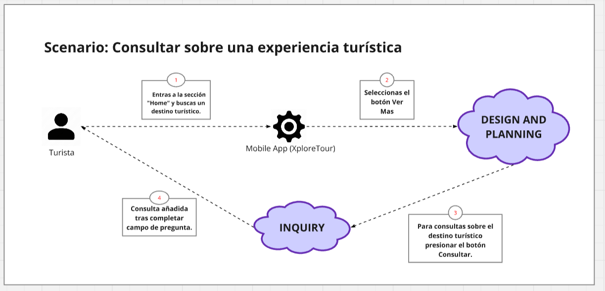

  

# Universidad Peruana de Ciencias Aplicadas

## Carrera de Ingeniería de Software

**Ciclo:** 2025 - 2  
**Curso:** Aplicaciones para Dispositivos Móviles - 1ACC0238  
**Sección:** 14649  
**Docente:** David Gerardo Quevedo Velasco  

**Informe del Trabajo Final**  

**Startup:** Xplora  
**Producto:** TripMatch

| Código      | Nombre                           |
|-------------|----------------------------------|
| U202219481  | Alaya Cabrera Rodrigo             |
| U20221E229  | Gordon Salas Gabriel Fernando  |
| U20231C505  | Melgarejo Gomez Marcia Victoria   |
| U20191E414  | Antayhua Castillo Oscar Josué   |
| U202224602 | Sulca Silva Melisa Geraldine     |

**Setiembre - 2025**

  

# **Registro de Versiones**

<table>
  <thead>
    <tr>
        <th>Versión</th>
        <th>Fecha</th>
        <th>Autor</th>
        <th>Descripción de modificación</th>
    </tr>
  </thead>
  <tbody>
  <tr>
      <td><strong>TB1</strong></td>
      <td>Setiembre</td>
      <td>
        <ul>
          <li>Rodrigo Alaya</li>
          <li>Gabriel Gordon</li>
          <li>Marcia Melgarejo</li>
          <li>Melisa Sulca</li>
          <li>Oscar Antayhua</li>
        </ul>
      </td>
      <td>
        Se han incluído los siguientes capítulos:
        <ul>
          <li>Capítulo I: Presentación</li>
          <li>Capítulo II: Requirements Development and Software Solution Design</li>
          <li>Avance de Conclusiones, Bibliografía y Anexos</li>
        </ul>
      </td>
  </tr>
  <tr>
      <td><strong>TP1</strong></td>
      <td>14/05/25</td>
      <td>
        <ul>
          <li>Rodrigo Alaya</li>
          <li>Gabriel Gordon</li>
          <li>Marcia Melgarejo</li>
          <li>Melisa Sulca</li>
          <li>Oscar Antayhua</li>
        </ul>
      </td>
      <td>
      </td>
  </tr>
  <tr>
      <td><strong>TB2</strong></td>
      <td>19/06/25</td>
      <td>
        <ul>
          <li>Rodrigo Alaya</li>
          <li>Gabriel Gordon</li>
          <li>Marcia Melgarejo</li>
          <li>Melisa Sulca</li>
          <li>Oscar Antayhua</li>
        </ul>
      </td>
      <td>
      </td>
  </tr>
  <tr>
      <td><strong>TF</strong></td>
      <td>09/07/25</td>
      <td>
        <ul>
          <li>Rodrigo Alaya</li>
          <li>Gabriel Gordon</li>
          <li>Marcia Melgarejo</li>
          <li>Melisa Sulca</li>
          <li>Oscar Antayhua</li>
        </ul>
      </td>
      <td>
      </td>
  </tr>
  </tbody>
</table>

## Project Report Collaboration Insights

| URL de la organización del proyecto | URL del repositorio del reporte   |
| :------------------: | :---------------------------: | 
| https://github.com/Xplora | https://github.com/Xplora/workstation-markdown/tree/main |

Commits del Report TB1:

# **Student Outcomes**
| Criterio específico | Acciones Realizadas | Conclusiones |
|:---:|:---|:---|
|**Actualiza conceptos y conocimientos necesarios para su desarrollo profesional y en especial para su proyecto en soluciones de software.**| **- Rodrigo Alaya**   **TB1:** Participé en la realización de entrevistas para dos segmentos de mercado, identificando requisitos clave. Además, elaboré los diagramas de clases por bounded context, aplicando los conceptos de Domain-Driven Design.  **TP:**   **TB2:** .   **TF:**.    **- Gabriel Gordon**   **TB1:** Colaboré en la elaboración del Strategic-Level Domain-Driven Design y en la creación de los diagramas de componentes para los bounded contexts, lo que fortaleció mi comprensión de la arquitectura de software a nivel de componentes.  **TP:**   **TB2:** .   **TF:**.    **- Marcia Melgarejo**   **TB1:** Lideré el desarrollo de la entrevista para el segmento de empresas, obteniendo información valiosa. También me encargué del Strategic-Level Domain-Driven Design para el bounded context de Experience y de los diagramas de base de datos asociados.  **TP:**   **TB2:** .   **TF:**.    **- Melisa Sulca**   **TB1:** Participé en la sesión de Event Storming para identificar los eventos clave del negocio y las relaciones entre ellos. Adicionalmente, elaboré el Context Mapping para definir las interacciones entre los diferentes bounded contexts del sistema.  **TP:**   **TB2:** .   **TF:**.    **- Oscar Antayhua**   **TB1:** Elaboré los diagramas de Context, Container y Deployment Mapping, lo que permitió visualizar la arquitectura del sistema en diferentes niveles y planificar el despliegue de nuestra solución.  **TP:**   **TB2:** .   **TF:**. | **TB1:** A lo largo de TB1, el equipo demostró una sólida comprensión de los principios de **Domain-Driven Design (DDD)** y del **Modelo C4**. Se aplicaron estos conceptos para diseñar una arquitectura de software robusta y escalable, lo que proporcionó una base técnica clara para el proyecto. El trabajo realizado refleja un dominio de los conocimientos teóricos y una habilidad para plasmarlos en un plan de arquitectura coherente.|
|**Reconoce la necesidad del aprendizaje permanente para el desempeño profesional y el desarrollo de proyectos en soluciones de software.**| **- Rodrigo Alaya**   **TB1:** Participé activamente en el análisis del dominio y en la elaboración de diagramas de diseño, lo que me permitió aplicar y consolidar los conceptos de arquitectura de software en un contexto práctico.  **TP:**   **TB2:** .   **TF:**.    **- Gabriel Gordon**   **TB1:** En esta primera entrega fomenté la participación equitativa dentro el equipo. Establecimos cronogramas de trabajo para poder cumplir con los objetivos sobre el trabajo.  **TP:**   **TB2:** .   **TF:**.    **- Marcia Melgarejo**   **TB1:** A través de la investigación y la aplicación práctica de nuevas metodologías de diseño y modelado de datos, pude fortalecer mi capacidad de aprendizaje autónomo y resolver desafíos complejos de arquitectura.  **TP:**   **TB2:** .   **TF:**.    **- Melisa Sulca**   **TB1:** La colaboración en las sesiones de Event Storming y Context Mapping fomentó una comprensión compartida del problema y la solución, reconociendo la importancia de trabajar en equipo para superar retos técnicos.  **TP:**   **TB2:** .   **TF:**.    **- Oscar Antayhua**   **TB1:** Reconocí la necesidad del aprendizaje continuo al profundizar en metodologías como Domain-Driven Design y herramientas especializadas como Structurizr DSL, complementando mis conocimientos previos en desarrollo web y automatización.  **TP:**   **TB2:** .   **TF:**. | **TB1:** El trabajo en equipo fue fundamental en esta etapa. Las interacciones en las sesiones de análisis y diseño fomentaron la **colaboración**, el **liderazgo compartido** y la **comunicación efectiva**. Esto demostró la capacidad del equipo para adaptarse a nuevas metodologías y organizar un flujo de trabajo dinámico, un aspecto crucial para el desarrollo de proyectos de software complejos.|

# **Objetivos SMART**

## U202219481 — Alaya Cabrera Rodrigo

Objetivo 1  
conseguir un puesto junior como desarrollador backend .NET en una empresa de tecnología en un plazo máximo de 6 meses después de la graduación.

- específico: rol backend con .NET y C# trabajando en APIs REST
- medible: enviar 40 postulaciones de calidad, 6 entrevistas, 1 oferta firmada
- alcanzable: experiencia del proyecto TripMatch y dos microservicios en el portafolio
- relevante: alinea carrera técnica en desarrollo de servicios
- tiempo: 6 meses post-graduación
- acciones clave: completar certificación AZ-204; publicar dos repos con clean architecture y pruebas; actualizar CV y LinkedIn; practicar entrevistas técnicas 2 veces por semana
- evidencia de logro: carta oferta firmada o contrato; enlaces a repos; badge de certificación

Objetivo 2  
elevar el nivel de inglés de B1 a B2 para mejorar empleabilidad internacional en 9 meses.

- específico: alcanzar B2 según MCER
- medible: obtener 6.5 en IELTS Academic o certificado equivalente B2
- alcanzable: plan de estudio 6 horas/semana y tutoría conversacional
- relevante: requisito frecuente en vacantes backend
- tiempo: 9 meses
- acciones clave: curso B1→B2; simulacros mensuales; clubes de conversación; ver y resumir 1 charla técnica semanal
- evidencia de logro: certificado IELTS o equivalente

---

## U20221E229 — Gordon Salas Gabriel Fernando

Objetivo 1  
incorporarse como desarrollador frontend con React y TypeScript en 6 meses tras la graduación.

- específico: rol frontend con React, Vite, Testing Library
- medible: 3 proyectos productivos en portafolio; 30 postulaciones; 5 entrevistas; 1 oferta
- alcanzable: experiencia UI de TripMatch y refactor a componentes reutilizables
- relevante: foco profesional en interfaces web
- tiempo: 6 meses
- acciones clave: construir un pequeño design system; cobertura de tests ≥ 70% en un proyecto; Lighthouse ≥ 90; certificación Meta Front-End o equivalente
- evidencia de logro: oferta firmada; repos públicos; reporte Lighthouse y cobertura de tests

Objetivo 2  
dominar pruebas end-to-end con Cypress para elevar la calidad de entrega en 4 meses.

- específico: automatizar flujos críticos de front
- medible: 15 pruebas E2E estables en un proyecto demo y en TripMatch
- alcanzable: guía oficial y práctica semanal
- relevante: calidad y empleabilidad
- tiempo: 4 meses
- acciones clave: configurar pipeline CI; reportes de fallos; patrón Page Object
- evidencia de logro: dashboard de CI con ejecuciones verdes; suite documentada

---

## U20231C505 — Melgarejo Gomez Marcia Victoria

Objetivo 1  
trabajar como desarrolladora full-stack JavaScript en 8 meses.

- específico: stack React + Node.js con Prisma/PostgreSQL
- medible: 2 proyectos full-stack en producción y 1 práctica profesional o freelance
- alcanzable: experiencia de TripMatch y cursos complementarios
- relevante: versatilidad en frontend y backend
- tiempo: 8 meses
- acciones clave: construir API con autenticación JWT y roles; pruebas unitarias y de integración; certificación PSM I de Scrum
- evidencia de logro: despliegues en la nube; certificación PSM I; bitácora de sprints

Objetivo 2  
mejorar habilidades de diseño funcional y accesibilidad web en 5 meses.

- específico: aplicar WCAG 2.2 nivel AA
- medible: Lighthouse Accessibility ≥ 95 en dos proyectos
- alcanzable: guía WCAG y herramientas axe
- relevante: impacto en usuarios y compliance
- tiempo: 5 meses
- acciones clave: auditorías mensuales; corrección de contrastes; foco y navegación por teclado
- evidencia de logro: reportes Lighthouse y axe con mejoras

---

## U20191E414 — Antayhua Castillo Oscar Josué

Objetivo 1  
obtener un rol jr de DevOps o Cloud en 7 meses.

- específico: automatizar CI/CD y despliegues en AWS o Azure
- medible: certificación AWS SAA-C03 o AZ-104 y 2 pipelines productivos
- alcanzable: base en proyectos y práctica guiada
- relevante: carrera en plataformas y confiabilidad
- tiempo: 7 meses
- acciones clave: infraestructura como código con Terraform; observabilidad básica con logs y métricas; hardening de contenedores
- evidencia de logro: badge de certificación; repos de IaC; pipelines activos

Objetivo 2  
elevar confiabilidad de servicios personales a SLOs básicos en 4 meses.

- específico: definir SLOs de disponibilidad y latencia para dos servicios demo
- medible: monitoreo con alertas y tableros; tiempo de recuperación < 30 min en simulacros
- alcanzable: uso de uptime checks y tracing ligero
- relevante: buenas prácticas DevOps
- tiempo: 4 meses
- acciones clave: definir SLOs; configurar alertas; ejecutar game days mensuales
- evidencia de logro: tableros y postmortems documentados

---

## U202224602 — Melisa Sulca

Objetivo 1  
insertarse como data analyst junior en 6 meses.

- específico: análisis con SQL, Python y Power BI
- medible: 3 dashboards publicados; 2 estudios de caso reproducibles; certificación Power BI Data Analyst Associate o Google Data Analytics
- alcanzable: plan de estudio y datasets abiertos
- relevante: trayectoria en datos aplicada a turismo
- tiempo: 6 meses
- acciones clave: portafolio con casos de reservas y demanda; storytelling de datos; validación con stakeholders
- evidencia de logro: certificación; portafolio público; feedback de revisión

Objetivo 2  
mejorar dominio de SQL para analítica en 3 meses.

- específico: consultas complejas con window functions y CTEs
- medible: 100 ejercicios nivel intermedio-avanzado y optimización de 3 consultas en un proyecto real
- alcanzable: práctica diaria y repos de ejercicios
- relevante: base para análisis y reporting
- tiempo: 3 meses
- acciones clave: rutina de 45 minutos diarios; revisión por pares semanal; documentación de patrones
- evidencia de logro: bitácora de ejercicios; antes/después de planes de ejecución

# **Project Report Online**

Tabla de contenidos

- [Capítulo I: Presentación](#capítulo-i-presentación)
  - [1.1. Startup Profile](#11-startup-profile)
    - [1.1.1. Descripción de la Startup](#111-descripción-de-la-startup)
    - [1.1.2. Perfiles de integrantes del equipo](#112-perfiles-de-integrantes-del-equipo)
  - [1.2. Solution Profile](#12-solution-profile)
    - [1.2.1. Antecedentes y problemática](#121-antecedentes-y-problemática)
    - [1.2.2. Lean UX Process](#122-lean-ux-process)
      - [1.2.2.1. Lean UX Problem Statements](#1221-lean-ux-problem-statements)
      - [1.2.2.2. Lean UX Assumptions](#1222-lean-ux-assumptions)
      - [1.2.2.3. Lean UX Hypothesis Statements](#1223-lean-ux-hypothesis-statements)
      - [1.2.2.4. Lean UX Canvas](#1224-lean-ux-canvas)
  - [1.3. Segmentos objetivo](#13-segmentos-objetivo)

- [Capítulo II: Requirements Development and Software Solution Design](#capítulo-ii-requirements-development-and-software-solution-design)
  - [2.1. Competidores](#21-competidores)
    - [2.1.1. Análisis competitivo](#211-análisis-competitivo)
    - [2.1.2. Estrategias y tácticas frente a competidores](#212-estrategias-y-tácticas-frente-a-competidores)
  - [2.2. Entrevistas](#22-entrevistas)
    - [2.2.1. Diseño de entrevistas](#221-diseño-de-entrevistas)
    - [2.2.2. Registro de entrevistas](#222-registro-de-entrevistas)
    - [2.2.3. Análisis de entrevistas](#223-análisis-de-entrevistas)
  - [2.3. Needfinding](#23-needfinding)
    - [2.3.1. User Personas](#231-user-personas)
    - [2.3.2. User Task Matrix](#232-user-task-matrix)
    - [2.3.3. User Journey Mapping](#233-user-journey-mapping)
    - [2.3.4. Empathy Mapping](#234-empathy-mapping)
    - [2.3.5. Ubiquitous Language](#235-ubiquitous-language)
  - [2.4. Requirements Specification](#24-requirements-specification)
    - [2.4.1. User Stories](#241-user-stories)
    - [2.4.2. Impact Mapping](#242-impact-mapping)
    - [2.4.3. Product Backlog](#243-product-backlog)
  - [2.5. Strategic-Level Domain-Driven Design](#25-strategic-level-domain-driven-design)
    - [2.5.1. EventStorming](#251-eventstorming)
      - [2.5.1.1. Candidate Context Discovery](#2511-candidate-context-discovery)
      - [2.5.1.2. Domain Message Flows Modeling](#2512-domain-message-flows-modeling)
      - [2.5.1.3. Bounded Context Canvases](#2513-bounded-context-canvases)
    - [2.5.2. Context Mapping](#252-context-mapping)
    - [2.5.3. Software Architecture](#253-software-architecture)
      - [2.5.3.1. Software Architecture Context Level Diagrams](#2531-software-architecture-context-level-diagrams)
      - [2.5.3.2. Software Architecture Container Level Diagrams](#2532-software-architecture-container-level-diagrams)
      - [2.5.3.3. Software Architecture Deployment Diagrams](#2533-software-architecture-deployment-diagrams)
  - [2.6. Tactical-Level Domain-Driven Design](#26-tactical-level-domain-driven-design)
    - [2.6.x. Bounded Context: <Bounded Context Name>](#26x-bounded-context-bounded-context-name)
      - [2.6.x.1. Domain Layer](#26x1-domain-layer)
      - [2.6.x.2. Interface Layer](#26x2-interface-layer)
      - [2.6.x.3. Application Layer](#26x3-application-layer)
      - [2.6.x.4. Infrastructure Layer](#26x4-infrastructure-layer)
      - [2.6.x.5. Bounded Context Software Architecture Component Level Diagrams](#26x5-bounded-context-software-architecture-component-level-diagrams)
      - [2.6.x.6. Bounded Context Software Architecture Code Level Diagrams](#26x6-bounded-context-software-architecture-code-level-diagrams)
        - [2.6.x.6.1. Bounded Context Domain Layer Class Diagrams](#26x61-bounded-context-domain-layer-class-diagrams)
        - [2.6.x.6.2. Bounded Context Database Design Diagram](#26x62-bounded-context-database-design-diagram)

- [Capítulo III: Solution UI/UX Design](#capítulo-iii-solution-uiux-design)
  - [3.1. Product Design](#31-product-design)
    - [3.1.1. Style Guidelines](#311-style-guidelines)
      - [3.1.1.1. General Style Guidelines](#3111-general-style-guidelines)
    - [3.1.2. Information Architecture](#312-information-architecture)
      - [3.1.2.1. Organization Systems](#3121-organization-systems)
      - [3.1.2.2. Labelling Systems](#3122-labelling-systems)
      - [3.1.2.3. SEO Tags and Meta Tags](#3123-seo-tags-and-meta-tags)
      - [3.1.2.4. Searching Systems](#3124-searching-systems)
      - [3.1.2.5. Navigation Systems](#3125-navigation-systems)
    - [3.1.3. Landing Page UI Design](#313-landing-page-ui-design)
      - [3.1.3.1. Landing Page Wireframe](#3131-landing-page-wireframe)
      - [3.1.3.2. Landing Page Mock-up](#3132-landing-page-mock-up)
    - [3.1.4. Mobile Applications UX/UI Design](#314-mobile-applications-uxui-design)
      - [3.1.4.1. Mobile Applications Wireframes](#3141-mobile-applications-wireframes)
      - [3.1.4.2. Mobile Applications Wireflow Diagrams](#3142-mobile-applications-wireflow-diagrams)
      - [3.1.4.3. Mobile Applications Mock-ups](#3143-mobile-applications-mock-ups)
      - [3.1.4.4. Mobile Applications User Flow Diagrams](#3144-mobile-applications-user-flow-diagrams)
      - [3.1.4.5. Mobile Applications Prototyping](#3145-mobile-applications-prototyping)

- [Capítulo IV: Product Implementation & Validation](#capítulo-iv-product-implementation--validation)
  - [4.1. Software Configuration Management](#41-software-configuration-management)
    - [4.1.1. Software Development Environment Configuration](#411-software-development-environment-configuration)
    - [4.1.2. Source Code Management](#412-source-code-management)
    - [4.1.3. Source Code Style Guide & Conventions](#413-source-code-style-guide--conventions)
    - [4.1.4. Software Deployment Configuration](#414-software-deployment-configuration)
  - [4.2. Landing Page & Mobile Application Implementation](#42-landing-page--mobile-application-implementation)
    - [4.2.1. Sprint n](#421-sprint-n)
      - [4.2.1.1. Sprint Planning n](#4211-sprint-planning-n)
      - [4.2.1.2. Sprint Backlog n](#4212-sprint-backlog-n)
      - [4.2.1.3. Development Evidence for Sprint Review](#4213-development-evidence-for-sprint-review)
      - [4.2.1.4. Testing Suite Evidence for Sprint Review](#4214-testing-suite-evidence-for-sprint-review)
      - [4.2.1.5. Execution Evidence for Sprint Review](#4215-execution-evidence-for-sprint-review)
      - [4.2.1.6. Services Documentation Evidence for Sprint Review](#4216-services-documentation-evidence-for-sprint-review)
      - [4.2.1.7. Software Deployment Evidence for Sprint Review](#4217-software-deployment-evidence-for-sprint-review)
      - [4.2.1.8. Team Collaboration Insights during Sprint](#4218-team-collaboration-insights-during-sprint)
  - [4.3. Validation Interviews](#43-validation-interviews)
    - [4.3.1. Diseño de Entrevistas](#431-diseño-de-entrevistas)
    - [4.3.2. Registro de Entrevistas](#432-registro-de-entrevistas)
    - [4.3.3. Evaluaciones según heurísticas](#433-evaluaciones-según-heurísticas)

- [Conclusiones](#conclusiones)
  - [Conclusiones y recomendaciones](#conclusiones-y-recomendaciones)

- [Video App Validation](#video-app-validation)
- [Video About the product](#video-about-the-product)
- [Video About the team](#video-about-the-team)
- [Glosario](#glosario)
- [Bibliografía](#bibliografía)
- [Anexos](#anexos)

# Capítulo 1: Introducción
## 1.1. Startup Profile
### 1.1.1. Descripción de la startup
En un mundo donde el turismo se ha diversificado y las experiencias personalizadas son cada vez más valoradas, Xplora surge como una startup enfocada en transformar la forma en que los viajeros conectan con agencias de turismo locales a través de soluciones digitales diseñadas principalmente para dispositivos móviles.

Reconocemos que muchos turistas enfrentan la dificultad de encontrar paquetes confiables, ajustados a su presupuesto y verdaderamente adaptados a sus intereses, mientras que las agencias buscan nuevas maneras tecnológicas de llegar a sus clientes.

A través de nuestra aplicación TripMatch, brindamos un espacio donde los usuarios pueden explorar, comparar y reservar actividades y experiencias turísticas únicas desde sus teléfonos móviles, filtradas por destino, tipo de viaje, duración o presupuesto. Al mismo tiempo, las agencias pueden administrar su catálogo de servicios, responder consultas en tiempo real mediante chat móvil y recibir reservas de forma directa y sencilla. Nuestro enfoque está en ofrecer una experiencia fluida y confiable tanto para el viajero como para el proveedor, promoviendo el turismo responsable y local.

**Misión:** Nuestra misión es facilitar el acceso a experiencias turísticas auténticas y personalizadas mediante una aplicación móvil que conecte a viajeros con agencias de turismo de manera directa, eficiente y transparente. Trabajamos para simplificar el proceso de búsqueda y reserva de actividades, fomentando al mismo tiempo el crecimiento de negocios turísticos locales a través de soluciones tecnológicas intuitivas.

**Visión:** Convertirnos en la aplicación de referencia para la planificación y reserva de experiencias turísticas móviles, destacándonos por promover el turismo responsable, la innovación tecnológica y el fortalecimiento de agencias locales. Aspiramos a ser una solución global que conecte millones de viajeros con sus destinos a través de su smartphone.

Valores: Defendemos la integridad, la innovación y el turismo sostenible. Aseguramos precisión en la información, apoyamos a agencias locales y ofrecemos experiencias personalizadas para garantizar viajes auténticos, seguros y responsables.

### 1.1.2. Perfiles de integrantes del equipo

|  Nombres y Apellidos |    Codigo   | Descripción | Foto | 
|----------------------|-------------|-------------|------|
| Gabriel Fernando Gordon Salas  | U20221E229  | Me considero una persona responsable, me gusta ayudar a mis compañeros en los trabajos y sé organizarme bien al momento de realizar mis cosas. Con esto mi objetivo es poder dar lo mejor en un ambiente de cooperación entre todos para que el proyecto dé una muy buena presentación |    |
| Marcia Victoria Melgarejo Gomez |  U20231C505  | Actualmente estoy cursando el quinto ciclo de la carrera de Ingeniería de Software en la UPC. Opté por esta carrera debido a mi interés en el mundo de la tecnología y todo lo que este campo puede ofrecer a la sociedad.   Me caracterizo por ser una persona curiosa, persistente y colaborativa.   Tengo conocimientos en C++, HTML, CSS, JS, Pyhton | |
| Rodrigo Alaya Cabrera |  U202219481  | Soy una persona responsable, comprometida con mis objetivos y con gran disposición para aprender continuamente. Me adapto con facilidad al trabajo en equipo, aportando ideas y soluciones. Valoro mucho la eficiencia, la ética profesional y la mejora constante. Me esfuerzo por entregar siempre resultados de calidad, gestionando mis tareas con orden y enfoque. |    |
|  Oscar Josué Antayhua Castillo |  U20191E414  | Soy una persona responsable, enfocado, con habilidades en automatización y desarrollo web. Manejo distintas herramientas RPA como Make, Power Automate, n8n y zapier, y para desarrollo web tengo conocimiento en HTML, CSS, Python, C++, NoSQL, SQL, Vue, Angular, Nextjs, Typescript. |   |
|  Melisa Geraldine Sulca Silva |  U202224602  | Mi nombre es Melisa Sulca y estudio la carrera de Ingeniería de Software en la Universidad Peruana de Ciencias Aplicadas (UPC). Mis principales habilidades son el trabajo en equipo, soy responsable, mantengo mi compromiso en dar todo mi esfuerzo y práctico perseverancia. |   |

## 1.2. Solution Profile

La propuesta de solución está orientada al diseño y desarrollo de **TripMatch**, una aplicación móvil que conecta a los usuarios con experiencias de viaje personalizadas según sus intereses, presupuesto y tiempo disponible. La solución busca responder a la creciente necesidad de contar con herramientas móviles que permitan planificar viajes de forma rápida, flexible y desde cualquier lugar, optimizando tanto la búsqueda como la gestión de reservas de actividades turísticas.

### 1.2.1. Antecedentes y problemática

**What**
- ¿Cuál es el problema?  
    El problema central radica en la desconexión entre viajeros y agencias de turismo locales. Los turistas tienen dificultades para encontrar experiencias auténticas y personalizadas, mientras que las agencias locales carecen de herramientas digitales efectivas que les permitan visibilizar y gestionar sus servicios en un mercado cada vez más competitivo.  
- ¿Cuál es la relación con la persona en cuestión?  
  La aplicación TripMatch (de Xplora) busca cerrar esa brecha. Para el viajero, TripMatch facilita la búsqueda, comparación y reserva de experiencias desde cualquier lugar mediante la app móvil, incorporando filtros relevantes, reseñas verificadas y opciones de reserva rápida. Para la agencia local, la plataforma ofrece herramientas sencillas de administración que reducen la dependencia de intermediarios y permiten llegar a clientes en el momento de decisión.

**When**
- ¿Cuándo sucede el problema?  
    El problema se manifiesta principalmente en las etapas de planificación y organización del viaje, cuando los turistas intentan investigar y contratar servicios turísticos confiables y personalizados desde sus dispositivos móviles. También ocurre durante el desplazamiento, cuando buscan actividades adicionales o alternativas a lo inicialmente planeado y requieren inmediatez en la información y la reserva.

- ¿Cuándo utiliza el cliente el producto?  
  El cliente utiliza la plataforma TripMatch en dos momentos clave: antes del viaje, cuando explora actividades y destinos desde casa o el trabajo mediante su smartphone o tablet; y durante el viaje, cuando ya se encuentra en el destino y busca experiencias complementarias, aprovechando la facilidad de realizar reservas y consultas directamente desde su móvil.

**Where**
- ¿Dónde está el cliente cuando utiliza el producto?  
  El usuario puede acceder a la plataforma desde múltiples ubicaciones. Desde su hogar durante la fase de planificación, utilizando dispositivos como computadoras o celulares; o bien desde su destino turístico y necesita encontrar nuevas experiencias turisticas.
- ¿A dónde se dirige?  
  El usuario se dirige a destinos nacionales o internacionales, buscando experiencias auténticas y personalizadas. Puede tratarse de destinos populares donde evita lo masificado o de lugares poco explorados en los que necesita orientación especializada que le aporte confianza y seguridad.
- ¿Dónde surge el problema?  
  El problema surge principalmente en el espacio digital fragmentado del sector turístico, donde la información se encuentra dispersa en múltiples sitios web, aplicaciones y plataformas, dificultando la comparación de opciones y la verificación de la calidad y autenticidad de las experiencias ofrecidas por agencias locales que a menudo carecen de presencia digital efectiva.

**Who**
- ¿Quiénes están involucrados?  
  Los principales involucrados son los turistas que buscan experiencias personalizadas, las agencias locales que ofrecen servicios especializados, los operadores turísticos y las plataformas tecnológicas que no integran oferta ni demanda de manera eficiente.
- ¿A quiénes les sucede el problema?  
  Afecta a dos actores principales: los turistas que buscan opciones auténticas y no logran comunicarse con proveedores locales de forma confiable, y las agencias locales que tienen dificultades para digitalizar sus servicios y competir frente a las grandes plataformas.
- ¿Quién lo utiliza?  
  La plataforma TripMatch será utilizada por viajeros independientes que buscan experiencias turísticas auténticas y personalizadas más allá del turismo masivo, así como por agencias locales de turismo que buscan ampliar su presencia digital y conectar directamente con clientes potenciales sin intermediarios que reduzcan sus márgenes o limiten su capacidad de personalización.

**Why**
- ¿Cuál es la causa del problema?  
  La causa radica en la falta de personalización de los paquetes turísticos y en la limitada digitalización de las agencias locales. Los viajeros quieren experiencias únicas y en tiempo real, pero reciben ofertas genéricas. Además, la baja presencia digital limita la interacción inmediata, clave para usuarios que gestionan sus viajes desde el internet  (KPMG Tendencias, 2024).

**How**
- ¿En qué condiciones nuestros clientes usan el producto?  
  Los clientes acceden a nuestra plataforma TripMatch cuando buscan experiencias turísticas auténticas y personalizadas que se ajusten a sus intereses específicos, presupuesto y disponibilidad de tiempo. Esto ocurre tanto durante la planificación anticipada de su viaje, desde casa o el trabajo, como cuando ya se encuentran en el destino y requieren modificar o complementar su itinerario con actividades locales recomendadas. En este último caso, la facilidad de acceder desde dispositivos móviles resulta clave para obtener información inmediata y concretar reservas en tiempo real.  

- ¿Cómo nos conocieron nuestros compradores?  
  Los usuarios conocen nuestra plataforma principalmente a través de marketing digital especializado en viajes y comunidades de viajeros, recomendaciones de otros usuarios satisfechos en redes sociales, y posicionamiento en buscadores especializados en turismo cuando buscan alternativas a las grandes plataformas tradicionales.  

- ¿Cómo prefieren nuestros consumidores acceder a nuestro producto?  
  Los usuarios acceden a nuestra plataforma mediante un sitio web para la planificación detallada previa, y a través de dispositivos móviles que les permiten facilitar reservas rápidas durante su viaje.  

- ¿Qué llevó a la persona a esa situación?  
  El creciente deseo de los viajeros por experiencias auténticas y personalizadas, junto con la frustración provocada por las plataformas masivas que ofrecen opciones estandarizadas, lleva a los usuarios a buscar alternativas que faciliten la conexión directa con proveedores locales. A la vez, las agencias de turismo local llegan a nuestra plataforma motivadas por la necesidad de digitalizar sus servicios y expandir su alcance.

**How Much**  
Aproximadamente el 82% de las reservas de viajes en 2018 se realizaron a través de Internet, según un análisis de Mize (2021). Este cambio refleja cómo la tecnología ha transformado la industria turística, eliminando intermediarios y facilitando la personalización de experiencias para los viajeros. Además, más del 50% de viajeros suelen dedicar su tiempo en investigar sitios locales de reseñas de viajes con el objetivo de tomar una decisión informada sobre su próximo viaje, considerando aspectos como videos y fotos de destinos, la capacidad de los hoteles para destacar sus servicios y la experiencia previa de otros viajeros, entre otros factores (Travelperk, 2022). Asimismo, según el Ministerio de Comercio Exterior y Turismo (MINCETUR, 2024) solo en el Perú, aproximadamente 48 millones de viajes se realizan anualmente por motivos de turismo interno, incluyendo tanto turistas extranjeros que visitan el país como locales que viajan a otras ciudades dentro del territorio nacional.

### 1.2.2. Lean UX Process
#### 1.2.2.1. Lean UX Problem Statements
Nuestro servicio ofrece una aplicación que conecta a viajeros con agencias de turismo locales, permitiendo a los usuarios explorar, comparar y reservar experiencias auténticas y personalizadas basadas en sus preferencias, presupuesto y destino. Al mismo tiempo, brindamos a las agencias locales herramientas digitales para gestionar sus servicios, interactuar con clientes en tiempo real y ampliar su alcance comercial de manera eficiente, promoviendo el turismo responsable y el crecimiento de negocios locales.    
Hemos identificado un factor crítico que afecta tanto a viajeros como a agencias locales. Los turistas enfrentan dificultades para encontrar experiencias confiables y adaptadas a sus intereses, mientras que las agencias carecen de una presencia digital efectiva para competir en un mercado cada vez más globalizado. Esta desconexión genera frustración en los viajeros, que terminan recurriendo a opciones genéricas o masificadas, y limita el crecimiento de las agencias, que no logran aprovechar la creciente demanda de turismo auténtico y personalizado.    
¿Cómo podemos mejorar la conexión entre viajeros y agencias locales para garantizar experiencias turísticas auténticas y personalizadas simplificando el proceso de planificación y reserva, con un impacto positivo en el turismo responsable?

#### 1.2.2.2. Lean UX Assumptions
**User Assumptions**
- ¿Quién es mi usuario?  
  Nuestros usuarios son viajeros que buscan experiencias auténticas y personalizadas, y agencias de turismo locales que necesitan digitalizar sus servicios para llegar a más clientes.
- ¿Dónde encaja nuestro producto en su trabajo o vida?  
  Para viajeros, simplifica la búsqueda y reserva de actividades únicas; para agencias, es una herramienta de gestión y conexión directa con turistas.
- ¿Qué problemas tiene nuestro producto? ¿Resolver?  
  Resuelve la dificultad de los viajeros para encontrar opciones confiables y personalizadas, y la falta de visibilidad digital de las agencias locales.
- ¿Cuándo y cómo es nuestro producto? ¿Usado?  
  Los viajeros lo usan al planificar su viaje o durante este para reservar actividades; las agencias lo usan diariamente para gestionar servicios y atender consultas.
- ¿Qué características son importantes?  
  Filtros avanzados, reseñas verificadas, chat en tiempo real, herramientas de gestión para agencias y opción de reservas móviles.
- ¿Cómo debe verse nuestro producto y cómo debe comportarse?  
  Debe ser visualmente atractivo, fácil de usar, seguro para transacciones e intuitivo para agencias con poca experiencia digital.  

**Business Assumptions**
- Creo que nuestros clientes necesitan una manera sencilla y confiable de encontrar y reservar experiencias turísticas auténticas y personalizadas, gestionadas por agencias locales, sin tener que navegar entre múltiples plataformas ni arriesgarse a servicios poco verificados.  
- Estas necesidades se pueden cubrir con una aplicación que ofrezca filtros avanzados, reseñas verificadas, herramientas de comparación, comunicación directa en tiempo real y un sistema de reservas seguro y eficiente.  
- Mis clientes iniciales serán viajeros independientes, tanto nacionales como internacionales, que buscan experiencias locales auténticas, y agencias de turismo local que necesitan digitalizar sus servicios para ampliar su alcance.  
- El valor principal que mis clientes esperan es contar con herramientas digitales que les permitan planificar, comparar y reservar experiencias de manera ágil, segura y adaptada a sus intereses y presupuesto.  
- Los clientes también pueden obtener beneficios adicionales como: ahorro de tiempo en la búsqueda de actividades, conexión directa con proveedores confiables, acceso a descuentos exclusivos, reseñas verificadas, contenido visual auténtico y recomendaciones personalizadas.  
- Captaré la mayoría de mis clientes mediante marketing digital, alianzas estratégicas con comunidades de viajeros y programas de recomendación con beneficios para quienes compartan la aplicación.  
- Generaré ingresos a través de comisiones por reservas, alianzas estratégicas y colaboraciones con influencers de viajes.  
- Mi competencia principal está representada por plataformas como *Withlocals*, *ToursByLocals* y *Showaround*, que también ofrecen experiencias personalizadas mediante guías o agencias locales.  
- Superaremos a la competencia gracias a nuestro enfoque en el turismo local auténtico, brindando soporte directo a pequeñas agencias que normalmente no tienen acceso a herramientas tecnológicas avanzadas. Además, nuestra propuesta prioriza la confianza, la personalización y la conexión directa con proveedores locales.  
- El mayor riesgo de producto es que las agencias locales no adopten la aplicación por falta de habilidades digitales o que no mantengan actualizado su catálogo, afectando la calidad del servicio.  
- Resolveremos este riesgo mediante capacitación inicial, soporte técnico continuo, una interfaz intuitiva diseñada para usuarios con poca experiencia digital.  

#### 1.2.2.3. Lean UX Hypothesis Statements
- **Creemos que** ofrecer filtros avanzados aumentará la adopción de la plataforma por parte de viajeros que buscan personalización.  
  **Sabremos que hemos tenido éxito**  
  **Cuando veamos** un aumento del 35% en las reservas realizadas con filtros personalizados durante los primeros 4 meses.

- **Creemos que** permitir a las agencias locales gestionar su catálogo digital y responder consultas en tiempo real incrementará su participación en la plataforma.  
  **Sabremos que hemos tenido éxito**  
  **Cuando veamos** que el 70% de las agencias registradas actualizan su catálogo semanalmente y responden a consultas en menos de 2 horas durante los primeros 3 meses.

- **Creemos que** eliminar intermediarios y ofrecer precios directos mejorará la rentabilidad de las agencias locales.  
  **Sabremos que hemos tenido éxito**  
  **Cuando veamos** un aumento del 25% en la renovación de contratos anuales con agencias locales y una reducción del 15% en quejas por precios elevados en el primer año.

- **Creemos que** la integración de reseñas verificadas y fotos reales de experiencias aumentará la confianza de los viajeros en las agencias locales.  
  **Sabremos que hemos tenido éxito**  
  **Cuando veamos** un aumento del 30% en las reservas de agencias con al menos 10 reseñas positivas durante el primer trimestre de uso.

#### 1.2.2.4. Lean UX Canvas

## 1.3. Segmentos Objetivos
**Segmento #1: Turistas**  
Este segmento está conformado por viajeros que buscan experiencias únicas y adaptadas a sus intereses y presupuestos. Se dirigen tanto a jóvenes aventureros como a familias y profesionales que desean descubrir destinos novedosos y actividades locales.
- Aspectos demográficos:
  - Sexo: Masculino y femenino
  - Edades: Entre 18 y 65 años
- Aspectos psicográficos:
  - Motivaciones: Vivir experiencias auténticas, apoyar el turismo local, evitar intermediarios innecesarios y optimizar su tiempo en la planificación.
  - Intereses: Turismo responsable, culturas locales, aventura, gastronomía típica y actividades fuera de lo convencional.
  - Comportamiento: Investigan opciones antes de reservar, comparan precios y valoran reseñas reales. Prefieren plataformas intuitivas que les permitan filtrar por preferencias específicas como duración, presupuesto, tipo de viaje, etc.

**Segmento #2: Agencias de Turismo**  
Este segmento agrupa a aquellas agencias y operadores turísticos que buscan ampliar su alcance y optimizar la gestión de sus servicios a través de canales digitales. Incluyen tanto pequeñas empresas emergentes como agencias consolidadas que desean modernizar sus procesos y alcanzar a un público más amplio mediante la reserva en tiempo real.
- Aspectos demográficos:
  - Tipo de negocio: Pequeñas y medianas agencias de turismo, y guías independientes.
  - Ubicación: Destinos turísticos con enfoque en experiencias culturales, ecológicas o de aventura.
- Aspectos psicográficos:
  - Motivaciones: Digitalizar su negocio, aumentar reservas directas, reducir costos de intermediación y fidelizar clientes mediante experiencias memorables.
  - Intereses: Innovación en turismo, marketing digital, sostenibilidad y herramientas que simplifiquen la gestión de reservas y consultas.
  - Comportamiento: Activos en redes sociales, dispuestos a adoptar tecnología accesible y con interés en destacar su propuesta de valor.

# Capítulo 2: Requirements Eliciation & Analysis
## 2.1. Competidores
### 2.1.1. Análisis competitivo
**¿Por qué llevar a cabo este análisis?**  
    Este análisis permite entender el entorno competitivo en el que TripMatch operará, identificar las fortalezas y debilidades de plataformas similares a nivel local e internacional, y delinear estrategias efectivas para posicionar a Turisnap como una solución confiable y diferenciada para el turismo personalizado y responsable.

| **Categoría** | **TripMatch**  | **Withlocals**  | **ToursByLocals**  | **Showaround**  |
|---------------|------------------|-------------------|----------------------|----------------------|
| **Overview** | Plataforma digital que conecta turistas con agencias locales para experiencias personalizadas. | Conecta viajeros con anfitriones locales para tours privados. | Tours privados guiados por expertos locales. | Recorridos personalizados con locales en su ciudad. |
| **Ventaja competitiva** | Filtros por tipo de viaje, presupuesto, duración; reservas instantáneas; soporte a agencias locales. | Experiencias privadas y auténticas en ciudades populares. | Personalización de itinerarios con guías especializados. | Perspectiva local auténtica para conocer la ciudad como residente. |
| **Mercado objetivo** | Viajeros que buscan autenticidad y agencias que desean digitalizarse. | Viajeros interesados en cultura local y experiencias no masificadas. | Turistas con alto presupuesto que buscan experiencias exclusivas. | Millennials y Gen Z viajeros espontáneos. |
| **Estrategias de marketing** | Alianzas con blogs de viaje, redes sociales, posicionamiento SEO en turismo peruano. | Marketing de influencers, presencia en redes, contenido en video. | Posicionamiento premium, campañas dirigidas a mercados maduros. | Promoción directa en Instagram y TikTok. |
| **Productos & Servicios** | Buscador por intereses, chat con agencias, reseñas, pagos online. | Tours guiados 1:1, personalizables. | Itinerarios custom, filtros por estilo de viaje. | Recorridos casuales, flexibles y sociales. |
| **Precios & Costos** | Comisión por transacción (microtransacciones), acceso freemium para agencias. | Precio por experiencia, sin comisiones intermedias. | Tarifa fija por guía, orientado a turismo premium. | Precios negociados directamente con los locales. |
| **Canales de distribución** | Aplicación móvil y plataforma web | Web y app móvil. | Web y app. | App y sitio móvil social. |
| **Fortalezas** | Enfoque local, flexibilidad, apoyo a pymes, interfaz intuitiva. | Autenticidad, enfoque humano. | Alta calidad y seguridad en el servicio. | Espontaneidad, enfoque juvenil. |
| **Debilidades** | Plataforma nueva, sin marca reconocida aún. | Limitado a ciertas ciudades. | Costos altos | **Oportunidades** | Crecimiento del turismo interno y de experiencias locales. | Tendencia al turismo responsable. | Viajeros de lujo que buscan experiencias únicas. | Mayor uso de apps sociales de viaje. |
| **Amenazas** | Alta competencia y presencia de marcas globales. | Escalabilidad limitada por modelo 1:1. | Barrera de acceso por costos. | Riesgos de seguridad para el usuario. |

### 2.1.2. Estrategias y tácticas frente a competidores
 TripMatch debe posicionarse como una alternativa local, accesible, confiable y especializada en conectar a viajeros con agencias peruanas. A continuación, se detallan estrategias para competir frente a las fortalezas de plataformas globales, aprovechar debilidades del mercado y mitigar amenazas.

### 2.1.2. Estrategias y tácticas frente a competidores
 TripMatch debe posicionarse como una alternativa local, accesible, confiable y especializada en conectar a viajeros con agencias peruanas. A continuación, se detallan estrategias para competir frente a las fortalezas de plataformas globales, aprovechar debilidades del mercado y mitigar amenazas.

#### Frente a las fortalezas de los competidores

| **Fortalezas de los competidores** | **Estrategias de TripMatch** |
|-----------------------------------|-------------------------------|
| Withlocals ofrece tours íntimos y personalizados. | Reforzar alianzas con agencias locales para experiencias culturales en zonas menos exploradas. |
| ToursByLocals tiene alta reputación y seguridad. | Incorporar validación de identidad, garantías y sistema de soporte proactivo. |
| Showaround apela al contacto informal entre viajeros y locales. | Crear perfiles verificados para guías y filtros por estilo de viaje para personalización real. |

#### Frente a las debilidades de los competidores

| **Debilidades de los competidores** | **Tácticas de TripMatch** |
|------------------------------------|-------------------------------|
| Withlocals está limitado a ciudades grandes. | Enfocarse en destinos emergentes y rurales dentro del Perú. |
| ToursByLocals tiene precios elevados. | Ofrecer experiencias de calidad a precios accesibles gracias a la eliminación de intermediarios. |
| Showaround carece de control de calidad. | Sistema de reputación, verificación de agencias y reseñas verificadas. |

#### Aprovechamiento de oportunidades del entorno

| **Oportunidades del entorno** | **Estrategias para capitalizarlas** |
|-------------------------------|------------------------------------|
| Creciente interés en el turismo responsable. | Promover experiencias sostenibles y apoyar económicamente a comunidades locales. |
| Mayor uso de herramientas digitales para planificar viajes. | Optimizar UX de TripMatch para dispositivos móviles y ofrecer recomendaciones inteligentes. |

#### Mitigación de amenazas del entorno

| **Amenazas externas** | **Tácticas de mitigación** |
|------------------------|----------------------------|
| Presencia de plataformas consolidadas. | Posicionar TripMatch como una solución peruana con valor local y enfoque en experiencias genuinas. |
| Baja confianza en plataformas nuevas. | Transparencia total en tarifas, reseñas verificadas, y garantías de reserva. |

#### Estrategia general

TripMatch se posicionará como una aplicación peruana de turismo responsable y digitalizado, enfocada en conectar viajeros con experiencias auténticas de forma directa y accesible. Su modelo flexible y su enfoque en la experiencia del usuario permitirá escalar en destinos clave del Perú y luego expandirse regionalmente, diferenciándose de competidores globales por su cercanía, confiabilidad y valor cultural.

## 2.2. Entrevistas
### 2.2.1. Diseño de entrevistas  

**Preguntas Generales:**  
+ ¿Cuál es tu nombre y a qué te dedicas actualmente?
+ ¿Cuántos años tienes?

**Preguntas Especificas:**   
  
Segmento 1: Turistas    
1. Cuando estás organizando un viaje, ¿qué tan fácil te resulta encontrar actividades o experiencias que realmente se alineen a tus intereses y presupuesto?
2. ¿Qué problemas sueles encontrar cuando buscas y reservas actividades turísticas online?
3. ¿Alguna vez has querido contratar un tour o actividad local y no supiste cómo contactarte con alguien confiable? ¿Qué hiciste en ese caso?
4. ¿Qué tan dispuesto estás a descubrir actividades nuevas durante tu viaje, que no estaban en tu plan original?
5. ¿Te gustaría poder encontrar experiencias personalizadas en una sola app, según tus intereses y reservar directamente con agencias locales? ¿Por qué?
6. ¿Qué haría que confíes en una app que te conecta con operadores locales directamente?
7. ¿Sientes que las plataformas actuales te dan opciones hechas a medida o más bien paquetes estándar para el turismo masivo? ¿Qué te gustaría que cambie?
   
Segmento 2: Agencias de Turismo  
1. ¿Cómo te das a conocer actualmente ante nuevos clientes?
2. ¿Qué tan fácil o difícil es para ti atraer turistas independientes sin intermediarios?
3. ¿Qué herramientas digitales utilizas actualmente para gestionar reservas o promocionar tus servicios?
4. ¿Has tenido problemas para digitalizar algunos aspectos de tu operación? ¿Cuáles?
5. ¿Qué desafíos enfrentas al competir con grandes agencias o plataformas conocidas?
6. ¿Te interesaría una plataforma que permita mostrar tus tours a turistas según sus intereses específicos y que puedan reservar directamente contigo? ¿Por qué?
7. ¿Qué características serían imprescindibles para ti en una plataforma como TripMatch?
8. ¿Cómo manejas actualmente las consultas y reservas de último minuto? ¿Sientes que necesitas automatizar eso?
9. ¿Qué beneficios esperarías obtener al usar una plataforma que conecte directamente agencias locales con viajeros sin tantos intermediarios?

### 2.2.2. Registro de entrevistas

> Segmento 1: Turistas

| Nº Entrevista | Datos del entrevistado                                                                                                                                                                | Resumen de la entrevista                                                                                                                                                                                                                                                                                                                                                                                                                                                                                       | Evidencia de entrevista                          |
|---------------|---------------|-------------------|--------------|
| 1             | - **Nombre:**  Valentino Chavez   - **Edad:** 20 años    - **Distrito:** San Miguel   - **Link:** [Entrevista 1: Valentino Chavez](https://upcedupe-my.sharepoint.com/:v:/g/personal/u202219481_upc_edu_pe/Eds4jzCLBjRKlkWWBEC8nEcB59T0FRpe17OH2a6_5EzH-g?e=xRUHKu&nav=eyJyZWZlcnJhbEluZm8iOnsicmVmZXJyYWxBcHAiOiJTdHJlYW1XZWJBcHAiLCJyZWZlcnJhbFZpZXciOiJTaGFyZURpYWxvZy1MaW5rIiwicmVmZXJyYWxBcHBQbGF0Zm9ybSI6IldlYiIsInJlZmVycmFsTW9kZSI6InZpZXcifX0%3D) | Valentino es un viajero que busca aventuras como canotaje le cuesta hallar actividades alineadas porque las webs no dan info suficiente y termina escribiendo por WhatsApp. Desconfía por falta de garantías y operadores confiables; recurre a recomendaciones. Está muy dispuesto a descubrir planes auténticos. Quiere una app con experiencias personalizadas por interés, reserva directa y alianza real entre la plataforma y operadores (no solo listado de contactos), con precios claros y reseñas verificadas. Rechaza paquetes estándar; busca flexibilidad para ajustar al horario propio.                 |  |
| 2             | - **Nombre:** Leslie Vanessa Quispe   - **Edad:** 24 años   - **Distrito:** Pachacútec – Ica   - **Link:** [Entrevista 2: Leslie Vanessa](https://upcedupe-my.sharepoint.com/:v:/g/personal/u202219481_upc_edu_pe/ER9uSjjYeUpAlCGDYI6ikEUBMF_SZ3xek6ePFchu92xoNg?e=KnUET1) | Leslie, joven viajera, enfrenta dificultades por precios altos y reseñas dudosas. Desea una app como TripMatch con precios claros, reseñas reales y conexión directa con operadores locales. Valora la autenticidad y personalización de las experiencias. Está motivada a apoyar el turismo local mediante plataformas confiables.                                                                                                                   |  |
| 3             | - **Nombre:** Alejandra Gamboa   - **Edad:** 19 años   - **Distrito:** Barranco   - **Link:** [Entrevista 3: Alejandra Gamboa](https://upcedupe-my.sharepoint.com/:v:/g/personal/u202219481_upc_edu_pe/EXm4HovlZY1PrmmdXs-fT9YBHs3fND1u5-Fia79sK1HtEw?e=zSYzcU&nav=eyJyZWZlcnJhbEluZm8iOnsicmVmZXJyYWxBcHAiOiJTdHJlYW1XZWJBcHAiLCJyZWZlcnJhbFZpZXciOiJTaGFyZURpYWxvZy1MaW5rIiwicmVmZXJyYWxBcHBQbGF0Zm9ybSI6IldlYiIsInJlZmVycmFsTW9kZSI6InZpZXcifX0%3D) | Alejandra viajera flexible y consciente del presupuesto, le cuesta hallar actividades alineadas a sus intereses y presupuesto; desconfía de reservas online por precios poco claros y costos ocultos. Ha querido tours locales pero falta un canal directo y termina pagando más o perdiendo cupos. Está muy dispuesta a descubrir experiencias auténticas. Quiere una app con precios transparentes, reseñas reales, operadores verificados y reserva directa con agencias locales. Crítica que las plataformas actuales ofrecen paquetes masivos; busca personalización y flexibilidad mientras apoya lo local.                                                             |  |

  #### Resumen de entrevistas  segmento #1

>Segmento 2: Agencias de Turismo

| Nº Entrevista | Datos del entrevistado  | Resumen de la entrevista     | Evidencia de entrevista                      |
|---------------|-----------------------------------|-------------------------------|----------------|
| 1             | - **Nombre:** Hector Rios  - **Edad:** 21 años   - **Distrito:** Callao   - **Link:** [Entrevista 1: Hector Rios](https://upcedupe-my.sharepoint.com/:v:/g/personal/u20231c505_upc_edu_pe/ESihRhLiTBVLq0ad9GJZNLIBJlhryUpCkoy-bTxl4qobxg?nav=eyJyZWZlcnJhbEluZm8iOnsicmVmZXJyYWxBcHAiOiJTdHJlYW1XZWJBcHAiLCJyZWZlcnJhbFZpZXciOiJTaGFyZURpYWxvZy1MaW5rIiwicmVmZXJyYWxBcHBQbGF0Zm9ybSI6IldlYiIsInJlZmVycmFsTW9kZSI6InZpZXcifX0%3D&e=RDjmxY) | Héctor Ríos, representante de agencia de turismo, indica que se promocionan sobre todo por redes sociales y recomendaciones, aunque atraer turistas independientes sin intermediarios es difícil. Menciona desorden en la gestión de información y clientes como reto para digitalizarse. Valora una app como TripMatch por la posibilidad de recibir reservas directas, organizar mejor sus servicios y generar confianza con reseñas verificadas.|  |
| 2             | - **Nombre:** Frank Mosqueiraa   - **Edad:** 23 años   - **Ciudad:** Cajamarca   - **Link:** [Entrevista 2: Frank Mosqueira](https://upcedupe-my.sharepoint.com/:v:/g/personal/u202219481_upc_edu_pe/EfKrwQSBA9RMqNWaMEsnJ68BEl10ehYjcu-9-AGaIYGkqg?e=dOYtGe&nav=eyJyZWZlcnJhbEluZm8iOnsicmVmZXJyYWxBcHAiOiJTdHJlYW1XZWJBcHAiLCJyZWZlcnJhbFZpZXciOiJTaGFyZURpYWxvZy1MaW5rIiwicmVmZXJyYWxBcHBQbGF0Zm9ybSI6IldlYiIsInJlZmVycmFsTW9kZSI6InZpZXcifX0%3D) | Frank que tiene una agencia familiar en Cajamarca hoy depende de boca a boca, redes y convenios; carece de sistema centralizado y sufre con pagos online y reservas manuales. Le cuesta captar turistas directos por la visibilidad de grandes plataformas. Quiere TripMatch para segmentar por intereses, reservas/pagos seguros y reseñas verificadas. Beneficios esperados: más visibilidad, menos intermediarios y mejores márgenes con automatización de consultas de último minuto. |  |
| 3             | - **Nombre:** Carlos Puma   - **Edad:** 23 años   - **Departamento:** Cusco   - **Agencia:** Local Trekkers Perú   - **Link:** [Entrevista 3: Carlos Puma](https://upcedupe-my.sharepoint.com/:v:/g/personal/u20221d382_upc_edu_pe/Efa3TJjWZ0tOqBBYaxlHYjoBWM9G087BxQmRgo7UQcteBw?e=iYPsIk) | Carlos, asistente en Local Trekkers Perú, señala que usan Instagram, su web y TripAdvisor para captar clientes, aunque les cuesta atraer turistas independientes. Enfrentan problemas operativos como desorganización en canales de contacto y escasa visibilidad frente a plataformas grandes. Desea una app como TripMatch que centralice reservas, tenga diseño visual atractivo, mensajería básica, filtros por intereses y permita destacar experiencias auténticas de operadores locales. |  |

#### Resumen de entrevistas  segmento #2

### 2.2.3. Análisis de entrevistas
#### SEGMENTO 1: Turistas

Este segmento está compuesto por tres jóvenes entre 19 y 24 años que viajan en grupo, tienen un perfil digital activo y buscan experiencias auténticas y accesibles. Todos han expresado frustraciones con plataformas tradicionales y un fuerte deseo por soluciones más personalizadas y seguras.

**Principales características comunes:**

- 100% tiene entre 19 y 24 años.
- 100% suele viajar acompañado (grupo o amigos).
- 100% ha tenido dificultades para encontrar experiencias alineadas a sus intereses y presupuesto.
- 66.7% ha tenido problemas para contactar operadores confiables sin intermediarios.
- 100% utiliza medios digitales para informarse y reservar (reseñas, apps, plataformas web).
- 100% expresa desconfianza hacia plataformas turísticas tradicionales (reseñas falsas, fotos engañosas, poca transparencia).
- 100% muestra disposición a descubrir actividades no planificadas durante sus viajes.
- 100% valora una app como TripMatch, que permita personalización, contacto directo y reseñas verificadas.
- 66.7% critica que las plataformas actuales ofrecen paquetes estandarizados que no responden a sus intereses reales.

**Gráfico de resultados:**

**Análisis del gráfico:**

El gráfico refleja una marcada homogeneidad en las necesidades de los turistas jóvenes: prefieren experiencias personalizadas, tienen altos niveles de autonomía digital y desconfían de las plataformas tradicionales. La falta de contacto directo con agencias locales y la estandarización de los paquetes turísticos son frustraciones claves. Este segmento representa una oportunidad clara para TripMatch de posicionarse como una app auténtica, transparente y centrada en el usuario.

---

#### SEGMENTO 2: Agencias de Turismo

Este segmento agrupa a tres representantes de agencias turísticas peruanas que enfrentan barreras en el entorno digital dominado por grandes plataformas. Todos buscan herramientas que les permitan automatizar procesos, conectarse directamente con turistas y visibilizar su propuesta auténtica.

**Principales características comunes:**

- 100% usa redes sociales como canal principal de promoción (Instagram, Facebook, TikTok).
- 100% encuentra difícil captar turistas sin intermediarios.
- 100% emplea herramientas digitales dispersas (WhatsApp, Google Forms, Mailchimp).
- 100% menciona problemas para gestionar pagos online y disponibilidad en tiempo real.
- 100% atiende consultas por WhatsApp manualmente (sin automatización).
- 100% destaca la atención personalizada como su mayor diferencial competitivo.
- 100% considera valiosa una app como TripMatch para reservas directas, filtros por intereses, contenido visual y reseñas reales.
- 100% desea automatizar procesos básicos como confirmaciones, disponibilidad y consultas.
- 100% indica que las plataformas actuales reducen su visibilidad y no permiten mostrar el verdadero valor de sus servicios.

**Gráfico de resultados:**

**Análisis del gráfico:**

Las agencias entrevistadas comparten limitaciones tecnológicas similares: falta de integración, baja visibilidad y dependencia de canales manuales. La atención personalizada es su ventaja competitiva, pero requiere herramientas que potencien su alcance sin intermediarios. La propuesta de TripMatch les permitiría automatizar tareas repetitivas, centralizar operaciones y fortalecer su relación directa con los turistas, resaltando su autenticidad en un entorno más justo.

## 2.3. Needfinding
### 2.3.1. User Personas
>Segmento 1: Turistas

>Segmento 2: Agencias de Turismo

### 2.3.2. User Task Matrix  

>Segmento 1: Turistas

|Tarea| Frecuencia| Importancia|
|-----|-----------|-------------|
|Buscar experiencias de viaje alineadas a sus intereses y presupuesto| Often|	High|
|Comparar actividades entre distintas agencias antes de tomar una decisión|	Often|	High|
Leer reseñas de otros viajeros sobre paquetes turísticos|	Often|	High|
Reservar paquetes directamente desde la plataforma|	Occasionally	|High|
Contactar a la agencia para resolver dudas antes de reservar	|Sometimes	|Medium|
Compartir su experiencia dejando una reseña	|Occasionally	|Medium|

>Segmento 2: Agencias de Turismo

|Tarea| Frecuencia| Importancia|
|-----|-----------|-------------|
Publicar nuevos paquetes turísticos y actualizarlos	|Often	|High|
Gestionar reservas en tiempo real |	Often	|High|
Responder dudas y mensajes de potenciales clientes	|Often	|High|
Revisar estadísticas sobre visualización y reservas de sus servicios	|Sometimes|	Medium|
Gestionar promociones y descuentos especiales	|Occasionally	|Medium|
Leer y responder reseñas de usuarios sobre sus servicios	|Occasionally	|Medium|
Explorar tendencias en tipos de experiencias populares	|Rarely	|Medium|  

### 2.3.3. User Journey Mapping  

>Segmento 1: Turistas

>Segmento 2: Agencias de Turismo

### 2.3.4. Empathy Mapping    

>Segmento 1: Turistas  

>Segmento 2: Agencias de Turismo  

### 2.3.5. Ubiquitous Language  

Este glosario representa los conceptos clave que definen nuestro dominio turístico. Su propósito es establecer un lenguaje común entre todos los miembros del equipo y partes interesadas, eliminando ambigüedades y asegurando que todos hablemos el mismo idioma al momento de diseñar, construir y validar nuestra solución.   

| Término | Definición |
| ------- | ------- |
| Traveler (Viajero) | Persona que utiliza la plataforma para descubrir, filtrar y reservar experiencias turísticas de acuerdo a sus intereses, presupuesto y tiempo disponible. | 
| Experience (Experiencia Turística) | Actividad organizada por una agencia, ofrecida en la plataforma, que puede incluir desde recorridos culturales hasta aventuras al aire libre. | 
| Agency (Agencia) | Empresa turística que publica y gestiona sus experiencias a través de la plataforma, ofreciendo disponibilidad, precios y descripciones. | 
| Booking | Proceso mediante el cual el viajero contrata una experiencia directamente con la agencia, sin pasar por intermediarios externos. | 
| Tourist Profile | Proceso mediante el cual el viajero contrata una experiencia directamente con la agencia, sin pasar por intermediarios externos. | 
| Review (Reseña) | Opinión publicada por un viajero después de realizar una experiencia. Las reseñas ayudan a otros viajeros a tomar decisiones basadas en experiencias reales. |  

## 2.4. Requirements specification  

### 2.4.1 User Stories 

<table border="1" cellspacing="0" cellpadding="6">
  <tr>
    <th>Story ID</th>
    <th>User</th>
    <th>Priority</th>
    <th>Epic</th>
  </tr>
  <tr>
    <td>US01</td>
    <td>Usuario / Agencia</td>
    <td>Alta</td>
    <td>EP01</td>
  </tr>
  <tr>
    <th colspan="4">Title</th>
  </tr>
  <tr>
    <td colspan="4">Registro de nuevo usuario con validación</td>
  </tr>
  <tr>
    <th colspan="4">Description</th>
  </tr>
  <tr>
    <td colspan="4"><b>Como</b> un usuario (particular o agencia) nuevo, <b>quiero</b> registrarme con validación de datos <b>para</b> crear una cuenta confiable, acceder a la aplicación inmediatamente y recibir una bienvenida.</td>
  </tr>
  <tr>
    <th colspan="4">Acceptance Criteria</th>
  </tr>
  <tr>
    <td colspan="4">
      <b>Escenario A: Registro exitoso y bienvenida</b> 
      <b>Dado que</b> el usuario completa el formulario con todos los datos requeridos (incluyendo la selección de rol "Usuario" o "Agencia") 
      <b>Cuando</b> hace clic en Crear cuenta 
      <b>Entonces</b> el sistema valida los datos, crea la cuenta, e inicia sesión automáticamente 
      <b>Y</b> redirige al usuario a la pantalla de inicio mostrando un mensaje de bienvenida personalizado 
       
      <b>Escenario B: Validación de campos obligatorios / formato</b> 
      <b>Dado que</b> el usuario intenta registrarse dejando campos esenciales vacíos o con formato incorrecto (ej. correo inválido) 
      <b>Cuando</b> hace clic en  Crear cuenta  
      <b>Entonces</b> el sistema no crea la cuenta 
      <b>Y</b> resalta visualmente los campos erróneos con mensajes de error específicos
    </td>
  </tr>
</table>

<table border="1" cellspacing="0" cellpadding="6">
  <tr>
    <th>Story ID</th>
    <th>User</th>
    <th>Priority</th>
    <th>Epic</th>
  </tr>
  <tr>
    <td>US02</td>
    <td>Usuario / Agencia</td>
    <td>Alta</td>
    <td>EP01</td>
  </tr>
  <tr>
    <th colspan="4">Title</th>
  </tr>
  <tr>
    <td colspan="4">Inicio de sesión con credenciales y manejo de errores</td>
  </tr>
  <tr>
    <th colspan="4">Description</th>
  </tr>
  <tr>
    <td colspan="4">Como un usuario existente, quiero poder iniciar sesión con mi correo y contraseña para acceder a mi cuenta de TripMatch y continuar planificando mis viajes.</td>
  </tr>
  <tr>
    <th colspan="4">Acceptance Criteria</th>
  </tr>
  <tr>
    <td colspan="4">
      <b>Escenario A: Inicio de sesión exitoso</b> 
      <b>Dado que</b> el usuario está en la página de inicio de sesión 
      <b>Y</b> ingresa un correo y contraseña válidos y registrados 
      <b>Cuando</b> hace clic en “Ingresar” 
      <b>Entonces</b> el sistema autentica al usuario 
      <b>Y</b> lo redirige a la página principal de la aplicación 
       
      <b>Escenario B: Credenciales incorrectas</b> 
      <b>Dado que</b> el usuario ingresa un correo o una contraseña incorrecta 
      <b>Cuando</b> hace clic en “Ingresar” 
      <b>Entonces</b> el sistema no inicia sesión 
      <b>Y</b> muestra un único mensaje de error genérico: “Correo o contraseña incorrectos” (por seguridad 
    </td>
  </tr>
</table>

<table border="1" cellspacing="0" cellpadding="6">
  <tr>
    <th>Story ID</th>
    <th>User</th>
    <th>Priority</th>
    <th>Epic</th>
  </tr>
  <tr>
    <td>US03</td>
    <td>Usuario / Agencia</td>
    <td>Alta</td>
    <td>EP01</td>
  </tr>
  <tr>
    <th colspan="4">Title</th>
  </tr>
  <tr>
    <td colspan="4">Garantía de seguridad y confirmación de la contraseña</td>
  </tr>
  <tr>
    <th colspan="4">Description</th>
  </tr>
  <tr>
    <td colspan="4"><b>Como</b> un usuario preocupado por la seguridad,  
 
 <b>quiero</b> que el sistema me fuerce a crear una contraseña robusta (con reglas específicas) y me pida confirmarla   
 <b>para</b> proteger mi cuenta y evitar errores de tipeo.</td>
  </tr>
  <tr>
    <th colspan="4">Acceptance Criteria</th>
  </tr>
  <tr>
    <td colspan="4">
<b>Escenario A: Requisitos de robustez no cumplidos</b> 
<b>Dado que</b> el usuario intenta registrar una contraseña que no cumple con todos los requisitos de seguridad (ej. no contiene un carácter especial o es muy corta) 
<b>Cuando</b> hace clic en “Crear cuenta” 
<b>Entonces</b> el sistema detiene el registro 
<b>Y</b> muestra un *feedback* en tiempo real (mientras se escribe) y un mensaje claro indicando qué requisito falta. 
 
<b>Escenario B: Contraseñas de confirmación no coinciden</b> 
<b>Dado que</b> el usuario ingresa una contraseña válida, pero la ingresa de forma diferente en el campo "Confirmar Contraseña" 
<b>Cuando</b> hace clic en “Crear cuenta” 
<b>Entonces</b> el sistema detiene el registro 
<b>Y</b> muestra un error de validación claro: "Las contraseñas no coinciden".
    </td>
  </tr>
</table>

<table border="1" cellspacing="0" cellpadding="6">
  <tr>
    <th>Story ID</th>
    <th>User</th>
    <th>Priority</th>
    <th>Epic</th>
  </tr>
  <tr>
    <td>US04</td>
    <td>Usuario</td>
    <td>Alta</td>
    <td>EP02 – Exploración y Búsqueda de Destinos (Mobile)</td>
  </tr>
  <tr>
    <th colspan="4">Title</th>
  </tr>
  <tr>
    <td colspan="4">Recomendaciones basadas en Popularidad y Categorías en la Home</td>
  </tr>
  <tr>
    <th colspan="4">Description</th>
  </tr>
  <tr>
    <td colspan="4"><b>Como</b> usuario, <b>quiero</b> que la pantalla de inicio me muestre secciones de experiencias basadas en su popularidad y mis intereses <b>para</b> encontrar fácilmente viajes atractivos sin necesidad de buscarlos.</td>
  </tr>
  <tr>
    <th colspan="4">Acceptance Criteria</th>
  </tr>
  <tr>
    <td colspan="4">
      <b>Escenario A: Recomendación por categoría recurrente</b> 
      <b>Dado que</b> el usuario ha agregado a favoritos o visualizado varias experiencias de la categoría "Aventura" 
      <b>Cuando</b> se carga la pantalla de inicio 
      <b>Entonces</b> se muestra una sección destacada con el título: "Recomendado para ti: Aventuras". 
       
      <b>Escenario B: Contenido por defecto (Experiencias Populares)</b> 
      <b>Dado que</b> el usuario es nuevo y no tiene historial de interacciones ni favoritos 
      <b>Cuando</b> se carga la pantalla de inicio 
      <b>Entonces</b> se muestra una sección con las experiencias **más populares** de la plataforma (basadas en número de favoritos o cantidad de reservas).
    </td>
  </tr>
</table>

<table border="1" cellspacing="0" cellpadding="6">
  <tr>
    <th>Story ID</th>
    <th>User</th>
    <th>Priority</th>
    <th>Epic</th>
  </tr>
  <tr>
    <td>US05</td>
    <td>Usuario</td>
    <td>Alta</td>
    <td>EP02 – Exploración y Búsqueda de Destinos (Mobile)</td>
  </tr>
  <tr>
    <th colspan="4">Title</th>
  </tr>
  <tr>
    <td colspan="4">Acciones rápidas en la tarjeta de experiencia (Favoritos y Navegación)</td>
  </tr>
  <tr>
    <th colspan="4">Description</th>
  </tr>
  <tr>
    <td colspan="4"><b>Como</b> usuario, <b>quiero</b> poder ver los datos esenciales y guardar una experiencia como favorita directamente desde su tarjeta en la lista <b>para</b> optimizar el tiempo de navegación.</td>
  </tr>
  <tr>
    <th colspan="4">Acceptance Criteria</th>
  </tr>
  <tr>
    <td colspan="4">
      <b>Escenario A: Contenido obligatorio de la tarjeta</b> 
      <b>Dado que</b> el usuario está visualizando una lista de resultados o recomendaciones 
      <b>Cuando</b> se muestra cada experiencia en formato de tarjeta 
      <b>Entonces</b> la tarjeta incluye la <b>Imagen principal</b>, <b>Título</b>, <b>Precio</b>, <b>Duración</b> y <b>Categoría</b> de la experiencia. 
       
      <b>Escenario B: Toggle de Favorito sin navegación</b> 
      <b>Dado que</b> el usuario toca el ícono de corazón para guardar una experiencia 
      <b>Cuando</b> se produce la interacción 
      <b>Entonces</b> la experiencia se añade/elimina de su lista de favoritos.
    </td>
  </tr>
</table>

<table border="1" cellspacing="0" cellpadding="6">
  <tr>
    <th>Story ID</th>
    <th>User</th>
    <th>Priority</th>
    <th>Epic</th>
  </tr>
  <tr>
    <td>US06</td>
    <td>Usuario</td>
    <td>Alta</td>
    <td>EP02 – Exploración y Búsqueda de Destinos (Mobile)</td>
  </tr>
  <tr>
    <th colspan="4">Title</th>
  </tr>
  <tr>
    <td colspan="4">Búsqueda inicial, mapa centrado y refinamiento dinámico de filtros</td>
  </tr>
  <tr>
    <th colspan="4">Description</th>
  </tr>
  <tr>
    <td colspan="4">
      <b>Como</b> usuario, <b>quiero</b> que los valores de mi búsqueda inicial se transfieran y que el mapa se centre automáticamente, además de poder modificar <b>cualquiera de los cuatro filtros (Destino, Día, Presupuesto, Tipo de Experiencia)</b> de manera dinámica en la página de resultados, <b>para</b> ajustar y ampliar mi exploración sin tener que reiniciar la búsqueda.
    </td>
  </tr>
  <tr>
    <th colspan="4">Acceptance Criteria</th>
  </tr>
  <tr>
    <td colspan="4">
      <b>Escenario A: Transferencia de búsqueda y mapa centrado</b> 
      <b>Dado que</b> el usuario ingresa valores para <b>Destino</b> y <b>Día</b> en el formulario de la página de inicio 
      <b>Cuando</b> el usuario presiona el botón de <b>Buscar</b> 
      <b>Entonces</b> el sistema navega a la página de resultados, los cuatro filtros se muestran precargados con los valores seleccionados (si los hubiera), y el mapa se carga centrado en el Destino elegido. 
       
      <b>Escenario B: Refinamiento dinámico de filtros</b> 
      <b>Dado que</b> el usuario se encuentra en la página de resultados 
      <b>Cuando</b> el usuario edita o cambia el valor de cualquiera de los filtros (<b>Destino, Día, Presupuesto, Tipo de Experiencia</b>) 
      <b>Entonces</b> la lista de experiencias y el mapa se actualizan de forma inmediata para reflejar los nuevos criterios. 
       
      <b>Escenario C: Anulación de un filtro</b> 
      <b>Dado que</b> el usuario tiene valores seleccionados en uno o varios filtros (<b>Destino, Día, Presupuesto, Tipo de Experiencia</b>) 
      <b>Cuando</b> el usuario vuelve a seleccionar la opción inicial (placeholder o valor sin filtro) en cualquiera de estos campos 
      <b>Entonces</b> el sistema anula ese criterio, ampliando los resultados, mientras mantiene activos los demás filtros que sigan aplicados.
    </td>
  </tr>
</table>

<table border="1" cellspacing="0" cellpadding="6">
  <tr>
    <th>Story ID</th>
    <th>User</th>
    <th>Priority</th>
    <th>Epic</th>
  </tr>
  <tr>
    <td>US07</td>
    <td>Usuario</td>
    <td>Alta</td>
    <td>EP02 – Exploración y Búsqueda de Destinos (Mobile)</td>
  </tr>
  <tr>
    <th colspan="4">Title</th>
  </tr>
  <tr>
    <td colspan="4">Visualización de resultados con carga incremental</td>
  </tr>
  <tr>
    <th colspan="4">Description</th>
  </tr>
  <tr>
    <td colspan="4">
      <b>Como</b> usuario,  
      <b>quiero</b> que los resultados de experiencias se carguen de manera progresiva (scroll infinito o botón "Ver más"),  
      <b>para</b> poder explorar sin que la página tarde demasiado en mostrar todos los resultados de golpe.
    </td>
  </tr>
  <tr>
    <th colspan="4">Acceptance Criteria</th>
  </tr>
  <tr>
    <td colspan="4">
      <b>Escenario A: Carga inicial</b> 
      <b>Dado que</b> el usuario realiza una búsqueda 
      <b>Cuando</b> se muestran los resultados 
      <b>Entonces</b> el sistema presenta solo un bloque inicial (ej. 10 resultados) en la lista y en el mapa. 
       
      <b>Escenario B: Carga adicional</b> 
      <b>Dado que</b> el usuario llegó al final de la lista de resultados 
      <b>Cuando</b> activa el scroll infinito o presiona el botón <b>Ver más</b> 
      <b>Entonces</b> el sistema carga los siguientes resultados, manteniendo los filtros aplicados. 
       
    </td>
  </tr>
</table>

<table border="1" cellspacing="0" cellpadding="6">
  <tr>
    <th>Story ID</th>
    <th>User</th>
    <th>Priority</th>
    <th>Epic</th>
  </tr>
  <tr>
    <td>US08</td>
    <td>Turista</td>
    <td>Alta</td>
    <td>EP03 – Planificación y Gestión de Itinerarios</td>
  </tr>
  <tr>
    <th colspan="4">Title</th>
  </tr>
  <tr>
    <td colspan="4">Visualizar mis reservas en un calendario móvil</td>
  </tr>
  <tr>
    <th colspan="4">Description</th>
  </tr>
  <tr>
    <td colspan="4"><b>Como</b> turista, <b>quiero</b> ver mis reservas destacadas en un calendario móvil, <b>para</b> identificar rápidamente qué días tengo experiencias programadas.</td>
  </tr>
  <tr>
    <th colspan="4">Acceptance Criteria</th>
  </tr>
  <tr>
    <td colspan="4">
      <b>Escenario A: Visualización inicial</b> 
      <b>Dado que</b> el turista está autenticado en la app 
      <b>Cuando</b> abre la sección "Mi itinerario" 
      <b>Entonces</b> el sistema muestra dos pestañas: "Lista" y "Calendario".  
      <b>Escenario B: Fechas resaltadas</b> 
      <b>Dado que</b> el turista entra a la pestaña "Calendario" 
      <b>Cuando</b> se carga la vista 
      <b>Entonces</b> las fechas con reservas aparecen resaltadas con un color distintivo.  
      <b>Escenario C: Día sin reservas</b> 
      <b>Dado que</b> el turista selecciona una fecha sin reservas 
      <b>Cuando</b> toca sobre el día 
      <b>Entonces</b> el sistema muestra un mensaje indicando que no hay experiencias programadas.
    </td>
  </tr>
</table>

<table border="1" cellspacing="0" cellpadding="6">
  <tr>
    <th>Story ID</th>
    <th>User</th>
    <th>Priority</th>
    <th>Epic</th>
  </tr>
  <tr>
    <td>US09</td>
    <td>Turista</td>
    <td>Alta</td>
    <td>EP03 – Planificación y Gestión de Itinerarios</td>
  </tr>
  <tr>
    <th colspan="4">Title</th>
  </tr>
  <tr>
    <td colspan="4">Visualizar mis reservas en formato lista</td>
  </tr>
  <tr>
    <th colspan="4">Description</th>
  </tr>
  <tr>
    <td colspan="4"><b>Como</b> turista, <b>quiero</b> ver mis reservas en formato lista con tarjetas (cards), <b>para</b> acceder a los detalles de cada experiencia de manera clara en mi dispositivo móvil.</td>
  </tr>
  <tr>
    <th colspan="4">Acceptance Criteria</th>
  </tr>
  <tr>
    <td colspan="4">
      <b>Escenario A: Vista lista</b> 
      <b>Dado que</b> el turista está en "Mi itinerario" 
      <b>Cuando</b> selecciona la pestaña "Lista" 
      <b>Entonces</b> el sistema muestra cada reserva en una tarjeta con información de la experiencia, fecha y monto pagado.  
      <b>Escenario B: Interacción con una reserva</b> 
      <b>Dado que</b> el turista revisa una tarjeta de reserva 
      <b>Cuando</b> toca sobre ella 
      <b>Entonces</b> accede a la vista de detalle con información completa de la experiencia.
    </td>
  </tr>
</table>

<table border="1" cellspacing="0" cellpadding="6">
  <tr>
    <th>Story ID</th>
    <th>User</th>
    <th>Priority</th>
    <th>Epic</th>
  </tr>
  <tr>
    <td>US10</td>
    <td>Turista</td>
    <td>Media</td>
    <td>EP03 – Planificación y Gestión de Itinerarios</td>
  </tr>
  <tr>
    <th colspan="4">Title</th>
  </tr>
  <tr>
    <td colspan="4">Buscar experiencias dentro de mi itinerario</td>
  </tr>
  <tr>
    <th colspan="4">Description</th>
  </tr>
  <tr>
    <td colspan="4"><b>Como</b> turista, <b>quiero</b> tener un buscador en la sección "Mi itinerario", <b>para</b> localizar rápidamente una experiencia reservada específica.</td>
  </tr>
  <tr>
    <th colspan="4">Acceptance Criteria</th>
  </tr>
  <tr>
    <td colspan="4">
      <b>Escenario A: Búsqueda por nombre</b> 
      <b>Dado que</b> el turista entra a "Mi itinerario" 
      <b>Cuando</b> escribe el nombre de una experiencia en el buscador 
      <b>Entonces</b> el sistema filtra y muestra solo las reservas que coinciden con el término buscado.        
      <b>Escenario B: Sin resultados</b> 
      <b>Dado que</b> el turista ingresa un término que no coincide 
      <b>Cuando</b> confirma la búsqueda 
      <b>Entonces</b> el sistema muestra un mensaje: "No se encontraron resultados".
    </td>
  </tr>
</table>

<table border="1" cellspacing="0" cellpadding="6">
  <tr>
    <th>Story ID</th>
    <th>User</th>
    <th>Priority</th>
    <th>Epic</th>
  </tr>
  <tr>
    <td>US11</td>
    <td>Turista</td>
    <td>Alta</td>
    <td>EP03 – Planificación y Gestión de Itinerarios</td>
  </tr>
  <tr>
    <th colspan="4">Title</th>
  </tr>
  <tr>
    <td colspan="4">Cancelar una reserva desde el itinerario</td>
  </tr>
  <tr>
    <th colspan="4">Description</th>
  </tr>
  <tr>
    <td colspan="4"><b>Como</b> turista, <b>quiero</b> poder cancelar una reserva directamente desde mi itinerario, <b>para</b> tener control sobre mis planes de viaje desde el móvil.</td>
  </tr>
  <tr>
    <th colspan="4">Acceptance Criteria</th>
  </tr>
  <tr>
    <td colspan="4">
      <b>Escenario A: Cancelación de reserva</b> 
      <b>Dado que</b> el turista abre los detalles de una reserva 
      <b>Cuando</b> selecciona la opción "Cancelar" 
      <b>Entonces</b> el sistema muestra un cuadro de confirmación con las opciones "Aceptar" o "Rechazar".        
      <b>Escenario B: Confirmar cancelación</b> 
      <b>Dado que</b> el turista confirma la cancelación 
      <b>Cuando</b> pulsa "Aceptar" 
      <b>Entonces</b> el sistema elimina la reserva y muestra un mensaje de éxito.        
      <b>Escenario C: Abortar cancelación</b> 
      <b>Dado que</b> el turista inicia el proceso de cancelación 
      <b>Cuando</b> pulsa "Rechazar" 
      <b>Entonces</b> el sistema mantiene la reserva activa.
    </td>
  </tr>
</table>

<table border="1" cellspacing="0" cellpadding="6">
  <tr>
    <th>Story ID</th>
    <th>User</th>
    <th>Priority</th>
    <th>Epic</th>
  </tr>
  <tr>
    <td>US12</td>
    <td>Empresa turística</td>
    <td>Alta</td>
    <td>EP03 – Planificación y Gestión de Itinerarios</td>
  </tr>
  <tr>
    <th colspan="4">Title</th>
  </tr>
  <tr>
    <td colspan="4">Visualizar reservas confirmadas en formato lista</td>
  </tr>
  <tr>
    <th colspan="4">Description</th>
  </tr>
  <tr>
    <td colspan="4"><b>Como</b> empresa turística, <b>quiero</b> visualizar en formato lista las reservas confirmadas de mis clientes, <b>para</b> organizar mis itinerarios y preparar los servicios.</td>
  </tr>
  <tr>
    <th colspan="4">Acceptance Criteria</th>
  </tr>
  <tr>
    <td colspan="4">
      <b>Escenario A: Visualización general</b> 
      <b>Dado que</b> la empresa inicia sesión en la app 
      <b>Cuando</b> entra a la sección "Reservas" 
      <b>Entonces</b> el sistema muestra una lista con tarjetas de reservas, incluyendo datos del cliente, fecha, personas y monto total.        
      <b>Escenario B: Búsqueda en reservas</b> 
      <b>Dado que</b> la empresa tiene varias reservas 
      <b>Cuando</b> utiliza el buscador 
      <b>Entonces</b> puede filtrar reservas por nombre de turista o experiencia.
    </td>
  </tr>
</table>

<table border="1" cellspacing="0" cellpadding="6">
  <tr>
    <th>Story ID</th>
    <th>User</th>
    <th>Priority</th>
    <th>Epic</th>
  </tr>
  <tr>
    <td>US13</td>
    <td>Empresa turística</td>
    <td>Alta</td>
    <td>EP04 – Gestión de Experiencias (Agency)</td>
  </tr>
  <tr>
    <th colspan="4">Title</th>
  </tr>
  <tr>
    <td colspan="4">Acceder a la creación de experiencias desde Gestión de Experiencias</td>
  </tr>
  <tr>
    <th colspan="4">Description</th>
  </tr>
  <tr>
    <td colspan="4"><b>Como</b> empresa turística, <b>quiero</b> crear nuevas experiencias desde el botón en la sección "Gestión de Experiencias", <b>para</b> centralizar la administración en un único lugar.</td>
  </tr>
  <tr>
    <th colspan="4">Acceptance Criteria</th>
  </tr>
  <tr>
    <td colspan="4">
      <b>Escenario A: Botón visible</b> 
      <b>Dado que</b> la empresa está en "Gestión de Experiencias" 
      <b>Cuando</b> entra a la vista 
      <b>Entonces</b> el sistema muestra un botón "Agregar experiencia".  
      <b>Escenario B: Redirección</b> 
      <b>Dado que</b> la empresa pulsa el botón "Agregar experiencia" 
      <b>Cuando</b> lo selecciona 
      <b>Entonces</b> el sistema redirige al formulario de creación de experiencias.
    </td>
  </tr>
</table>

<table border="1" cellspacing="0" cellpadding="6">
  <tr>
    <th>Story ID</th>
    <th>User</th>
    <th>Priority</th>
    <th>Epic</th>
  </tr>
  <tr>
    <td>US14</td>
    <td>Empresa turística</td>
    <td>Alta</td>
    <td>EP04 – Gestión de Experiencias (Agency)</td>
  </tr>
  <tr>
    <th colspan="4">Title</th>
  </tr>
  <tr>
    <td colspan="4">Registrar detalles de una experiencia en el formulario</td>
  </tr>
  <tr>
    <th colspan="4">Description</th>
  </tr>
  <tr>
    <td colspan="4"><b>Como</b> empresa turística, <b>quiero</b> ingresar los detalles de una experiencia (nombre, descripción, precio, horario, categoría, imágenes, etc.), <b>para</b> publicarla correctamente en la app.</td>
  </tr>
  <tr>
    <th colspan="4">Acceptance Criteria</th>
  </tr>
  <tr>
    <td colspan="4">
      <b>Escenario A: Campos obligatorios</b> 
      <b>Dado que</b> la empresa está en el formulario 
      <b>Cuando</b> intenta guardar sin completar los campos requeridos 
      <b>Entonces</b> el sistema muestra un mensaje de alerta.  
      <b>Escenario B: Experiencia guardada</b> 
      <b>Dado que</b> la empresa llenó todos los campos 
      <b>Cuando</b> pulsa "Guardar" 
      <b>Entonces</b> el sistema crea la experiencia y muestra un mensaje de confirmación.
    </td>
  </tr>
</table>

<table border="1" cellspacing="0" cellpadding="6">
  <tr>
    <th>Story ID</th>
    <th>User</th>
    <th>Priority</th>
    <th>Epic</th>
  </tr>
  <tr>
    <td>US15</td>
    <td>Empresa turística</td>
    <td>Alta</td>
    <td>EP04 – Gestión de Experiencias (Agency)</td>
  </tr>
  <tr>
    <th colspan="4">Title</th>
  </tr>
  <tr>
    <td colspan="4">Editar experiencias existentes</td>
  </tr>
  <tr>
    <th colspan="4">Description</th>
  </tr>
  <tr>
    <td colspan="4"><b>Como</b> empresa turística, <b>quiero</b> editar los datos de una experiencia publicada, <b>para</b> corregir información o actualizar precios y horarios.</td>
  </tr>
  <tr>
    <th colspan="4">Acceptance Criteria</th>
  </tr>
  <tr>
    <td colspan="4">
      <b>Escenario A: Acceso a edición</b> 
      <b>Dado que</b> la empresa visualiza la lista de experiencias 
      <b>Cuando</b> selecciona "Editar" 
      <b>Entonces</b> el sistema abre el formulario con los datos precargados.  
      <b>Escenario B: Guardado de cambios</b> 
      <b>Dado que</b> la empresa modifica la información 
      <b>Cuando</b> pulsa "Guardar" 
      <b>Entonces</b> el sistema actualiza la experiencia y muestra un mensaje de éxito.
    </td>
  </tr>
</table>

<table border="1" cellspacing="0" cellpadding="6">
  <tr>
    <th>Story ID</th>
    <th>User</th>
    <th>Priority</th>
    <th>Epic</th>
  </tr>
  <tr>
    <td>US16</td>
    <td>Empresa turística</td>
    <td>Alta</td>
    <td>EP04 – Gestión de Experiencias (Agency)</td>
  </tr>
  <tr>
    <th colspan="4">Title</th>
  </tr>
  <tr>
    <td colspan="4">Eliminar experiencias publicadas</td>
  </tr>
  <tr>
    <th colspan="4">Description</th>
  </tr>
  <tr>
    <td colspan="4"><b>Como</b> empresa turística, <b>quiero</b> eliminar experiencias publicadas, <b>para</b> retirar aquellas que ya no ofrezco.</td>
  </tr>
  <tr>
    <th colspan="4">Acceptance Criteria</th>
  </tr>
  <tr>
    <td colspan="4">
      <b>Escenario A: Confirmación de eliminación</b> 
      <b>Dado que</b> la empresa selecciona "Eliminar" en una experiencia 
      <b>Cuando</b> confirma la acción 
      <b>Entonces</b> el sistema elimina la experiencia y muestra un mensaje de éxito.  
      <b>Escenario B: Cancelación</b> 
      <b>Dado que</b> la empresa selecciona "Eliminar" 
      <b>Cuando</b> cancela la acción 
      <b>Entonces</b> el sistema no borra la experiencia.
    </td>
  </tr>
</table>

<table border="1" cellspacing="0" cellpadding="6">
  <tr>
    <th>Story ID</th>
    <th>User</th>
    <th>Priority</th>
    <th>Epic</th>
  </tr>
  <tr>
    <td>US17</td>
    <td>Empresa turística</td>
    <td>Media</td>
    <td>EP04 – Gestión de Experiencias (Agency)</td>
  </tr>
  <tr>
    <th colspan="4">Title</th>
  </tr>
  <tr>
    <td colspan="4">Visualizar listado de experiencias creadas</td>
  </tr>
  <tr>
    <th colspan="4">Description</th>
  </tr>
  <tr>
    <td colspan="4"><b>Como</b> empresa turística, <b>quiero</b> visualizar un listado de mis experiencias creadas, <b>para</b> revisar rápidamente lo que tengo publicado.</td>
  </tr>
  <tr>
    <th colspan="4">Acceptance Criteria</th>
  </tr>
  <tr>
    <td colspan="4">
      <b>Escenario A: Lista cargada</b> 
      <b>Dado que</b> la empresa entra a "Gestión de Experiencias" 
      <b>Cuando</b> se carga la vista 
      <b>Entonces</b> el sistema muestra las experiencias en formato tarjetas con título, precio, duración y categoría.  
      <b>Escenario B: Lista vacía</b> 
      <b>Dado que</b> la empresa no tiene experiencias creadas 
      <b>Cuando</b> entra a la vista 
      <b>Entonces</b> el sistema muestra un mensaje indicando "No tienes experiencias publicadas".
    </td>
  </tr>
</table>

<table border="1" cellspacing="0" cellpadding="6">
  <tr>
    <th>Story ID</th>
    <th>User</th>
    <th>Priority</th>
    <th>Epic</th>
  </tr>
  <tr>
    <td>US18</td>
    <td>Empresa turística</td>
    <td>Media</td>
    <td>EP04 – Gestión de Experiencias (Agency)</td>
  </tr>
  <tr>
    <th colspan="4">Title</th>
  </tr>
  <tr>
    <td colspan="4">Buscar experiencias por nombre o categoría</td>
  </tr>
  <tr>
    <th colspan="4">Description</th>
  </tr>
  <tr>
    <td colspan="4"><b>Como</b> empresa turística, <b>quiero</b> buscar mis experiencias por nombre o categoría, <b>para</b> encontrar rápidamente la que necesito administrar.</td>
  </tr>
  <tr>
    <th colspan="4">Acceptance Criteria</th>
  </tr>
  <tr>
    <td colspan="4">
      <b>Escenario A: Búsqueda por nombre</b> 
      <b>Dado que</b> la empresa tiene varias experiencias 
      <b>Cuando</b> escribe un título en el buscador 
      <b>Entonces</b> el sistema filtra y muestra solo las coincidencias.  
      <b>Escenario B: Búsqueda por categoría</b> 
      <b>Dado que</b> la empresa selecciona una categoría en el filtro 
      <b>Cuando</b> aplica el filtro 
      <b>Entonces</b> el sistema muestra solo las experiencias asociadas a esa categoría.
    </td>
  </tr>
</table>

<table border="1" cellspacing="0" cellpadding="6">
  <tr>
    <th>Story ID</th>
    <th>User</th>
    <th>Priority</th>
    <th>Epic</th>
  </tr>
  <tr>
    <td>US19</td>
    <td>Turista</td>
    <td>Alta</td>
    <td>EP05 – Gestión de Reservas</td>
  </tr>
  <tr>
    <th colspan="4">Title</th>
  </tr>
  <tr>
    <td colspan="4">Realizar una reserva desde la vista de detalle de experiencia</td>
  </tr>
  <tr>
    <th colspan="4">Description</th>
  </tr>
  <tr>
    <td colspan="4"><b>Como</b> turista, <b>quiero</b> reservar una experiencia desde su pantalla de detalle, <b>para</b> confirmar mi participación en la fecha y horario seleccionados desde mi móvil.</td>
  </tr>
  <tr>
    <th colspan="4">Acceptance Criteria</th>
  </tr>
  <tr>
    <td colspan="4">
      <b>Escenario A: Reserva exitosa</b> 
      <b>Dado que</b> el turista ha ingresado a la vista de detalle 
      <b>Cuando</b> selecciona fecha, horario y número de personas y pulsa "Reservar ahora" 
      <b>Entonces</b> el sistema confirma la reserva y muestra un mensaje de éxito.     
      <b>Escenario B: Validación faltante</b> 
      <b>Dado que</b> el turista no selecciona fecha u horario 
      <b>Cuando</b> intenta reservar 
      <b>Entonces</b> el sistema muestra un mensaje indicando que debe completar los campos obligatorios.
    </td>
  </tr>
</table>

<table border="1" cellspacing="0" cellpadding="6"> 
  <tr> 
    <th>Story ID</th> 
    <th>User</th> 
    <th>Priority</th> 
    <th>Epic</th> 
  </tr> 
  <tr> 
    <td>US20</td> 
    <td>Turista</td> 
    <td>Alta</td> 
    <td>EP05 – Gestión de Reservas</td> 
  </tr> 
  <tr> 
    <th colspan="4">Title</th> 
  </tr> 
  <tr> 
    <td colspan="4">Recibir notificación de confirmación de reserva</td> 
  </tr> 
  <tr> 
    <th colspan="4">Description</th> 
  </tr> 
  <tr> 
    <td colspan="4"><b>Como</b> turista, <b>quiero</b> recibir una notificación en mi dispositivo móvil al confirmar una reserva, <b>para</b> estar seguro de que quedó registrada correctamente.</td> 
  </tr> 
  <tr> 
    <th colspan="4">Acceptance Criteria</th> 
  </tr> 
  <tr> 
    <td colspan="4"> 
      <b>Escenario A: Confirmación exitosa</b>  
      <b>Dado que</b> el turista completa la reserva  
      <b>Cuando</b> el sistema la confirma  
      <b>Entonces</b> se envía una notificación push con los datos principales de la experiencia reservada.        
      <b>Escenario B: Error en confirmación</b>  
      <b>Dado que</b> ocurre un problema de servidor  
      <b>Cuando</b> el turista intenta reservar  
      <b>Entonces</b> el sistema muestra un mensaje: "No se pudo confirmar la reserva, intente nuevamente". 
    </td> 
  </tr> 
</table>

<table border="1" cellspacing="0" cellpadding="6">
  <tr>
    <th>Story ID</th>
    <th>User</th>
    <th>Priority</th>
    <th>Epic</th>
  </tr>
  <tr>
    <td>US21</td>
    <td>Turista</td>
    <td>Alta</td>
    <td>EP05 – Gestión de Reservas</td>
  </tr>
  <tr>
    <th colspan="4">Title</th>
  </tr>
  <tr>
    <td colspan="4">Recibir notificación recordatoria de experiencia próxima</td>
  </tr>
  <tr>
    <th colspan="4">Description</th>
  </tr>
  <tr>
    <td colspan="4"><b>Como</b> turista, <b>quiero</b> recibir una notificación automática cuando falte una semana para mi experiencia, <b>para</b> estar preparado y no olvidar mi reserva.</td>
  </tr>
  <tr>
    <th colspan="4">Acceptance Criteria</th>
  </tr>
  <tr>
    <td colspan="4">
      <b>Escenario A: Notificación programada</b> 
      <b>Dado que</b> el turista tiene una reserva confirmada 
      <b>Cuando</b> falte exactamente 7 días para la fecha de la experiencia 
      <b>Entonces</b> el sistema envía una notificación push con el nombre de la experiencia, la fecha y la hora.  
      <b>Escenario B: Acceso desde la notificación</b> 
      <b>Dado que</b> el turista recibe una notificación de su próxima experiencia 
      <b>Cuando</b> toca sobre la notificación 
      <b>Entonces</b> el sistema abre directamente la sección "Mis itinerarios" mostrando la tarjeta de esa reserva.  
      <b>Escenario C: Cancelación de experiencia</b> 
      <b>Dado que</b> el turista cancela una reserva 
      <b>Cuando</b> la cancelación es confirmada 
      <b>Entonces</b> el sistema ya no envía la notificación programada para esa experiencia.
    </td>
  </tr>
</table>

<table border="1" cellspacing="0" cellpadding="6">
  <tr>
    <th>Story ID</th>
    <th>User</th>
    <th>Priority</th>
    <th>Epic</th>
  </tr>
  <tr>
    <td>US22</td>
    <td>Turista</td>
    <td>Alta</td>
    <td>EP06 – Consultas y Soporte</td>
  </tr>
  <tr>
    <th colspan="4">Title</th>
  </tr>
  <tr>
    <td colspan="4">Enviar consulta desde los detalles de una experiencia</td>
  </tr>
  <tr>
    <th colspan="4">Description</th>
  </tr>
  <tr>
    <td colspan="4"><b>Como</b> turista, <b>quiero</b> enviar una consulta directamente desde la ventana de detalles de una experiencia, <b>para</b> resolver dudas antes de reservar.</td>
  </tr>
  <tr>
    <th colspan="4">Acceptance Criteria</th>
  </tr>
  <tr>
    <td colspan="4">
      <b>Escenario A: Consulta básica</b> 
      <b>Dado que</b> el turista está viendo los detalles de una experiencia 
      <b>Cuando</b> selecciona la opción "Enviar consulta" 
      <b>Entonces</b> el sistema muestra un campo de texto para escribir la pregunta y enviarla a la agencia.  
      <b>Escenario B: Confirmación de envío</b> 
      <b>Dado que</b> el turista envía su consulta 
      <b>Cuando</b> el sistema procesa la solicitud 
      <b>Entonces</b> se muestra un mensaje de confirmación indicando que la consulta fue enviada exitosamente.
    </td>
  </tr>
</table>

<table border="1" cellspacing="0" cellpadding="6">
  <tr>
    <th>Story ID</th>
    <th>User</th>
    <th>Priority</th>
    <th>Epic</th>
  </tr>
  <tr>
    <td>US23</td>
    <td>Empresa turística</td>
    <td>Alta</td>
    <td>EP06 – Consultas y Soporte</td>
  </tr>
  <tr>
    <th colspan="4">Title</th>
  </tr>
  <tr>
    <td colspan="4">Visualizar consultas recibidas de turistas</td>
  </tr>
  <tr>
    <th colspan="4">Description</th>
  </tr>
  <tr>
    <td colspan="4"><b>Como</b> empresa turística, <b>quiero</b> visualizar en una lista las consultas enviadas por turistas, <b>para</b> responderlas oportunamente y mejorar la atención.</td>
  </tr>
  <tr>
    <th colspan="4">Acceptance Criteria</th>
  </tr>
  <tr>
    <td colspan="4">
      <b>Escenario A: Visualización de consultas</b> 
      <b>Dado que</b> la empresa accede a la sección "Consultas" 
      <b>Cuando</b> abre la lista 
      <b>Entonces</b> el sistema muestra cada consulta con datos como: nombre del turista, experiencia relacionada, fecha y contenido de la consulta.  
      <b>Escenario B: Orden de consultas</b> 
      <b>Dado que</b> hay varias consultas 
      <b>Cuando</b> la empresa accede 
      <b>Entonces</b> las consultas aparecen ordenadas de más recientes a más antiguas.
    </td>
  </tr>
</table>

<table border="1" cellspacing="0" cellpadding="6">
  <tr>
    <th>Story ID</th>
    <th>User</th>
    <th>Priority</th>
    <th>Epic</th>
  </tr>
  <tr>
    <td>US24</td>
    <td>Empresa turística</td>
    <td>Alta</td>
    <td>EP06 – Consultas y Soporte</td>
  </tr>
  <tr>
    <th colspan="4">Title</th>
  </tr>
  <tr>
    <td colspan="4">Responder consultas de turistas</td>
  </tr>
  <tr>
    <th colspan="4">Description</th>
  </tr>
  <tr>
    <td colspan="4"><b>Como</b> empresa turística, <b>quiero</b> responder consultas desde la app, <b>para</b> resolver dudas de los turistas de manera rápida.</td>
  </tr>
  <tr>
    <th colspan="4">Acceptance Criteria</th>
  </tr>
  <tr>
    <td colspan="4">
      <b>Escenario A: Respuesta escrita</b> 
      <b>Dado que</b> la empresa visualiza una consulta 
      <b>Cuando</b> selecciona "Responder" 
      <b>Entonces</b> el sistema habilita un campo de texto para enviar una respuesta al turista.  
      <b>Escenario B: Confirmación</b> 
      <b>Dado que</b> la empresa envía una respuesta 
      <b>Cuando</b> la acción se procesa 
      <b>Entonces</b> el turista recibe una notificación con la respuesta.
    </td>
  </tr>
</table>

<table border="1" cellspacing="0" cellpadding="6">
  <tr>
    <th>Story ID</th>
    <th>User</th>
    <th>Priority</th>
    <th>Epic</th>
  </tr>
  <tr>
    <td>US25</td>
    <td>Turista</td>
    <td>Media</td>
    <td>EP06 – Consultas y Soporte</td>
  </tr>
  <tr>
    <th colspan="4">Title</th>
  </tr>
  <tr>
    <td colspan="4">Recibir notificación de respuesta a consulta</td>
  </tr>
  <tr>
    <th colspan="4">Description</th>
  </tr>
  <tr>
    <td colspan="4"><b>Como</b> turista, <b>quiero</b> recibir una notificación cuando la agencia responda a mi consulta, <b>para</b> estar informado sin necesidad de revisar manualmente.</td>
  </tr>
  <tr>
    <th colspan="4">Acceptance Criteria</th>
  </tr>
  <tr>
    <td colspan="4">
      <b>Escenario A: Notificación en tiempo real</b> 
      <b>Dado que</b> la empresa responde a una consulta 
      <b>Cuando</b> la respuesta se envía 
      <b>Entonces</b> el turista recibe una notificación push en su dispositivo móvil.  
      <b>Escenario B: Acceso directo</b> 
      <b>Dado que</b> el turista recibe la notificación 
      <b>Cuando</b> la abre 
      <b>Entonces</b> el sistema lo redirige al detalle de la consulta con la respuesta visible.
    </td>
  </tr>
</table>

<table border="1" cellspacing="0" cellpadding="6">
  <tr>
    <th>Story ID</th>
    <th>User</th>
    <th>Priority</th>
    <th>Epic</th>
  </tr>
  <tr>
    <td>US26</td>
    <td>Turista</td>
    <td>Media</td>
    <td>EP06 – Consultas y Soporte</td>
  </tr>
  <tr>
    <th colspan="4">Title</th>
  </tr>
  <tr>
    <td colspan="4">Consultar historial de mis preguntas y respuestas</td>
  </tr>
  <tr>
    <th colspan="4">Description</th>
  </tr>
  <tr>
    <td colspan="4"><b>Como</b> turista, <b>quiero</b> acceder al historial de mis consultas y respuestas, <b>para</b> revisar información anterior sin tener que preguntar de nuevo.</td>
  </tr>
  <tr>
    <th colspan="4">Acceptance Criteria</th>
  </tr>
  <tr>
    <td colspan="4">
      <b>Escenario A: Visualización</b> 
      <b>Dado que</b> el turista accede a la sección "Mis consultas" 
      <b>Cuando</b> abre la lista 
      <b>Entonces</b> el sistema muestra todas las preguntas enviadas y sus respuestas asociadas.  
      <b>Escenario B: Detalle</b> 
      <b>Dado que</b> el turista selecciona una consulta 
      <b>Cuando</b> abre el detalle 
      <b>Entonces</b> el sistema muestra la pregunta enviada, la fecha y la respuesta de la agencia.
    </td>
  </tr>
</table>

<table border="1" cellspacing="0" cellpadding="6"> 
  <tr> 
    <th>Story ID</th> 
    <th>User</th> 
    <th>Priority</th> 
    <th>Epic</th> 
  </tr> 
  <tr> 
    <td>US27</td> 
    <td>Turista</td> 
    <td>Alta</td> 
    <td>EP07 – Reseñas y Valoraciones</td> 
  </tr> 
  <tr> 
    <th colspan="4">Title</th> 
  </tr> 
  <tr> 
    <td colspan="4">Dejar una reseña con calificación en estrellas y comentario</td> 
  </tr> 
  <tr> 
    <th colspan="4">Description</th> 
  </tr> 
  <tr> 
    <td colspan="4"><b>Como</b> turista, <b>quiero</b> dejar una reseña con estrellas y un comentario sobre la experiencia, <b>para</b> compartir mi opinión y ayudar a otros usuarios.</td> 
  </tr> 
  <tr> 
    <th colspan="4">Acceptance Criteria</th> 
  </tr> 
  <tr> 
    <td colspan="4"> 
      <b>Escenario A: Reseña exitosa</b>  
      <b>Dado que</b> el turista ha completado una experiencia  
      <b>Cuando</b> entra al perfil de la agencia y presiona el botón “Dejar reseña” y envía estrellas y comentario  
      <b>Entonces</b> el sistema guarda la reseña y muestra un mensaje de confirmación.               
      <b>Escenario B: Validación incompleta</b>  
      <b>Dado que</b> el turista intenta enviar sin calificación o comentario  
      <b>Cuando</b> presiona “Enviar reseña”  
      <b>Entonces</b> el sistema muestra un mensaje de error solicitando completar ambos campos.         
      <b>Escenario C: Intento sin reserva</b>  
      <b>Dado que</b> el turista no ha realizado una reserva con la empresa  
      <b>Cuando</b> intenta dejar una reseña en el perfil de la empresa  
      <b>Entonces</b> el sistema muestra un mensaje de error: "Solo puedes dejar una reseña si has realizado una reserva con esta empresa". 
    </td> 
  </tr> 
</table>

<table border="1" cellspacing="0" cellpadding="6"> 
  <tr> 
    <th>Story ID</th> 
    <th>User</th> 
    <th>Priority</th> 
    <th>Epic</th> 
  </tr> 
  <tr> 
    <td>US28</td> 
    <td>Turista</td> 
    <td>Media</td> 
    <td>EP07 – Reseñas y Valoraciones</td> 
  </tr> 
  <tr> 
    <th colspan="4">Title</th> 
  </tr> 
  <tr> 
    <td colspan="4">Editar o eliminar mi reseña publicada</td> 
  </tr> 
  <tr> 
    <th colspan="4">Description</th> 
  </tr> 
  <tr> 
    <td colspan="4">
      <b>Como</b> turista, <b>quiero</b> editar o eliminar una reseña que ya hice, 
      <b>para</b> corregir información o retirar mi opinión si lo deseo.
    </td> 
  </tr> 
  <tr> 
    <th colspan="4">Acceptance Criteria</th> 
  </tr> 
  <tr> 
    <td colspan="4"> 
      <b>Escenario A: Edición</b>  
      <b>Dado que</b> el turista tiene una reseña publicada  
      <b>Cuando</b> selecciona “Editar” y modifica comentario o estrellas  
      <b>Entonces</b> el sistema actualiza la reseña correctamente.         
      <b>Escenario B: Eliminación</b>  
      <b>Dado que</b> el turista desea retirar su opinión  
      <b>Cuando</b> selecciona “Eliminar reseña” y confirma  
      <b>Entonces</b> el sistema borra la reseña y deja de mostrarla en el perfil de la agencia. 
    </td> 
  </tr> 
</table>

<table border="1" cellspacing="0" cellpadding="6"> 
  <tr> 
    <th>Story ID</th> 
    <th>User</th> 
    <th>Priority</th> 
    <th>Epic</th> 
  </tr> 
  <tr> 
    <td>US29</td> 
    <td>Turista</td> 
    <td>Alta</td> 
    <td>EP07 – Reseñas y Valoraciones</td> 
  </tr> 
  <tr> 
    <th colspan="4">Title</th> 
  </tr> 
  <tr> 
    <td colspan="4">Visualizar reseñas de otros turistas en la agencia</td> 
  </tr> 
  <tr> 
    <th colspan="4">Description</th> 
  </tr> 
  <tr> 
    <td colspan="4">
      <b>Como</b> turista, <b>quiero</b> ver las reseñas y calificaciones de otros usuarios en el perfil de la agencia, 
      <b>para</b> evaluar la calidad del servicio antes de reservar.
    </td> 
  </tr> 
  <tr> 
    <th colspan="4">Acceptance Criteria</th> 
  </tr> 
  <tr> 
    <td colspan="4"> 
      <b>Escenario A: Lista inicial</b>  
      <b>Dado que</b> el turista accede al perfil de una agencia  
      <b>Cuando</b> se desplaza a la sección “Reseñas”  
      <b>Entonces</b> el sistema muestra las últimas reseñas con nombre, fecha, calificación y comentario.         
      <b>Escenario B: Ver más</b>  
      <b>Dado que</b> existen más de dos reseñas  
      <b>Cuando</b> el turista selecciona “Ver más”  
      <b>Entonces</b> el sistema abre una ventana con todas las reseñas disponibles. 
    </td> 
  </tr> 
</table>

<table border="1" cellspacing="0" cellpadding="6"> 
  <tr> 
    <th>Story ID</th> 
    <th>User</th> 
    <th>Priority</th> 
    <th>Epic</th> 
  </tr> 
  <tr> 
    <td>US30</td> 
    <td>Agencia turística</td> 
    <td>Media</td> 
    <td>EP07 – Reseñas y Valoraciones</td> 
  </tr> 
  <tr> 
    <th colspan="4">Title</th> 
  </tr> 
  <tr> 
    <td colspan="4">Visualizar reseñas y promedio de calificaciones en mi perfil</td> 
  </tr> 
  <tr> 
    <th colspan="4">Description</th> 
  </tr> 
  <tr> 
    <td colspan="4">
      <b>Como</b> agencia turística, <b>quiero</b> ver todas las reseñas de mis clientes junto con el promedio de calificación, 
      <b>para</b> evaluar la satisfacción de mis turistas y mejorar mis servicios.
    </td> 
  </tr> 
  <tr> 
    <th colspan="4">Acceptance Criteria</th> 
  </tr> 
  <tr> 
    <td colspan="4"> 
      <b>Escenario A: Promedio visible</b>  
      <b>Dado que</b> la agencia accede a su perfil  
      <b>Cuando</b> se cargan los datos  
      <b>Entonces</b> el sistema muestra el promedio de estrellas con un número y gráfico visual.         
      <b>Escenario B: Listado de reseñas</b>  
      <b>Dado que</b> la agencia tiene reseñas recibidas  
      <b>Cuando</b> revisa la sección de reseñas  
      <b>Entonces</b> puede leer cada comentario y la calificación de los turistas. 
    </td> 
  </tr> 
</table>

<table border="1" cellspacing="0" cellpadding="6"> 
  <tr> 
    <th>Story ID</th> 
    <th>User</th> 
    <th>Priority</th> 
    <th>Epic</th> 
  </tr> 
  <tr> 
    <td>US31</td> 
    <td>Turista</td> 
    <td>Alta</td> 
    <td>EP08 – Perfiles de Usuario y Agencia</td> 
  </tr> 
  <tr> 
    <th colspan="4">Title</th> 
  </tr> 
  <tr> 
    <td colspan="4">Editar información personal en el perfil</td> 
  </tr> 
  <tr> 
    <th colspan="4">Description</th> 
  </tr> 
  <tr> 
    <td colspan="4">
      <b>Como</b> turista, <b>quiero</b> editar mi nombre, teléfono y foto de perfil desde la aplicación, 
      <b>para</b> mantener mis datos actualizados en la plataforma.
    </td> 
  </tr> 
  <tr> 
    <th colspan="4">Acceptance Criteria</th> 
  </tr> 
  <tr> 
    <td colspan="4"> 
      <b>Escenario A: Edición exitosa</b>  
      <b>Dado que</b> el turista accede a su perfil  
      <b>Cuando</b> modifica sus datos y presiona "Guardar"  
      <b>Entonces</b> el sistema actualiza la información y muestra un mensaje: "Perfil actualizado exitosamente".        
      <b>Escenario B: Error en la conexión</b>  
      <b>Dado que</b> el turista edita sus datos  
      <b>Cuando</b> ocurre un error en el guardado  
      <b>Entonces</b> se muestra un mensaje: "Error al actualizar perfil. Intente nuevamente". 
    </td> 
  </tr> 
</table>

<table border="1" cellspacing="0" cellpadding="6"> 
  <tr> 
    <th>Story ID</th> 
    <th>User</th> 
    <th>Priority</th> 
    <th>Epic</th> 
  </tr> 
  <tr> 
    <td>US32</td> 
    <td>Turista</td> 
    <td>Media</td> 
    <td>EP08 – Perfiles de Usuario y Agencia</td> 
  </tr> 
  <tr> 
    <th colspan="4">Title</th> 
  </tr> 
  <tr> 
    <td colspan="4">Visualizar mi perfil con datos actualizados</td> 
  </tr> 
  <tr> 
    <th colspan="4">Description</th> 
  </tr> 
  <tr> 
    <td colspan="4">
      <b>Como</b> turista, <b>quiero</b> visualizar mi información de perfil actualizada 
      (nombre, correo, teléfono y foto), <b>para</b> confirmar que mis datos se encuentran correctos.
    </td> 
  </tr> 
  <tr> 
    <th colspan="4">Acceptance Criteria</th> 
  </tr> 
  <tr> 
    <td colspan="4"> 
      <b>Escenario A: Visualización correcta</b>  
      <b>Dado que</b> el turista tiene datos guardados  
      <b>Cuando</b> ingresa a su perfil  
      <b>Entonces</b> la aplicación muestra la información en los campos correspondientes.         
      <b>Escenario B: Datos faltantes</b>  
      <b>Dado que</b> algún campo no ha sido completado  
      <b>Cuando</b> el turista accede al perfil  
      <b>Entonces</b> el sistema muestra un texto por defecto: “Dato no registrado”. 
    </td> 
  </tr> 
</table>

<table border="1" cellspacing="0" cellpadding="6" style="border-collapse:collapse; width:100%; text-align:left;">
  <tr>
    <th>Story ID</th>
    <th>User</th>
    <th>Priority</th>
    <th>Epic</th>
  </tr>
  <tr>
    <td>US33</td>
    <td>Agencia</td>
    <td>Alta</td>
    <td>EP08 – Perfiles de Usuario y Agencia</td>
  </tr>
  <tr>
    <th colspan="4">Title</th>
  </tr>
  <tr>
    <td colspan="4">Editar información del perfil de agencia</td>
  </tr>
  <tr>
    <th colspan="4">Description</th>
  </tr>
  <tr>
    <td colspan="4">
      <b>Como</b> agencia, <b>quiero</b> poder modificar los datos de contacto, descripción y redes sociales en mi perfil, 
      <b>para</b> mantener mi información disponible y actualizada para los turistas.
    </td>
  </tr>
  <tr>
    <th colspan="4">Acceptance Criteria</th>
  </tr>
  <tr>
    <td colspan="4">
      
<b>Escenario A: Actualización correcta</b> 
      <b>Dado que</b> la agencia edita los campos 
      <b>Cuando</b> guarda los cambios 
      <b>Entonces</b> el sistema actualiza los datos y muestra un mensaje: 
      “Perfil de agencia actualizado exitosamente”.

      
<b>Escenario B: Validación de campos</b> 
      <b>Dado que</b> la agencia deja un campo obligatorio vacío 
      <b>Cuando</b> intenta guardar 
      <b>Entonces</b> el sistema muestra un mensaje de error indicando el campo inválido.

    </td>
  </tr>
</table>

<table border="1" cellspacing="0" cellpadding="6" style="border-collapse:collapse; width:100%; text-align:left;">
  <tr>
    <th>Story ID</th>
    <th>User</th>
    <th>Priority</th>
    <th>Epic</th>
  </tr>
  <tr>
    <td>US34</td>
    <td>Agencia</td>
    <td>Alta</td>
    <td>EP08 – Perfiles de Usuario y Agencia</td>
  </tr>
  <tr>
    <th colspan="4">Title</th>
  </tr>
  <tr>
    <td colspan="4">Ver reseñas en el perfil de agencia</td>
  </tr>
  <tr>
    <th colspan="4">Description</th>
  </tr>
  <tr>
    <td colspan="4">
      <b>Como</b> agencia, <b>quiero</b> visualizar un listado de reseñas con calificaciones en mi perfil, 
      <b>para</b> conocer la opinión de los turistas sobre mis servicios.
    </td>
  </tr>
  <tr>
    <th colspan="4">Acceptance Criteria</th>
  </tr>
  <tr>
    <td colspan="4">
      
<b>Escenario A: Visualización de reseñas</b> 
      <b>Dado que</b> existen reseñas registradas 
      <b>Cuando</b> la agencia ingresa a su perfil 
      <b>Entonces</b> se muestran las reseñas con nombre del turista, fecha, comentario y calificación.

      
<b>Escenario B: Sin reseñas</b> 
      <b>Dado que</b> la agencia aún no tiene reseñas 
      <b>Cuando</b> accede a su perfil 
      <b>Entonces</b> se muestra un mensaje: “Aún no tienes reseñas”.

    </td>
  </tr>
</table>

<table border="1" cellspacing="0" cellpadding="6" style="border-collapse:collapse; width:100%; text-align:left;">
  <tr>
    <th>Story ID</th>
    <th>User</th>
    <th>Priority</th>
    <th>Epic</th>
  </tr>
  <tr>
    <td>US35</td>
    <td>Agencia</td>
    <td>Alta</td>
    <td>EP08 – Perfiles de Usuario y Agencia</td>
  </tr>
  <tr>
    <th colspan="4">Title</th>
  </tr>
  <tr>
    <td colspan="4">Mostrar estadísticas en el perfil de agencia</td>
  </tr>
  <tr >
    <th colspan="4">Description</th>
  </tr>
  <tr>
    <td colspan="4">
      <b>Como</b> agencia, <b>quiero</b> ver en mi perfil el promedio de calificación, número de reseñas y cantidad de reservas, 
      <b>para</b> conocer el rendimiento de mis servicios.
    </td>
  </tr>
  <tr>
    <th colspan="4">Acceptance Criteria</th>
  </tr>
  <tr>
    <td colspan="4">
      
<b>Escenario A: Estadísticas disponibles</b> 
      <b>Dado que</b> la agencia tiene reseñas y reservas 
      <b>Cuando</b> accede a su perfil 
      <b>Entonces</b> se muestran: promedio de calificación, total de reseñas y total de reservas.

      
<b>Escenario B: Sin datos</b> 
      <b>Dado que</b> la agencia aún no registra actividad 
      <b>Cuando</b> entra al perfil 
      <b>Entonces</b> se muestra un mensaje: “Todavía no tienes estadísticas disponibles”.

    </td>
  </tr>
</table>

<table border="1" cellspacing="0" cellpadding="6"> 
<tr> <th>Story ID</th> <th>User</th> <th>Priority</th> <th>Epic</th> </tr> 
<tr> <td>US36</td> <td>Turista</td> <td>Alta</td> <td>EP09 – Funcionalidades Landing Page</td> </tr> 
<tr> <th colspan="4">Title</th> </tr> 
<tr> <td colspan="4">Descubrimiento de beneficios para turistas</td> </tr> 
<tr> <th colspan="4">Description</th> </tr> 
<tr> <td colspan="4"><b>Como</b> visitante del segmento de turistas, <b>quiero</b> ver claramente los beneficios que ofrece la plataforma, <b>para</b> entender cómo puede mejorar mi experiencia de viaje.</td> </tr> 
<tr> <th colspan="4">Acceptance Criteria</th> </tr> 
<tr> <td colspan="4"> <b>Escenario: Visualización de beneficios</b>  
<b>Dado que</b> el visitante se encuentra en la sección “Benefits”  
<b>Cuando</b> hace scroll hasta esa sección  
<b>Entonces</b> puede visualizar una lista de beneficios relevantes para turistas y entender cómo estos se relacionan con sus necesidades. </td> </tr> 
</table>  

<table border="1" cellspacing="0" cellpadding="6"> 
<tr> <th>Story ID</th> <th>User</th> <th>Priority</th> <th>Epic</th> </tr> 
<tr> <td>US37</td> <td>Turista</td> <td>Alta</td> <td>EP09 – Funcionalidades Landing Page</td> </tr> 
<tr> <th colspan="4">Title</th> </tr> 
<tr> <td colspan="4">Conocer el propósito de la plataforma</td> </tr> 
<tr> <th colspan="4">Description</th> </tr> 
<tr> <td colspan="4"><b>Como</b> visitante del segmento de turistas, <b>quiero</b> saber de qué se trata Turisfera, <b>para</b> decidir si me interesa seguir explorando.</td> </tr> 
<tr> <th colspan="4">Acceptance Criteria</th> </tr> 
<tr> <td colspan="4"> <b>Escenario: Lectura de “About us”</b>  
<b>Dado que</b> el visitante accede a la sección “About us”  
<b>Cuando</b> lee la descripción disponible  
<b>Entonces</b> puede comprender claramente el propósito y la misión de la plataforma. </td> </tr> 
</table>  

<table border="1" cellspacing="0" cellpadding="6"> 
<tr> <th>Story ID</th> <th>User</th> <th>Priority</th> <th>Epic</th> </tr> 
<tr> <td>US38</td> <td>Turista</td> <td>Media</td> <td>EP09 – Funcionalidades Landing Page</td> </tr> 
<tr> <th colspan="4">Title</th> </tr> 
<tr> <td colspan="4">Navegación simple desde el header</td> </tr> 
<tr> <th colspan="4">Description</th> </tr> 
<tr> <td colspan="4"><b>Como</b> visitante del segmento de turistas, <b>quiero</b> usar el menú superior <b>para</b> moverme fácilmente por la página sin perder tiempo.</td> </tr> 
<tr> <th colspan="4">Acceptance Criteria</th> </tr> 
<tr> <td colspan="4"> <b>Escenario: Uso del menú</b>  
<b>Dado que</b> el visitante visualiza el menú superior  
<b>Cuando</b> hace clic en un ítem (Home, About us, Benefits, Contact)  
<b>Entonces</b> la página hace scroll automáticamente a la sección correspondiente de forma fluida. </td> </tr> 
</table>  

<table border="1" cellspacing="0" cellpadding="6"> 
<tr> <th>Story ID</th> <th>User</th> <th>Priority</th> <th>Epic</th> </tr> 
<tr> <td>US39</td> <td>Turista</td> <td>Alta</td> <td>EP09 – Funcionalidades Landing Page</td> </tr> 
<tr> <th colspan="4">Title</th> </tr> 
<tr> <td colspan="4">Acceder al formulario de contacto</td> </tr> 
<tr> <th colspan="4">Description</th> </tr> 
<tr> <td colspan="4"><b>Como</b> visitante del segmento de turistas, <b>quiero</b> llegar fácilmente al formulario de contacto <b>para</b> comunicarme con el equipo y resolver dudas.</td> </tr> 
<tr> <th colspan="4">Acceptance Criteria</th> </tr> 
<tr> <td colspan="4"> <b>Escenario: Acceso al formulario</b>  
<b>Dado que</b> el visitante está en la landing  
<b>Cuando</b> hace clic en “Contact”  
<b>Entonces</b> es dirigido al formulario en la parte inferior de la página, listo para enviar un mensaje. </td> </tr> 
</table>  

<table border="1" cellspacing="0" cellpadding="6"> 
<tr> <th>Story ID</th> <th>User</th> <th>Priority</th> <th>Epic</th> </tr> 
<tr> <td>US40</td> <td>Turista</td> <td>Media</td> <td>EP09 – Funcionalidades Landing Page</td> </tr> 
<tr> <th colspan="4">Title</th> </tr> 
<tr> <td colspan="4">Registro desde la landing</td> </tr> 
<tr> <th colspan="4">Description</th> </tr> 
<tr> <td colspan="4"><b>Como</b> visitante del segmento de turistas, <b>quiero</b> encontrar fácilmente el botón de registro <b>para</b> crear una cuenta en la plataforma sin complicaciones.</td> </tr> 
<tr> <th colspan="4">Acceptance Criteria</th> </tr> 
<tr> <td colspan="4"> <b>Escenario: Clic en "Sign Up"</b>  
<b>Dado que</b> el visitante está en la landing  
<b>Cuando</b> ve y hace clic en el botón “Sign Up”  
<b>Entonces</b> es redirigido a la interfaz de registro y puede completar su inscripción. </td> </tr> 
</table>  

<table border="1" cellspacing="0" cellpadding="6"> 
<tr> <th>Story ID</th> <th>User</th> <th>Priority</th> <th>Epic</th> </tr> 
<tr> <td>US41</td> <td>Agencia</td> <td>Alta</td> <td>EP09 – Funcionalidades Landing Page</td> </tr> 
<tr> <th colspan="4">Title</th> </tr> 
<tr> <td colspan="4">Identificación de beneficios para agencias</td> </tr> 
<tr> <th colspan="4">Description</th> </tr> 
<tr> <td colspan="4"><b>Como</b> visitante del segmento de agencias de turismo, <b>quiero</b> conocer los beneficios que se me ofrecen <b>para</b> evaluar si vale la pena registrarme en la plataforma.</td> </tr> 
<tr> <th colspan="4">Acceptance Criteria</th> </tr> 
<tr> <td colspan="4"> <b>Escenario: Revisión de beneficios</b>  
<b>Dado que</b> la sección "Benefits" incluye beneficios generales  
<b>Cuando</b> una agencia revisa esta sección  
<b>Entonces</b> puede identificar claramente los beneficios aplicables a su negocio. </td> </tr> 
</table>  

<table border="1" cellspacing="0" cellpadding="6"> 
<tr> <th>Story ID</th> <th>User</th> <th>Priority</th> <th>Epic</th> </tr> 
<tr> <td>US42</td> <td>Agencia</td> <td>Alta</td> <td>EP09 – Funcionalidades Landing Page</td> </tr> 
<tr> <th colspan="4">Title</th> </tr> 
<tr> <td colspan="4">Conocer cómo funciona la plataforma</td> </tr> 
<tr> <th colspan="4">Description</th> </tr> 
<tr> <td colspan="4"><b>Como</b> visitante del segmento de agencias de turismo, <b>quiero</b> entender cómo funciona la plataforma <b>para</b> saber si es compatible con mis servicios.</td> </tr> 
<tr> <th colspan="4">Acceptance Criteria</th> </tr> 
<tr> <td colspan="4"> <b>Escenario: Lectura de funcionamiento</b>  
<b>Dado que</b> la landing incluye una sección de explicación  
<b>Cuando</b> la agencia revisa este apartado  
<b>Entonces</b> puede comprender claramente cómo se usan las funciones principales de la plataforma. </td> </tr> 
</table>  

|EP01 – Autenticación y Registro de Usuarios|1,2,3|
|-|-|
|EP02 – Exploración y Búsqueda de Destinos |4,5,6,7|
|EP03 – Planificación y Gestión de Itinerarios|8,9,10,11,12|
|EP04 – Gestión de Experiencias|19,20,21,16,17,18|
|EP05 – Gestión de Reservas|19-20-21|
|EP06 – Consultas y Soporte|22-23-24-25-26|
|EP07 - Reseñas y Valoraciones| 27-28-29-30|
|EP08 - Perfiles de agencia y de usuario| 31-32-33-34-35|
|EP09- Funcionalidades Landing Page|38-37-38-39-40-41-42|

## Spike 1: Integración de pasarela de pagos para reservas
Contexto  
TripMatch debe procesar pagos de reservas en web y móvil con seguridad y cumplimiento.

Historia  
Como equipo de desarrollo, quiero investigar y prototipar la integración de una pasarela de pagos adecuada para entender implicaciones, riesgos y esfuerzo end to end.

Criterios de aceptación  
1. Dado que se requiere comparar opciones, cuando se evalúan Stripe, Culqi y Mercado Pago, entonces se documentan flujos soportados, fees, cobertura regional y reembolsos.  
2. Dado que la app web consume APIs, cuando se revisan SDKs web y server de la pasarela seleccionada, entonces se documenta el flujo request/response y manejo de webhooks.  
3. Dado que se debe validar viabilidad, cuando se construye un PoC con pago de prueba y webhook de confirmación, entonces queda registrado el flujo exitoso en sandbox y trazabilidad en logs.

Definition of Done  
- Informe comparativo y decisión recomendada  
- PoC funcional en sandbox  
- Endpoints y eventos mapeados  
- Estimación de esfuerzo y riesgos  
- Tiempo acotado a 8–16 horas

---

## Spike 2: Disponibilidad y concurrencia en Bookings
Contexto  
Prevenir sobreventa de cupos al confirmar reservas simultáneas.

Historia  
Como equipo de desarrollo, quiero evaluar estrategias de concurrencia y consistencia para confirmar reservas y evitar overbooking.

Criterios de aceptación  
1. Dado que pueden ocurrir colisiones, cuando se prueba bloqueo optimista con versión y transacciones, entonces se documenta el manejo de conflictos y reintentos.  
2. Dado que se requiere confirmar cupos, cuando el PoC simula 50 confirmaciones concurrentes para el mismo horario, entonces se registran tasas de conflicto y la estrategia elegida.  
3. Dado que hay picos de demanda, cuando se prueba degradación controlada con cola o rechazo, entonces se documenta la política seleccionada.

Definition of Done  
- PoC con pruebas concurrentes  
- Métricas de conflicto y latencia  
- Recomendación de patrón y pasos de implementación  
- Riesgos identificados

---

## Spike 3: Búsqueda y filtros de experiencias
Contexto  
Soportar búsqueda por texto y filtros por categoría, ubicación, precio y frecuencia.

Historia  
Como equipo de desarrollo, quiero comparar full-text en base de datos vs motor dedicado para definir la solución de búsqueda y filtros.

Criterios de aceptación  
1. Dado que se busca por título y descripción, cuando se prueba full-text nativo y un motor externo, entonces se documentan relevancia, tiempos de respuesta y costo.  
2. Dado que hay filtros combinados, cuando se evalúan índices y paginación, entonces se documenta el plan de índices y su impacto.  
3. Dado que debe escalar, cuando se simulan 10k experiencias y consultas concurrentes, entonces se registran percentiles de latencia.

Definition of Done  
- Benchmark comparativo  
- Recomendación de arquitectura  
- Esquema de índices o pipeline de indexación  
- Estimación de esfuerzo

---

## Spike 4: Recomendaciones personalizadas
Contexto  
Recomendaciones basadas en preferencias y comportamiento.

Historia  
Como equipo de desarrollo, quiero validar un enfoque de recomendaciones viable para un MVP y priorizar entre reglas, contenido-based o colaborativo ligero.

Criterios de aceptación  
1. Dado que hay atributos de experiencia y favoritos, cuando se implementa un PoC de reglas y contenido-based, entonces se mide cobertura y precisión con datos de muestra.  
2. Dado que el costo importa, cuando se compara complejidad y mantenimiento, entonces se documenta el trade-off frente a colaborativo.  
3. Dado que la API debe responder rápido, cuando se prueba precálculo vs on-demand, entonces se registra la opción recomendada y su latencia.

Definition of Done  
- PoC con dataset sintético  
- Métricas básicas de cobertura/precisión/latencia  
- Diagrama de flujo de datos  
- Decisión para MVP y próximos pasos

---

## Spike 5: Almacenamiento y entrega de imágenes de experiencias
Contexto  
Subida segura, optimización y entrega rápida de imágenes.

Historia  
Como equipo de desarrollo, quiero evaluar almacenamiento de objetos y CDN para definir subida segura, versiones optimizadas y entrega global.

Criterios de aceptación  
1. Dado que el cliente sube imágenes, cuando se prueba carga directa con URL firmada, entonces se documenta el flujo seguro y límites.  
2. Dado que se requieren miniaturas, cuando se valida redimensionamiento serverless o en backend, entonces se documentan costo y tiempos.  
3. Dado que se busca performance, cuando se integra un CDN y se configura cache-control, entonces se registran mejoras en tiempo de carga.

Definition of Done  
- Diagrama de subida y entrega  
- PoC de subida con URL firmada y variante optimizada  
- Lineamientos de caché y seguridad

---

## Spike 6: Moderación y saneamiento de contenido en Reviews e Inquiry
Contexto  
Asegurar que comentarios y respuestas sean seguros y adecuados.

Historia  
Como equipo de desarrollo, quiero evaluar bibliotecas de saneamiento y filtros de lenguaje para prevenir contenido malicioso u ofensivo.

Criterios de aceptación  
1. Dado que los textos pueden contener HTML, cuando se prueba saneamiento en servidor, entonces se garantiza la remoción de scripts y etiquetas peligrosas.  
2. Dado que puede haber lenguaje inapropiado, cuando se integra un filtro de términos y se mide falso positivo/negativo, entonces se documenta el umbral recomendado.  
3. Dado que se requiere auditabilidad, cuando se registran eventos de bloqueo, entonces se definen campos y retención en logs.

Definition of Done  
- PoC de sanitización y filtro básico  
- Lista de reglas aceptadas  
- Recomendaciones de configuración y logging

---

## Spike 7: Autenticación y autorización entre bounded contexts
Contexto  
Emisión y validación de JWT y traspaso de identidad entre servicios.

Historia  
Como equipo de desarrollo, quiero validar emisión y validación de tokens y autorización por rol para acceso a Experience, Bookings, Review e Inquiry.

Criterios de aceptación  
1. Dado que se emiten tokens, cuando se define contenido y expiración, entonces se documentan claims mínimos y rotación de claves.  
2. Dado que los servicios consumen el token, cuando se valida autorización por rol y scope, entonces se registran respuestas para permitido y denegado.  
3. Dado que hay múltiples servicios, cuando se prueba firma y validación en cada uno, entonces se documenta la configuración de middleware común.

Definition of Done  
- Esquema de claims  
- PoC de emisión y validación en al menos dos servicios  
- Matriz de permisos por rol  
- Pasos de implementación

---

## Spike 8: Observabilidad y trazabilidad
Contexto  
Diagnóstico en producción con trazas, métricas y logs.

Historia  
Como equipo de desarrollo, quiero definir logging estructurado, métricas e instrumentación de trazas distribuidas para observar APIs y detectar cuellos de botella.

Criterios de aceptación  
1. Dado que existen múltiples servicios, cuando se instrumentan trazas con correlativo, entonces se visualiza el recorrido de una reserva end to end.  
2. Dado que se requieren métricas, cuando se publican latencias y tasas de error, entonces se definen umbrales de alerta.  
3. Dado que los logs deben ser útiles, cuando se estructuran con campos clave, entonces se valida su consulta en el agregador elegido.

Definition of Done  
- PoC con trazas, métricas y logs en un tablero  
- Umbrales iniciales definidos  
- Guía de instrumentación para el equipo

### 2.4.2. Impact Mapping  
El Impact Mapping es una metodología visual y ágil que permite a las organizaciones enfocar el desarrollo de productos y servicios en función de sus metas estratégicas. Esta técnica facilita la identificación de una relación directa entre los objetivos del negocio, las acciones esperadas de los usuarios clave y las soluciones o funcionalidades que deben implementarse para lograr dichos objetivos.  

### 2.4.3. Product Backlog
|# Orden|User Story Id|Description|Story Points (1 /3 /5 /8)|
| :-: | :-: | - | :-: |
|1|US01|**Como** usuario, **quiero** registrarme en la aplicación **para** poder acceder a sus funcionalidades y planificar mis viajes.|8|
|2|US02|**Como** usuario, **quiero** que el sistema valide mis datos correctamente al registrarme **para** evitar errores.|5|
|3|US03|**Como** usuario, **quiero** confirmar mi contraseña durante el registro **para** asegurarme de que la escribí correctamente.|3|
|4|US04|**Como** usuario, **quiero** recibir un mensaje de bienvenida después de registrarme **para** sentirme valorado.|8|
|5|US05|**Como** usuario, **quiero** poder registrarme con mi cuenta de Google o Facebook **para** ahorrar tiempo.|8|
|6|US06|**Como** usuario, **quiero** recibir un correo de confirmación después de registrarme **para** validar mi cuenta.|8|
|7|US07|**Como** usuario, **quiero** buscar destinos turísticos dentro de la aplicación **para** explorar opciones de viaje que se ajusten a mis intereses.|5|
|8|US08|**Como** usuario, **quiero** usar filtros al buscar destinos **para** encontrar los que se ajusten a mis preferencias.|5|
|9|US09|**Como** usuario, **quiero** que los resultados de búsqueda sean relevantes **para** no perder tiempo revisando opciones irrelevantes|3|
|10|US10|**Como** usuario, **quiero** ver una vista previa de cada destino **para** decidir rápidamente cuál me interesa explorar.|5|
|11|US11|**Como** usuario, **quiero** poder marcar destinos como favoritos **para** acceder a ellos rápidamente más adelante.|8|
|12|US12|**Como** usuario, **quiero** buscar destinos por país o región **para** explorar zonas específicas que me interesen.|8|
|13|US13|**Como** usuario, **quiero** eliminar un itinerario que ya no necesito **para** mantener mi cuenta organizada.|5|
|14|US14|
**Como** usuario, **quiero** visualizar todos los detalles de mi itinerario **para** revisarlo antes y durante el viaje.

|5|
|15|US15|**Como** usuario, **quiero** buscar destinos turísticos por nombre **para** encontrar rápidamente el lugar que deseo visitar.|3|
|16|US16|**Como** usuario, **quiero** filtrar los destinos por tipo de experiencia (aventura, relax, cultura, etc.) **para** encontrar opciones que se alineen con mis intereses.|5|
|17|US17|**Como** usuario, **quiero** ver la información completa de un destino (fotos, descripción, actividades disponibles) **para** decidir si me interesa visitarlo.|5|
|18|US18|**Como** usuario, **quiero** guardar destinos como favoritos **para** poder acceder rápidamente a ellos en el futuro.|8|
|19|US19|**Como** usuario, **quiero** recibir recomendaciones de destinos según mis búsquedas y preferencias **para** descubrir nuevas opciones personalizadas.|3|
|20|US20|**Como** agencia de turismo, **quiero** poder publicar mis paquetes turísticos en la plataforma **para** llegar a más usuarios interesados en viajar.|3|
|21|US21|**Como** agencia de turismo, **quiero** editar la información de los paquetes turísticos que ya publiqué **para** mantenerlos actualizados.|3|
|22|US22|**Como** agencia de turismo, **quiero** poder activar o desactivar la disponibilidad de mis paquetes **para** ajustarlos según la temporada o los cupos disponibles.|5|
|23|US23|**Como** agencia de turismo, **quiero** gestionar las reservas realizadas por los usuarios **para** tener un control claro de los cupos y atención al cliente.|5|
|24|US24|**Como** agencia de turismo, **quiero** confirmar o rechazar reservas pendientes **para** asegurar que se respeten los cupos y condiciones del servicio.|5|
|25|US25|**Como** agencia de turismo, **quiero** comunicarme directamente con los usuarios que reservaron **para** brindar información adicional o resolver dudas.|3|
|26|US26|**Como** agencia de turismo, **quiero** crear y editar paquetes turísticos en la plataforma **para** ofrecer experiencias personalizadas a los usuarios.|3|
|27|US27|**Como** agencia de turismo, **quiero** modificar precios y aplicar promociones en mis paquetes **para** atraer más clientes según temporadas.|8|
|28| US28 |  **Como** visitante del segmento de turistas, **quiero** ver claramente los beneficios que ofrece la plataforma **para** entender cómo puede mejorar mi experiencia de viaje. | 3 |
|29| US29 | **Como** visitante del segmento de turistas, **quiero** saber de qué se trata Turisfera **para** decidir si me interesa seguir explorando.| 5  |
|30| US30 | **Como** visitante del segmento de turistas, **quiero** usar el menú superior **para** moverme fácilmente por la página. | 3  |
|31| US31  | **Como** visitante del segmento de turistas, **quiero** llegar fácilmente al formulario de contacto **para** comunicarme con el equipo. | 8  |
|32| US32  | **Como** visitante del segmento de turistas, **quiero** encontrar fácilmente el botón de registro **para** crear una cuenta.  | 3  |
|33| US33  | **Como** visitante del segmento de agencias de turismo, **quiero** conocer los beneficios que se me ofrecen **para** evaluar si vale la pena registrarme.  | 3  |
|34| US34  | **Como** visitante del segmento de agencias de turismo, **quiero** entender cómo funciona la plataforma **para** saber si es compatible con mis servicios.  | 5 |
|35| US35  | **Como** visitante del segmento de agencias de turismo, **quiero** usar el formulario de contacto **para** hacer consultas o proponer colaboración. | 8 |
|36| US36  | **Como** visitante del segmento de agencias de turismo, **quiero** acceder desde el menú a secciones como FAQs y About us **para** informarme. | 5 |
|37| US37  | **Como** visitante del segmento de agencias de turismo, **quiero** registrarme desde la landing **para** empezar a formar parte de la plataforma.  | 5 |

## 2.5. Strategic-Level Domain-Driven Design
### 2.5.1. EventStorming

Event Storming es una técnica que se realiza en equipo para poder comprender y explorar todos los posibles eventos que posee un sistema. Los integrantes del grupo realizan una lluvia de ideas para mapear las acciones que un usuario posiblemente realice durante el uso de la aplicación. También, con esta técnica podemos definir en grupo los procesos, el diseño y las reglas de negocio de la plataforma a desarrollar. 

A continuación se mostrará los 9 pasos del Event Storming realizado en Miro:

**Paso 1: Unstructured Exploration**

En este paso se realiza una lluvia de ideas relacionado a los eventos que posiblemente posea el sistema.

**Paso 2: Timelines**

En esta fase, los eventos identificados se ordenan de manera secuencial y se agrupan entre los tipos de usuario.

**Paso 3: Paint Points**

Durante este paso, se identifican los puntos donde es posible que haya mucho tráfico  o también, llamado cuellos de botella para poseer un plan para poder mejorar y actualizar aquellos puntos y así ofrecer una mejor experiencia a nuestros usuarios.

**Paso 4: Pivotal Points**

En este paso, identificamos los eventos comerciales importantes que nos indica que hay un cambio de contexto o sección en la aplicación móvil.

**Paso 5: Commands**

Los comandos son representaciones de la consecuencia que generó un evento o varios eventos.

**Paso 6: Policies**

En este escenario, se muestra que un evento puede provocar la ejecución de un comando manejado por una política. 

**Paso 7: Read Models**

En este escenario, los read models sirven para generar una interfaz de lectura de un evento para que el usuario pueda decidir si ejecutar un comando o no.

**Paso 8: External Systems**

En esta fase, se identifican los sistemas externos que usará la plataforma móvil para su ejecución eficaz.

**Paso 9: Aggregates**

En este paso, con los eventos y comandos realizados, entonces ya se puede comenzar a juntar conceptos  relacionados en un grupo, o mejor dicho en un bounded context.

#### 2.5.1.1. Candidate Context Discovery

Nuestro equipo adoptó un enfoque que se centra en buscar partes del sistema que deben estar agrupados, desde un punto funcional, del usuario y de infraestructura. 

Se identificaron 6 Bounded Context: 

- Design and Planning:
  Maneja la administración de las experiencias turísticas que están disponibles en la aplicación móvil. En esta parte, se muestra un campo de búsqueda para el destino y una  lista de las experiencias turísticas relacionadas al destino buscado.

- Users (IAM):
  En este escenario, se crea, auténtica, autoriza y gestiona los usuarios que están registrados en el sistema. Se introduce el manejo de permisos y roles, y el control de acceso a diferentes tipos de usuarios que contiene la plataforma móvil.

- Profile Management:
  Se encarga de administrar las cuentas de usuarios creadas, tanto del tipo de usuario turista y agencia de viaje. Aquí, se configura la información personal, foto de perfil y ajustes relacionados a la experiencia del usuario.

- ARM (Assets and Resource Management):
  Es responsable de manejar los procesos de reservas de las experiencias turísticas. Incluye la cancelación y seguimiento de las reservas realizadas. 

- Inquiry:
  Se encarga de registrar y gestionar las consultas hechas por los turistas y a responderlas. Se muestra también un listado de las consultas que posee cada agencia de viaje.

- Reviews:
  Este escenario, se encarga de recolectar, mostrar y gestionar las publicaciones de reseñas de los usuarios sobre distintos lugares turísticos. Incluye la posibilidad de dejar calificaciones de estrellas y comentarios máx de 160 caracteres. 

#### 2.5.1.2. Domain Message Flows Modeling

En esta sección, se describe el proceso que se usó para reflejar cómo sería la interacción de los diferentes bounded contexts dentro del sistema Xplore. Es esencial entender cómo es el flujo de trabajo de los diferentes bounded context para representar la regla de negocio y brindar a los usuarios una experiencia que satisfaga sus necesidades. Además, se usó la técnica de Domain Storytelling para presentar los flujos secuenciales de los actores, eventos y los sistemas involucrados.

**Design and Planning ->ARM**

Cuando uno quiere buscar un destino turístico para viajar, primero debe ir a la sección de Home y buscar el destino en la barra de búsqueda, y cuando aparece una lista de destinos coincidentes, se escoge uno para reservar, este contexto informa a la gestión de reserva para poder completar el proceso de la reserva. Como adicional, también el usuario podría guardar el destino reservado como favoritos.

**ARM -> Design and Planning**

Cuando una agencia de viaje quiere agregar un nuevo destino, se le informa a la gestión de destino para que se agregue un destino turístico más disponible para reservar.  

**Design and Planning  -> Reviews**

Cuando se requiere realizar una publicación de reseña sobre una experiencia turística, debes estar en la sección Home y cuando busques algún destino, podrás visualizar una opción extra donde puedes ver el perfil de la agencia. Desde aquella sección, se le informará a la gestión de reseñas y podrás publicar una opinion mediante el botón de Enviar reseña.

**Design and Planning -> Inquiry** 

Cuando se requiere consultar sobre un destino turístico, debes ingresar en la sección Home, y buscando un destino, encontrarás un botón de Ver más, que sirve para realizar consultas sobre aquel destino Ingresarás a la gestión de consultas y en aquella sección se logrará enviar tu consulta hecha tras haber presionado el botón de Consultar. 

**User (IAM) -> Profile Management**
Cuando se crea una nueva cuenta, ya sea de modo turista o de agencia de viaje, luego de que inicie sesión, se le informará a la gestión perfil sobre la creación y sincronización  de los datos ingresados previamente en el registro de cuenta. 

#### 2.5.1.3. Bounded Context Canvases

En esta sección se demuestra el proceso que ejecutó el equipo para agrupar los bounded context que posee nuestro sistema. El desarrollo de aquellos se realizó minuciosamente para comprobar de qué son los bounded context que reflejan el dominio del negocio. De esta manera, se logró formar 6 bounded context, enfocándonos en que cada uno de ellos resuelva la necesidad del usuario.

- Bounded Context Canvases Users (IAM): 

- Bounded Context Canvases Profile Management:

- Bounded Context Canvases Design and Planning: 

- Bounded Context Canvases ARM:

- Bounded Context Canvases Inquiry: 

- Bounded Context Canvases Reviews: 

### 2.5.2. Context Mapping

En esta parte, se explican las relaciones entre los 6 bounded contexts identificados de nuestro sistema.

**Users (IAM) ➔ Profile Management**

**Descripción:**

 La Gestión de Usuarios gestiona la identidad y la autorización de los usuarios. Luego la gestión de perfil analiza la información de aquel usuario para autenticar y asignar los permisos y roles adecuados antes de permitir el acceso y modificación del perfil de la cuenta.

**Profile Management➔ Design and planning**

**Descripción:**

La Gestión de Perfil muestra información personal sobre las preferencias  y configuraciones que es importante para la gestión de destino, la cual usa la información para recomendar destinos turísticos y opciones relevantes.

**Design and planning ➔ ARM**

**Descripción:**

Cuando un usuario selecciona un destino y realiza los pasos para reservar la experiencia turística, entonces la gestión de Destino envía esta información a Gestión de Reserva. Esta última, utiliza aquellos datos para permitir al usuario hacer la reserva del destino y garantizar que la reserva se procese eficazmente.

**ARM ➔ Design and planning**

**Descripción:**

Envía la información de la reserva para publicar, editar o eliminar una experiencia turística, y aquellos datos se reflejan en el contexto de gestión de destino en la sección de Home con nuevos destinos disponibles para reservar.

**Design and planning ➔ Reviews**

**Descripción:**

Gestión de destino permite a los turistas publicar sus experiencias con otros usuarios sobre los destinos que han visitado con dicha agencia de viaje. Esta información se realiza en la gestión de reseñas y se refleja en la interfaz de reseñas, donde estas se recopilan y se almacenan.

**Design and planning ➔ Inquiry**

**Descripción:**

Cuando un usuario tiene preguntas o dudas sobre un destino turístico que ofrece dicha agencia de viaje, entonces el contexto de gestión de destino consume esta información y  proporciona las respuestas detalladas mediante la gestión de consultas.

**Preguntas estratégicas de reflexión:**

**¿Qué pasaría si juntamos Users (IAM) y Profile Management?**

No sería lo ideal juntarlos ya que cada bounded context tiene una responsabilidad diferente. La gestión de IAM se encarga de la autorización, autenticación y permisos de los usuarios, mientras que la gestión de perfil maneja la información personal de cada tipo de cuenta.

**¿Qué pasaría si juntamos Inquiry con Design and Planning?**

No sería lo mejor, ya que se generaría una sobrecarga en el dominio del negocio y, aparte, poseen diferentes funciones, por lo que no sería lo ideal fusionarlos.

 **¿Qué pasaría si eliminamos Reviews y la incluimos en Design and Planning?**

Si se realiza aquello podríamos obtener un bounded context difícil de manejar, ya que la gestión de reseñas hace su propia recopilación y presentación de los datos de las opiniones sobre los destinos turísticos. Mientras que la gestión de destinos se dedica a almacenar la información de los lugares turísticos, por lo que ambos se dedican a guardar distintas informaciones. Lo mejor sería separarlas y así no poder afectar el tiempo de respuesta de las reseñas y evitar errores que se generarían al manejar una gran cantidad de información.

**Conclusion del analisis:**

- No se crean nuevos bounded contexts adicionales. 
- Se mantienen los 6 bounded contexts. 
- Se refleja la importancia de mantener las responsabilidades específicas iniciales de cada bounded context.
- Se analiza que se mejora la flexibilidad de respuesta al mantener algunos bounded context separados. 

### 2.5.3. Software Architecture

#### 2.5.3.1. Software Architecture Context Level Diagrams
Este diagrama muestra a los principales actores y sistemas externos que interactúan con TripMatch, la plataforma para planificar y vivir experiencias de viaje.

Los usuarios son turistas, agencias de turismo y administradores, cada uno con roles claros en la gestión y uso del sistema.

TripMatch se integra con sistemas externos clave como pasarelas de pago (Visa, MasterCard, PayPal), servicios de autenticación (Auth0 o Firebase Auth) y servicios de mapas y geolocalización (Google Maps API) para ofrecer funcionalidades seguras y completas.

Este contexto permite entender las principales dependencias y actores involucrados en la plataforma móvil, facilitando su desarrollo y gestión.

#### 2.5.3.2. Software Architecture Container Level Diagrams

El diagrama de contenedores de TripMatch muestra una aplicación monolítica modular compuesta por una aplicación móvil Flutter que permite a turistas, agencias y administradores interactuar con el sistema, la cual consume la API REST del Backend Spring Boot que centraliza toda la lógica de negocio a través de cinco bounded contexts especializados (Gestión de Perfiles, Experiencias, Reservas, Consultas y Reseñas), orquesta las comunicaciones con sistemas externos como el Sistema de Pago, Sistema de Autenticación y Google Maps API, y persiste todos los datos en una base de datos MySQL compartida.

#### 2.5.3.3. Software Architecture Deployment Diagrams

El diagrama de despliegue muestra cómo el sistema TripMatch opera en producción: los turistas, agencias y administradores acceden desde la aplicación móvil Flutter (Android/iOS) desplegada en sus dispositivos móviles, la cual consume los servicios REST de la API Backend (Java/Spring Boot) desplegada en un servidor de aplicaciones en la nube, que centraliza toda la lógica de negocio a través de los bounded contexts especializados (Gestión de Perfiles, Experiencias, Reservas, Consultas y Reseñas) y se conecta con la base de datos MySQL compartida para persistir información de usuarios, experiencias turísticas, reservas y reseñas, mientras que el backend procesa las integraciones HTTPS/JSON con sistemas externos como el Sistema de Pagos (Visa/Mastercard/PayPal), Sistema de Autenticación (Auth0/Firebase) y Google Maps API para servicios de geolocalización y mapas.

**Componentes del despliegue:**
- **Dispositivos móviles**: Aplicación Flutter nativa para Android/iOS
- **Servidor de aplicaciones**: API Backend Spring Boot desplegado en infraestructura cloud
- **Base de datos**: MySQL Database para persistencia centralizada  
- **Sistemas externos**: Integración con proveedores de pago, autenticación y mapas
- **Protocolos**: REST API (HTTPS/JSON) para comunicación entre capas

Esta arquitectura de despliegue garantiza escalabilidad, disponibilidad y seguridad para la plataforma de turismo TripMatch, permitiendo que múltiples usuarios accedan simultáneamente desde diferentes ubicaciones geográficas mientras mantiene la integridad de los datos y las transacciones.

## 2.6. Tactical-Level Domain-Driven Desing
### 2.6.1 Bounded Context : IAM 

Se encarga de gestionar la identidad del usuario, además, controla los permisos de acceso a diversos recusos del sistema. Proporciona servicios de autenticación y autorización de una forma segura 

#### 2.6.1.1. Domain Layer 

Contiene la lógica de negocio y las entidades principales relacionadas a la identidad. 

>**Agregate 1: Role**

|Nombre|Categoría|Descripción|
|-|-|-|
|Role|Entity|Degine un tipo de usuario con un conjunto específico de permisos 

**Attrinutes**

|Nombre|Tipo de dato|Visibilidad|Descripción|
|-|-|-|-|
|id| UUID  | Private  |Identificador único del usuario
|name|String|Private|Nombre único del rol asignado
|description|String|Private|Descripcióndel rol|

**Methods**

|Nombre|Tipo de retorno|Visibilidad|Descripción|
|-|-|-|-|
|addPermission(permission:Permission)|Void|Public|Añade un permiso al rol
|removePermission(permission:Permission)|Void|Public|Elimina un permiso al rol
|canAssign(user: User)|Boolean|Public|Añade un permiso al rol

>**Aggregate 2: JwtToken**

|Nombre|Categoría|Descripción|
|-|-|-|
|JwtToken|Entity|Representa un token JWT emitido como parte de una sesión

**Attributes**

|Nombre|Tipo de dato|Visibilidad|Descripción|
|-|-|-|-|
|id| UUID  | Private  |Identificador único del usuario

**Methods**

|Nombre|Tipo de retorno|Visibilidad|Descripción|
|-|-|-|-|
|isExpired()|Boolean|Public|Verifica si el token ha expirado|

>**Agregate 3: User**

|Nombre|Categoría|Descripción|
|-|-|-|
|User|Entity|Representa un usuario en IAM, este posee credenciales seguras, estado de verificación de email y el único rol asignado. 

**Attributes**

|Nombre|Tipo de dato|Visibilidad|Descripción|
|-|-|-|-|
|id| UUID  | Private  |Identificador único del usuario.
|firstName| String| Private  | Nombre registrado del usuario
|lastNumber| String| Private  | Apellido registrado del usuario
|number| String| Private  | Número de telefono del usuario
|email| String| Private  |Objeto de valor encapsulando la dirección de correo electónico y su validación.
|password| String| Private  |Contraseña hasheada del usuario

**Methods**
|Nombre|Tipo de retorno|Visibilidad|Descripción|
|-|-|-|-|
|getProfile()|User|Public| Obtiene el perfil del Usuario |
|getId()|UUID|Public|Obtiene el identificador con el cuál está registrado el usuario|

#### 2.6.1.2. Interface Layer 

Esta capa es resonsable de la recepción y formato de peticiones(API REST), validación básica del formato y los datos de entrada, manejo de errores a nivel de api.

>**Controller: AuthController**

|Nombre|Categoría|Descripción|
|-|-|-|
|AuthController|Controller|Controlador de endpoints relacionados con la autenticación de usuarios y la gestión del ciclo de vida de las sesiones (sing-in,sign-up)

**Attributes**

|Nombre|Tipo de dato|Visibilidad|Descripción|
|-|-|-|-|
|authService|AuthService|Private|Servicio de la capa de Aplicación

**Endpoints**

|Ruta|Método|Descripción|
|-|-|-|
|/api/iam/authentication/sign-in|POST|Registra un nuevo usuario en el sistema|
|/api/iam/authentication/sign-up|POST|Autentica un usuario con email y contraseña|

#### 2.6.1.3. Application Layer 

En la capa de Application Layer se ubican los servicios que contienen la lógica de negocio relacionada con usuarios y roles.

>**AuthService**

|Nombre|Categoría|Descripción|
|-|-|-|
|AuthService|Servicce|Servicio de aplicación responsable de la gestión de sesiones y tokens|

**Commands y Queries**

- SignInCommand
- SignUpCommand

#### 2.6.1.4. Infrastructure Layer 

En la capa de Infrastructure Layer, se encuentran los repositorios que permiten la persistencia de las entidades de usuarios y roles en la
base de datos.

>**BCryptPasswordEncoderImpl**

|Nombre|Categría|Implementa|Descripción|
|-|-|-|-|
|BCryptPasswordEncoderImpl|Security Service Implementation|UserRepository| Maneja el mapeo entre la entidad de dominio User|

**Funcionalidad Clave**

-String encode(CharSequence rawPassword): Genera el hash de una contraseña plana

>**JwtProviderImpl**

|Nombre|Categría|Implementa|Descripción|
|-|-|-|-|
|JwtProviderImpl|Repository Implementation|Password Encoder|Verificar contraseñas de forma segura|

**Funcionalidad Clave**

String generateAccessToke(...): Crea y firma un JWT para autenticación

#### 2.6.1.5. Bounded Context Software Architecture Component Level Diagrams 

#### 2.6.1.6. Bounded Context Software Architecture Code Level Diagrams  

Este diagrama de base de datos representa el bounded context IAM (Identity and Access Management), encargado de la autenticación y autorización de los usuarios dentro del sistema.
Las tablas principales son User y Role, vinculadas mediante una relación muchos a uno, donde cada usuario posee un único rol asignado, pero un rol puede estar asociado a múltiples usuarios.
Este diseño permite administrar de manera flexible los permisos y accesos, garantizando seguridad y control centralizado en la gestión de identidades.

#### 2.6.1.6.1. Bounded Context Domain Layer Class Diagrams  
El diagrama modela la autenticación y seguridad con IAuthService que orquesta SignUpCommand y SignInCommand y retorna un User creado o un AuthResult. ITokenService genera el token a partir de User. Los tipos User, Tourist y Agency se tratan como externos del contexto Users y las dependencias reflejan el flujo de credenciales y emisión de token.

#### 2.6.1.6.2. Bounded Context Database Design Diagram 

### 2.6.2. Bounded Context : Profile Management

Se encarga de la administración de perfiles de usuario, incluyendo la información personal. Este contexto interactúa con el contexto IAM para autenticar al usuario.

#### 2.6.2.1. Domain Layer 

Se definen las entidades y agregados que componen el perfil de usuario, incluyendo información personal, direcciones, datos de contacto.

>**Agregate 1: User**

|Nombre|Categoría|Descripción|
|-|-|-|
|User|Entity|Representa un usuario en IAM, este posee credenciales seguras, estado de verificación de email y el único rol asignado. 

**Attributes**

|Nombre|Tipo de dato|Visibilidad|Descripción|
|-|-|-|-|
|id| UUID  | Private  |Identificador único del usuario.
|firstName| String| Private  | Nombre registrado del usuario
|lastNumber| String| Private  | Apellido registrado del usuario
|number| String| Private  | Número de telefono del usuario
|email| String| Private  |Objeto de valor encapsulando la dirección de correo electónico y su validación.
|password| String| Private  |Contraseña hasheada del usuario

**Methods**
|Nombre|Tipo de retorno|Visibilidad|Descripción|
|-|-|-|-|
|getProfile()|User|Public| Obtiene el perfil del Usuario |
|getId()|UUID|Public|Obtiene el identificador con el cuál está registrado el usuario|

>**Agregate 2: Agency**

|Nombre|Categoría|Descripción|
|-|-|-|
|Agency|Entity|Representa una agencia en la que el usuario se encuentra registrado

**Attributes**

|Nombre|Tipo de dato|Visibilidad|Descripción|
|-|-|-|-|
|agencyName|String|Private|Nombre de la agencia en la que se encuentra el usuario
|ruc|	String|	Private|	Número de RUC de la agencia o empresa
|description|	String|	Private|	Descripción general de la agencia o empresa
|rating|	Float	|Private|	Calificación promedio otorgada por los usuarios
|reviewCount|	Int|	Private|	Cantidad total de reseñas realizadas
|reservationCount|	Int |	Private|	Cantidad total de reservas registradas
|avatarUrl|	String|	Private|	URL del avatar o imagen representativa
|contactEmail|	String|	Private|	Correo electrónico de contacto
|contactPhone|	String|	Private |	Número de teléfono de contacto
|socialLinkFacebook|	String|	Private|	Enlace al perfil o página de Facebook
|socialLinkInstagram|	String|	Private|	Enlace al perfil de Instagram
|socialLinkWhatsapp|String|	Private|	Enlace directo a WhatsApp (API o link)
|user|User|	Private|	Objeto de tipo User asociado a esta entidad

>**Agregate 3: Tourist**

|Nombre|Categoría|Descripción|
|-|-|-|
|Tourits|Entity|Representa al usuario con el rol de turista|

**Attributes**

|Nombre|Tipo de dato|Visibilidad|Descripción|
|-|-|-|-|
|preferences|String|Private|Preferiencias que tiene el usuario d las experiencias

#### 2.6.2.2. Interface Layer 

Esta capa es resonsable de la recepción y formato de peticiones(API REST), validación básica del formato y los datos de entrada, manejo de errores a nivel de api.

>**Controller 1: UserController**

|Nombre|Categoría|Descripción|
|-|-|-|
|UserController|Controller|Controlador para los endpoints relacionados con la gestión de usuario|

**Attributes**

|Nombre|Tipo de dato|Visibilidad|Descripción|
|-|-|-|-|
|userService|UserService|Private|Servicio de la capa de Aplicación

**Endpoints**

|Ruta|Método|Descripción|
|-|-|-|
|api/profile/user/{id}|GET|Recupera la información de un perfil de usuario por su ID|
|api/profile/user/{id}|PUT|Actualiza la información de un perfil de usuario existente|
|api/profile/user/{id}|Delete|Elimina un perfil de usuario|

>**Controller 2: AgencyController**

|Nombre|Categoría|Descripción|
|-|-|-|
|AgencyController|Controller|Controlador para los endpoints de la agencia en la cual pertenece el usuario|

**Endpoints**

|Ruta|Método|Descripción|
|-|-|-|
|api/profile/user/agency/{id}|GET|Recupera la información de una agencia por el userid|
|api/profile/user/agency/{id}|PUT|Actualiza la información de un perfil de la agenia existente|

>**Controller 2: TouristController**

|Nombre|Categoría|Descripción|
|-|-|-|
|TouristController|Controller|Controlador para los endpoints del rol turista|

**Endpoints**

|Ruta|Método|Descripción|
|-|-|-|
|api/profile/user/tourist/{id}|GET|Recupera la información de una agencia por el userid|
|api/profile/user/tourist/{id}|PUT|Actualiza la información de un perfil de la agenia existente|

#### 2.6.2.3. Application Layer 

En la capa de Application Layer se ubican los servicios que contienen la lógica de de perfil para el usurio. 

>**Service 1: UserService**

|Nombre|Categoría|Descripción|
|-|-|-|
|UserService|Service|Servicio que coordina la lógica relacionada con la gestión de perfiles de usuario|

**Dependencies**

|Nombre|Tipo de Objeto|Visibilidad|Descripción|
|-|-|-|-|
|userRepository|UserRepository|Private|Repositories para la persistencia de información de usuarios 

**Methods**

|Nombre|Tipo de retorno|Visibilidad|Descripción|
|-|-|-|-|
|CreateUser|void|Public|Crea un nuevo perfil de usuario|
|UpdateAgency|void|Public|Actualiza el perfil de usuario con rol de agencia|
|UpdateTourist|void|Public|Actualiza el perfil de usuario con rol de turista|
|GetUserById|User|Public|Obtiene un perfil de usuario por su Id|

#### 2.6.2.4. Infrastracture Layer 

En la capa de Infrastructure Layer, se encuentran los repositorios que permiten la persistencia de las entidades de usuarios y roles en la base de datos.

**UserRepositoryImpl**

|Nombre|Categría|Implementa|Descripción|
|-|-|-|-|
|UserRepositoryImpl|Repositorio|UserRepository|Verificar contraseñas de forma segura|

**Funcionalidades clave**

- Busca y carga perfiles de usuario por Id, userId
- Guarda perfiles 
- Elimina perfiles de usuario
- Verifica la existencia de perfiles de usuario

#### 2.6.2.5. Bounded Context Software Architecture Component Level Diagrams 

#### 2.6.2.6. Bounded Context Software Architecture Code Level Diagrams  
#### 2.6.2.6.1 Bounded Context Domain Layer Class Diagrams  
El diagrama presenta al agregado User con sus atributos y la composición de los perfiles Agency y Tourist en relación uno a uno por usuario. Incluye el puerto IUserRepository para persistencia y consulta y la enumeración Role. Las multiplicidades indican que cada usuario puede tener perfil de agencia y/o de turista con campos de auditoría.

#### 2.6.2.6.2 Bounded Context Database Design Diagram 

Este diagrama de base de datos corresponde al bounded context Profile, encargado de la gestión de identidades y perfiles dentro de la aplicación.
La tabla principal User centraliza los datos básicos de autenticación y contacto, extendiéndose en dos perfiles especializados: Tourist y Agency.
Un User puede estar asociado a un Tourist o a un Agency, lo que permite diferenciar entre clientes que consumen experiencias y organizaciones que las ofrecen.

 

## 2.2.3 Bounded Context : ARM (Assets Resource Managment)

Este bounded context centraliza la gestión de los pagos en distintos viajes que solicitan los turistas.

#### 2.2.3.1. Domain Layer 

> **Agregate: Booking**

|Nombre|Categría|Descripción|
|-|-|-|
|Booking|Entity|Respresenta las reservas de los turistas hacía un viaje|

**Attributes**

|Nombre|Tipo de dato|Visibilidad|Descripción|
|-|-|-|-|
|id|Int|Private|Identificador único del vehículo en el sistema|
|bookingDate|DateTime|Private|Fecha en la que se realiza la reserva|
|numberOfPeople|Int|Private|Número de personas que se registran en la reserva|
|price|Decimal|Private|Precio de la reserva|
|status|String|Private|Estado de la reserva|
|Time|String|Private|Tiempo en el que se realiza la reserva|

**Methods**

|Nombre|Tipo de retorno|Visibilidad|Descripción|
|-|-|-|-|
|getDetail()|String|Public|Retorna el detalle de la reserva|
|calculateTotalPrice()|Void|Public|Retorna el precio total de la reserva|

#### 2.2.3.2. Interface Layer 

>**Controller 1: BookingController**

|Nombre|Categría|Descripción|
|-|-|-|
|BookingController|Controller|Controlador para los endpoints con la gestión de reservas de los usuarios|

**Endpoints**

|Ruta|Método|Descripción|
|-|-|-|
|api/user/booking|POST|Crea una mueva reserva|
|api/user/booking/{id}|Delete|Crea una mueva reserva|
|api/user/booking|GET|Recupera todas las reservas|
|api/user/booking/{id}|GET|Busca las reservas por su id|

#### 2.2.3.3. Application Layer 

**Service 1: BookingService** 

|Nombre|Categoría|Descripción|
|-|-|-|
|BookingService|Service|Servicio que coordina la lógica relacionada con la gestión de reservas del usuario|

**Dependencies**

|Nombre|Tipo de Objeto|Visibilidad|Descripción|
|-|-|-|-|
|bookingRepository|BookingRepository|Private|Repositories para la persistencia de reservas del usuarios 

**Methods**

|Nombre|Tipo de retorno|Visibilidad|Descripción|
|-|-|-|-|
|CreateBooking|void|Public|Crea una nueva reserva del usuario|
|UpdateBooking|void|Public|Actualiza la reserva del usuario|
|DeleteBooking|void|Public|Borra la reserva del usuario|
|GetBookingById|Booking|Public|Obtiene la reserva del usuario por su Id|
|GetAllBookings|Booking|Public|Obtiene todas las reservas de los usuarios|

#### 2.2.3.4. Infrastracture Layer 

>**BookingRepository**

|Nombre|Categría|Implementa|Descripción|
|-|-|-|-|
|BookingRepositoryImpl|Repositorio|BookingRepository|Implementación del Repositorio para acceder a la base de datos de las reservar|

**Funcionalidad Clave**

- Encontrar Reserva por agencia y turista 
- Encontrar Reserva por experiencia
- Encontrar todas las reservas por experiencia

#### 2.2.3.5. Bounded Context Software Architecture Component Level Diagrams 

#### 2.2.3.6. Bounded Context Software Architecture Code Level Diagrams  
#### 2.2.3.6.1 Bounded Context Domain Layer Class Diagrams  
El diagrama muestra el agregado Arm con sus atributos y reglas para confirmar, completar y cancelar. Incluye el puerto IBookingRepository, el enum BookingStatus y las dependencias hacia Users y Experiences como tipos externos. Las asociaciones indican que múltiples reservas pertenecen a un User turista, a una Agency y a una Experience, con estados y auditoría.

 

#### 2.2.3.6.2 Bounded Context Database Design Diagram   

Este diagrama de base de datos representa la estructura del bounded context ARM – Assets and Resource Management, específicamente orientado al proceso de Booking.
La tabla central es Booking, que gestiona las reservas realizadas por los usuarios. Esta tabla almacena información clave como la fecha de reserva, número de personas, precio, estado y horario seleccionado.

Las relaciones principales conectan a Booking con Experience, permitiendo identificar la experiencia reservada, y con User (en el rol de Tourist), para vincular la reserva al cliente que la realiza.

De esta manera, la base de datos facilita la administración de recursos y la trazabilidad de cada reserva, asegurando una correcta asociación entre los usuarios, las experiencias y la gestión operativa de las reservas

 

### 2.6.4 Bounded Context : DAP - Desing And Planing 

Este contexto está centrado en la gestión de experiencias turísticas. Su propósito es manejar la creación, consulta, actualización y eliminación de experiencias, así como sus componentes relacionados como categorías, imágenes, horarios y lo que incluye cada experiencia.

#### 2.6.4.1. Domain Layer 

Contiene las entidades y reglas de negocio principales relacionadas con la gestión de experiencias turísticas.

>Aggregate: Experience

| Nombre | Categoría | Descripción |
| :--- | :--- | :--- |
| Experience | Aggregate Root | Representa una experiencia turística completa. Actúa como el punto de entrada para todas las operaciones que involucran a sus entidades secundarias: ExperienceImage, Include y Schedule. La integridad de estas entidades es controlada por Experience. |

Atributos
| Nombre | Tipo de dato | Visibilidad | Descripción |
| :--- | :--- | :--- | :--- |
| Id | int | Public | Identificador único de la experiencia. |
| Title | string | Public | Título de la experiencia. |
| Description | string | Public | Descripción detallada. |
| Location | string | Public | Ubicación donde se realiza la experiencia. |
| Duration | int | Public | Duración en horas. |
| Price | decimal | Public | Costo de la experiencia. |
| Frequencies | string | Public | Días o frecuencias de la experiencia. |
| CategoryId | int | Public | ID de la categoría a la que pertenece. |
| Category | Category | Public | Objeto de la categoría, relación de navegación. |
| AgencyUserId | Guid | Public | ID del usuario de la agencia que publica la experiencia. |
| Agency | Users | Public | Objeto de la agencia, relación de navegación. |
| Schedules | List<Schedule> | Public | Lista de horarios disponibles (entidades internas). |
| ExperienceImages | List<ExperienceImage> | Public | Lista de imágenes de la experiencia (entidades internas). |
| Includes | List<Include> | Public | Lista de elementos incluidos (entidades internas). |  
  

Métodos    

| Nombre  | Tipo de retorno     | Visibilidad | Descripción    |
| -------------------------- | ---------------- | ----------- | ------------------------ |
| Handle(GetAllExperiencesQuery)        | Task\<IEnumerable\<Experience>> | Public      | Devuelve todas las experiencias.                                                      |
| Handle(GetExperiencesByCategoryQuery) | Task\<IEnumerable\<Experience>> | Public      | Devuelve experiencias filtradas por categoría.                                        |
| Handle(GetExperienceByIdQuery)        | Task\<Experience?>              | Public      | Devuelve una experiencia por su Id.                                                   |
| Handle(GetExperiencesByAgencyQuery)   | Task\<IEnumerable\<Experience>> | Public      | Devuelve experiencias asociadas a una agencia (valida primero que exista la agencia). |

>Entity: Schedule (dentro del Aggregate)    

Son entidades con su propia identidad, pero su ciclo de vida y la integridad son gestionados por el agregado Experience

| Nombre   | Categoría                    | Descripción                                   |
| -------- | ---------------------------- | --------------------------------------------- |
| Schedule | Entity (parte de Experience) | Horario de inicio asociado a una experiencia. |

| Nombre       | Tipo de dato | Visibilidad | Descripción                               |
| ------------ | ------------ | ----------- | ----------------------------------------- |
| Id           | int          | Public      | Identificador único del horario.          |
| Time         | string       | Public      | Hora en formato texto (ej. "09:00").      |
| ExperienceId | int          | Public      | Identificador de la experiencia asociada. |
| Experience   | Experience   | Public      | Relación de navegación a Experience.      |

>Entity: Include  

| Nombre  | Categoría  | Descripción       |
| ------- | ------------ | ---------- |
| Include | Entity (parte de Experience) | Elemento o servicio incluido en la experiencia. |
  
| Nombre       | Tipo de dato | Visibilidad | Descripción                               |
| ------------ | ------------ | ----------- | --------- |
| Id           | int          | Public      | Identificador único del include.          |
| Description  | string       | Public      | Texto descriptivo del elemento incluido.  |
| ExperienceId | int          | Public      | Identificador de la experiencia asociada. |
| Experience   | Experience   | Public      | Relación de navegación a Experience.      |  

>Entity: ExperienceImage  

| Nombre          | Categoría   | Descripción     |
| --------------- | ------------- | ------- |
| ExperienceImage | Entity (parte de Experience) | Imagen asociada a una experiencia. |

| Nombre       | Tipo de dato | Visibilidad | Descripción                               |
| ------------ | ------------ | ----------- | ----------------------------------------- |
| Id           | int          | Public      | Identificador único de la imagen.         |
| Url          | string       | Public      | Dirección URL de la imagen.               |
| ExperienceId | int          | Public      | Identificador de la experiencia asociada. |
| Experience   | Experience   | Public      | Relación de navegación a Experience.      |

>Entity: Category

| Nombre   | Categoría | Descripción       |
| -------- | --------- | ----------- |
| Category | Entity    | Clasificación de las experiencias (ej. Aventura, Cultural). Puede considerarse un catálogo independiente. |

Attributes

| Nombre      | Tipo de dato      | Visibilidad | Descripción                          |
| ----------- | ----------------- | ----------- | ------------------------------------ |
| Id          | int               | Public      | Identificador único de la categoría. |
| Name        | string            | Public      | Nombre de la categoría.              |
| Experiences | List\<Experience> | Public      | Colección de experiencias asociadas. |

#### 2.6.4.2. Interface Layer

Esta capa se encarga de exponer la lógica de negocio hacia el exterior mediante API REST Controllers.

Sus responsabilidades incluyen:
- Recepción y formato de peticiones HTTP.
- Validación básica de los datos de entrada.
- Comunicación con la capa de Aplicación (Application Services, Commands, Queries).
- Manejo de respuestas y errores a nivel de API.

>Controller: ExperienceController

| Nombre               | Categoría  | Descripción                                                                                                                    |
| -------------------- | ---------- | -------------------- |
| ExperienceController | Controller | Controlador de endpoints relacionados con experiencias turísticas: listar, crear, actualizar, eliminar y filtrar experiencias. |

Attributes
| Nombre                     | Tipo de dato              | Visibilidad | Descripción                                                                |
| -------------------------- | ------------------------- | ----------- | -------------------------------------------------------------------------- |
| \_experienceQueryService   | IExperienceQueryService   | Private     | Servicio encargado de consultas de experiencias.                           |
| \_experienceCommandService | IExperienceCommandService | Private     | Servicio encargado de comandos (crear, actualizar, eliminar experiencias). |
| \_categoryRepository       | ICategoryRepository       | Private     | Repositorio de categorías utilizado para validaciones y filtros.           |

Endpoints

| Ruta                                     | Método | Descripción                                                                                                |
| ---------------------------------------- | ------ | ---------------------------------------------------------------------------------------------------------- |
| /api/v1/Experience                       | GET    | Obtiene todas las experiencias, con filtros opcionales (`destination`, `day`, `experienceType`, `budget`). |
| /api/v1/Experience                       | POST   | Crea una nueva experiencia turística a partir de un `CreateExperienceCommand`.                             |
| /api/v1/Experience/{id}                  | PUT    | Actualiza una experiencia existente según su ID.                                                           |
| /api/v1/Experience/{id}                  | DELETE | Elimina una experiencia por su ID.                                                                         |
| /api/v1/Experience/category/{categoryId} | GET    | Obtiene todas las experiencias asociadas a una categoría específica.                                       |
| /api/v1/Experience/{id}                  | GET    | Obtiene una experiencia por su ID.                                                                         |
| /api/v1/Experience/agency/{agencyUserId} | GET    | Obtiene todas las experiencias asociadas a una agencia determinada (por `agencyUserId`).                   |

>Controller: CategoryController

| Nombre             | Categoría  | Descripción                                                                                 |
| ------------------ | ---------- | ------------------------------- |
| CategoryController | Controller | Controlador encargado de exponer los endpoints relacionados con categorías de experiencias. |

Endpoints  
| Ruta             | Método | Descripción                                                       |
| ---------------- | ------ | ----------------------------------------------------------------- |
| /api/v1/Category | GET    | Obtiene todas las categorías disponibles.                         |
| /api/v1/Category | POST   | Crea una nueva categoría a partir de un `CreateCategoryResource`. |

#### 2.6.4.3. Application Layer  

En la Application Layer se ubican los servicios que actúan como Command Handlers y Query Handlers, encargados de coordinar el flujo de procesos de negocio relacionados con experiencias turísticas. Estos servicios utilizan los repositorios definidos en la capa de dominio a través de interfaces.

| Nombre                    | Categoría                 | Descripción                                                                         |
| ------------------------- | ------------------------- | ----------------------------------------------------------------------------------- |
| IExperienceCommandService | Command Handler Interface | Expone métodos para manejar comandos que crean, actualizan o eliminan experiencias. |

Commands manejados
- CreateExperienceCommand
- UpdateExperienceCommand
- DeleteExperienceCommand

| Nombre                  | Categoría               | Descripción                                                                                |
| ----------------------- | ----------------------- | ------------------------------------------------------------------------------------------ |
| IExperienceQueryService | Query Handler Interface | Expone métodos para manejar queries que consultan experiencias según diferentes criterios. |

Queries manejados
- GetAllExperiencesQuery
- GetExperiencesByCategoryQuery
- GetExperienceByIdQuery
- GetExperiencesByAgencyQuery

#### 2.6.4.4. Infrastructure Layer

En la Infrastructure Layer se encuentran las implementaciones concretas de los repositorios definidos en el dominio. Estas clases utilizan Entity Framework Core para acceder y persistir información en la base de datos relacional a través del TripMatchContext.

| Nombre               | Categoría                 | Implementa            | Descripción                                                                                                                                |
| -------------------- | ------------------------- | --------------------- | ------------------------------------------------------------------------------------------------------------------------------------------ |
| ExperienceRepository | Repository Implementation | IExperienceRepository | Permite acceder a las entidades `Experience` en la base de datos, incluyendo sus relaciones con categorías, agencias, imágenes y horarios. |

Funcionalidad clave

- Task<IEnumerable<Experience>> ListAsync() → Obtiene todas las experiencias con sus relaciones.

- Task<IEnumerable<Experience>> ListByCategoryIdAsync(int categoryId) → Obtiene experiencias activas según categoría.

- Task<Experience?> FindByIdAsync(int id) → Busca una experiencia específica con sus datos relacionados.

- Task<IEnumerable<Experience>> FindByAgencyUserIdAsync(Guid agencyUserId) → Filtra experiencias activas según el usuario de agencia.

| Nombre             | Categoría                 | Implementa          | Descripción                                                 |
| ------------------ | ------------------------- | ------------------- | ----------------------------------------------------------- |
| CategoryRepository | Repository Implementation | ICategoryRepository | Gestiona la persistencia de las categorías de experiencias. |

Funcionalidad clave:

Hereda los métodos de BaseRepository<Category> para operaciones CRUD estándar. Tales como: 
- Task AddAsync(Category entity) → Agrega una nueva categoría.
- Task<Category?> FindByIdAsync(int id) → Busca una categoría por ID.
- void Update(Category entity) → Actualiza una categoría existente.
- void Remove(Category entity) → Elimina una categoría.
- Task<IEnumerable<Category>> ListAsync() → Devuelve todas las categorías.

#### 2.6.4.5. Bounded Context Software Architecture Component Level Diagrams 
Esta sección se enfoca en la arquitectura interna de los Bounded Contexts de Experience. El diagrama a continuación ilustra nuestra estrategia de diseño a nivel de componente, detallando cómo los elementos  interactúan entre sí y con la base de datos para la gestión de las funcionalidades de cada dominio.

 

#### 2.6.4.6. Bounded Context Software Architecture Code Level Diagrams  

#### 2.6.4.6.1 Bounded Context Domain Layer Class Diagrams  
El diagrama describe el agregado Dap con operaciones para añadir imágenes, incluidos y horarios y para actualizar datos principales. Compone las entidades ExperienceImage, Include y Schedule en relación uno a muchos, pertenece a una Category y está publicada por una Agency como tipo externo. Incluye los puertos IExperienceRepository e ICategoryRepository para consulta y persistencia.

 

#### 2.6.4.6.2 Bounded Context Database Design Diagram  

Este diagrama de base de datos detalla las tablas y relaciones para la gestión de experiencias dentro del bounded context DAP – Design And Planning, enfocándose en los módulos de Favorite y Experience.
La tabla principal es Experience, que almacena la información central de cada experiencia turística (descripción, precio, ubicación, horarios, etc.).
A partir de esta, se relacionan otras tablas como Schedule (para manejar los diferentes horarios disponibles de cada experiencia) y Favorite, que permite a los usuarios marcar experiencias de su preferencia, estableciendo la conexión entre User y Experience.

Con esta estructura, se logra gestionar de manera integral tanto la definición y planificación de experiencias como la personalización del usuario a través de sus experiencias favoritas.

 

# 2.6.5. Bounded Context: **Inquiry**

El bounded context **Inquiry** gestiona el ciclo de vida de **preguntas** realizadas por usuarios sobre experiencias turísticas y sus **respuestas** oficiales por parte del prestador/agencia dueña de la experiencia. Su foco es: registro de preguntas, **unicidad** de respuesta por pregunta, **validación de actores** y **auditoría** (fechas/estado).

---

## 2.6.5.1. Domain Layer

### 1) Visión general

| Objetivo del dominio | Reglas clave |
| :-- | :-- |
| Permitir que un usuario consulte detalles de una experiencia y que el **dueño** de la experiencia responda de forma oficial. | (1) Una **Inquiry** tiene **máximo una** `Response`. (2) Solo el **dueño/agencia** de la experiencia puede responder. (3) Validar existencia de `Experience`/usuarios (en otros BC). (4) Saneamiento de texto y límites de longitud. (5) Tiempos en **UTC** y campos auditables. |

---

### 2) Clases del dominio (diccionario)

> **Aggregate: Inquiry**

| Nombre | Categoría | Descripción |
| :-- | :-- | :-- |
| Inquiry | **Aggregate Root** | Pregunta realizada por un usuario sobre una experiencia. Controla la integridad del agregado: 0..1 Response. |

**Atributos – `Inquiry`**

| Nombre | Tipo de dato | Visibilidad | Descripción |
| :-- | :-- | :-- | :-- |
| Id | int | Public | Identificador único (PK). |
| ExperienceId | int` | Public | Id lógico de la experiencia (FK hacia BC Experience). |
| UserId | Guid | Public | Usuario que pregunta. |
| Question | string (<=500) | Public | Texto de la pregunta (saneado). |
| AskedAt | DateTime (UTC) | Public | Fecha/hora en UTC. |
| IsActive | bool | Public | Soft-delete. |
| CreatedDate | DateTime (UTC) | Public | Auditoría de creación. |
| Response | Response? | Public | Navegación 0..1 hacia la respuesta. |

**Métodos / Reglas – Inquir`**

| Nombre | Retorno | Visibilidad | Descripción |
| :-- | :-- | :-- | :-- |
| ValidateQuestion() | void | Public | Verifica longitud, vacíos y contenido prohibido (tags/URLs). |
| Deactivate() | void | Public | Desactiva (soft delete) preservando historial. |

> **Entity: Response**

| Nombre | Categoría | Descripción |
| :-- | :-- | :-- |
| Response | **Entity (del agregado)** | Respuesta oficial a una Inquiry. Unicidad por InquiryId. |

**Atributos – Response**

| Nombre | Tipo de dato | Visibilidad | Descripción |
| :-- | :-- | :-- | :-- |
| Id` | int | Public | Identificador único (PK). |
| InquiryId` | int | Public | FK hacia Inquiry (**UK** para unicidad 1:1). |
| ResponderId` | Guid | Public | Usuario de la agencia que responde. |
| Answer` | string (<=500) | Public | Contenido de la respuesta (saneado). |
| AnsweredAt` | DateTime (UTC) | Public | Fecha/hora en UTC. |
| IsActive` | bool | Public | Soft-delete. |
| CreatedDate` | DateTime (UTC) | Public | Auditoría de creación. |
| Inquiry` | Inquiry | Public | Navegación inversa 1:1. |

**Métodos / Reglas – Response**

| Nombre | Retorno | Visibilidad | Descripción |
| :-- | :-- | :-- | :-- |
| ValidateAnswer() | void | Public | Verifica longitud, vacíos y contenido prohibido (tags/URLs). |

> **Aggregate & Invariante**

| Root | Miembros | Invariante |
| :-- | :-- | :-- |
| Inquiry | Inquiry (root) + Response (0..1) | **Una sola** Response por Inquiry (enforced por **UK** en Responses.InquiryId). |

> **Value Objects (opcional futuro)**

| Nombre | Motivo |
| :-- | :-- |
| QuestionText, AnswerText | Encapsular saneamiento/longitud y reglas de formato. |

> **Domain Services (abstracciones)**

| Interfaz | Responsabilidad | Notas |
| :-- | :-- | :-- |
| IExperienceOwnershipService | Verificar si ResponderId **es dueño** de ExperienceId. | Llama a BC/servicio externo (IAM/Experiences). |

> **Repositorios (interfaces / puertos)**

| Interfaz | Métodos clave |
| :-- | :-- |
| IInquiryRepository | FindByIdAsync(int), ListAsync(int? experienceId, int page=1, int pageSize=20), AddAsync(Inquiry), SaveChangesAsync() |
| IResponseRepository| FindByInquiryIdAsync(int), AddAsync(Response), SaveChangesAsync() |

---

## 2.6.5.2. Interface Layer

> **Controllers (REST)**

| Controller | Endpoints | Descripción |
| :-- | :-- | :-- |
| InquiryController | POST /api/v1/inquiries | Crea pregunta. |
|  | GET /api/v1/inquiries | Lista paginada de preguntas. |
|  | GET /api/v1/experiences/{experienceId}/inquiries | Lista preguntas por experiencia (paginada). |
| ResponseController | POST /api/v1/inquiries/{inquiryId}/response | Crea respuesta para una Inquiry. |
|  | GET /api/v1/inquiries/{inquiryId}/response | Obtiene la respuesta de una Inquiry. |

> **Contracts (DTOs)**

**Requests**

| DTO | Campos |
| :-- | :-- |
| CreateInquiryRequest | { ExperienceId:int, UserId:Guid, Question:string, AskedAt?:DateTime } |
| CreateResponseRequest |{ ResponderId:Guid, Answer:string, AnsweredAt?:DateTime } |

**Resources (Responses DTO)**

| DTO | Campos |
| :-- | :-- |
| InquiryResource | { Id, ExperienceId, UserId, Question, AskedAt } |
| ResponseResource | { Id, InquiryId, ResponderId, Answer, AnsweredAt } |

**Policies**

| Política | Detalle |
| :-- | :-- |
| Autenticación | Requerida para crear preguntas y responder. |
| Autorización | En POST response: ResponderId **debe ser dueño** de ExperienceId (vía IExperienceOwnershipService). |

---

## 2.6.5.3. Application Layer

> **Capabilities (casos de uso)**

| # | Capability | Handler |
| :--: | :-- | :-- |
| 1 | Registrar pregunta | CreateInquiryHandler |
| 2 | Listar preguntas | ListInquiriesHandler |
| 3 | Listar preguntas por experiencia | ListInquiriesByExperienceHandler |
| 4 | Responder pregunta | CreateResponseHandler |
| 5 | Obtener respuesta por pregunta | GetResponseByInquiryIdHandler |

> **Commands / Command Handlers**

| Command | Validaciones/Reglas en Handler |
| :-- | :-- |
| CreateInquiryCommand { ExperienceId, UserId, Question, AskedAt } | Sanea/valida Question; si AskedAt == null → UtcNow; puede validar existencia de Experience; persiste Inquiry. |
| CreateResponseCommand { InquiryId, ResponderId, Answer, AnsweredAt } | Verifica Inquiry activa; **si ya existe Response → 409**; valida **propiedad** vía IExperienceOwnershipService; normaliza AnsweredAt; persiste Response. |

> **Queries / Query Handlers**

| Query | Resultado |
| :-- | :-- |
| GetAllInquiriesQuery { page, pageSize } | Lista paginada de Inquiry. |
| GetAllInquiriesByExperienceQuery { ExperienceId, page, pageSize } | Lista paginada por experiencia. |
| GetResponseByInquiryIdQuery { InquiryId } | Response? de la Inquiry. |

> **Validaciones (Application)**

| Campo | Regla |
| :-- | :-- |
| Question, Answer | Requeridos, <= 500, sin HTML/script, Trim(). |
| Fechas | <= UtcNow. |
| Ids | ExperienceId > 0, UserId/ResponderId GUID válidos. |

> **Eventos (opcional)**

| Evento | Uso |
| :-- | :-- |
| InquiryCreated, ResponseCreated | Notificaciones, métricas, integración con otros BC. |

---

## 2.6.5.4. Infrastructure Layer

> **Persistencia (ORM/SQL – EF Core)**

**Mapeos de tablas**

| Tabla | Columnas principales | Claves / Constraints | Relación |
| :-- | :-- | :-- | :-- |
| Inquiries | Id (PK), ExperienceId, UserId, Question(500), AskedAt, IsActive, CreatedDate | Índices: (ExperienceId, AskedAt DESC) | 1 ↔ 0..1 con Responses |
| Responses | Id (PK), InquiryId (FK, UK), ResponderId, Answer(500), AnsweredAt, IsActive, CreatedDate | **UK** en InquiryId (unicidad 1:1), **FK** → Inquiries.Id con **ON DELETE CASCADE** | 0..1 ↔ 1 con Inquiries |

**Repositorios (Adapters)**

| Implementación | Interfaz | Funcionalidad clave |
| :-- | :-- | :-- |
| InquiryRepository | IInquiryRepository | ListAsync con filtros/paginación, FindByIdAsync, AddAsync, SaveChangesAsync (uso de AsNoTracking() en lecturas). |
| ResponseRepository | IResponseRepository | FindByInquiryIdAsync, AddAsync, SaveChangesAsync (garantiza unicidad por UK). |

**Servicios externos**

| Adapter | Interfaz | Propósito |
| :-- | :-- | :-- |
| ExperienceOwnershipService | IExperienceOwnershipService | Verifica propiedad de experiencia (HTTP/GRPC a BC externo). |

**Cross-cutting**

| Aspecto | Detalle |
| :-- | :-- |
| Filtro global | Consultas de lectura con IsActive = true (si se configura). |
| Rendimiento | Paginación, AsNoTracking() en queries, índices por ExperienceId y AskedAt. |

---
#### 2.6.5.5. Bounded Context Software Architecture Component Level Diagrams 

#### 2.6.5.6. Bounded Context Software Architecture Code Level Diagrams  
#### 2.6.5.6.1 Bounded Context Domain Layer Class Diagrams  

El diagrama presenta el agregado Inquiry con sus atributos y métodos de validación y desactivación y su relación uno a cero o uno con Response con validación de respuesta. Incluye los puertos IInquiryRepository y IResponseRepository para persistencia. Muestra el servicio IExperienceOwnershipService para verificar que quien responde sea dueño de la experiencia.

 

#### 2.6.5.6.2 Bounded Context Database Design Diagram   

Este diagrama de base de datos corresponde al bounded context Inquiry, encargado de gestionar las consultas de los usuarios sobre experiencias. La tabla principal Inquiry registra la pregunta realizada, asociándola tanto a un User como a una Experience.
Cada consulta puede recibir una Response, vinculada al usuario que responde. De esta forma se asegura la trazabilidad entre preguntas, respuestas y los participantes involucrados.

 

# 2.6.6. Bounded Context: **Review**

El bounded context **Review** gestiona el ciclo de vida de reseñas que realizan **turistas** a **agencias** (dueños de experiencias) después de participar en una experiencia. Enfatiza: **unicidad** de reseña por turista–agencia, **rating** normalizado (1–5), **saneamiento** y **auditoría**.

---

## 2.6.6.1. Domain Layer

### 1) Visión general

| Objetivo del dominio | Reglas clave |
| --- | --- |
| Permitir que un turista califique y comente su experiencia con una agencia. | Rating en [1..5]. Una reseña por par turista–agencia. Comentario requerido y ≤ 200 caracteres (saneado). Fechas en UTC y campos de auditoría. |

### 2) Clases del dominio (diccionario)

> Aggregate: Review

| Nombre | Categoría | Descripción |
| --- | --- | --- |
| Review | Aggregate Root | Reseña hecha por un turista hacia una agencia. Controla su integridad (unicidad y validaciones). |

**Atributos – Review**

| Nombre | Tipo de dato | Visibilidad | Descripción |
| --- | --- | --- | --- |
| Id | int | Public | Identificador único (PK). |
| TouristUserId | Guid | Public | Usuario turista que reseña. |
| AgencyUserId | Guid | Public | Usuario/Agencia reseñada. |
| Rating | int (1..5) | Public | Puntuación entera normalizada. |
| Comment | string (≤ 200) | Public | Comentario (saneado; requerido). |
| ReviewDate | DateTime (UTC) | Public | Fecha/hora de la reseña (UTC). |
| IsActive | bool | Public | Soft-delete. |
| CreatedDate | DateTime (UTC) | Public | Auditoría de creación. |
| TouristUser | User | Public | Navegación al usuario turista. |
| Agency | Agency | Public | Navegación a la agencia. |

**Métodos / Reglas – Review**

| Nombre | Retorno | Visibilidad | Descripción |
| --- | --- | --- | --- |
| ValidateRating() | void | Public | Garantiza 1 ≤ Rating ≤ 5. |
| ValidateComment() | void | Public | Garantiza comentario requerido, ≤ 200 y saneado. |

> Repositorios (interfaces / puertos)

| Interfaz | Métodos clave |
| --- | --- |
| IReviewRepository | FindByIdAsync(int), FindByAgencyUserIdAsync(Guid), FindByAgencyAndTouristUserAsync(Guid agencyId, Guid touristId), FindAllReviewsForAgency(Guid), AddAsync(Review), SaveChangesAsync() |

---

## 2.6.6.2. Interface Layer

> Controllers (REST)

| Controller | Endpoint | Método | Descripción |
| --- | --- | --- | --- |
| ReviewController | /api/v1/Review | POST | Crea una reseña. |
| ReviewController | /api/v1/Review/{id} | GET | Obtiene una reseña por Id. |
| ReviewController | /api/v1/Review/agency/{agencyUserId} | GET | Lista reseñas por agencia. |

> Contracts (DTOs expuestos)

| Tipo | Nombre | Campos principales |
| --- | --- | --- |
| Request | CreateReviewCommand | TouristUserId, AgencyUserId, Rating, Comment |
| Resource | ReviewResource | Id, TouristUserId, AgencyUserId, Rating, Comment, ReviewDate |

*(También se usa ReviewAssembler para transformar a Resource.)*

**Políticas en la interfaz**

| Política | Detalle |
| --- | --- |
| Autenticación | Requerida para crear reseñas. |
| Validación | Delegada a CreateReviewCommandValidator y a la capa de aplicación. |

---

## 2.6.6.3. Application Layer

> Servicios (Command/Query Services)

| Servicio | Responsabilidad | Operaciones |
| --- | --- | --- |
| ReviewCommandService | Manejar comandos de creación de reseñas. | Handle(CreateReviewCommand) |
| ReviewQueryService | Consultar reseñas. | Handle(GetReviewsByAgencyIdQuery), Handle(GetReviewByIdQuery) |

> Commands / Queries

| Tipo | Nombre | Propósito |
| --- | --- | --- |
| Command | CreateReviewCommand | Registrar una nueva reseña. |
| Query | GetReviewsByAgencyIdQuery | Listar reseñas por AgencyUserId. |
| Query | GetReviewByIdQuery | Obtener una reseña por Id. |

> Validaciones (Application)

| Componente | Reglas principales |
| --- | --- |
| CreateReviewCommandValidator | TouristUserId y AgencyUserId requeridos; Rating en [1..5]; Comment requerido, ≤ 200, sin HTML/URLs. |

> Reglas de orquestación en Command Service

| Regla | Descripción |
| --- | --- |
| Unicidad | Verifica que no exista una reseña previa para el par (AgencyUserId, TouristUserId) usando IReviewRepository.FindByAgencyAndTouristUserAsync. |
| Existencia y roles | Verifica con repositorios de Users/Agencies que el turista y la agencia existan con el rol correcto. |
| Agregación de métricas | Tras crear la reseña, actualiza en Agency el promedio y conteo de reseñas. |

---

## 2.6.6.4. Infrastructure Layer

> Persistencia (ORM/SQL – EF Core)

**Tabla Reviews**

| Columna | Tipo | Constraint |
| --- | --- | --- |
| Id | int | PK |
| TouristUserId | uuid | Index |
| AgencyUserId | uuid | Index (y combinación para consultas por agencia) |
| Rating | int | Check 1..5 (validado en app) |
| Comment | varchar(200) | Not null |
| ReviewDate | datetime | Not null (UTC) |
| IsActive | bit | Default true |
| CreatedDate | datetime | Not null (UTC) |

**Repositorios (adapters)**

| Implementación | Interfaz | Detalles |
| --- | --- | --- |
| ReviewRepository | IReviewRepository | Usa Include para relaciones (TouristUser, Agency); expone búsquedas por Id, por agencia, y por par agencia–turista; AddAsync/SaveChangesAsync. |

**Integraciones**

| Dependencia | Uso |
| --- | --- |
| Repos de Users/Agencies | Validación de existencia/rol de TouristUser y Agency antes de crear la reseña. |

**Prácticas transversales**

| Aspecto | Detalle |
| --- | --- |
| Lecturas | AsNoTracking() en consultas; paginación en listados por agencia. |
| Índices | AgencyUserId y (AgencyUserId, ReviewDate DESC) para ordenar y filtrar. |
| Auditoría | Fechas en UTC; soft-delete con IsActive. |

Este diagrama de base de datos corresponde al bounded context Review, cuya finalidad es gestionar las reseñas realizadas por los turistas hacia las agencias.
La tabla principal Review almacena la calificación, comentario y fecha, relacionando al Tourist (quien emite la reseña) con la Agency (quien la recibe).

#### 2.6.6.5. Bounded Context Software Architecture Component Level Diagrams 

#### 2.6.6.6. Bounded Context Software Architecture Code Level Diagrams  
#### 2.6.6.6.1 Bounded Context Domain Layer Class Diagrams  
El diagrama modela el agregado Review con campos de usuario turista, agencia, calificación, comentario, fecha y auditoría. Muestra asociaciones donde muchas reseñas pertenecen a un User y a una Agency. Incluye el puerto IReviewRepository para crear y consultar reseñas y refleja la unicidad por par turista agencia y manejo de tiempos en UTC.

 

#### 2.6.6.6.2 Bounded Context Database Design Diagram   
Este diagrama de base de datos corresponde al bounded context Review, cuya finalidad es gestionar las reseñas realizadas por los turistas hacia las agencias.
La tabla principal Review almacena la calificación, comentario y fecha, relacionando al Tourist (quien emite la reseña) con la Agency (quien la recibe).

 

# Capítulo 3: Solution UI/UX Design  

## 3.1. Product Design   

### 3.1.1. Style Guidelines  
Una Style Guidelines es un conjunto de lineamientos y criterios que establecen la forma en que deben redactarse, diseñarse o presentar documentos, contenido web, software u otros tipos de trabajos creativos. A continuación, se describen las especificaciones de los parámetros aplicados en la estructura del proyecto.

#### 3.1.1.1. General Style Guidelines  

**Branding:**

Para la creación del logo de nuestro producto TripMatch, se ha optado por un diseño representativo y amigable que transmite los valores de aventura, autenticidad y conexión con la naturaleza. El logotipo está compuesto por una tipografía redondeada y moderna, acompañada de un ícono que representa una montaña nevada dentro de un círculo, evocando destinos naturales, seguridad y dirección. Los colores utilizados son armónicos y cálidos, lo que refuerza la idea de un turismo responsable y accesible.

 

**Typography:**  

La tipografía principal seleccionada es Poppins, una fuente moderna, clara y versátil que funciona adecuadamente tanto en web como en dispositivos móviles. Para títulos y encabezados se emplean versiones más pesadas (Bold, SemiBold), mientras que para párrafos y descripciones se utilizan versiones regulares o light. Esta elección mantiene una jerarquía visual consistente y legible en pantallas de distintos tamaños.

 

**Colors:**  

La paleta de colores de TripMatch se compone de tonos vibrantes pero equilibrados que evocan calma, naturaleza y aventura. Se utiliza principalemente el color turquesa con sus derivados, lo que genera identidad. Tambien se usa colores secundarios para resaltar acciones clave y una gama de neutros como el blanco que aportan equilibrio y contraste. Esto asegura una experiencia visual atractiva y accesible.  

 

**Spacing:**  

El espaciado es un elemento clave para mantener una interfaz ordenada, limpia y fácil de navegar. El uso generoso de espacio en blanco permite mejorar la legibilidad, reduce la sobrecarga visual y facilita la interacción tanto en pantallas grandes como en móviles.  

 

**Tone of Communication:**  

El tono de comunicación es amistoso, cercano y confiable, con un lenguaje sencillo y motivador. Se evita lo excesivamente formal para conectar con un público joven y aventurero, pero manteniendo siempre el respeto y la claridad.  

> Web Style Guidelines

La interfaz web de TripMatch está diseñada con un estilo moderno, limpio y adaptable a distintos dispositivos. Se emplean paletas de colores inspiradas en la naturaleza, tipografías claras como Poppins, y componentes visuales amigables como botones redondeados, íconos intuitivos y tarjetas informativas.

Se prioriza la experiencia del usuario mediante:
* Interacciones suaves que aportan dinamismo sin distracciones.
* Menús simplificados con jerarquía clara.
* Diseño responsivo, optimizado para pantallas de escritorio y tablets.
* Accesibilidad, con contrastes adecuados y facil entendimiento de la web.  

> Mobile Style Guidelines

La aplicación móvil de TripMatch sigue un diseño optimizado para pantallas pequeñas y orientado a la usabilidad en movimiento, garantizando una experiencia fluida e intuitiva.

Principios de diseño mobile:

* Simplicidad: solo se muestran los elementos esenciales en cada vista.
* Jerarquía visual clara: títulos grandes, botones prominentes y suficiente espacio táctil.
* Gestos nativos: navegación mediante scroll, swipe y taps naturales en móviles.
* Consistencia: se siguen las guías de Material Design de Android.

### 3.1.2. Information Architecture  

La arquitectura de información de TripMatch está pensada para una experiencia optimizada en dispositivos móviles, adaptándose a las necesidades de dos tipos principales de usuarios:

* Turistas: buscan explorar experiencias, planificar itinerarios y guardar favoritos.
* Agencias: gestionan actividades, reservas y consultas de clientes.

La organización prioriza la simplicidad, la rapidez de acceso y la consistencia visual en pantallas reducidas. Se aplica un diseño con jerarquía clara, navegación simplificada y sistemas de búsqueda optimizados para interacción táctil.

#### 3.1.2.1. Organization Systems  

Turistas

* Inicio (Jerárquico visual): vista principal con experiencias destacadas Y búsqueda guiada paso a paso con filtros dinámicos (destino, presupuesto, tipo de experiencia). Los resultados se muestran en tarjetas adaptadas al formato móvil.
* Itinerarios (Secuencial): Se muestra las experiencias previamente reservadas con su fecha.
* Favoritos (Jerárquico): lista visual de experiencias guardadas, organizada por categorías de interés.
* Perfil (Jerárquico): configuración de datos personales, historial de viajes y ajustes de la app.

Agencias

* Inicio (Jerárquico visual): panel con resumen de próximas actividades, métricas rápidas y notificaciones.
* Gestión de experiencias (Secuencial): creación/edición en flujo paso a paso: detalles → ubicación → horarios → publicación.
* Reservas (Cronológica): listado de reservas en orden de fecha, con filtros rápidos por estado (pendiente, confirmada, finalizada).
* Consultas (Jerárquico): mensajes organizados por usuario interesado.
* Perfil de agencia (Jerárquico): datos de la organización, verificaciones y fotos.

#### 3.1.2.2. Labelling Systems  

Aquí se definen las etiquetas a utilizar en la aplicación TripMatch, buscando simplicidad, consistencia y claridad para los usuarios. Se presentan organizadas según el tipo de usuario: turistas y agencias.  

---

App Móvil – Turistas  

| **Etiqueta**   | **Descripción** |
|----------------|-----------------|
| Inicio         | Pantalla principal con recomendaciones y experiencias destacadas |
| Buscar         | Acceso al buscador con filtros dinámicos (destino, precio, categoría) |
| Itinerarios    | Creación y gestión de itinerarios personalizados |
| Favoritos      | Listado de experiencias guardadas por el usuario |
| Perfil         | Edición de datos personales, historial y configuración |
| Reservar       | Botón de acción rápida para confirmar experiencia |
| Editar         | Permite modificar itinerarios o experiencias guardadas |
| Eliminar       | Elimina un itinerario o experiencia de favoritos |
| Cerrar Sesión  | Salida segura de la aplicación |

---  

App Móvil – Agencias  

| **Etiqueta**        | **Descripción** |
|----------------------|-----------------|
| Inicio               | Panel principal con próximas actividades y métricas rápidas |
| Gestión de Experiencias       | Creación y edición de experiencias publicadas |
| Reservas             | Listado de reservas ordenadas cronológicamente |
| Consultas            | Bandeja de mensajes de usuarios interesados |
| Agencia              | Edición de información de perfil institucional |
| Añadir    | Permite registrar una nueva experiencia en la plataforma |
| Editar               | Modificar la información de una experiencia publicada |
| Eliminar             | Dar de baja una experiencia |
| Sin responder        | Consultas de turistas que aún no han sido atendidas |
| Respondidas          | Consultas ya contestadas a los usuarios |
| Cerrar Sesión        | Salida segura de la aplicación |

#### 3.1.2.3. SEO Tags and Meta Tags  

Aplicación Móvil (ASO):

* App Title: TripMatch – Tu guía de experiencias turísticas
* Subtitle: Descubre, planea y vive aventuras únicas.
* Keywords: viajes, experiencias, itinerarios, turismo local, tours, guías, aventuras.
* Description: TripMatch te conecta con experiencias auténticas y agencias locales. Descubre actividades, organiza itinerarios personalizados y guarda tus favoritas desde una app rápida y sencilla.
* Author: Xplora

Web App (SEO):

* Title: TripMatch | Descubre experiencias únicas en tus destinos
* Meta Description: Plataforma para turistas y agencias que permite crear itinerarios personalizados, gestionar reservas y descubrir nuevas actividades.
* Keywords: turismo, experiencias, itinerarios, agencias, viajes.
* Author: Xplora

#### 3.1.2.4. Searching Systems  

El sistema de búsqueda de TripMatch está diseñado para ser simple, táctil e intuitivo en dispositivos móviles, permitiendo al usuario encontrar experiencias o gestionar información con facilidad.  

- **Búsqueda global:** disponible en la parte superior de la aplicación para acceder rápidamente a destinos y experiencias.  
- **Filtros dinámicos:** opciones desplegables tipo acordeón para refinar resultados según:  
  - Presupuesto (con campo para definir el monto máximo).  
  - Categoría (aventura, cultural, gastronómica, etc.).  
  - Calendario (selección de fechas para ajustar disponibilidad).  
  - Ubicación (ciudades o regiones específicas).  
- **Resultados en formato tarjeta móvil:** cada experiencia se muestra con imagen destacada, título breve, precio y botones de acción rápida.  
- **Favoritos:** accesibles desde la pantalla de búsqueda, mostrando experiencias vistas recientemente y las guardadas por el usuario.  
- **Búsqueda en panel de reservas (Agencias):** permite localizar usuarios o reservas específicas mediante nombre, código de reserva o fecha.  

#### 3.1.2.5. Navigation Systems  

La navegación móvil de TripMatch se basa en una tab bar inferior que agrupa las secciones principales según el tipo de usuario (turistas o agencias). El diseño prioriza recorridos lineales y accesos rápidos, reduciendo al mínimo los clics necesarios y la carga cognitiva del usuario.  

---

Turistas  

| **Sección**   | **Descripción** |
|---------------|-----------------|
| **Inicio**    | Pantalla principal con recomendaciones personalizadas y acceso directo a la búsqueda de experiencias. |
| **Itinerarios** | Creación, edición y seguimiento de itinerarios paso a paso. |
| **Favoritos** | Lista visual de experiencias guardadas por el usuario. |
| **Perfil**    | Edición de datos personales, historial de reservas, preferencias y ajustes de la cuenta. |

---

Agencias  

| **Sección**   | **Descripción** |
|---------------|-----------------|
| **Inicio**    | Resumen general de actividades, métricas rápidas y próximas reservas. Incluye acceso directo a búsqueda de usuarios o experiencias. |
| **Gestion de Experiencias** | Gestión simplificada de experiencias (añadir, editar, eliminar). |
| **Reservas**  | Listado cronológico con detalles de cada reserva, con filtros por fecha o usuario. |
| **Consultas** | Bandeja de mensajería directa con usuarios interesados. |
| **Perfil**    | Gestión de datos institucionales, información de la agencia, reseñas y ajustes de cuenta. |

### 3.1.3. Landing Page UI Design  

#### 3.1.3.1. Landing Page Wireframe  

#### 3.1.3.2. Landing Page Mock-up   

### 3.1.4. Mobile Applications UX/UI Design  
 
#### 3.1.4.1. Mobile Applications Wireframes  

#### 3.1.4.2. Mobile Applications Wireflow Diagrams  

#### 3.1.4.3. Mobile Applications Mock-ups  

#### 3.1.4.4. Mobile Applications User Flow Diagrams  

#### 3.1.4.5. Mobile Applications Prototyping

# Capítulo 4: Product Implementation & Validation

## 4.1. Software Configuration Management

Esta sección establece las decisiones y convenciones para mantener la consistencia durante el ciclo de vida del proyecto TripMatch, una solución IoT de Xplora que conecta turistas con agencias locales mediante app móvil Android, landing page y web services. Se incluyen subsecciones para configuración del entorno de desarrollo, gestión de código fuente, guías de estilo y configuración de despliegue, priorizando herramientas gratuitas y colaborativas como GitHub y Figma, con nomenclatura en inglés y enfoque en procesos ágiles simples. Estas prácticas aseguran trazabilidad y colaboración eficiente, respetando restricciones de open-source y evitando SaaS no utilizados.

### 4.1.1. Software Development Environment Configuration

En esta subsección, el equipo especifica los productos de software utilizados para colaborar en el ciclo de vida de TripMatch, cubriendo actividades como project management, requirements management, UX/UI design, desarrollo, testing, despliegue y documentación. Se indica nombres en inglés, propósito y rutas de referencia (URL para SaaS) o descarga (para locales), centrándose en herramientas reales como el repositorio Markdown dedicado para documentación y requisitos. Toda nomenclatura se aplica en inglés, priorizando accesibilidad y minimalismo.

#### Project Management

- GitHub Organization: Plataforma para colaboración general y seguimiento informal de sprints y epics.  
  URL: https://github.com/Xplora

#### Requirements Management

- GitHub Markdown Repo: Repositorio central para documentación y gestión de requisitos.  
  URL: https://github.com/Xplora/workstation-markdown/tree/main  
  Registra user stories, priorización MoSCoW, acceptance criteria, traceability y actividades de needfinding con personas y empathy mapping.

#### Product UX/UI Design

- Figma: SaaS para wireframes, prototipos y mockups.  

  Desarrolla diseños de landing page, flujos móviles y guías de estilo para TripMatch.

#### Software Development

- Android Studio: IDE para desarrollo móvil en Kotlin.  

- Visual Studio Code: Editor para landing page en HTML/CSS/JS nativo.  

- IntelliJ IDEA: IDE para backend en Java/Spring Boot.  

#### Software Testing

- JUnit: Framework para pruebas unitarias e integración en Java (backend, integrado en IntelliJ).
- Espresso: Para pruebas UI en móvil Kotlin (incluido en Android Studio).
- Postman: SaaS para testing de APIs REST.  

#### Software Deployment

- Docker: Para contenedorización de web services.  

- Google Play Console: SaaS para publicación de apps móviles.  

#### Software Documentation

- GitHub Markdown Repo: Nativo en repositorio dedicado para README, guías y diagramas.  
  URL: https://github.com/Xplora/workstation-markdown/tree/main  
  Incluye documentación de APIs con Swagger y requisitos estructurados.

### 4.1.2. Source Code Management

El equipo utiliza GitHub como plataforma de control de versiones para el seguimiento de modificaciones, centralizado en la organización:  
https://github.com/Xplora

Repositorios Específicos:
- Landing Page: [HTML/CSS/JS]  
  https://github.com/Xplora/workstation-landing-page
- Web Services (Spring Boot):  
  https://github.com/Xplora/workstation-back-end
- Mobile Frontend (Android Kotlin):  
  https://github.com/Xplora/workstation-frontend-mobile

El workflow aplicado es GitFlow, basado en el modelo de Vincent Driessen, con las siguientes convenciones:
- Rama principal: `main`
- Rama de desarrollo: `develop`
- Feature branches: `feature/<nombre-en-kebab-case>` (ejemplo: `feature/add-tour-search`)
- Release branches: `release/v<MAJOR>.<MINOR>.<PATCH>` (ejemplo: `release/v1.0.0`)
- Hotfix branches: `hotfix/<descripcion>`
- Versionado Semántico: MAJOR.MINOR.PATCH según Semantic Versioning 2.0.0
- Commits: Formato Conventional Commits  
  `<type>[scope]: <description>`, por ejemplo:  
  `feat(auth): implement JWT login`  
  Incluyendo `!` para cambios incompatibles

### 4.1.3. Source Code Style Guide & Conventions

Se aplican convenciones estándar para nombrar y programar en los lenguajes de TripMatch (HTML, CSS, JavaScript, Java, Kotlin, Gherkin), siempre en inglés:
- camelCase para variables y métodos (userProfile)
- PascalCase para clases y componentes (UserEntity)
- snake_case para constantes (MAX_RESERVATIONS)
- kebab-case para nombres de archivos y branches (user-search-activity.kt)

Referencias seguidas:
- HTML: "HTML Style Guide and Coding Conventions" (indentación 2 espacios, tags cerrados)
- CSS: "Google HTML/CSS Style Guide" (selectores semánticos, 80 chars, organización alfabética)
- JavaScript: "Google JavaScript Style Guide" (strict mode, arrow functions, let/const)
- Java: "Google Java Style Guide" (100 chars por línea, imports ordenados, checked exceptions)
- Kotlin: Guidelines de Android (null-safety, coroutines, extensión de funciones)
- Gherkin: "Gherkin Conventions for Readable Specifications" (Given-When-Then, inglés, conciso)
- Spring Boot: @RestController para APIs, uso de application.properties para config

### 4.1.4. Software Deployment Configuration

Se detallan los pasos de despliegue desde los repositorios GitHub para la Landing Page (HTML nativo), Web Services (backend) y Mobile Applications (Android).  
Despliegue automatizado y seguro, con GitHub Actions para CI/CD y Docker para contenedorización.

#### Landing Page

1. Clonar: https://github.com/Xplora/workstation-landing-page
2. Modificar HTML/CSS/JS directamente en main (sin build por HTML nativo)
3. Configurar GitHub Pages para servir estáticos desde main  
   Acceso: https://xplora.github.io/workstation-landing-page

#### Web Services

1. Clonar: https://github.com/Xplora/workstation-back-end
2. Ejecutar: `mvn clean package` para compilar el JAR de Spring Boot
3. Docker:  
   - `docker build -t tripmatch-backend:latest .`  
   - `docker push <tu-registry>`
4. Desplegar con workflow de GitHub Actions en Heroku, AWS u otro cloud, configurando variables de entorno y puerto 8080

#### Mobile Applications

1. Clonar: https://github.com/Xplora/workstation-frontend-mobile
2. Importar en Android Studio
3. Build APK Release: Build > Generate Signed Bundle / APK
4. Publicar APK manual o vía Actions en Google Play Console

## 4.2. Landing Page & Mobile Application Implementation

### 4.2.1. Sprint 1

#### 4.2.1.1. Sprint Planning 1

| **Sprint #**                          | **Sprint 1 TripMatch**                                                |
|---------------------------------------|----------------------------------------------------------------------|
| **Sprint Planning Background**        |                                                                      |
| **Date**                             | 08/10/2025                                                           |
| **Time**                             | 05:00 PM                                                             |
| **Location**                         | Servidor de Discord del Equipo                                       |
| **Prepared By**                      | Oscar Antayhua                                                       |
| **Attendees (to planning meeting)**   | Oscar Antayhua / Marcia Melgarejo / Rodrigo Alaya / Melisa Sulca / Gabriel Gordon |
| **Sprint 1 Review Summary**           | Durante este sprint, el equipo desarrolló, diseñó y publicó la primera versión funcional de la landing page de TripMatch, enfocándose en secciones clave como presentación del servicio, planes, formulario de contacto y estructura multiplataforma. Se completaron actividades de UX: User Personas, Journey Maps y arquitectura de información, alineando la experiencia y el propósito del producto con las expectativas de turistas y agencias.                          |
| **Sprint 1 Retrospective Summary**    | El trabajo en equipo fue eficiente y colaborativo. Destacan aciertos en la integración de herramientas como Figma y el diseño responsivo. Como mejora, se identificó la necesidad de optimizar gestión de tiempos y definir criterios de aceptación claros desde el inicio.                    |
| **Sprint Goal & User Stories**        | Completar la fase de descubrimiento e investigación, validación de usuarios, análisis de la competencia, arquitectura de información y base de la landing de TripMatch.                                                 |
| **Sprint 1 Goal**                     | Desarrollar una landing page coherente y funcional para TripMatch, asegurando que refleje propósito, sea responsiva y accesible tanto para turistas como agencias, y sentar las bases de experiencia de usuario con entregables como User Personas, Wireframes y Style Guides.     |
| **Sprint 1 Velocity**                 | 4 Velocity                                                           |
| **Sum of Story Points**               | 6 Story Points                                                       |

#### 4.2.1.2. Sprint Backlog 1

| User Story Id | User Story Title                                                                                                         | Work-Item/Task Id | Work-Item/Task Title                     | Description                                                             | Estimation | Assigned To      | Status     |
|:-------------:|:------------------------------------------------------------------------------------------------------------------------:|:-----------------:|:-----------------------------------------:|:------------------------------------------------------------------------:|:----------:|:---------------:|:----------:|
| US01          | Como usuario/agencia nuevo, quiero registrarme con validación de datos para crear una cuenta confiable y recibir una bienvenida. | T01               | Formulario de registro y onboarding       | Implementar formulario de registro, validación de datos y bienvenida     | 8h         | Equipo Frontend  | Done       |
| US02          | Como usuario/agencia, quiero iniciar sesión con correo y contraseña para acceder a mi cuenta de TripMatch.               | T02               | Interfaz y lógica de login                | Crear pantalla de login y lógica de autenticación                        | 6h         | Equipo Frontend  | Done       |
| US03          | Como usuario, quiero que el sistema me fuerce a crear una contraseña robusta y confirmarla para proteger mi cuenta.      | T03               | Validación de contraseña                  | Validar seguridad y confirmación de contraseña                            | 4h         | Equipo Frontend  | Done       |
| US04          | Como usuario, quiero recibir un mensaje de bienvenida personalizado tras mi registro.                                    | T04               | Mensaje y lógica de bienvenida            | Programar el mensaje posterior a registro exitoso                        | 3h         | Equipo Frontend  | Done       |
| US05          | Como usuario, quiero poder registrarme con mi cuenta de Google o Facebook para ahorrar tiempo.                           | T05               | Integración con OAuth (Google/Facebook)   | Implementar el login/register con OAuth providers                        | 8h         | Equipo Frontend  | Done       |
| US06          | Como usuario, quiero recibir un correo de confirmación después de registrarme para validar mi cuenta.                    | T06               | Implementación de correo de confirmación  | Lógica para envío y validación vía correo electrónico                    | 5h         | Equipo Backend   | Done       |

#### 4.2.1.3. Development Evidence for Sprint Review

#### 4.2.1.4. Testing Suite Evidence for Sprint Review

#### 4.2.1.5. Execution Evidence for Sprint Review

Para este primer Sprint de TripMatch, se desarrolló y publicó la Landing Page del proyecto. A través de esta landing, los usuarios pueden visualizar claramente la propuesta de valor de la plataforma, destinada a conectar turistas con agencias locales, facilitando la reserva, coordinación y acceso seguro a experiencias auténticas.

Las User Stories ejecutadas y su evidencia visible en la Landing Page son:

| ID   | User Story                                                      | Evidencia en Landing Page                                                |
|------|------------------------------------------------------------------|--------------------------------------------------------------------------|
| US01 | Acceso multiplataforma a la Landing Page de TripMatch           | Visualización responsive en computadoras, tablet y móviles                |
| US02 | Información clara sobre el propósito y beneficios de TripMatch   | Sección "About Us" y "Benefits" describen misión, visión y solución       |
| US03 | Visualización de imágenes y gráficos turísticos relevantes       | Imágenes y gráficos en secciones principales (home, benefits, FAQ, team)  |
| US04 | Tipografía cómoda y estilo agradable                             | Fuente moderna y legible compatible con el diseño visual                  |
| US05 | Navegación clara y funcional entre secciones                     | Menú de navegación y botones de acción funcionales en el header           |
| US06 | Formulario de contacto funcional                                 | Sección de contacto con campos validados y presentación profesional       |

La evidencia se puede validar visualmente en la Landing Page, que presenta cada uno de estos elementos como parte de la experiencia principal del usuario en TripMatch.

**Sección About Us**

Muestra el propósito de TripMatch, permitiendo al visitante entender rápidamente el objetivo de la plataforma.

**Sección Our Team**

Se exhiben los perfiles de los desarrolladores de la startup, reforzando la transparencia y profesionalismo del proyecto.

**Sección Benefits**

Se muestra una estructura clara de los beneficios de nuestra aplicación para ambos segmentos objetivos.

**Sección Contact Us**

Formularios para el envío de mensajes de contacto, cumpliendo criterios de accesibilidad y usabilidad.

#### 4.2.1.6. Services Documentation Evidence for Sprint Review

#### 4.2.1.7. Software Deployment Evidence for Sprint Review

#### 4.2.1.8. Team Collaboration Insights during Sprint

## 4.3. Validation Interviews

### 4.3.1. Diseño de Entrevistas

### 4.3.2. Registro de Entrevistas

### 4.3.3. Evaluaciones según heurísticas

# Conclusiones y recomendaciones

- TripMatch resuelve con claridad la brecha entre viajeros que buscan experiencias auténticas y agencias locales que necesitan digitalizar su oferta. La propuesta integra en un solo flujo la búsqueda con filtros relevantes, la ficha completa de cada experiencia, la reserva directa, un módulo de consultas ágil y un sistema de reseñas verificadas. Este enfoque reduce la fricción en la decisión de compra, eleva la confianza y mejora la visibilidad de los proveedores locales sin intermediación innecesaria, generando valor inmediato para ambos lados del mercado.

- El diseño del producto se apoya en una arquitectura por dominios que separa con rigor identidad y acceso, perfiles, experiencias, reservas, consultas, reseñas y favoritos. Esta organización disminuye el acoplamiento, facilita la escalabilidad por módulos y hace más predecible la evolución del sistema. Los diagramas y flujos de mensajes capturan reglas e invariantes críticas del negocio, lo que se traduce en mantenibilidad a largo plazo y en una base técnica preparada para crecer sin comprometer la estabilidad.

- La estrategia prioriza un lanzamiento móvil enfocado en descubrir, evaluar y reservar, acompañado por métricas accionables que permitan aprender y ajustar con rapidez. La activación de usuarios, la conversión desde la búsqueda hasta la reserva, el tiempo de respuesta a consultas, la retención de agencias activas y la calidad percibida medida con encuestas y calificaciones orientarán las iteraciones del equipo. Con estas bases, el producto es viable como un primer lanzamiento y cuenta con una ruta de crecimiento que incluye pagos en producción, recomendaciones más precisas y automatización operativa para agencias, todo reforzado por iniciativas de verificación de proveedores y transparencia de precios que mitigan riesgos de adopción y calidad de la oferta.

# Bibliografia 

KPMG Tendencias. (2024, 8 de julio). *El futuro del sector turístico: hacia la máxima digitalización y personalización de los servicios al cliente*. KPMG Tendencias. Recuperado el día 10 de abril de 2025, de <https://www.tendencias.kpmg.es/2024/07/futuro-sector-turistico-digitalizacion-personalizacion/>

Ministerio de Comercio Exterior y Turismo. (2024). *Turismo Interno*. Mincetur. Recuperado el 10 de abril de 2025, de <https://www.mincetur.gob.pe/centro_de_Informacion/mapa_interactivo/turismoInterno.html>

Nissa, M. (2021, 07 de abril). *7 Estadísticas Esenciales de Reservas de Viajes Online*. Mize. Recuperado el 10 de abril de 2025, de <https://mize.tech/es/blog/reservas-de-viajes-online-las-7-estadisticas-mas-importantes/>

TravelPerk. (2022, 29 de diciembre). *Más de 60 estadísticas y tendencias de reservas de viajes en línea*. TravelPerk. Recuperado el día 10 de abril de 2025, de <https://www.travelperk.com/es/blog/estadisticas-reservas-de-viajes-en-linea/>
